# Arduino UNO Q Setup


---

## 1. Introduction

### What This Tutorial Covers

This tutorial focuses on getting the UNO Q up and running using **terminal tools** (ADB and SSH). We deliberately skip Arduino App Lab's graphical interface (where it is possible) and instead focus on a professional, command-line-driven development workflow. Once you're comfortable here, the [VS Code Remote-SSH chapter](../7-Setup-VScode/README.md) shows how to layer a full editor on top of this same setup.

**Why this approach?**

- You gain full control over the board's Debian Linux environment.
- Code lives on your host machine under Git, not locked inside the board.
- You learn transferable Linux/SSH/SCP skills used in real embedded and edge-AI deployments.
- Build and deployment can be scripted and automated.
- It works with any editor — VS Code, Vim, whatever you already use — since none of it depends on a specific tool.

By the end of this tutorial, you will be able to connect to the UNO Q headlessly, configure its network, and transfer and run dual-brain projects (Python + Arduino sketch) over SSH.

---

## 2. What Is the Arduino UNO Q?

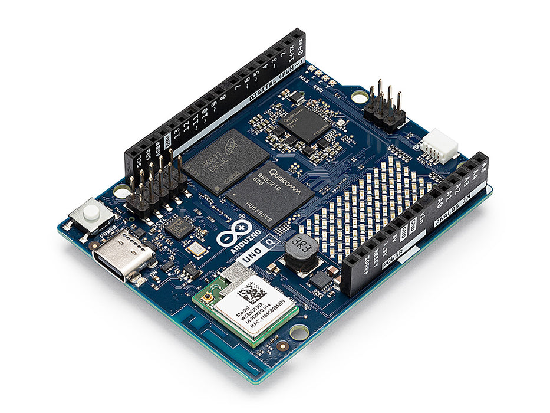

The Arduino UNO Q is a **hybrid single-board computer** that combines two processors on one UNO-form-factor board:

| Component | Role | Details |
|---|---|---|
| **MPU** (Microprocessor Unit) | High-level computing, AI, networking | Qualcomm Dragonwing™ QRB2210 — quad-core Arm Cortex-A53 @ 2.0 GHz, Adreno 702 GPU, dual ISP. Runs **Debian Linux**. |
| **MCU** (Microcontroller Unit) | Real-time hardware control | STMicroelectronics STM32U585 — Arm Cortex-M33 @ 160 MHz. Runs **Arduino Core on Zephyr OS**. |

The two processors communicate through **Bridge**, Arduino's RPC (Remote Procedure Call) library, allowing Python code on the MPU to call functions running in Arduino sketches on the MCU, and vice versa.

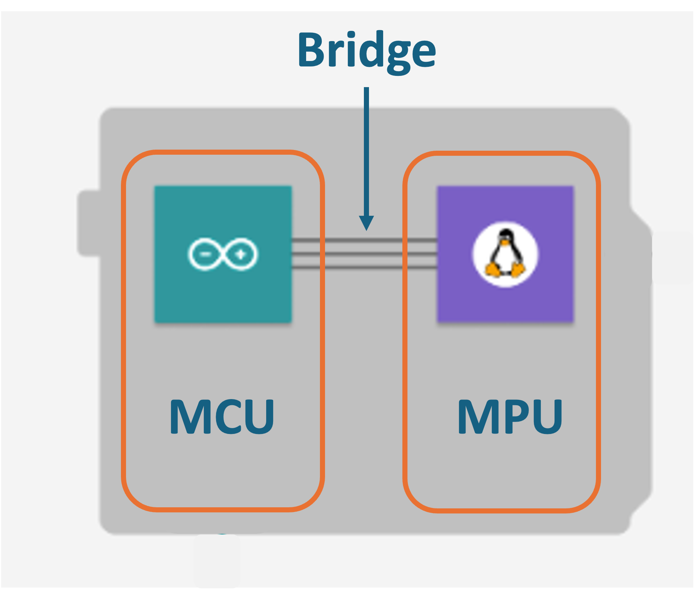

### Available Variants

| Variant | RAM | Storage (eMMC) | Best For |
|---|---|---|---|
| **2 GB** | 2 GB LPDDR4X | 16 GB | Headless/SSH development, lightweight edge AI, TinyML |
| **4 GB** | 4 GB LPDDR4X | 32 GB | SBC mode with display, larger AI models, multitasking |

Both variants share the same processor, connectivity (dual-band Wi-Fi 5 + Bluetooth 5.1), USB-C port, UNO-compatible headers, Qwiic connector, 8×13 LED matrix, and 4 RGB LEDs.

### Key Connectivity

- **USB-C**: Single multi-function port for power delivery, data (ADB), and DisplayPort video output.
- **Wi-Fi**: Dual-band 802.11ac (2.4 GHz and 5 GHz).
- **Bluetooth**: 5.1.

> **Important**: The UNO Q uses a single USB-C port for everything. Make sure you use a **data-capable USB-C cable** (not a charge-only cable). Some USB hubs and Apple USB-C adapters may not be recognized.

For more details: [Arduino® UNO Q 1 User Manual]( https://docs.arduino.cc/resources/datasheets/ABX00162-datasheet.pdf)

---

## 3. Hardware and Software Requirements

### Hardware

- Arduino UNO Q (2 GB or 4 GB variant)
- USB-C data cable (verify it is not charge-only)
- Host computer (Linux, macOS, or Windows)
- Wi-Fi network (the UNO Q and your host must be on the same network for SSH)

### Software (on your host computer)

| Tool | Purpose |
|---|---|
| **ADB** (Android Debug Bridge) | Initial headless connection over USB-C |
| **SSH client** | Remote access over Wi-Fi (built-in on Linux/macOS; available on Windows) |
| **SCP** | Secure file transfer to the board |

> An editor is not required for this tutorial — everything here runs from a terminal. If you'd like a full IDE experience (IntelliSense, integrated terminal, Git), see the [VS Code Remote-SSH chapter](../7-Setup-VScode/README.md) once you're done here.

---

## 4. Installing ADB on Your Host Computer

ADB (Android Debug Bridge) lets you open a shell on the UNO Q over the USB-C cable — no network or monitor required. This is essential for initial setup.

### Linux (Ubuntu/Debian)

```bash
sudo apt update
sudo apt install android-tools-adb
```

### macOS

Using [Homebrew](https://brew.sh/):

```bash
brew install android-platform-tools
```

### Windows

1. Download **SDK Platform-Tools** from:  
   https://developer.android.com/studio/releases/platform-tools
2. Extract the ZIP to a folder (e.g., `C:\platform-tools`).
3. Add that folder to your system `PATH` environment variable, or open a terminal (PowerShell or Command Prompt) in that folder.

> **Windows tip**: For a more Unix-like experience (with native `ssh` and `scp` commands), consider installing [WSL (Windows Subsystem for Linux)](https://learn.microsoft.com/en-us/windows/wsl/install). Inside WSL you can install ADB the same way as on Ubuntu.

### Verify the Installation

With the UNO Q **disconnected**, run:

```bash
adb version
```

You should see output like `Android Debug Bridge version X.X.X`. If not, revisit the installation steps.

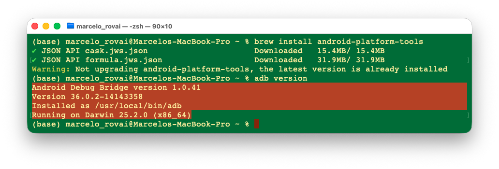

---

## 5. Flashing the Latest Linux Image (Recommended)

> **This step is optional but strongly recommended**, especially for boards fresh out of the box. The first batches of UNO Q shipped with an older Debian image that can cause issues such as: random desktop/application restarts due to missing ZRAM memory compression, ADB defaulting to root (a security concern), and missing HDMI audio support. Flashing the latest image resolves all of these and ensures a consistent experience across your classroom boards.
>
> **If your board is already up to date** (e.g., you purchased it recently and it boots correctly), you can skip this section and go directly to [Section 6](#6-first-connection-headless-setup-via-adb).

The flashing process uses Arduino's `arduino-flasher-cli` tool, which runs entirely from the terminal on your host computer. It downloads the latest Debian image (~1 GB) and writes it to the UNO Q's eMMC storage.

> **Warning**: Flashing erases everything on the board and restores it to factory state. If you have existing projects on the UNO Q, back them up first.

### Step 1 — Download the Flasher CLI

Go to the  [Arduino Software Download page](https://www.arduino.cc/en/software/#:~:text=available%20here.-,Arduino,-Flasher%20CLI) or the [Flasher CLI releases page](https://github.com/arduino/arduino-flasher-cli/releases) and download the version for your operating system.

| OS | File to download |
|---|---|
| **Linux** | `arduino-flasher-cli_X.X.X_Linux_64bit.tar.gz` |
| **macOS** | `arduino-flasher-cli_X.X.X_macOS_64bit.tar.gz` |
| **Windows** | `arduino-flasher-cli_X.X.X_Windows_64bit.zip` |

Extract the archive to a convenient location.

### Step 2 — Put the Board into Flash Mode (EDL Mode)

With the board **powered off** (USB cable disconnected):

1. Locate the **JCTL** header on the UNO Q board (a small 10-pin header).
2. Using a jumper wire or shunt, **short the two pins furthest from the USB-C connector**.
3. With the jumper in place, connect the USB-C cable to your computer.

The board will boot into EDL (Emergency Download) mode — the LED matrix will continuously display the Arduino Logo. 


### Step 3 — Flash the Latest Image

Open a terminal on your host computer, navigate to the folder where you extracted the flasher CLI, and run:

**Linux / macOS:**

```bash
./arduino-flasher-cli flash latest
```

**Windows (PowerShell):**

```powershell
.\arduino-flasher-cli.exe flash latest
```

The tool will:

1. Ask if you want to download the latest Debian image — type `yes` and press Enter.
2. Download the image (~2.3 GB); this may take several minutes.
3. Extract the image.
4. Flash it to the UNO Q's eMMC.

**Do not disconnect the USB cable or interrupt the process.** Wait until you see a message confirming that the partition is now bootable.

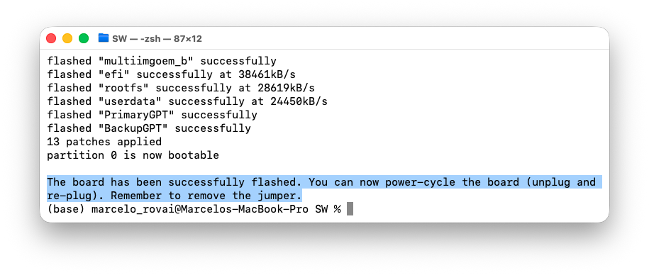

> **Linux users**: If the flasher cannot access the device, you may need to run it with `sudo`, or add a udev rule for the Qualcomm EDL device.

### Step 4 — Remove the Jumper and Reboot

1. Disconnect the USB cable.
2. **Remove the jumper** from the JCTL header.
3. Reconnect the USB cable.

The board will boot from the fresh image. You will see the Arduino logo animation on the LED matrix, which will end momentarily with a heart, indicating a successful flash (note that one of the blue LEDs will also be on). The board is now in a factory-fresh state and ready for setup.


### Flashing a Local Image (Alternative)

If you have already downloaded the Debian image file, you can flash it directly without re-downloading:

```bash
./arduino-flasher-cli flash path/to/downloaded/image
```

> This is useful in multiple settings where you can download the image once and distribute it via a shared drive or USB stick.
>

---

## 6. First Connection: Headless Setup via ADB

### Step 1 — Connect the Board

1. Plug the USB-C data cable into the UNO Q and into your computer.
2. Wait approximately 30 seconds for the board to boot. You will see the LED matrix display an animated Arduino logo, ending momentarily with a heart during startup, and with the QRB blue LED 2 on.

### Step 2 — Verify ADB Sees the Device

```bash
adb devices
```

Expected output:

```
List of devices attached
XXXXXXXX    device
```

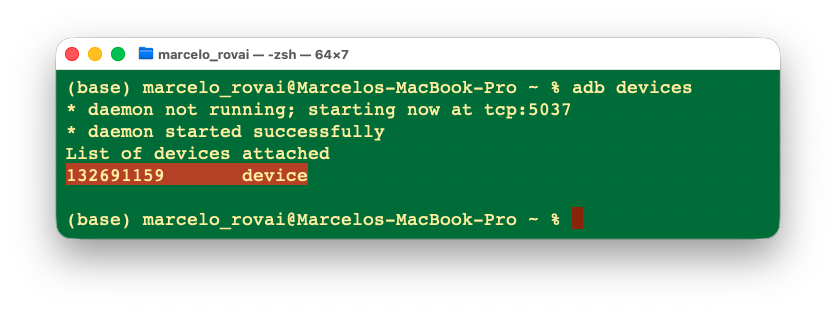

If the list is empty:

- Confirm that you are using a USB-C data cable.
- Try a different USB port (preferably a USB-C or USB 3.0 port directly on your computer, not through a hub).
- On Linux, you may need to configure udev rules for the device.

### Step 3 — Open a Shell on the Board

```bash
adb shell
```

You are now inside the UNO Q's Debian Linux environment. The default credentials are:

| Field | Value |
|---|---|
| Username | `arduino` |
| Password | `arduino` |

### Step 4 — Change the Default Password (Recommended)

For security, the default password `arduino` should be changed. If you do not change it, the system will remind you. It is mandatory. 

```bash
sudo passwd arduino
```

Enter and confirm your new password. **Remember this password** — you will need it for SSH.

### Step 5 — Check Board Information

While in the ADB shell, you can inspect the system:

```bash
# Check OS version
cat /etc/os-release

# Check available storage
df -h

# Check RAM
free -h

# Check CPU info
lscpu
```

> To return to the host terminal, type `exit` to leave the ADB shell. 
>

---

## 7. Configuring Wi-Fi from the Terminal

Wi-Fi is essential for SSH access. We will configure it entirely from the ADB shell.

### Step 1 — Enter the ADB Shell

```bash
adb shell
```

### Step 2 — Scan for Available Networks

```bash
nmcli dev wifi list
```

This will display all visible Wi-Fi networks with their SSID, signal strength, security type, etc.

### Step 3 — Connect to Your Wi-Fi Network

```bash
sudo nmcli dev wifi connect "YOUR_WIFI_SSID" password "YOUR_WIFI_PASSWORD"
```

Replace `YOUR_WIFI_SSID` and `YOUR_WIFI_PASSWORD` with your actual network credentials. If your SSID contains spaces, keep the quotes.

### Step 4 — Verify the Connection

```bash
nmcli device status
```

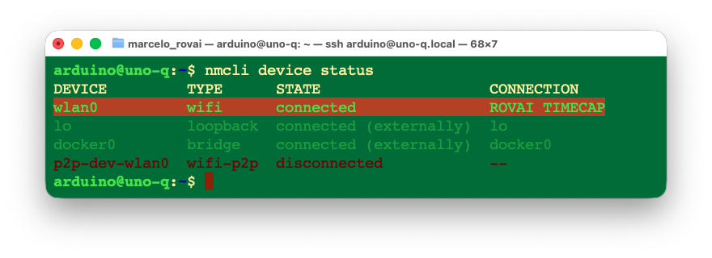

The `wlan0` interface should show `connected`. Now get the board's IP address:

```bash
hostname -I
```

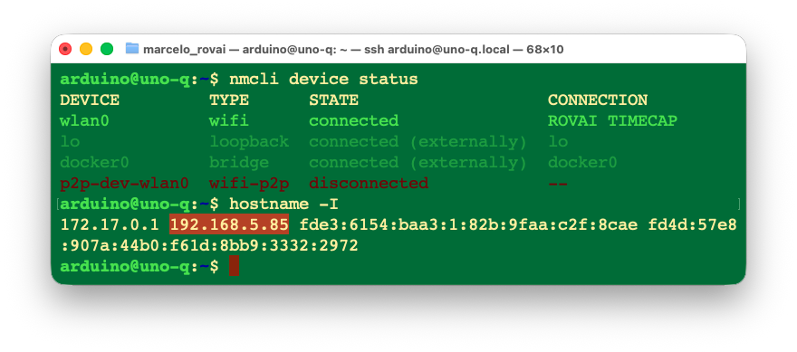

or, for more detail:

```bash
ip addr show wlan0
```

Look for the `inet` line — it will show something like `192.168.1.XXX/YY`. **Write down this IP address**; you will need it for SSH.

> **Tip**: If your router supports it, assign a **static IP** to your UNO Q using its MAC address (visible in the output of `ip addr show wlan0` under `link/ether`). This prevents the IP from changing between reboots — especially useful in classroom setups with multiple boards.

### Switching Networks Later

If you need to change Wi-Fi networks in the future (over SSH or ADB):

```bash
# Disconnect from current network
nmcli device disconnect wlan0

# Connect to a different network
sudo nmcli dev wifi connect "NEW_SSID" password "NEW_PASSWORD"
```

---

## 8. Enabling and Using SSH

### Step 1 — Enable the SSH Server

During the first setup, Wi-Fi® credentials are entered, and the board will automatically enable SSH. But it also needs to be completed and activated manually. 

For that, run the command below in the board's shell.

```bash
arduino-app-cli system network-mode enable 
```

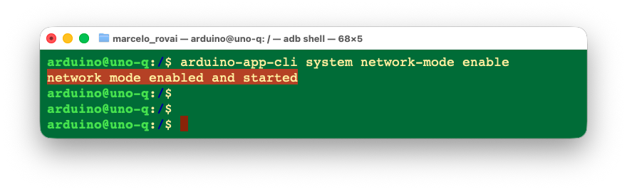

### Step 2 — Exit ADB and Connect via SSH

Exit the ADB shell:

```bash
exit
```

Now, from your host computer's terminal, connect via SSH:

```bash
ssh arduino@<UNO_Q_IP_ADDRESS>
```

Replace `<UNO_Q_IP_ADDRESS>` with the IP you noted earlier (e.g., `192.168.1.42`).

- The first time you connect, you will be asked to accept the host fingerprint. Type `yes`.
- Enter the password you set earlier (or `arduino` if you did not change it).

You should now have a remote Debian shell on the UNO Q over your Wi-Fi network.

### Alternative: Connect Using Hostname

On some networks that support mDNS, you can also use:

```bash
ssh arduino@uno-q.local
```

Or if you named your board during setup:

```bash
ssh arduino@<boardname>.local
```

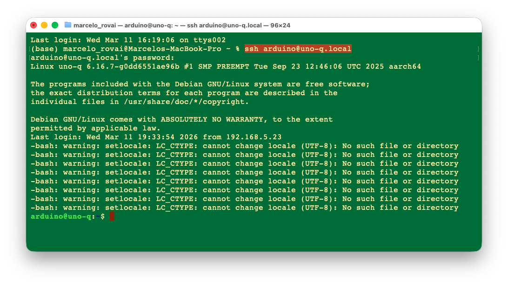

### If the SSH Password Is Not Working

If the default `arduino` password is rejected, use ADB to reset it:

```bash
adb shell
sudo passwd arduino
```

Set a new password, exit, and try SSH again.

### Step 3 —Check the CPU and memory with htop

On the terminal, run:

```bash
htop
```

With the Arduni UNO-Q 2GB you see something like: 

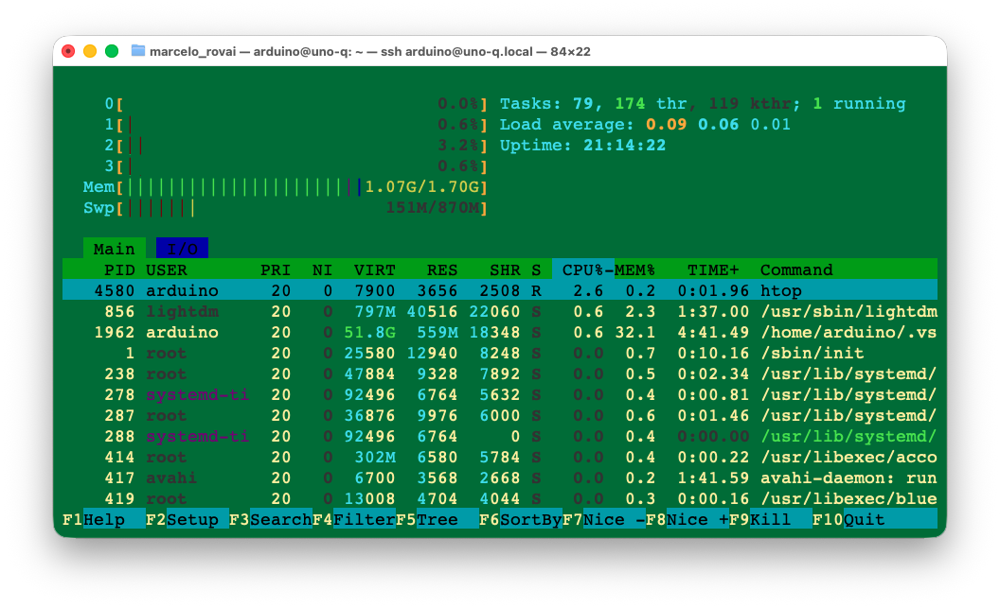

And with the 4GB version:

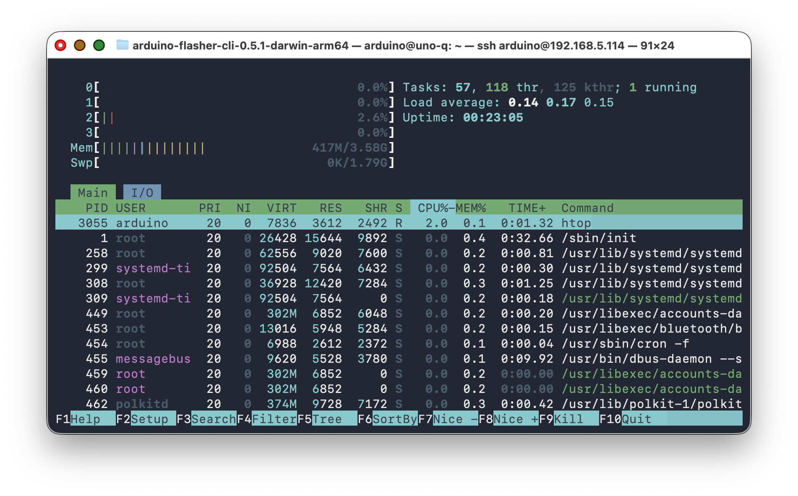

> Note that both the RAM Memory size and the SWAP are doubled on the 4GB memory. 

### Step 4 —Update/Upgrade the system

```bash
sudo apt update
sudo apt upgrade
sudo reboot
```
### Step 5 — Transfer Files (if necessary)

#### a. Transferring files using FTP (FileZilla)

Transferring files via FTP, such as [FileZilla FTP Client](https://filezilla-project.org/download.php?type=client), is also possible and much easier to use. Follow the instructions to install the program on your Desktop, then use the Uno-Q's IP address as the `Host`. For example:

```bash
sftp://192.168.5.85
```

Enter your UNO-Q `username and password`. Pressing `Quickconnect` opens two windows, one for your host computer desktop (right) and another for the UNO-Q (left).

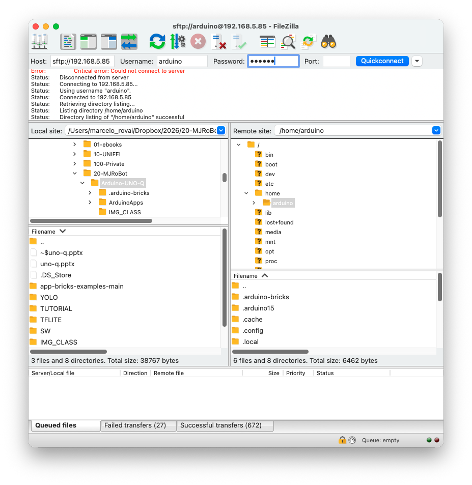

#### b. Using scp

From your host machine, navigate into the directory where you have files to transfer and for example, copy all files to the board:

```bash
cd <folder>
scp -r * arduino@<UNO_Q_IP_ADDRESS>:~/ArduinoApps/<folder>/
```

Enter your password when prompted. You should see the files being transferred.

---

## 9. Exploring Pre-Installed Examples

### Step 1 — Exploring the Pre-loaded AI models

The UNO Q ships with a rich set of pre-installed example applications that demonstrate everything from basic LED control to AI-powered computer vision. You can discover, run, study, and customize all of them entirely from an SSH terminal — no App Lab GUI required.

> To guarantee that you have the latest pre-loaded models you can updated the system with the command:
>
> `arduino-app-cli system update`
>
> Note that the update will take a long time. 

From an SSH terminal, run:

 `arduino-app-cli app list`.

This command will show all installed models, including the user created ones:

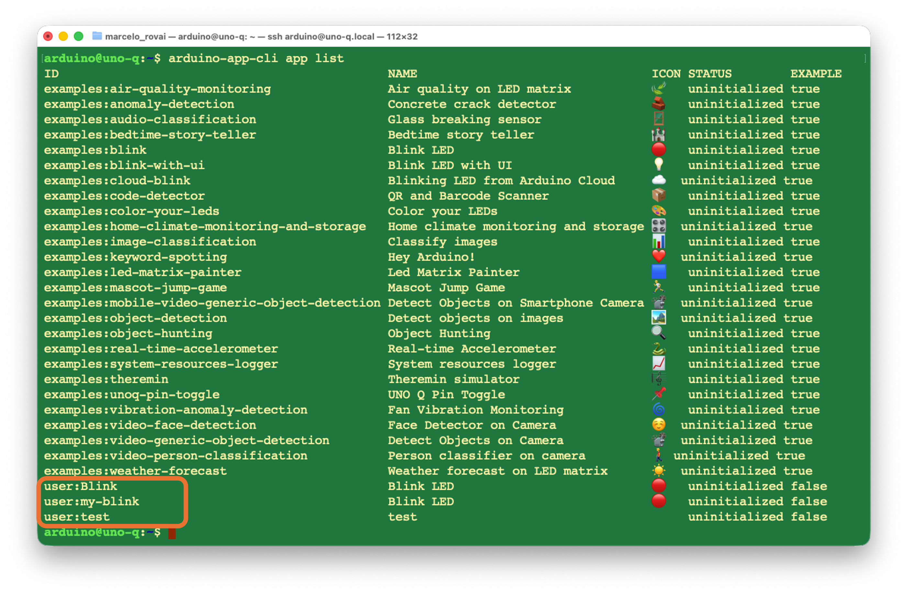

Note that the `examples:` apps listed by `arduino-app-cli` are **not** stored in `~/ArduinoApps/` — only your user-created apps (like `Blink`) live there. The examples are managed internally by the CLI on the filesystem and  stored inside `~/.local/share/arduino-app-cli` on the board.

So we have two classes of apps in the UNO-Q:

- **`examples:\*`** → read-only, managed by the CLI at `/var/lib/arduino-app-cli`
- **`user:\*`** → your apps in `~/ArduinoApps/`, which is the only place you see with `ls`

### Step 2 — Running an example via terminal

It is possible to run any of the examples directly on a terminal via SSH

```bash
arduino-app-cli app start examples:blink
```

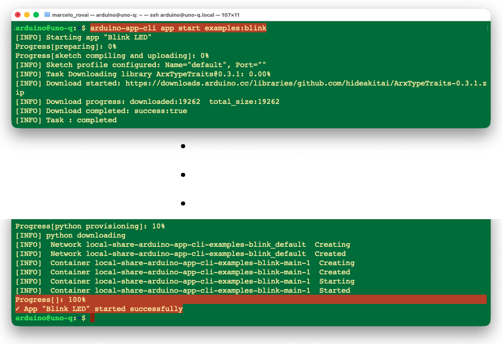


> **Note**: The first run may take several minutes as the system downloads and installs Arduino libraries and sets up the Python container.

You should see the built-in LED on the UNO Q blinking on and off every second.


To inspect the logs:

```bash
arduino-app-cli app logs examples:blink
```

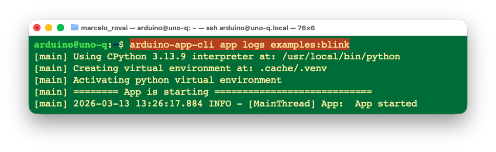

And to stop it:

```bash
arduino-app-cli app stop examples:blink
```

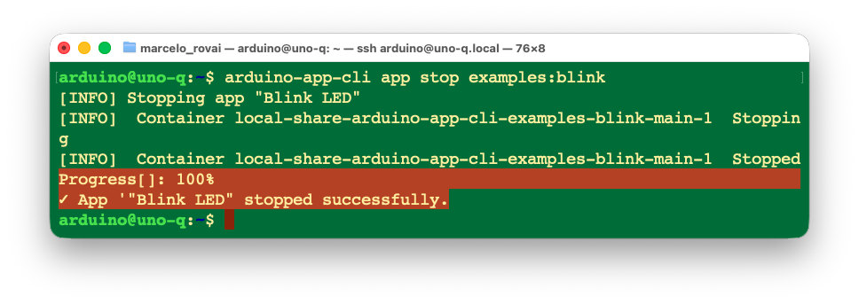

## 10. The arduino-app-cli Command Reference

The `arduino-app-cli` tool is pre-installed on the UNO Q and manages the full lifecycle of dual-brain applications.

| Command | Description |
|---|---|
| `arduino-app-cli app start <path>` | Build (if needed) and start the application at the given path |
| `arduino-app-cli app stop <path>` | Stop a running application |
| `arduino-app-cli app logs <path>` | View the Python-side log output |
| `arduino-app-cli app list` | List installed/running applications |
| `arduino-app-cli app new "<name>"` | Create a new App |
| `arduino-app-cli system cleanup` | Clean unused containers and images |
| `arduino-app-cli system update` | Update the CLI tool and board components |

> For full documentation, see the [Arduino App CLI repo](https://github.com/arduino/arduino-app-cli) and the [official CLI tutorial](https://docs.arduino.cc/software/app-lab/tutorials/cli/).

---

## 11. Essential Linux Commands for the UNO Q

Since the UNO Q runs Debian Linux, here are the commands you will use frequently:

### System Information

```bash
# OS version
cat /etc/os-release

# CPU information
lscpu

# Memory usage
free -h

# Disk usage
df -h

# Running processes
htop                  # (if necessary, install with: sudo apt install htop)
```

### Network Management

```bash
# Show network interfaces and IPs
ip addr show

# Show Wi-Fi connection status
nmcli device status

# Show current Wi-Fi connection details
nmcli connection show

# List available Wi-Fi networks
nmcli dev wifi list

# Connect to a Wi-Fi network
sudo nmcli dev wifi connect "SSID" password "PASSWORD"

# Get board IP address (short form)
hostname -I
```

### Package Management

```bash
# Update package lists
sudo apt update

# Upgrade installed packages
sudo apt upgrade -y

# Install a package
sudo apt install <package-name> -y

# Remove a package
sudo apt remove <package-name>

# Clean up unused packages and cache
sudo apt autoremove -y
sudo apt clean
```

### File Operations

```bash
# List files (detailed)
ls -la

# Navigate directories
cd ~/ArduinoApps

# Create a directory
mkdir -p my_project/python my_project/sketch

# Copy files
cp source.txt destination.txt

# Move/rename files
mv old_name.py new_name.py

# Remove a file
rm filename.txt

# Remove a directory and its contents
rm -rf directory_name

# View file contents
cat filename.txt

# Edit a file (nano is pre-installed)
nano filename.txt
```

### Service Management

```bash
# Check SSH service status
sudo systemctl status sshd

# Restart SSH
sudo systemctl restart sshd

# Reboot the board
sudo reboot

# Shut down the board
sudo shutdown -h now
sudo halt
```

---

## 12. Tips, Tricks, and Troubleshooting

### ADB Not Detecting the Board

- Ensure you are using a **data-capable** USB-C cable (not a charge-only cable).
- Use a USB-C or USB 3.0 port **directly** on your computer. Avoid USB hubs when possible.
- Some **Apple USB-C hubs** are not compatible.
- The board takes about **30 seconds to boot** — wait before running `adb devices`.
- On Linux, you may need udev rules. Check the [Android developer documentation](https://developer.android.com/studio/run/device) for guidance.

### SSH Connection Refused

- Verify the SSH server is running:

  ```bash
  adb shell
  sudo systemctl status sshd
  ```

  If it is not running:

  ```bash
  sudo apt install openssh-server -y
  sudo systemctl enable ssh
  sudo ssh-keygen -A
  sudo systemctl start sshd
  ```

### SSH Password Rejected

Reset the password via ADB:

```bash
adb shell
sudo passwd arduino
```

### Wi-Fi Not Connecting

- Verify the SSID and password are correct (case-sensitive).
- Try connecting to the 2.4 GHz band if 5 GHz fails (some access points have issues).
- Check that your router is not blocking new devices (MAC filtering).

### "App.run() Missing" Error

If you see errors like `Stopped decode loop: EOF` when starting a project, make sure your Python code includes:

```python
App.run(user_loop=loop)
```

This line is **mandatory** for the runtime to start the application properly.

### Memory Issues (Especially on the 2 GB Variant)

- Avoid running large AI models; use TinyML-optimized models.
- Monitor memory usage: `free -h` or `htop`.
- Close unused applications and services.
- If you're using VS Code Remote-SSH (see the [dedicated chapter](../7-Setup-VScode/README.md)), disable unnecessary extensions on the remote host — its server process adds its own RAM footprint.

### Storage Cleanup

Over time, Docker images, logs, and cached packages can fill the eMMC:

```bash
# Check available space
df -h

# Clean apt cache
sudo apt clean
sudo apt autoremove -y

# If using Docker
docker system prune -a
```

### Using Git for Version Control

Install Git on the UNO Q and use it to sync code instead of SCP:

```bash
sudo apt install git -y
```

You can then clone repositories directly on the board or push/pull from your host. This is especially useful for team projects and keeping your code backed up.

### Alternative File Transfer: rsync

For iterative development, `rsync` is faster than `scp` because it only transfers changed files:

```bash
# On your host machine, from inside the project directory:
rsync -avz --progress ./ arduino@<UNO_Q_IP_ADDRESS>:~/ArduinoApps/uno_q_blink/
```

Install `rsync` on the UNO Q if not present:

```bash
sudo apt install rsync -y
```

---

## 13. Going Further

Now that you have a working CLI/SSH development environment, here are some paths to explore:

### Edge AI on the UNO Q

- **Pre-loaded AI models**: The UNO Q comes with models for object detection, image classification, sound recognition, and keyword spotting. Explore them via `arduino-app-cli app list`.

- **Edge Impulse integration**: Train and deploy custom ML models from Edge Impulse Studio to the UNO Q. See the [Edge Impulse Arduino UNO Q documentation](https://docs.edgeimpulse.com/hardware/boards/arduino-uno-q).
- **TinyML with Python**: Use TensorFlow Lite or ONNX Runtime on the Linux side for inference tasks.
- **GenAI at the Edge**: Use Llama.cpp to run generative models at the edge. 

### Hardware Expansion

- **Camera modules**: Connect a USB camera via USB Hub, or a MIPI-CSI camera for computer vision projects.
- **Modulino nodes**: Use the Qwiic connector for plug-and-play sensors and actuators.
- **Arduino shields**: Traditional UNO shields are compatible with the header layout.

---

## 14. Conclusion

### What We Covered

This tutorial walked through a complete terminal-first workflow for the Arduino UNO Q: from headless setup via ADB, through Wi-Fi and SSH configuration, to running dual-brain projects like Blink using the `arduino-app-cli`. 

### Advantages of the UNO Q Approach

**For teaching ML System Engineering:**

- **One board, two worlds**: The dual-brain architecture naturally teaches students the boundary between high-level AI inference (Python/Linux) and real-time physical control (C++/RTOS) — a distinction that is central to real-world edge AI systems but hard to convey with a single-processor board.
- **Professional development workflow**: Working over SSH, transferring files via SCP/rsync, and using CLI tools mirrors how edge AI systems are developed and maintained in industry — very different from the "click upload" experience of traditional Arduino. (Layer a full editor like VS Code on top with the [Remote-SSH chapter](../7-Setup-VScode/README.md) once this workflow feels natural.)
- **Gradual complexity**: Students can start with simple LED blink examples to understand the Bridge architecture, then progress to AI-powered projects (image classification, keyword spotting, object detection) without switching hardware.
- **Ecosystem continuity**: Skills learned on the UNO Q (Linux administration, Python ML frameworks, Arduino sketches) transfer directly to both simpler MCU boards and more powerful SBCs, making it a natural stepping stone in the course progression.

**Technical advantages:**

- The Adreno 702 GPU enables hardware-accelerated inference, achieving sub-100ms latency on common vision models via TensorFlow Lite.
- Pre-loaded Edge Impulse models provide instant hands-on experience with production-grade ML pipelines.
- The `arduino-app-cli` orchestrates the entire build-deploy-run cycle for both processors from a single command.
- Standard Debian Linux means full access to `pip`, `apt`, Docker, Git, and any Python ML library that fits in memory.

### Limitations and Considerations

It is important to be realistic about the UNO Q's constraints, particularly in comparison to the platforms we've used previously:

- **Compute power**: The Cortex-A53 cores sit at roughly the Raspberry Pi 3 level of performance. Running large models (e.g., LLMs beyond 2B parameters) is impractical. For heavy inference tasks, a Raspberry Pi 5 or an accelerator (like MemryX MX3 or Google Coral) remains the better choice.
- **RAM limitations**: The 2 GB variant can feel tight when running a remote editor server, a Python container, and an AI model simultaneously. The 4 GB variant is recommended for more demanding workloads, mainly GenAI. 
- **Single USB-C port**: All connectivity (power, data, video) goes through one port, requiring a hub for SBC mode. Cable compatibility issues are a recurring frustration.
- **Maturing software ecosystem**: Arduino App Lab and the `arduino-app-cli` are still evolving (currently pre-1.0). Students may encounter rough edges, and documentation is still catching up. This is both a limitation and a learning opportunity — working with early-stage tooling is a reality of edge AI development.
- **No dedicated NPU**: Unlike the upcoming Arduino VENTUNO Q (with 40 TOPS via the Dragonwing IQ8 NPU), the current UNO Q relies on CPU and GPU for inference. For compute-intensive models, this is a bottleneck.
- **Camera requires external hardware**: Unlike the Nicla Vision or XIAO ESP32S3 Sense  (which have built-in cameras), the UNO Q needs a USB webcam or a MIPI-CSI camera with a carrier board.

---

## 15. Resources

### Useful Resources

| Resource | URL |
|---|---|
| Arduino UNO Q Documentation | https://docs.arduino.cc/hardware/uno-q |
| Arduino App CLI Tutorial | https://docs.arduino.cc/software/app-lab/tutorials/cli |
| Arduino App CLI (GitHub) | https://github.com/arduino/arduino-app-cli |
| Bricks Documentation | https://docs.arduino.cc/software/app-lab/tutorials/bricks |
| Blink CLI Example (Shawn Hymel) | https://github.com/ShawnHymel/arduino_uno_q_blink_cli |
| Edge Impulse — Arduino UNO Q | https://docs.edgeimpulse.com/hardware/boards/arduino-uno-q |
| UNO Q Datasheet (PDF) | https://docs.arduino.cc/resources/datasheets/ABX00162-datasheet.pdf |

### References
1. Arduino, "Arduino UNO Q Product Page," https://www.arduino.cc/product-uno-q/
2. Arduino, "UNO Q Documentation," https://docs.arduino.cc/hardware/uno-q
3. Arduino, "Arduino App CLI — Manage Apps from the Command Line," https://docs.arduino.cc/software/app-lab/tutorials/cli
4. Shawn Hymel, "How to Use the Command Line (CLI) With the Arduino UNO Q," https://shawnhymel.com/3074/how-to-use-the-command-line-cli-with-the-arduino-uno-q/
5. Edge Impulse, "Arduino UNO Q," https://docs.edgeimpulse.com/hardware/boards/arduino-uno-q
6. Kevin McAleer, "How to Set Up WiFi on the Arduino Uno Q," https://www.kevsrobots.com/blog/arduino-uno-q-wifi-setup.html
7. Kevin McAleer, "5 Tips for Managing Your Arduino Uno Q," https://www.kevsrobots.com/blog/uno-q-tips.html
8. Foundries.io, "Arduino UNO Q Elf Detector Series — Part 0: Introduction," https://www.foundries.io/insights/blog/arduino-uno-q-elf-detector/

---


*Tutorial created for IESTI05 — Edge AI Machine Learning System Engineering, UNIFEI. Licensed under GNU General Public License 3.0.*
