# Generative AI at the Edge:

Running Small Language Models with llama.cpp

![*Cover image prompt (Nano Banana: Here is the shortened, single-paragraph prompt to reproduce the image: A clean, colorful vector-style digital illustration of an electronics development board on a green cutting mat. In the exact center of the blue board is a large, prominent Qualcomm QRB2210 processor chip glowing with a bright cyan light, while a smaller STM32U585 chip sits to its right. The board is connected via colorful jumper wires to a variety of components scattered around it, including a servo motor, a small breadboard with a sensor, a row of vertical LEDs, and tactile push-buttons. The scene features crisp line art, smooth gradients, and a textbook-illustration style, softly lit by an overhead light source.*](images/jpeg/cover.jpg)

---

## 1. Introduction

### What This Tutorial Covers

This tutorial runs a Small Language Model (SLM) directly on the Arduino UNO Q, with no internet connection and no cloud API calls. The inference engine is `llama.cpp`, running entirely on the Linux (MPU) side. You will learn three ways to talk to it:

1. **The command line** (`llama-cli`) — one-shot prompts, no server, the fastest way to sanity-check a model.
2. **A local HTTP server** (`llama-server`) — an OpenAI-compatible API you start by hand and query with `curl` or Python.
3. **Python** — first with the standard `openai` client library, then with raw HTTP calls, so you can see what the library is doing for you underneath.

This chapter is deliberately self-contained and tool-focused: no Bridge RPC, no MCU sketch, no systemd service. Those come next, once you're comfortable with the tools themselves — see [Going Further](#12-going-further) for where this leads.

**Why this approach?**

- Full local inference. No API keys, no rate limits, and prompts never leave the device.
- `llama.cpp` gives you fine-grained control over memory usage (KV cache quantization, context length, thread count), which matters when RAM is shared with the OS.
- `llama-server` speaks an OpenAI-compatible HTTP API, so the same client code that talks to a local SLM today can point at a cloud LLM tomorrow with a one-line URL change — the pattern you'll use for real applications, not just this tutorial.

By the end of this tutorial, you will be able to build `llama.cpp` from source, run a quantized SLM interactively from the terminal, serve it over HTTP, and call it from Python using both a standard client library and raw requests.

### Prerequisites

This tutorial assumes you have completed the [Setup](../1-Setup/README.md) chapter and are comfortable connecting to the UNO Q via SSH (or VS Code Remote-SSH) and using basic Linux commands.

## 2. Small Language Models on the Edge: What's Realistic on the UNO Q

A Small Language Model (SLM) here means a transformer-based language model with roughly 100 million to 7 billion parameters, optimized (pruned, distilled, and quantized) to run on CPU-only hardware with a few GB of RAM. The "small" is relative — modern GPTs have well over 1 trillion parameters — but these models are big enough to handle real classification, summarization, structured output, and short conversational tasks.

### Why SLMs Matter for Edge AI

Early TinyML models were single-purpose: a wake-word detector, an image classifier, a vibration anomaly detector. One model, one task. SLMs change that. A single sub-1B-parameter model can classify, summarize, reformat, translate, and reason about structured inputs, all at the edge, all without a network call. The cost is latency (seconds, not milliseconds) and the need for a Linux-capable platform with at least 2 GB of RAM. The UNO Q sits right at that threshold.

### The Memory Reality on a 4 GB UNO Q

The UNO Q 4 GB variant has 4 GB of LPDDR4X RAM shared between the OS, system services, the App Lab runtime, and your application. After boot, with no user app running, `free -h` typically shows about 2.8 to 3.0 GB available and 600 to 900 MB in use.

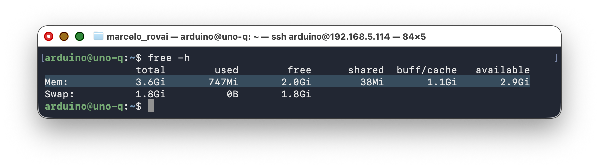

Below, `htop` shows the UNO Q 4GB running a 0.8B-parameter SLM at 8-bit quantization:

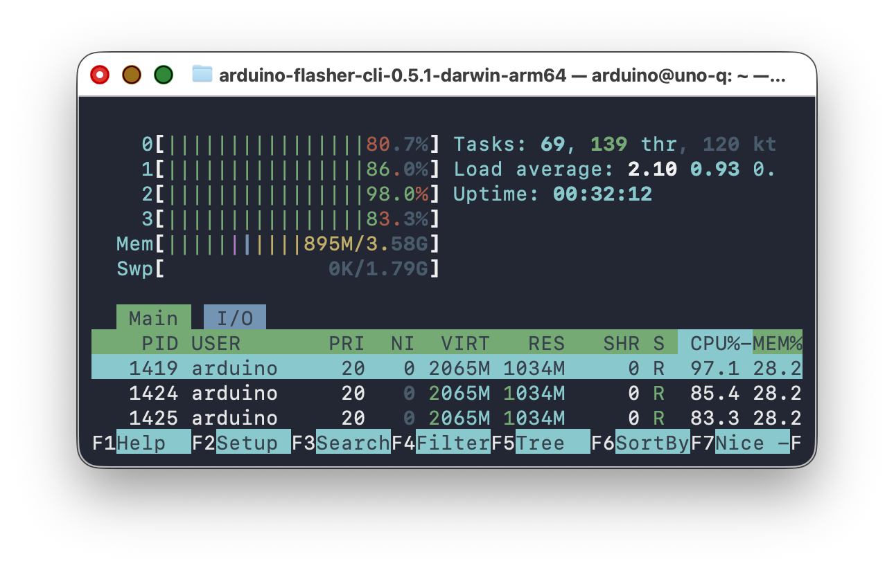

> The 2 GB variant can run the smallest models (SmolLM2-135M, SmolLM2-360M) but cannot comfortably fit 0.8B-parameter models. This chapter targets the 4 GB board.

### Storage Reality: A Single Partition

> **Storage layout depends on your factory image.** Run `df -h` to check. There are two layouts in the wild:
>
> - **Older images:** `/` and `/home` share a single ~9.8 GB partition with ~830 MB free after boot. Disk management matters; follow the cleanup steps in this chapter.
> - **Newer images:** `/home/arduino` is on a separate ~18 GB partition; llama.cpp source, models, and any project all land there. The 9.8 GB root partition stays mostly untouched by this tutorial, and you can skip the shallow-clone and build-tree-deletion steps.

Check your available space before starting:

```bash
df -h /home/arduino
```

You need at least **5 GB of free space** to complete the build and model download. If you have less, see [Section 11](#11-tips-tricks-and-troubleshooting) for cleanup tips.

### Why Qwen 3.5

[Qwen3.5-0.8B](https://qwen.ai/blog?id=qwen3.5) (released February 2026 by Alibaba's Qwen team) is the recommended SLM for the UNO Q for a few reasons:

- **Designed for edge devices.** The Qwen3.5 Small series (0.8B, 2B, 4B, 9B) uses a hybrid architecture that combines Gated Delta Networks with sparse Attention and is tuned for low-latency inference on constrained hardware.
- **Hybrid thinking/non-thinking mode.** In non-thinking mode the model answers directly without internal chain-of-thought, which keeps latency low and avoids the "reasoning loops" that plague thinking models on slow hardware.
- **201 languages.** Useful for multilingual teaching contexts (English/Portuguese/Spanish/etc.) and for Global South deployments.
- **Newer than LLama 3.2 and Gemma 3.** Better quality-per-parameter than earlier models at this size point on most benchmarks.
- **Apache 2.0 licensed.** No restrictions on academic or commercial deployment.

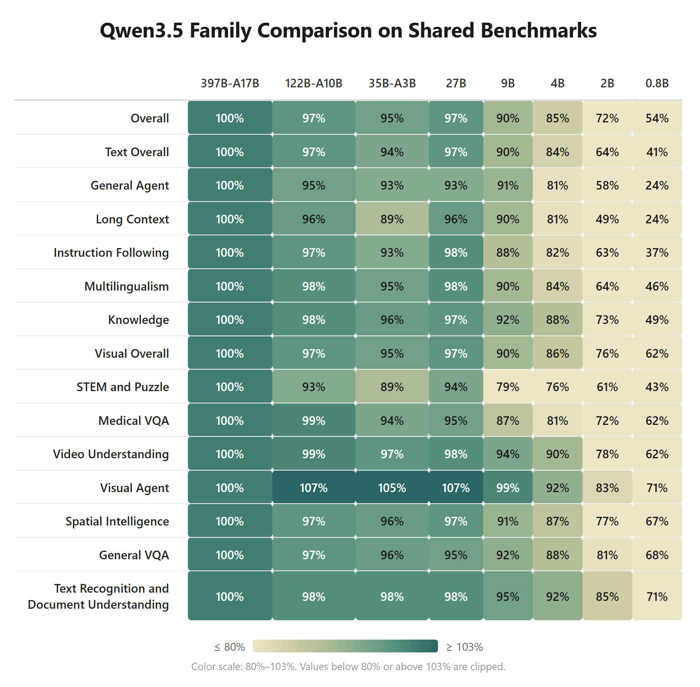

### Candidate Models

| Model | Params | Size | Notes |
|---|---|---|---|
| `SmolLM2-135M-Instruct Q4_K_M` | 135 M | ~95 MB | Very fast, limited reasoning. Good for routing/classification only. |
| `SmolLM2-360M-Instruct Q4_K_M` | 360 M | ~230 MB | Balanced. Recommended fallback if 0.8B is too tight on space. |
| `Qwen3.5-0.8B Q8.0` | 800 M | ~880 MB | **Our primary choice.** Best quality-per-parameter for edge. |
| `Qwen3.5-2B (Q4-Q8)` | 2B | 1.25 to 2 GB | Excellent, but a little slower. |

### Quantization: Q4 vs Q8 for Sub-1B Models

During testing on the UNO Q, Q4_K_M quantization produced noticeably weaker output quality for sub-1B models compared to Q8_0. The aggressive 4-bit compression loses too much information when the model has only 800M parameters to begin with. There's less redundancy to exploit than in bigger models.

> At sub-1B scale, Q4 is aggressive. The quantization error compounds in smaller model. Q6 or Q8 helps a lot.
>
> Also, prefer `min_p` over `top_p` for sampling. Something like `min_p=0.05` with `temp=0.7` works better for small models because it dynamically adjusts the candidate pool based on the probability distribution rather than using a fixed cutoff. `top_p` at low temperatures produces a very narrow beam, and repetition becomes almost inevitable at these model sizes.

Recommendations:

- **Start with Q4_K_M** (~550 MB for Qwen3.5-0.8B) to verify the workflow fits on your board.
- **Try Unsloth Dynamic quants** (`UD-Q4_K_XL`). These upcast critical layers to 8 or 16 bits while keeping overall size close to Q4. Available from the [unsloth/Qwen3.5-0.8B-GGUF](https://huggingface.co/unsloth/Qwen3.5-0.8B-GGUF) repo.
- **Try Q8_0** if you have space (~850 MB). Quality is meaningfully better, but leaves very little headroom on the current factory image. (This is the choice for this tutorial.)
- **For production use, combine Q4 with strong few-shot prompting** and `response_format: json_object` to compensate for quantization noise.

> [unsloth/Qwen3.5-2B-GGUF (UD-Q4_K_XL)](https://huggingface.co/unsloth/Qwen3.5-2B-GGUF/blob/main/Qwen3.5-2B-UD-Q4_K_XL.gguf) is a great model when latency is not an issue. The 2B model with Unlosh Dynamic quants (`UD-Q4_K_XL`) should have double the latency of the 0.8B/8_0 model, but it has superior performance.

## 3. Hardware and Software Requirements

### Hardware

- Arduino UNO Q **4 GB** variant (the 2 GB variant works with SmolLM2-360M or smaller only).
- USB-C data cable.
- Host computer with SSH (see the Setup chapter).

### Software (already on the UNO Q from Setup)

| Tool | Purpose |
|---|---|
| Debian Linux (latest image) | Base OS on the MPU |
| Python 3.13 | Application code |
| SSH server | Remote access |

### Software (installed in this tutorial)

| Tool | Purpose |
|---|---|
| `build-essential`, `cmake`, `git` | Build llama.cpp from source |
| `libcurl4-openssl-dev` | Enables in-binary model downloads |
| `openai`, `requests` (Python) | Talking to `llama-server` from Python |

## 4. Preparing the Linux Side

SSH into the board and check what you have:

```bash
uname -m            # aarch64
free -h             # ~3.6 Gi total, ~3.0 Gi available
df -h /             # root partition — check available space
```

### Step 1 — Verify Swap Is Present

The current factory image includes **1.8 GB of swap** pre-configured. Verify:

```bash
free -h
```

You should see a `Swap:` line showing about 1.8 Gi total.

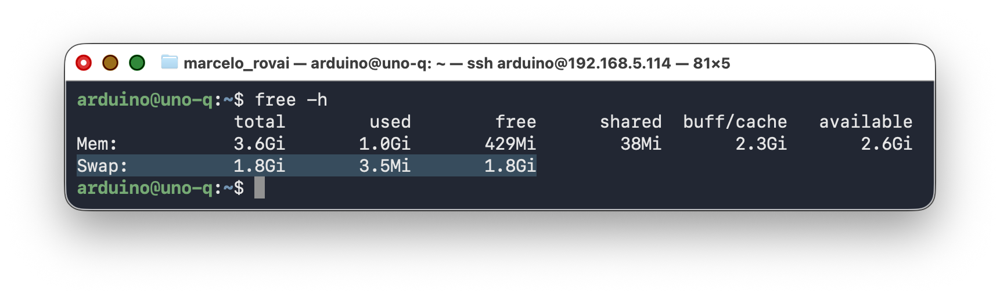

If swap is missing (older images), add it:

```bash
sudo fallocate -l 2G /home/swapfile
sudo chmod 600 /home/swapfile
sudo mkswap /home/swapfile
sudo swapon /home/swapfile
echo '/home/swapfile none swap sw 0 0' | sudo tee -a /etc/fstab
```

> Swap acts as a safety net during the brief model-loading phase. You don't want to hit it during inference (it would tank throughput), but having it prevents the OOM killer from ending your processes during the load spike.

### Step 2 — Install Build Tools

```bash
sudo apt update
sudo apt install -y build-essential cmake git pkg-config \
                    libcurl4-openssl-dev
```

## 5. Building llama.cpp from Source

llama.cpp's Makefile-based build is deprecated; the supported path is CMake. The old `LLAMA_CURL=1 make` recipe you may find in older tutorials fails with `make: command not found` on the UNO Q's factory image, which does not include `make` by default.

### Step 1 — Clone the Repository

A full clone of the llama.cpp repo pulls ~400 MB of git history you don't need. A shallow clone saves disk space:

```bash
cd /home/arduino
git clone --depth 1 https://github.com/ggml-org/llama.cpp
cd llama.cpp
```

This brings the clone down from ~550 MB to roughly 80–100 MB.

### Step 2 — Configure and Build

From the llama.cpp folder, run:

```bash
cmake -B build \
  -DLLAMA_CURL=ON \
  -DGGML_NATIVE=ON \
  -DCMAKE_BUILD_TYPE=Release
cmake --build build --config Release -j4
```

The flags:

- `LLAMA_CURL=ON` enables model downloads directly inside `llama-server` and `llama-cli`.
- `GGML_NATIVE=ON` detects the A53's NEON SIMD capabilities and emits the right CPU intrinsics.
- `-j4` uses all four cores. The build takes 20–25 minutes on the UNO Q.

> **If the build runs out of memory** (the board freezes or the build dies), drop to `-j2`. The build takes longer but stays under the OOM threshold. With the factory swap in place, `-j4` normally works.

### Step 3 — Verify the Binaries

```bash
ls build/bin/llama-cli build/bin/llama-server
./build/bin/llama-cli --version
```

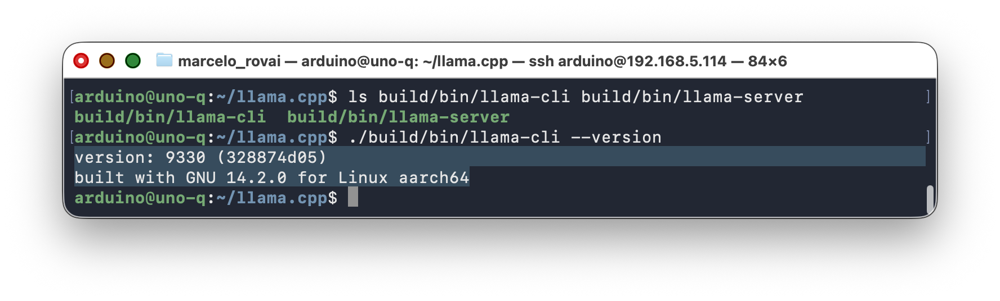

### Step 4 — Reclaim Disk Space (Optional)

The build tree adds about 142 MB of intermediate files. On a board with limited storage, copy the runtime binaries to a slim directory and delete the rest:

```bash
cd /home/arduino
mkdir -p llama-runtime
cp llama.cpp/build/bin/llama-server llama-runtime/
cp llama.cpp/build/bin/llama-cli    llama-runtime/
cp llama.cpp/build/bin/*.so*        llama-runtime/ 2>/dev/null

# Verify standalone operation
cd llama-runtime
LD_LIBRARY_PATH=. ./llama-cli --version

# Delete the source + build tree (saves ~690 MB)
rm -rf /home/arduino/llama.cpp
df -h /
```

After cleanup, you should have roughly 1.5 GB free — enough for the model and normal system operation.

> **Alternative: Use pre-built binaries.** llama.cpp publishes pre-built aarch64 Linux binaries on its [GitHub Releases page](https://github.com/ggml-org/llama.cpp/releases). Download the tarball, extract `llama-server` and `llama-cli`, and skip the whole build step. This turns this section into a 2-minute download instead of a 25-minute build, which is useful for classroom setups where you don't need to teach the build process.

## 6. Choosing and Downloading a Model

### Step 1 — Create the Models Directory

```bash
mkdir -p /home/arduino/models
cd /home/arduino/models
```

### Step 2 — Download Qwen3.5-0.8B

Two of the best quantizations are from [Bartowski](https://huggingface.co/bartowski/Qwen_Qwen3.5-0.8B-GGUF/tree/main) and [Unsloth.](https://huggingface.co/unsloth/Qwen3.5-0.8B-GGUF/tree/main)  

For the first part of this tutorial, the test was with 4-bit and 8-bit Bartowski quantization. The best result was with the [Q8_0 version](https://huggingface.co/bartowski/Qwen_Qwen3.5-0.8B-GGUF/blob/main/Qwen_Qwen3.5-0.8B-Q8_0.gguf) (about 797 MB).

```bash
cd ~/models
wget https://huggingface.co/bartowski/Qwen_Qwen3.5-0.8B-GGUF/resolve/main/Qwen_Qwen3.5-0.8B-Q8_0.gguf
```

For 4-bit quantization (about 553 MB):

```bash
wget https://huggingface.co/bartowski/Qwen_Qwen3.5-0.8B-GGUF/resolve/main/Qwen_Qwen3.5-0.8B-Q4_K_M.gguf
ls -lh Qwen_Qwen3.5-0.8B-Q4_K_M.gguf
```

I also make tests with Unsloth. The Unsloth Dynamic quant, which upcasts critical model layers to 16 bits while keeping the overall file size close to Q8: 

> The best is to put the models inside a directory to not make confusion

```
mkdir -p ~/models/Qwen3.5-0.8B-GGUF
cd ~/models/Qwen3.5-0.8B-GGUF

wget -c "https://huggingface.co/unsloth/Qwen3.5-0.8B-GGUF/resolve/main/Qwen3.5-0.8B-Q8_0.gguf"
```

**For the 2 GB UNO Q or extremely tight storage:**

```bash
wget https://huggingface.co/bartowski/SmolLM2-360M-Instruct-GGUF/resolve/main/SmolLM2-360M-Instruct-Q4_K_M.gguf
```
> Adjust the model path in the sections below accordingly.

### A Note on Quantization Quality for Sub-1B Models

During testing, the Q4_K_M quantization of Qwen3.5-0.8B produced noticeably weaker structured outputs compared to larger models at the same quantization level. That's expected: aggressive 4-bit quantization removes information that a 0.8B model can't afford to lose, because smaller models have less redundancy.

Things that helped in the tests:

- **Strong few-shot prompting** (two examples in the system prompt). The most effective single fix.
- **`response_format: json_object`** to constrain decoding to valid JSON.
- **`presence_penalty=1.5`** to prevent repetition loops.
- **Low `max_tokens`** (60–80) to keep answers short and focused.
- **Trying the Unsloth `UD-Q4_K_XL` quant**, which upcasts sensitive layers automatically.

## 7. Using llama-cli

`llama-cli` is a self-contained, one-shot tool: no HTTP, no extra process, just "run a prompt, see the text, exit." It's the fastest way to sanity-check a model before building anything on top of it. Once you want anything persistent, multi-client, or called from a program, you'll move to `llama-server` (Section 8).

### Qwen 3.5 and Thinking Mode

Qwen3.5 is a hybrid reasoning model, and by default the models are in "thinking mode." For edge use, disable it. `llama-cli` needs to be told this explicitly via the `--reasoning` flags. Without them, the model may enter thinking mode, producing long internal reasoning chains that burn minutes of CPU time and often loop without reaching a conclusion.

In current llama.cpp builds, use `--reasoning off` and `--reasoning-budget 0` on the command line. The older `--chat-template-kwargs '{"enable_thinking":false}'` flag is **deprecated** and produces a warning. If you see it in other tutorials, replace it with the newer flags.

Recommended inference parameters for non-thinking mode (from the [Unsloth Qwen3.5 guide](https://unsloth.ai/docs/models/qwen3.5)):

| Parameter            | Value      | Purpose                                              |
| --------------------- | ---------- | ---------------------------------------------------- |
| `temperature`        | 0.7 to 1.0 | Moderate creativity for general tasks                |
| `top_p`              | 0.8        | Nucleus sampling                                     |
| `top_k`              | 20         | Limit token pool                                     |
| `min_p`              | 0.0        | Disabled                                             |
| `presence_penalty`   | 1.5        | Prevent repetition loops (critical for small models) |
| `repetition_penalty` | 1.0        | Disabled (presence_penalty handles it)               |

Call `llama-cli` with those settings:

```bash
cd ~/llama.cpp

./build/bin/llama-cli \
  --model ~/models/Qwen_Qwen3.5-0.8B-Q8_0.gguf \
  --threads 4 \
  --ctx-size 1024 \
  --temperature 0.7 \
  --top-p 0.8 \
  --top-k 20 \
  --min-p 0.0 \
  --presence-penalty 1.5 \
  --repeat-penalty 1.0 \
  --reasoning off \
  --reasoning-budget 0
```

At the prompt `>`, type a question, for example:

> `> What is the capital of Brazil. Answer with one word.`

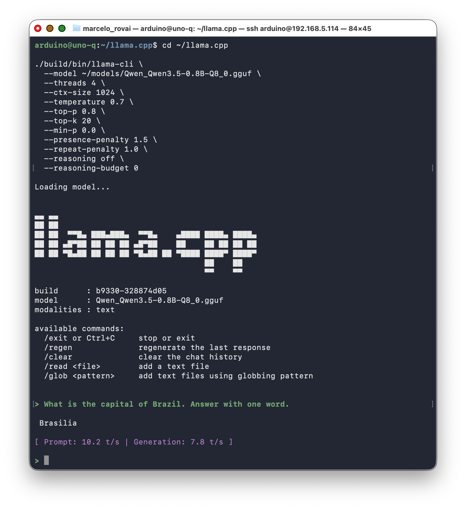

Latency in tokens/s is acceptable and usable, in the 5–10 tokens/s range.

While inference runs, monitor CPU use and temperature:

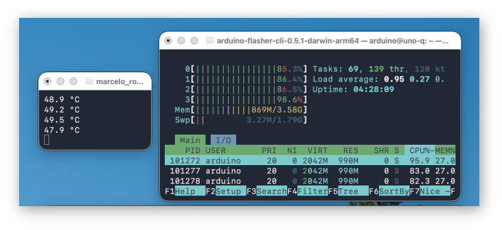

The UNO Q handles SLMs well. The inferences were done without any heatsink or fan. Internal temperature increased by about 20 °C (from ~30 °C to ~50 °C). For long answers, the temperature reached ~60 °C, which is lower than a Raspberry Pi 5 with an active cooler.

> Check session 8. Using llama-server / Step 4 — Thermal Monitoring for creating a scriot to measure the temperature

### Create a Helper Script

You can wrap the full `llama-cli` command in a small shell script and run it instead of typing all the flags every time.

On the UNO Q:

```bash
nano ~/qwen_cli_llama.sh
```

Paste:

```bash
#!/usr/bin/env bash
# Simple Qwen3.5 0.8B 8-bit CLI on UNO-Q without thinking

MODEL=~/models/Qwen_Qwen3.5-0.8B-Q8_0.gguf
LLAMA=~/llama.cpp/build/bin/llama-cli

"$LLAMA" \
  --model "$MODEL" \
  --threads 4 \
  --ctx-size 1024 \
  --temperature 0.7 \
  --top-p 0.8 \
  --top-k 20 \
  --min-p 0.0 \
  --presence-penalty 1.5 \
  --repeat-penalty 1.0 \
  --reasoning off \
  --reasoning-budget 0 \
  -p "$*"
```

Save and make it executable:

```bash
chmod +x ~/qwen_cli_llama.sh
```

> Optionally, add `~/` to your `PATH` in `~/.bashrc` or `~/.profile` so you can call it without the full path.

### Use It With a Simple Command

Now run:

```bash
~/qwen_cli_llama.sh "Explain edge AI in two sentences."
```

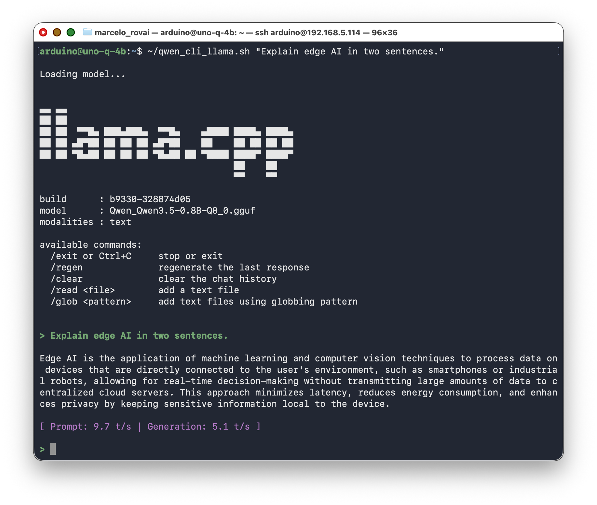

or, after adding `~/` to `PATH` and reloading the shell:

```bash
qwen_cli_llama.sh "Explain edge AI in two sentences."
```

## 8. Using llama-server

The Arduino UNO Q can host a small language model directly on its Linux side, and the easiest way to expose that model to other programs — Python scripts, `curl`, a browser — is through `llama-server`. Instead of calling the model via a one-shot CLI, `llama-server` loads the GGUF file into RAM once and exposes a simple HTTP API on localhost, so any client can send prompts and receive completions via JSON.

In this chapter you'll run `llama-server` **interactively, in the foreground** — no systemd, no background service. That's enough to learn the API and build client code against it. (Turning it into a service that survives reboots is covered in a later, project-focused chapter.)

You need **two SSH sessions** open to the UNO Q at the same time:

- **Terminal 1** runs `llama-server` in the foreground (you'll see logs here).
- **Terminal 2** sends queries with `curl` and Python.

### Step 1 — Start llama-server (Terminal 1)

In your first terminal:

```bash
cd ~/llama.cpp

./build/bin/llama-server \
  --model ~/models/Qwen_Qwen3.5-0.8B-Q8_0.gguf \
  --threads 4 \
  --ctx-size 1024 \
  --port 8081 \
  --reasoning off \
  --reasoning-budget 0 \
  --alias qwen3.5-0.8b
```

> **`--alias` gives the server a stable name to answer to**, independent of the GGUF filename. Client code (curl, Python, the WebUI) can always ask for `"model": "qwen3.5-0.8b"` no matter which actual file is loaded behind it — which matters the moment you start swapping models (see the multimodal chapter for a worked example). Use it from here on, every time you start `llama-server`.

Watch the log output. You should see:

- The model loading (file path, parameter count, quantization type)
- `thinking = 0`, which confirms reasoning mode is disabled
- `HTTP server listening` on the port you chose

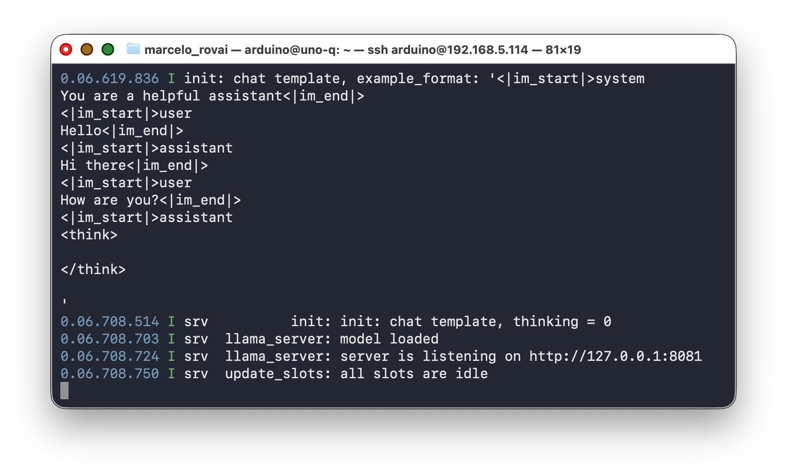

If port 8081 is busy, try another port:

```bash
sudo ss -ltnp | grep 8081
```

> **Do not close this terminal.** The server runs as long as this process is alive. When you're done testing, press `Ctrl+C` to stop it.

### Step 2 — Quick Test With curl (Terminal 2)

Open a second SSH session to the UNO Q. First, verify the server is alive:

```bash
curl -s http://127.0.0.1:8081/health | python3 -m json.tool
```

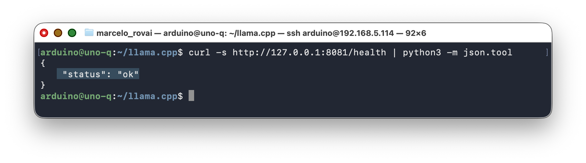

You should see `"status": "ok"`. Now send a prompt using the `/completion` endpoint:

```bash
curl http://127.0.0.1:8081/completion \
  -H "Content-Type: application/json" \
  -d '{
    "prompt": "In 2 sentences, what is the Olympic Games?",
    "n_predict": 128
  }'
```

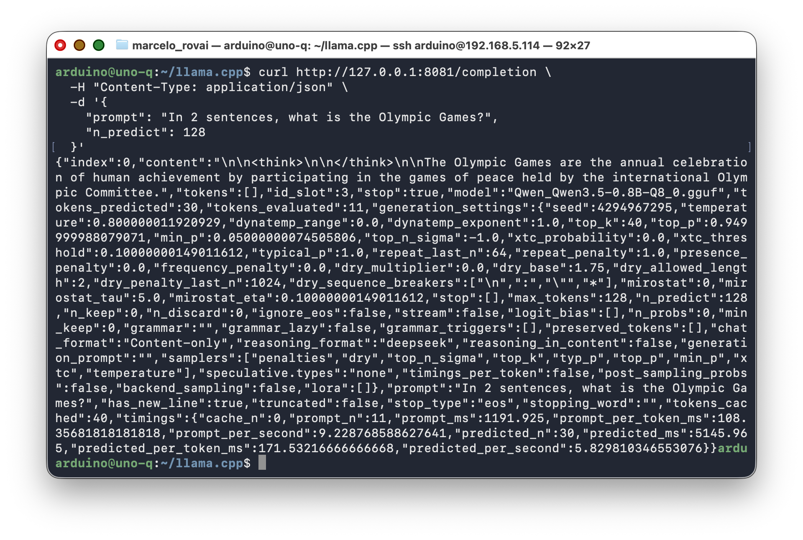

Switch back to **Terminal 1** while it processes. You'll see the server log each token as it generates, plus timing information. That's the main advantage of running in the foreground: you see exactly what the model is doing.

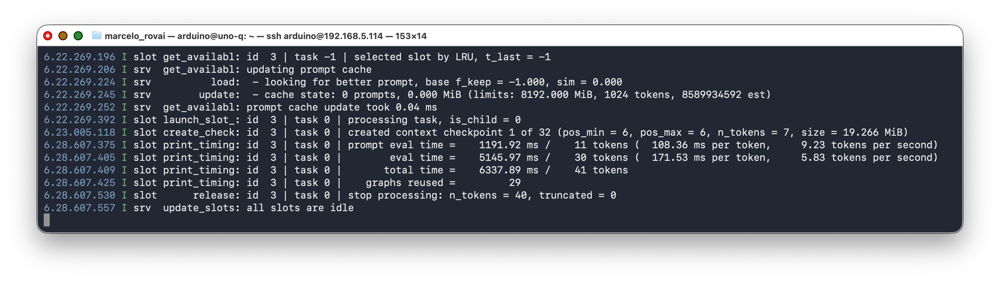

Now try the OpenAI-compatible `/v1/chat/completions` endpoint, which is what the Python clients in Section 9 use:

```bash
curl http://127.0.0.1:8081/v1/chat/completions \
  -H "Content-Type: application/json" \
  -d '{
    "model": "qwen3.5-0.8b",
    "messages": [
      {"role": "system", "content": "You are concise. Answer in one sentence."},
      {"role": "user", "content": "What is TinyML?"}
    ],
    "max_tokens": 80,
    "temperature": 0.7,
    "top_p": 0.8,
    "presence_penalty": 1.5
  }'
```

The response arrives as a JSON object. The model's answer is in `choices[0].message.content`.

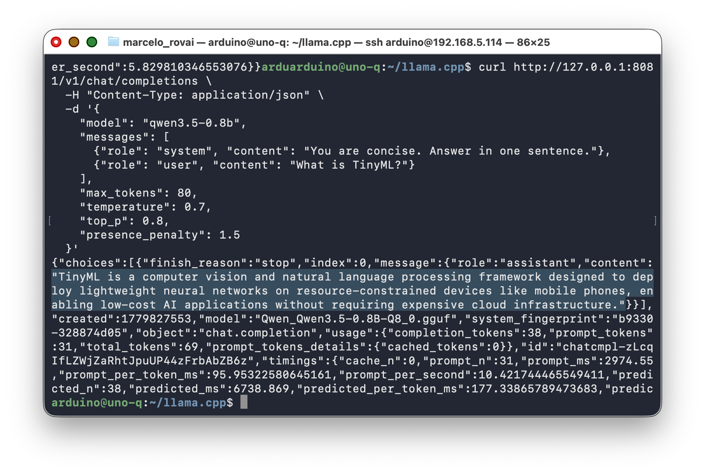

### Step 3 — Stop the Server

When you're done testing, go back to **Terminal 1** and press `Ctrl+C`. The model unloads and the port is freed. Keep it running for the next section — you'll need it for the Python examples.

### Step 4 — Thermal Monitoring (Optional)

The UNO Q exposes Qualcomm thermal data through Linux thermal and hwmon interfaces. To monitor the MPU temperature in real time during inference:

```bash
# Check thermal zone type
cat /sys/class/thermal/thermal_zone0/type

# Read current temperature (in millidegrees Celsius)
cat /sys/class/thermal/thermal_zone0/temp

# Live monitor (updates every second)
watch -n 1 "cat /sys/class/hwmon/hwmon0/temp1_input"
```

For a friendlier readout, drop a small Python script in `~/q_temp_monitor.py`:

```python
#!/usr/bin/env python3
import time
from pathlib import Path

# The mapss_thermal zone exposes the QRB2210 SoC temperature
TEMP_PATH = Path("/sys/class/hwmon/hwmon0/temp1_input")

def read_temp_c():
    raw = int(TEMP_PATH.read_text().strip())
    return raw / 1000.0

if __name__ == "__main__":
    try:
        while True:
            print(f"{read_temp_c():.1f} °C")
            time.sleep(1.0)
    except KeyboardInterrupt:
        pass
```

Make it executable and run it in a side terminal while the SLM works:

```bash
chmod +x ~/q_temp_monitor.py
~/q_temp_monitor.py
```

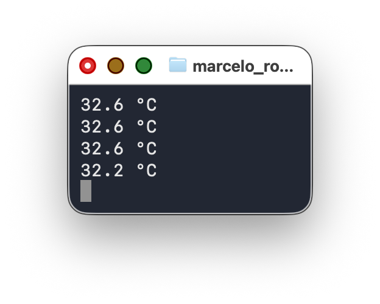

You should see the reading climb from ~32 °C at idle to whatever your workload pushes it to during inference.

#### Thermal Behavior (Measured)

During testing on a UNO Q 4 GB **without any heatsink or fan**:

| Condition | Internal CPU Temperature |
|---|---|
| Idle (no inference) | ~34 °C |
| Normal inference (short prompts) | ~54 °C (+20 °C above idle) |
| Sustained inference (long answers) | ~62 °C |

All of these are well under the 70–80 °C range where ARM cores begin to throttle. The UNO Q runs cooler than a Raspberry Pi 5 under comparable loads. **No heatsink or fan is required** for normal SLM workloads, even in sustained use.

### Step 5 — The Built-In WebUI (Optional)

Recent llama.cpp builds ship a SvelteKit-based chat interface embedded directly into the `llama-server` binary. No extra install, no extra flag. If the build from Section 5 is recent enough, the UI is already running on the same port as the API.

From the UNO Q itself, use `http://127.0.0.1:8081/`, or tunnel from your laptop with `ssh -L 8081:127.0.0.1:8081 arduino@<UNO_Q_IP>` and open `http://localhost:8081/` in the host browser.

Alternatively, adding `--host 0.0.0.0` to llama. cpp.cpp command, the WebUI can be opened from your desktop browser using the UNO Q IP   Address:

```bash
cd ~/llama.cpp

./build/bin/llama-server \
  --model ~/models/Qwen_Qwen3.5-0.8B-Q8_0.gguf \
  --threads 4 \
  --ctx-size 1024 \
  --port 8081 \
  --host 0.0.0.0 \
  --reasoning off \
  --reasoning-budget 0 \
  --alias qwen3.5-0.8b
```

And so, from any device on the same Wi-Fi, open:

**http://<UNO_Q_IP>:8081/**  (for example, in my case: http://192.168.5.114:8081/)

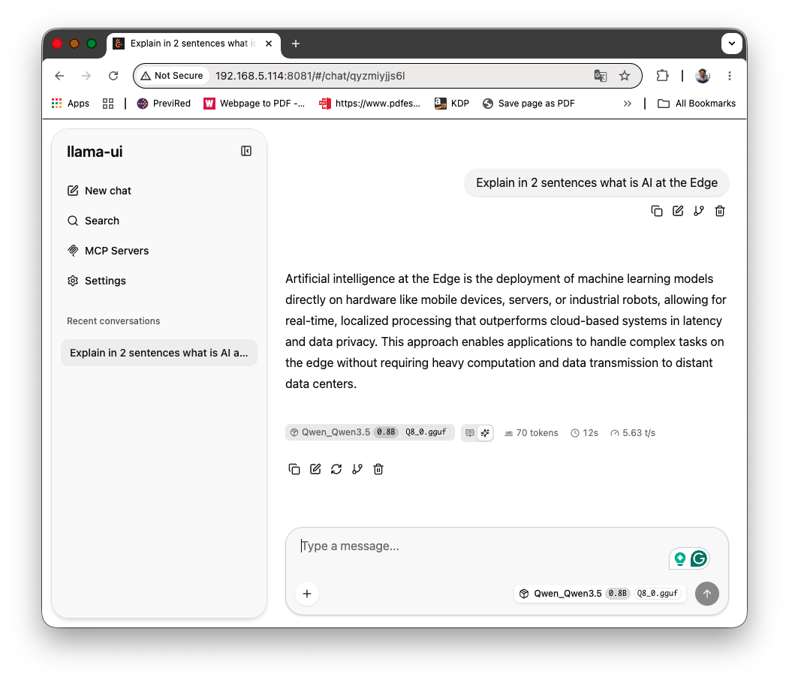

What's useful here:

- Streaming chat against your local Qwen3.5-0.8B, no extra app needed.
- A live sampling panel for `temperature`, `top_p`, `presence_penalty`, and friends. Useful for tuning before you bake values into Python code.
- Reasoning/thinking blocks render in their own collapsible section. With `--reasoning off --reasoning-budget 0` the section stays empty, which is a quick visual confirmation that the flag worked.
- For more information, see [guide: using `llama-ui` — the new WebUI of llama.cpp](https://github.com/ggml-org/llama.cpp/discussions/16938).

What to skip on a 4 GB UNO Q:

- **File uploads.** The UI accepts images and PDFs, but Qwen3.5-0.8B is text-only (We will learn how to handle image further) . Dropping an image either gets ignored or produces a hallucination. Vision-capable GGUFs (Qwen3.5-VL, LLaVA variants) don't fit comfortably in this board's RAM.
- **MCP tool calling and built-in agent tools.** Available in the UI, but enabling filesystem or shell tools on a server bound to `0.0.0.0` is a security footgun. Keep them off in this setup.

> If the URL returns a bare JSON error instead of a UI, your `llama-server` build predates the embedded WebUI. Rebuild from the latest llama.cpp `master`, or grab a recent pre-built aarch64 binary from the GitHub Releases page.

## 9. Talking to llama-server From Python

`llama-server` speaks the same API shape as OpenAI's Chat Completions endpoint. That means you have two ways to call it from Python: the official `openai` client library (recommended — it's the standard interface, and the same code works against a cloud model later), or raw HTTP requests (useful to understand what the library does underneath, or when you can't add a dependency).

With **Terminal 1** still running `llama-server` from Section 8, use **Terminal 2** for the examples below.

### 9.1 Using the `openai` Client Library

Install it:

```bash
pip install --user openai
```

Create `~/qwen_client.py`:

```bash
nano ~/qwen_client.py
```

Paste:

```python
#!/usr/bin/env python3
"""
Chat with the local Qwen3.5 SLM served by llama-server,
using the standard OpenAI-compatible client library.
Run llama-server in another terminal first, then call this script.
"""
import re
import sys
from openai import OpenAI

# llama-server doesn't check the API key, but the client requires one.
client = OpenAI(base_url="http://127.0.0.1:8081/v1", api_key="not-needed")

MODEL = "qwen3.5-0.8b"

def strip_think(text):
    """Remove residual <think>...</think> tags from Qwen3.5 output."""
    return re.sub(r"<think>.*?</think>", "", text, flags=re.DOTALL).strip()

def ask(messages, max_tokens=128, stream=True):
    """Send a chat completion request and return the cleaned response."""
    response = client.chat.completions.create(
        model=MODEL,
        messages=messages,
        max_tokens=max_tokens,
        temperature=0.7,
        top_p=0.8,
        presence_penalty=1.5,
        stream=stream,
    )
    if not stream:
        return strip_think(response.choices[0].message.content)

    chunks = []
    for chunk in response:
        delta = chunk.choices[0].delta.content or ""
        print(delta, end="", flush=True)
        chunks.append(delta)
    print()
    return strip_think("".join(chunks))

if __name__ == "__main__":
    system = "You are concise."
    history = [{"role": "system", "content": system}]

    if len(sys.argv) > 1:
        # One-shot mode: pass the prompt as arguments
        prompt = " ".join(sys.argv[1:])
        history.append({"role": "user", "content": prompt})
        ask(history)
    else:
        # Interactive REPL with conversation memory
        print("Qwen3.5 on UNO Q (via llama-server + openai). Ctrl+C to exit.\n")
        try:
            while True:
                prompt = input("> ").strip()
                if not prompt:
                    continue
                history.append({"role": "user", "content": prompt})
                print()
                reply = ask(history)
                history.append({"role": "assistant", "content": reply})
                print()
        except (KeyboardInterrupt, EOFError):
            print("\nBye!")
```

Make it executable and test:

```bash
chmod +x ~/qwen_client.py

# One-shot test
~/qwen_client.py "In one sentence, what causes dengue fever?"
```

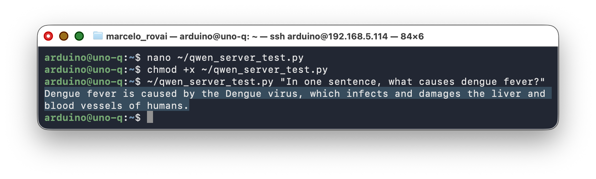

```bash
# Interactive REPL, with memory across turns
~/qwen_client.py
```

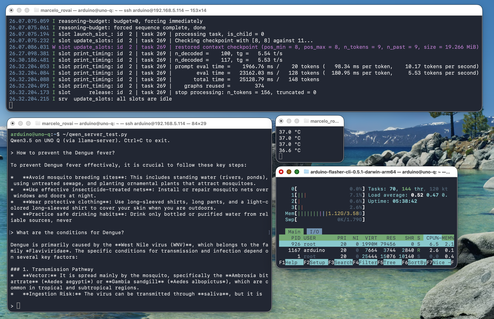

Two things worth noticing in this script:

- **`stream=True` by default.** Tokens print as they're generated instead of waiting for the full response — the same experience you get from the WebUI or `llama-cli`.
- **`history` is a plain Python list.** Each turn appends both the user prompt and the assistant's reply, so the model sees the full conversation on the next call. This is exactly how multi-turn "memory" works with any OpenAI-compatible API — there's no hidden server-side state.

#### Structured JSON output

The same client works for structured tasks, not just chat. Ask the model to produce JSON:

```bash
~/qwen_client.py "Given: temp=30.2C, humidity=85%, standing water=yes. Classify dengue risk as low/medium/high. Reply ONLY with JSON: {\"risk\":\"...\", \"reason\":\"...\"}"
```

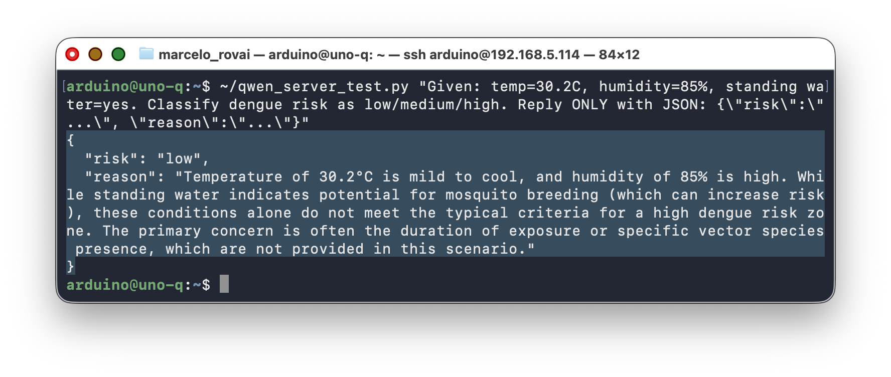

The model returns valid JSON most of the time at Q8 quantization. This pattern — sensor-like input in, structured verdict out — is exactly what a real application built on this chapter would use; see [Going Further](#12-going-further).

### 9.2 Alternative: Raw HTTP With `requests`

Sometimes you don't want the `openai` dependency — an embedded script, a minimal container image, or just wanting to see the wire format directly. `llama-server`'s HTTP API is plain JSON over HTTP, so `requests` works fine too:

```python
import requests

resp = requests.post(
    "http://127.0.0.1:8081/v1/chat/completions",
    json={
        "model": "qwen3.5-0.8b",
        "messages": [
            {"role": "system", "content": "You are concise."},
            {"role": "user", "content": "What is TinyML?"},
        ],
        "max_tokens": 80,
        "temperature": 0.7,
        "top_p": 0.8,
        "presence_penalty": 1.5,
    },
    timeout=120,
)
resp.raise_for_status()
print(resp.json()["choices"][0]["message"]["content"])
```

### 9.3 Library vs. Direct HTTP: When to Use Which

| | `openai` library | raw `requests` |
|---|---|---|
| Code | Shorter, typed response objects | More verbose, manual JSON parsing |
| Streaming | Built-in iterator over chunks | Manual SSE line parsing |
| Swapping to a cloud provider | Change `base_url` + `api_key`, done | Change the URL and headers by hand |
| Dependencies | Adds `openai` package | Only `requests` (often already installed) |
| Error handling | Raises typed exceptions | You inspect `status_code` / `response.text` yourself |
| Best for | Application code, anything long-lived | Quick scripts, debugging, constrained environments |

For anything beyond a one-off test, prefer the library — it's the same code you'd write against a real OpenAI, Groq, or other hosted endpoint, which is the point of `llama-server` implementing that API in the first place.

## 10. Performance: What to Actually Expect

Measured on a UNO Q 4 GB with the factory image, Qwen3.5-0.8B Q8_0, no heatsink, no fan:

| Metric | Value |
|---|---|
| Cold model load (boot of llama-server) | ~4 s |
| Idle RAM (llama-server running) | ~700–800 MB |
| Model + context memory usage | ~1,122 MiB |
| Prompt processing throughput | ~9.9 tokens/s |
| Generation throughput | ~4.75 tokens/s |
| CPU usage during decode | 4 cores @ 100% |
| Idle board temperature (no inference) | ~34 °C |
| Temperature during normal inference | ~54 °C |
| Temperature during sustained long answers | ~62 °C |
| Thermal throttle threshold | 70–80 °C (never reached) |
| Power consumption (max.) | 3.1 W |

Takeaways:

- **Usable but not desktop-class.** Prompt processing at ~9.9 tok/s and generation at ~4.75 tok/s make the setup workable for periodic queries, but responses take a few seconds depending on length. The ~1,122 MiB memory footprint (model + context) leaves about 2.5 GB for the OS and your application. Tight but viable on the 4 GB board.
- **Q4 quantization shows quality tradeoffs.** At 0.8B parameters, the model has less redundancy than a 7B model, so Q4 compression removes information that matters. Strong few-shot prompting and `presence_penalty=1.5` compensate for most of it. **Use Q8_0** or the Unsloth Dynamic quant if storage allows.
- **Thermal behavior is not a concern.** The +20 °C rise from idle to inference is modest, and even sustained workloads only reach ~62 °C, well under the 70–80 °C throttle threshold. No heatsink is required for normal lab use.
- **Thinking mode kills the board.** With thinking enabled, the model spends 30–60 seconds generating internal reasoning chains before producing any output, and often loops without reaching a conclusion. Always run Qwen3.5 Small with `--reasoning off --reasoning-budget 0`.
- **Repetition loops.** Without `presence_penalty=1.5`, the model tends to repeat phrases or produce circular responses. A known behavior of small Qwen3.5 variants, well-documented in the Unsloth guide.

> **Token throughput vs. wall-clock latency**
>
> People often optimize for tokens/second when wall-clock latency is what actually matters. A 30-token answer at 10 tok/s (3 s) feels twice as responsive as a 100-token answer at 10 tok/s (10 s). Cap `max_tokens` aggressively and design prompts to keep responses short.

## 11. Tips, Tricks, and Troubleshooting

### Model Loops or Produces Very Long Responses

This almost always means thinking mode is active. Verify the `--reasoning off --reasoning-budget 0` flags are present on your `llama-server` / `llama-cli` command line, and that `presence_penalty` is set to 1.5 in your API calls.

Even with `--reasoning off`, Qwen3.5 may still emit an empty `<think></think>` tag in its output. That's cosmetic — the `strip_think()` function in the Python examples handles it. The content inside the tags is empty, so no actual reasoning is happening.

If you see the deprecation warning about `--chat-template-kwargs`, update your command line to use `--reasoning off --reasoning-budget 0` instead.

### llama-cli Shows Reasoning Even With Flags

A known issue: `llama-cli` is less reliable than `llama-server` for suppressing Qwen 3.5 reasoning traces. For anything you build on top, prefer `llama-server`. The CLI is best reserved for quick experiments.

### Out-of-Memory Crashes

If the kernel OOM-killer takes out `llama-server` during model load:

- Confirm swap is enabled. Running `free -h` should show a non-zero swap size.
- Reduce `--ctx-size` (try 1024 or lower).

### JSON Parse Failures From the Model

Even when asking for JSON explicitly, occasional responses include stray text. A simple, robust pattern:

```python
import json

def parse_verdict(content):
    try:
        return json.loads(content)
    except json.JSONDecodeError:
        cleaned = content.strip().strip("`")
        if cleaned.startswith("json"):
            cleaned = cleaned[4:].lstrip()
        return json.loads(cleaned)
```

If failures persist, strengthen the system prompt (`"Output MUST start with { and end with }"`), or look into llama.cpp's grammar-based decoding (GBNF) for a hard constraint instead of a prompt hint.

### Disk Space Running Low

```bash
df -h /
```

The root partition is ~9.8 GB total on older images. If you're running low:

```bash
# Check what is using space
sudo du -sh /home/arduino/* | sort -h

# Clean apt cache
sudo apt clean
sudo apt autoremove -y
```

If you deleted the llama.cpp source tree and still need to rebuild later, use a shallow clone: `git clone --depth 1 https://github.com/ggml-org/llama.cpp`

## 12. Going Further

This chapter deliberately stopped at "the tools work and you can call them from Python." Two follow-up chapters build real applications on top of what you just learned:

- **A vision-language project** — giving a small model eyes: loading a multimodal SLM and its projector, running a vision server, and reasoning about camera input.
- **A dual-brain generative AI project** — wrapping `llama-server` as a systemd service, connecting it to an Arduino sketch over Bridge RPC, and exposing it to other devices over Flask: a complete sensor-in, SLM-reasoning, actuator-out application.

### Alternative Model (Qwen 3.5 2B)

The general rule from the empirical Qwen3.5 work is that parameter count beats quantization. A 4-bit version of a larger Qwen3.5 model can still be substantially stronger than a smaller one at higher precision, using nearly the same amount of memory. The jump from 0.8B to 2B is the largest for agent tasks and long contexts.

On the UNO Q specifically:

| Dimension                                 | 0.8B Q8_0                   | 2B UD-Q4_K_XL          |
| ----------------------------------------- | --------------------------- | ---------------------- |
| Model file size                           | ~880 MB                     | ~1.25 GB               |
| RAM footprint (model + 1024 ctx)          | ~1.1 GB                     | ~1.9–2.0 GB            |
| Free RAM after load (out of ~3 GB usable) | ~1.7 GB                     | ~0.8 GB                |
| Generation speed (measured / estimated)   | ~4.75 tok/s                 | ~1.8–2.5 tok/s         |
| Quality on structured JSON                | Good with a strong few-shot | Noticeably more robust |
| Quality on free-form chat                 | Adequate                    | Meaningfully better    |
| Thermal load                              | ~54 °C inference            | ~58–62 °C inference    |

What this means in practice: the 0.8B Q8 stays responsive for chat and interactive demos; the 2B is worth the extra latency when quality matters more than snappy responses (e.g., an infrequent classification call rather than a live chat).

> **Worth trying before committing:** the Unsloth `UD-Q4_K_XL` variant of the 2B, not vanilla Q4_K_M — it upcasts sensitive tensors automatically, so you get most of Q6 quality at near-Q4 size.

### Alternative SLM Backends

This tutorial used llama.cpp because it's the lowest-overhead path on a CPU-only ARM64 board. Three other backends worth knowing about:

- **Ollama** — easier setup, slightly higher overhead (Not simple to install in the UNO Q)
- **LiteRT-LM** — Google's `.litertlm` format with built-in function calling and Python presets. Officially supports Raspberry Pi (and therefore the UNO Q's aarch64 Debian). Tradeoff: limited to Gemma family models.
- **yzma** — a Go wrapper around llama.cpp with `purego` instead of CGo. Single Go binary, no daemon needed. Useful when you want to package everything into one executable.

### Function Calling and Multimodal Models

Qwen3.5 supports function-calling formats, which lets the model itself decide when to call external tools (read a sensor, drive an actuator) instead of just answering a prompt. It also has native multimodal variants (text + image in a unified latent space) — the 0.8B text-only model used here is one point on a spectrum that includes vision-capable siblings. Both topics are picked up in the follow-up project chapters above.

### Agentic AI Assistant

For example, implement the **[QClaw](https://github.com/laurenvil/Uno-QClaw)**, an on-device agentic AI assistant for the Arduino Uno Q, developed by [David Laurenvill](https://www.linkedin.com/in/david-laurenvil-3a223410/). It writes, compiles, and uploads Arduino sketches; captures camera frames; drives Linux-side LEDs; reports network state; and scans I²C buses — all running entirely on the board. No internet. No API keys. No cloud.

## 13. Conclusion

### What We Covered

This tutorial got a Small Language Model running locally on the Arduino UNO Q, entirely offline: building `llama.cpp` from source, downloading and comparing quantized Qwen3.5 models, running one-shot prompts with `llama-cli`, serving the model over HTTP with `llama-server`, and calling it from Python — first the standard way with the `openai` client library, then with raw `requests` to see what's underneath. We also measured what's realistic on this hardware: throughput, memory footprint, and thermal behavior.

### Advantages of This Approach

- **Local generative AI on Arduino hardware.** Until the UNO Q, "running an LLM on an Arduino" was a contradiction. Now, on the same board used for Blink, a language model answers questions without an internet connection.
- **Standard, transferable tools.** An OpenAI-compatible HTTP API and the official `openai` client library are the same tools you'd use against a hosted model. Nothing here is UNO-Q-specific except the hardware constraints.
- **The OpenAI-compatible API surface means application code can switch from a local SLM to a cloud LLM (and back) with a one-line URL change** — a pattern worth internalizing early.

### Limitations and Considerations

- **Storage is tight.** The factory image leaves ~830 MB free on a single 9.8 GB partition on older images. Building llama.cpp and downloading a model compete for that space.
- **Q4 quantization degrades sub-1B models noticeably.** A 0.8B model at Q4 loses more quality than a larger model at Q4 — less redundancy to exploit.
- **No NPU acceleration.** The QRB2210's Adreno 702 GPU is not a reliable llama.cpp target. CPU is the only option: four A53 cores at 2 GHz doing all the work.
- **Thinking mode is unusable on this hardware.** Qwen3.5's reasoning mode produces multi-minute inference times and frequent loops on the UNO Q. Always use `--reasoning off --reasoning-budget 0`.
- **SLM quality at this size is still uneven.** A 0.8B-parameter model will sometimes produce nonsense JSON, refuse benign prompts, or hallucinate reasons. Keep a human in the loop for any safety-critical decision.

### Where Generative AI Fits in the Edge AI Curriculum


The UNO Q is where generative AI becomes possible at the edge but stays bounded: small models, short outputs, batch-rate inference. Students who understand the constraints here won't be surprised when they hit the same constraints on a real production deployment.

### A Note on the Arduino VENTUNO Q

The VENTUNO Q, with its 40 TOPS Dragonwing IQ8 NPU and 16 GB of RAM, will change what's realistic. SLMs with several billion parameters become interactive; multimodal Qwen3.5-4B (with native vision) becomes practical; multi-turn agents with tool use work in real time. The patterns from this chapter (llama.cpp + OpenAI-compatible HTTP) port directly. Only the model sizes and the latency numbers change.

## 14. Resources

### Useful Resources

| Resource | URL |
|---|---|
| llama.cpp repository | <https://github.com/ggml-org/llama.cpp> |
| llama.cpp HTTP server docs | <https://github.com/ggml-org/llama.cpp/blob/master/tools/server/README.md> |
| OpenAI Python library | <https://github.com/openai/openai-python> |
| Qwen3.5-0.8B GGUF (Bartowski) | <https://huggingface.co/bartowski/Qwen_Qwen3.5-0.8B-GGUF> |
| Qwen3.5-0.8B GGUF (Unsloth Dynamic) | <https://huggingface.co/unsloth/Qwen3.5-0.8B-GGUF> |
| Unsloth Qwen3.5 inference guide | <https://unsloth.ai/docs/models/qwen3.5> |
| Qwen3.5 reasoning control discussion | <https://github.com/ggml-org/llama.cpp/discussions/20476> |
| SmolLM2 GGUF family (Bartowski) | <https://huggingface.co/bartowski?search=SmolLM2> |
| Arduino UNO Q Documentation | <https://docs.arduino.cc/hardware/uno-q> |
| Running LLMs on UNO Q with yzma | <https://projecthub.arduino.cc/marc-edgeimpulse/running-local-llms-and-vlms-on-the-arduino-uno-q-with-yzma-74e288> |
| LiteRT-LM (alternative SLM runtime) | <https://github.com/google-ai-edge/LiteRT-LM> |
| yzma (Go wrapper for llama.cpp) | <https://github.com/hybridgroup/yzma> |
| QClaw | <https://github.com/laurenvil/Uno-QClaw> |

### References

1. Qwen Team, "Qwen3.5 Small Model Series," Alibaba Cloud, March 2026.
2. Unsloth, "Qwen3.5 — How to Run Locally," <https://unsloth.ai/docs/models/qwen3.5>, March 2026.
3. Gerganov, G., "llama.cpp: Inference of Meta's LLaMA model (and others) in pure C/C++," <https://github.com/ggml-org/llama.cpp>
4. Bartowski, "Qwen_Qwen3.5-0.8B-GGUF," <https://huggingface.co/bartowski/Qwen_Qwen3.5-0.8B-GGUF>
5. llama.cpp discussion, "Qwen3.5 Small: How to truly disable thinking?" <https://github.com/ggml-org/llama.cpp/discussions/20476>
6. llama.cpp issue, "enable_thinking param cannot turn off thinking for qwen3.5," <https://github.com/ggml-org/llama.cpp/issues/20182>
7. Arduino, "Arduino UNO Q Product Page," <https://www.arduino.cc/product-uno-q/>
8. Pous, M., "Running local LLMs and VLMs on the Arduino UNO Q with yzma," Arduino Project Hub, Feb 2026.

---

*Tutorial created for IESTI05 — Edge AI Machine Learning System Engineering, UNIFEI. Licensed under GNU General Public License 3.0.*
