# GenAI Meets the Real World:

A Dual-Brain Dengue Risk Classifier with llama.cpp and Bridge RPC

![*Cover image prompt (Nano Banana: Here is the shortened, single-paragraph prompt to reproduce the image: A clean, colorful vector-style digital illustration of an electronics development board on a green cutting mat. In the exact center of the blue board is a large, prominent Qualcomm QRB2210 processor chip glowing with a bright cyan light, while a smaller STM32U585 chip sits to its right. The board is connected via colorful jumper wires to a variety of components scattered around it, including a servo motor, a small breadboard with a sensor, a row of vertical LEDs, and tactile push-buttons. The scene features crisp line art, smooth gradients, and a textbook-illustration style, softly lit by an overhead light source.*](images/jpeg/cover.jpg)

---

## 1. Introduction

### What This Tutorial Covers

This chapter wires the SLM tooling from [Generative AI at the Edge](../2-Gen_AI/README.md) into a real physical-computing application — the loop closes through hardware, not just a terminal. Qwen3.5-0.8B runs as a persistent `llama-server` **systemd service** on the Linux (MPU) side. A Python application built with the `arduino-app-cli` framework uses **Bridge RPC** to expose the SLM to an Arduino sketch on the MCU side, which reads real sensors and drives real actuators. An optional Flask endpoint exposes the same service over HTTP to other devices on the network.

**The Project**

Imagine you have a camera monitoring potential stagnant water sources that are suitable for mosquito larval development. A YOLO model could be trained, for example, to detect water on discarded car tires or buckets. The output of such a model would be one of the inputs to a **Dengue Risk Classifier**. The classifier will also have other inputs, such as temperature and humidity, which are also important conditions for mosquito larvae development. Based on those inputs, the classifier should categorize the situation by turning on external LEDS based on the risk and also providing an explanation through a webpage.

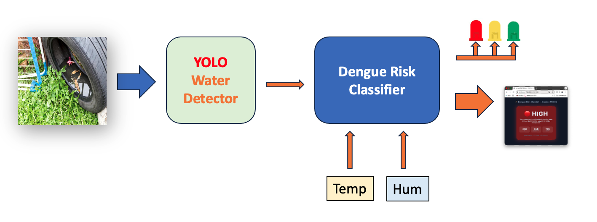

**The Architecture**

The worked example is a dengue risk classifier: the MCU reads temperature, humidity, and a water-presence signal from sensors; the SLM categorizes the situation as `low`, `medium`, or `high` risk with a one-sentence explanation; the MCU drives the RGB LEDs to match the risk level. The pattern generalizes to any application where sensors produce structured data and a language model produces a structured verdict.

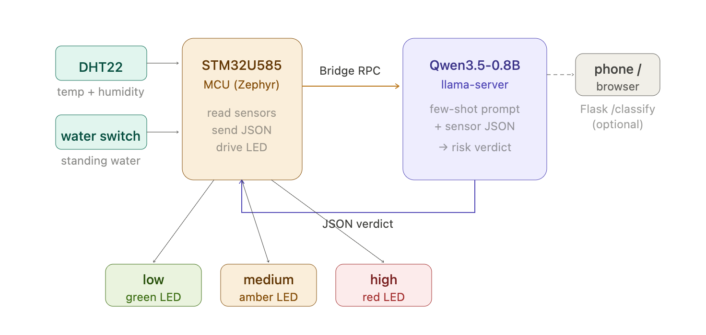

**Why this approach?**

- Full local inference. No API keys, no rate limits, and sensor data never leaves the device.
- The dual-brain architecture works as designed: real-time sensing and actuation on the MCU, AI reasoning on the Linux side, Bridge RPC connecting them.
- Unlike the previous chapters, `llama-server` runs persistently as a service — it survives reboots and restarts on failure, which is what a real deployment needs instead of a terminal you have to keep open.
- The same llama.cpp `llama-server` binary speaks an OpenAI-compatible HTTP API, so the same Python code that talks to a local SLM today can fall back to a cloud LLM tomorrow with a one-line URL change.

By the end of this tutorial you will have a complete UNO Q application that runs from boot, reads sensor data on the MCU, classifies it on the MPU using Qwen3.5-0.8B, drives an RGB LED based on the verdict, and exposes a `/classify` HTTP endpoint for off-board clients (phones, browsers, other boards).

### Prerequisites

This tutorial assumes you have completed:

- [Setup](../1-Setup/README.md) — headless ADB/Wi-Fi/SSH access to the board.
- [Generative AI at the Edge](../2-Gen_AI/README.md) — `llama.cpp` built from source, a Qwen3.5-0.8B GGUF downloaded, and comfort running `llama-server` by hand and calling it from Python.

Also useful, but not required for this chapter: [Multimodal AI at the Edge](../3-Multimodal_AI_Edge/README.md), if you want the vision pathway too.

You'll also want a comfortable way to edit and transfer a multi-file project (`app.yaml`, `python/main.py`, `sketch/sketch.ino`) — Section 2 below sets up VS Code with Remote-SSH for that. `nano` over SSH plus `scp` works too if you'd rather stay terminal-only; everything in this chapter is plain text and nothing depends on the editor.

> If any of the above is unfamiliar, work through those chapters first. This one builds directly on them rather than repeating the tooling.

## 2. Setting Up VS Code with Remote-SSH

Visual Studio Code with the Remote-SSH extension gives you a full IDE experience — file browsing, an integrated terminal, IntelliSense, extensions — running directly against the UNO Q's filesystem. It's not required (everything below also works from `nano` and `scp`/`rsync`), but for a project with three files spread across two languages, it's a meaningfully better workflow than juggling terminal windows.

### Step 1 — Install VS Code

Download and install VS Code for your OS from:
https://code.visualstudio.com/

### Step 2 — Install the Remote-SSH Extension

1. Open VS Code.
2. Go to the **Extensions** view (`Ctrl+Shift+X` / `Cmd+Shift+X`).
3. Search for **Remote - SSH** (by Microsoft).
4. Click **Install**.

### Step 3 — Connect to the UNO Q

1. Click the **Remote Connection** icon in the bottom-left corner or at the left menu of VS Code (it looks like `><`).
2. Select `+` or **Connect to Host…**
3. Enter: `arduino@<UNO_Q_IP_ADDRESS>`

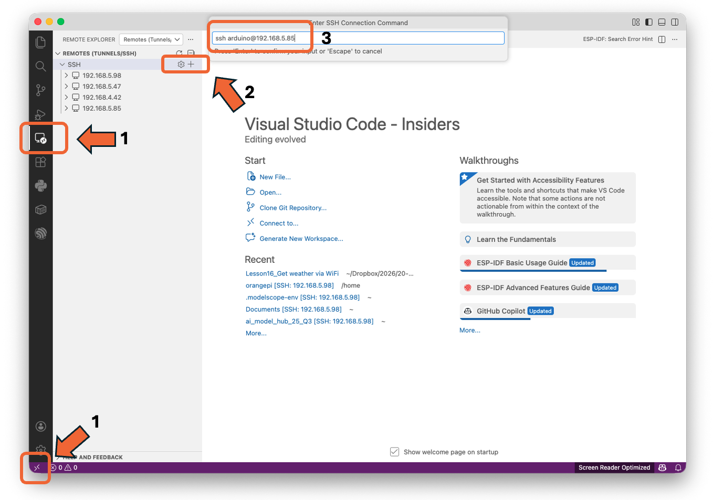

4. When prompted, hit `<Enter>`. The Arduino UNO IP Address will appear under `SSH`.
5. Click in the `terminal +`  icon.

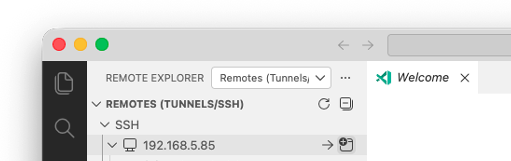

6. Enter your password (or it will authenticate automatically if you set up SSH keys in the Setup chapter).

VS Code will install a lightweight server component on the UNO Q. This may take a minute on the first connection.

### Step 4 — Open Your Projects Folder

Once connected:

1. Go to **File → Open Folder…**
2. Navigate to `/home/arduino/ArduinoApps/`

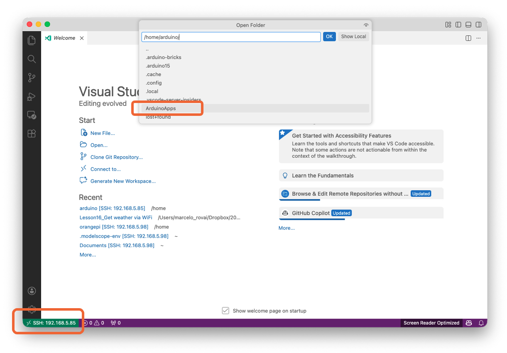

3. Click **OK**.

You now have full file-browsing, editing, and integrated terminal access to the UNO Q.

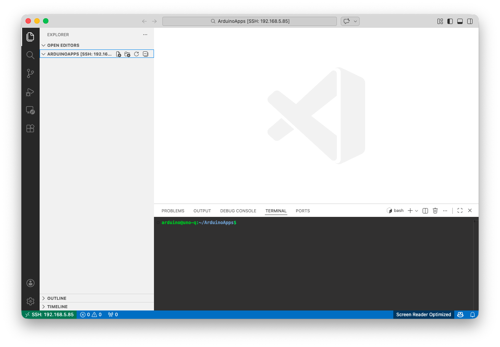

### Step 5 — Open the Integrated Terminal

If not opened, use `` Ctrl+` `` (backtick) to open a terminal inside VS Code. This terminal runs directly on the UNO Q, so you can execute `arduino-app-cli` commands, install packages, and manage your project — all from within VS Code. Every terminal command in the rest of this chapter can run here instead of a separate SSH session.

### Important: Disable Heavy Extensions on the Remote

The UNO Q has limited RAM (especially the 2 GB variant). To avoid memory issues while `llama-server` is also running:

- **Disable** GitHub Copilot and other AI assistants on the remote connection.
- **Disable** any extension you do not strictly need for Python/C++ editing.
- Keep installed remote extensions to a minimum: **Python**, **C/C++**, and **Pylance** are usually sufficient.

You can disable extensions selectively for the SSH connection without affecting your local setup: right-click the extension and choose *Disable (SSH: arduino@...)*.

## 3. Hardware and Software Requirements

### Hardware

- Arduino UNO Q **4 GB** variant (the 2 GB variant works with SmolLM2-360M or smaller only — see the candidate-models table in [chapter 2](../2-Gen_AI/README.md)).
- USB-C data cable.
- Host computer with SSH and, optionally, VS Code (Section 2).
- DHT22 temperature/humidity sensor, water-presence switch, and RGB LEDs (and 220 ohm resistors).
- Breadboard and wiring.

### Software (already on the UNO Q from earlier chapters)

| Tool | Purpose |
|---|---|
| Debian Linux (latest image) | Base OS on the MPU |
| `arduino-app-cli` | Build/run dual-brain apps |
| Python 3.13 | Application code |
| SSH server | Remote access |
| `llama.cpp` built from source, Qwen3.5-0.8B GGUF | From [chapter 2](../2-Gen_AI/README.md) |

### Software (installed in this chapter)

| Tool | Purpose |
|---|---|
| `flask`, `requests` (Python) | HTTP endpoint + API client, installed via the app's `requirements.txt` |

No further build tools are needed — `build-essential`, `cmake`, and `libcurl4-openssl-dev` were already installed when you built `llama.cpp` in chapter 2.

## 4. Running llama-server as a systemd Service

So far, every `llama-server` you've started (chapters 2 and 3) ran interactively, in the foreground, in a terminal you had to keep open. That's fine for testing, but this project needs the model available continuously — surviving reboots, restarting if it crashes, with no terminal attached. That's what a **systemd service** gives you.

### Step 1 — Create the Service File

Since the UNO Q is on the local network, binding to `0.0.0.0` exposes the SLM endpoint to any device on that LAN, which is exactly what [Section 10](#10-the-optional-flask-endpoint-exposing-the-slm-over-http) later does via Flask too.

```bash
sudo nano /etc/systemd/system/llama-server.service
```

Paste:

```ini
[Unit]
Description=llama.cpp server (Qwen3.5-0.8B on UNO Q)
After=network-online.target

[Service]
User=arduino
WorkingDirectory=/home/arduino/llama.cpp
ExecStart=/home/arduino/llama.cpp/build/bin/llama-server \
  -m /home/arduino/models/Qwen_Qwen3.5-0.8B-Q8_0.gguf \
  --host 0.0.0.0 --port 8081 \
  -c 1024 -t 4 \
  --reasoning off \
  --reasoning-budget 0 \
  --alias qwen3.5-0.8b
Restart=on-failure
RestartSec=10
Nice=-5

[Install]
WantedBy=multi-user.target
```

> **Note**: If you moved the binaries to `~/llama-runtime/` (per chapter 2's optional disk-cleanup step), adjust `WorkingDirectory` and `ExecStart` accordingly, and add `Environment=LD_LIBRARY_PATH=/home/arduino/llama-runtime`.

Key flags (most are unchanged from chapter 2 — the new ones are `Restart`, `RestartSec`, and `Nice`, which only make sense in a persistent service):

- `--reasoning off --reasoning-budget 0` — **critical**. Disables Qwen 3.5's thinking mode, as covered in chapter 2. The server log should report `thinking = 0` when this is working.
- `-c 1024` — context length. Larger values eat KV-cache RAM; 1024 is enough for structured classification and short Q&A.
- `--alias qwen3.5-0.8b` — same stable client-facing name used throughout chapters 2 and 3.
- `Restart=on-failure` / `RestartSec=10` — if the process crashes (e.g., OOM), systemd restarts it automatically after 10 seconds instead of leaving the endpoint dead.
- `Nice=-5` gives `llama-server` slightly higher scheduling priority than user-space apps. Don't go lower than -5 or you risk starving the kernel.

### Step 2 — Enable and Start

```bash
sudo systemctl daemon-reload
sudo systemctl enable --now llama-server.service
systemctl status llama-server --no-pager
journalctl -u llama-server -f
```

Wait for `HTTP server listening` in the journal output, then `Ctrl+C` to exit the log tail.

### Step 3 — Verify It Survives a Reboot

```bash
sudo reboot
```

After the board comes back up, SSH in and check:

```bash
systemctl status llama-server --no-pager
curl -s http://127.0.0.1:8081/health
```

If both work, the service is solid. You now have a persistent local AI endpoint that starts on boot, restarts on failure, and serves any client on the board via HTTP — the foundation the rest of this chapter builds on.

## 5. The Dual-Brain Architecture for Generative AI

The UNO Q's dual-brain architecture maps naturally onto the SLM use case: real-time sensing on the MCU, AI reasoning on the MPU, with **Bridge RPC** as the glue between them.

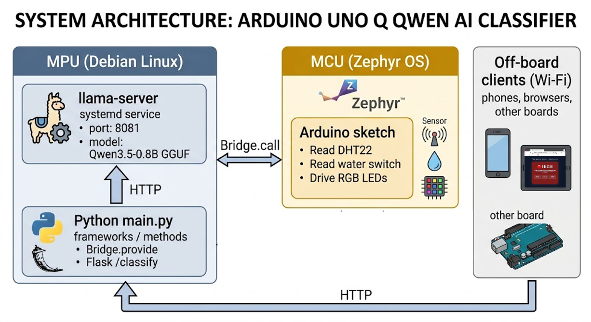

Three data paths run through this architecture:

1. **MCU → MPU (Bridge RPC)** — the sketch calls `Bridge.call("classify", ...)` and gets a verdict back. This is the on-board, low-latency path.
2. **MPU → llama-server (HTTP)** — the Python code calls `localhost:8081` to run inference. Internal to the Linux side.
3. **External → MPU (Flask)** — other devices on the network call `http://<UNO_Q_IP>:7000/classify`. The *optional* off-board path.

The same `classify()` logic powers all three. That's the design.

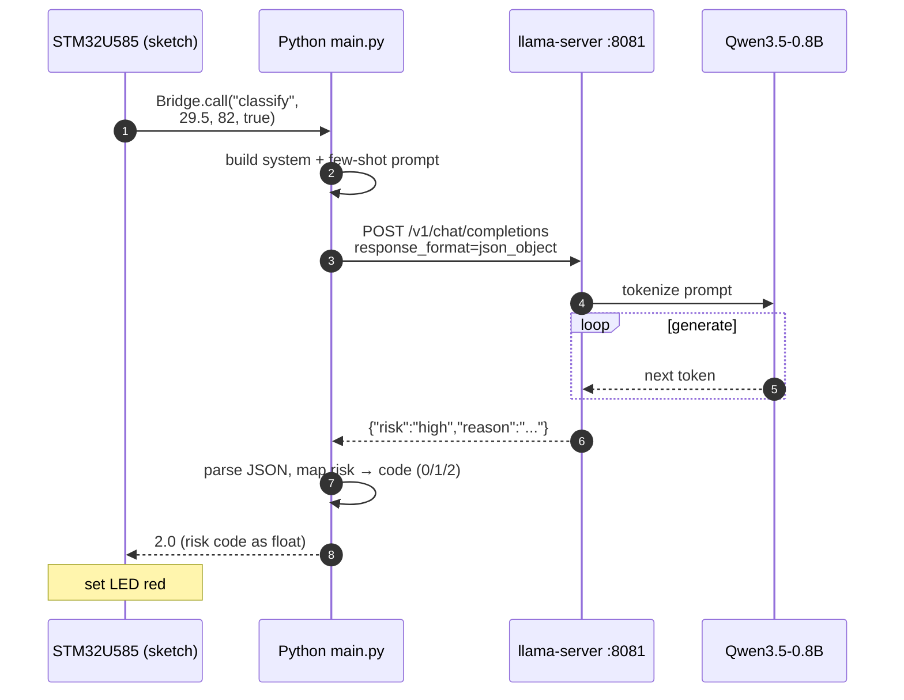

## 6. Project Structure for a Bridge + Flask SLM App

Create a standard UNO Q app following the structure introduced in [chapter 1](../1-Setup/README.md). The app is called `risk-classifier`.

```
risk-classifier/
├── app.yaml
├── README.md
├── python/
│   ├── main.py
│   └── requirements.txt
└── sketch/
    ├── sketch.ino
    └── sketch.yaml
```

### Step 1 — Create the App Skeleton

On the UNO Q:

```bash
cd ~/ArduinoApps
arduino-app-cli app new "risk-classifier"
cd risk-classifier
```

You can also create the project directly in [VS Code with Remote-SSH](#2-setting-up-vs-code-with-remote-ssh) (Section 2 above):

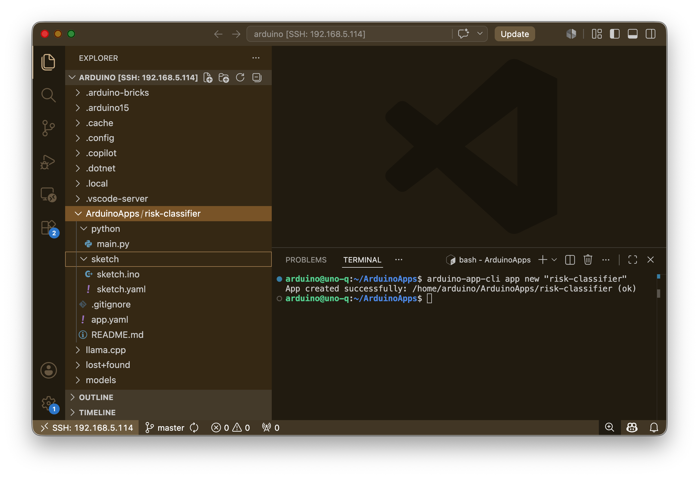

Or in the Arduino App Lab:

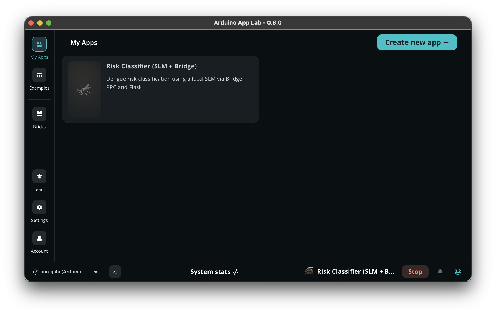

### Step 2 — Edit `app.yaml`

```yaml
name: Risk Classifier (SLM + Bridge)
description: "Dengue risk classification using a local SLM via Bridge RPC and Flask"
icon: 🦟
version: "1.0.0"
ports:
  - 7000
bricks: []
```

The `ports: [7000]` line tells the App Lab runtime to forward port 7000 so external clients can reach the Flask endpoint. Without this, Flask binds inside the container only and is invisible from outside the board.

## 7. Building the Python Side

The Python side does three jobs:

1. Provides a `classify_risk()` function to the MCU sketch over Bridge RPC (returns a numeric code the sketch can use directly).
2. Calls llama-server via HTTP to do the actual inference.
3. Serves the same logic as an HTTP endpoint via Flask for off-board clients (returns the full JSON verdict).

### Step 1 — `python/requirements.txt`

Under the `python` folder, create `requirements.txt`:

```
flask==3.0.3
requests==2.32.3
```

### Step 2 — `python/main.py`

```python
"""
risk-classifier: Dengue risk classification on the UNO Q.

Two interfaces over the same classify() function:
  1. Bridge RPC for the on-board MCU sketch (returns a float code).
  2. Flask HTTP endpoint for off-board clients (returns the full JSON verdict).
"""

import json
import re
import socket
import struct
import threading
import time
import requests
from flask import Flask, request, jsonify
from arduino.app_utils import *

# ─── Container-aware host discovery ────────────────────────────────
# Inside the App Lab container, 127.0.0.1 is the *container's* loopback,
# not the UNO Q's. The default gateway in /proc/net/route is the host
# as seen from this container, which is where llama-server listens.

def _host_gateway():
    """Return the default gateway IP (the UNO Q host from inside the container)."""
    try:
        with open("/proc/net/route") as f:
            for line in f.readlines()[1:]:
                fields = line.strip().split()
                if fields[1] == "00000000" and int(fields[3], 16) & 2:
                    return socket.inet_ntoa(struct.pack("<L", int(fields[2], 16)))
    except OSError:
        pass
    return "127.0.0.1"  # fallback when running outside a container

# ─── Configuration ─────────────────────────────────────────────────
LLM_HOST = _host_gateway()
LLM_URL = f"http://{LLM_HOST}:8081/v1/chat/completions"
LLM_HEALTH_URL = f"http://{LLM_HOST}:8081/health"
TIMEOUT_S = 120
FLASK_PORT = 7000

# Mapping from risk label to numeric code for the MCU
RISK_CODE = {"low": 0.0, "medium": 1.0, "high": 2.0}

# Qwen3.5 non-thinking mode parameters (from Unsloth docs)
LLM_PARAMS = {
    "temperature": 0.7,
    "top_p": 0.8,
    "presence_penalty": 1.5,
}

SYSTEM_PROMPT = (
    "You are an environmental risk classifier for dengue surveillance. "
    "Given temperature (Celsius), humidity (%), and whether standing water "
    "is reported, output ONLY a JSON object with two fields: "
    '"risk" (one of: low, medium, high) and '
    '"reason" (one short sentence, max 20 words). '
    "Do not include any prose outside the JSON."
)

FEW_SHOTS = [
    {"role": "user",
     "content": '{"temp_c": 18.0, "humidity_pct": 40, "standing_water": false}'},
    {"role": "assistant",
     "content": '{"risk":"low","reason":"Cool and dry conditions with no water; Aedes mosquito activity unlikely."}'},
    {"role": "user",
     "content": '{"temp_c": 29.5, "humidity_pct": 82, "standing_water": true}'},
    {"role": "assistant",
     "content": '{"risk":"high","reason":"Warm humid conditions plus standing water create ideal Aedes breeding habitat."}'},
]

# ─── Core inference function (used by both Bridge and Flask) ───────

def strip_think_blocks(text):
    """Remove residual <think>...</think> tags that Qwen3.5 emits even with
    --reasoning off. A known behavior in current llama.cpp builds."""
    cleaned = re.sub(r"<think>.*?</think>", "", text, flags=re.DOTALL)
    return cleaned.strip()


def build_messages(payload):
    user_msg = {"role": "user",
                "content": json.dumps(payload, ensure_ascii=False)}
    return [{"role": "system", "content": SYSTEM_PROMPT}, *FEW_SHOTS, user_msg]


def call_llm(messages, max_tokens=80):
    body = {
        "model": "qwen3.5-0.8b",
        "messages": messages,
        "max_tokens": max_tokens,
        "response_format": {"type": "json_object"},
        **LLM_PARAMS,
    }
    t0 = time.perf_counter()
    r = requests.post(LLM_URL, json=body, timeout=TIMEOUT_S)
    r.raise_for_status()
    latency_ms = (time.perf_counter() - t0) * 1000
    content = r.json()["choices"][0]["message"]["content"]
    content = strip_think_blocks(content)  # remove residual <think> tags
    return content, latency_ms


def parse_verdict(content):
    """Defensive parse: tolerate stray code fences if the model adds them."""
    try:
        verdict = json.loads(content)
    except json.JSONDecodeError:
        cleaned = content.strip().lstrip("`").rstrip("`").strip()
        if cleaned.startswith("json"):
            cleaned = cleaned[4:].lstrip()
        verdict = json.loads(cleaned)
    if verdict.get("risk") not in {"low", "medium", "high"}:
        raise ValueError(f"unexpected risk value: {verdict!r}")
    return verdict


def classify(temp_c, humidity_pct, standing_water):
    """Inner classifier. Returns the full verdict dict.
    Used by the Flask endpoint and wrapped by classify_risk() for Bridge."""
    payload = {
        "temp_c": float(temp_c),
        "humidity_pct": float(humidity_pct),
        "standing_water": bool(standing_water),
    }
    messages = build_messages(payload)
    content, latency_ms = call_llm(messages)
    try:
        verdict = parse_verdict(content)
    except (json.JSONDecodeError, ValueError):
        # one retry with stricter parameters
        content, latency_ms2 = call_llm(messages, max_tokens=60)
        verdict = parse_verdict(content)
        latency_ms += latency_ms2
    verdict["latency_ms"] = round(latency_ms, 1)
    print(f"[classify] {payload} -> {verdict}")
    return verdict


def classify_risk(temp_c, humidity_pct, standing_water):
    """Bridge-facing wrapper. Returns a float code: 0=low, 1=medium, 2=high.
    The Bridge serializes float cleanly in both directions; the sketch
    reads the code into a float and drives the LEDs."""
    verdict = classify(temp_c, humidity_pct, standing_water)
    return RISK_CODE.get(verdict.get("risk", "unknown"), -1.0)


# ─── Flask app (off-board interface) ───────────────────────────────

flask_app = Flask(__name__)

@flask_app.route("/healthz", methods=["GET"])
def healthz():
    try:
        r = requests.get(LLM_HEALTH_URL, timeout=5)
        return jsonify({"flask": "ok", "llm": r.json()}), 200
    except Exception as e:
        return jsonify({"flask": "ok", "llm_error": str(e)}), 503

@flask_app.route("/classify", methods=["POST"])
def classify_endpoint():
    p = request.get_json(force=True)
    required = {"temp_c", "humidity_pct", "standing_water"}
    if not required.issubset(p):
        return jsonify({"error": f"missing: {required - set(p)}"}), 400
    verdict = classify(p["temp_c"], p["humidity_pct"], p["standing_water"])
    return jsonify(verdict), 200


def run_flask():
    # threaded=False because the model handles one request at a time anyway
    flask_app.run(host="0.0.0.0", port=FLASK_PORT, threaded=False)


# ─── Main entry: register Bridge function, start Flask, run loop ──

# Expose the float-returning wrapper to the MCU sketch.
# (The sketch reads the result with rpc.result(float_var), so we MUST
#  return a numeric type, not a dict.)
Bridge.provide("classify", classify_risk)

# Start Flask in a background thread
threading.Thread(target=run_flask, daemon=True).start()

print(f"[init] llama-server target: {LLM_URL}")
print(f"[init] Bridge registered, Flask on :{FLASK_PORT}")


def loop():
    # The main loop is idle. All work is event-driven
    # (Bridge calls from MCU, HTTP requests from Flask).
    time.sleep(1)


App.run(user_loop=loop)
```

Design choices highlights:

- **One inference path, two interfaces.** Bridge RPC and Flask both end up calling the same `classify()` function. The Bridge gets a wrapper that returns a numeric code; Flask gets the full JSON verdict. Separation of concerns between interface and logic.
- **Float on the Bridge, dict over HTTP.** The sketch can only consume primitive types via `rpc.result()`, so the Bridge wrapper collapses the verdict to a float. Off-board HTTP clients get the richer JSON.
- **`response_format: json_object`** tells llama-server to constrain decoding to valid JSON. Not a prompt hint — a real grammar constraint on token selection.
- **`presence_penalty=1.5`** is critical for Qwen3.5 Small models to prevent repetition loops, per the Unsloth recommendation.
- **Few-shot in code, not in the prompt template.** Keeps the chat template clean and lets you swap models without rewriting prompts.
- **`threaded=False`** on Flask. The model serves one request at a time; threading just queues backpressure on a board with no extra cores to spare.

## 8. Building the MCU Side

The sketch reads sensors (temperature, humidity, water presence), calls `Bridge.call("classify", ...)`, and drives actuators (RGB LEDs).

### Step 1 — Hardware

Connect the sensors (DHT22 and button) and the actuators (RGB LEDs):

```text
Red LED     : D9  → LED → 220Ω → GND   (high risk)
Yellow LED  : D10 → LED → 220Ω → GND   (medium risk)
Green LED   : D11 → LED → 220Ω → GND   (low risk)

DHT22:
  VCC  → 3.3V          (NOT 5V — STM32U585 GPIO is 3.3V)
  GND  → GND
  DATA → D2
  10kΩ pull-up between DATA and VCC

Button: one leg → D3
        other leg → GND
```

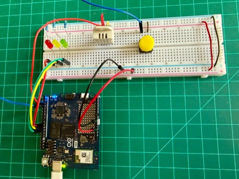

### Step 2 — `sketch/sketch.ino`

```cpp
#include "Arduino_RouterBridge.h"
#include <DHT.h>

#define DHTPIN  2
#define DHTTYPE DHT22

const int BTN_PIN = 3;
const int LED_R   = 9;    // red   = high risk
const int LED_Y   = 10;   // amber = medium risk
const int LED_G   = 11;   // green = low risk

DHT dht(DHTPIN, DHTTYPE);

unsigned long lastReading = 0;
const unsigned long READING_PERIOD_MS = 30000;

// ── Button state with debounce ──────────────────────────────
bool water_state = false;
int  last_btn_reading = HIGH;
int  btn_state        = HIGH;
unsigned long last_debounce_time = 0;
const unsigned long DEBOUNCE_MS = 50;

void updateButton() {
  int reading = digitalRead(BTN_PIN);
  if (reading != last_btn_reading) {
    last_debounce_time = millis();
  }
  if ((millis() - last_debounce_time) > DEBOUNCE_MS) {
    if (reading != btn_state) {
      btn_state = reading;
      if (btn_state == LOW) {            // falling edge = press
        water_state = !water_state;
        Serial.print("[btn] water_state -> ");
        Serial.println(water_state ? "YES" : "no");
      }
    }
  }
  last_btn_reading = reading;
}

void setLEDs(bool r, bool y, bool g) {
  digitalWrite(LED_R, r ? HIGH : LOW);
  digitalWrite(LED_Y, y ? HIGH : LOW);
  digitalWrite(LED_G, g ? HIGH : LOW);
}

// Print float as "X.YY" without depending on dtostrf or printf-float support.
void printFloat2(float v) {
  if (isnan(v)) { Serial.print("nan"); return; }
  if (v < 0)    { Serial.print("-"); v = -v; }
  int whole = (int)v;
  int frac  = (int)((v - whole) * 100.0f + 0.5f);
  if (frac >= 100) { whole++; frac -= 100; }
  Serial.print(whole);
  Serial.print(".");
  if (frac < 10) Serial.print("0");
  Serial.print(frac);
}

void setup() {
  pinMode(LED_R, OUTPUT);
  pinMode(LED_Y, OUTPUT);
  pinMode(LED_G, OUTPUT);
  pinMode(BTN_PIN, INPUT_PULLUP);

  Serial.begin(115200);
  dht.begin();
  Bridge.begin();

  // boot blink
  for (int i = 0; i < 3; i++) {
    setLEDs(true, true, true);  delay(150);
    setLEDs(false, false, false); delay(150);
  }
  setLEDs(false, false, true);  // green = ready
}

void loop() {
  updateButton();   // poll button every loop pass

  if (millis() - lastReading < READING_PERIOD_MS) return;
  lastReading = millis();

  float temp_c       = dht.readTemperature();
  float humidity_pct = dht.readHumidity();
  bool  standing_water = water_state;

  if (isnan(temp_c) || isnan(humidity_pct)) {
    Serial.println("DHT22 read failed");
    setLEDs(true, true, false);  // R+Y = sensor error
    return;
  }

  Serial.print("Classifying: ");
  printFloat2(temp_c);       Serial.print("C, ");
  printFloat2(humidity_pct); Serial.print("%, water=");
  Serial.println(standing_water ? "yes" : "no");

  setLEDs(true, true, true);   // all three on = inference in progress

  // Bridge.call() returns an RpcCall object — do NOT assign to String or use >>.
  // Use .result(var) to extract the return value: returns true on success.
  float risk_f = -1.0f;
  RpcCall rpc = Bridge.call("classify", temp_c, humidity_pct, standing_water);

  if (rpc.result(risk_f)) {
    int risk_code = (int)(risk_f + 0.5f);   // 0 = low, 1 = medium, 2 = high

    Serial.print("[result] risk_code=");
    Serial.println(risk_code);

    if      (risk_code == 0) setLEDs(false, false, true);   // green  — low
    else if (risk_code == 1) setLEDs(false, true,  false);  // yellow — medium
    else if (risk_code == 2) setLEDs(true,  false, false);  // red    — high
    else                     setLEDs(true,  false, true);   // R+G    — unexpected
  } else {
    Serial.print("[rpc error] code=");
    Serial.println(rpc.getErrorCode());
    Serial.print("[rpc error] msg=");
    Serial.println(rpc.getErrorMessage());
    setLEDs(true, false, true);   // R+G = RPC-level error
  }
}
```

**`RpcCall` API note:** `Bridge.call()` returns an `RpcCall` object. To extract the Python function's return value, call `.result(variable)` — it returns `true` on success and fills `variable` by reference. Don't attempt direct assignment (`String s = Bridge.call(...)`) or the stream operator (`>> variable`); neither is defined for `RpcCall`. On failure, `.getErrorCode()` and `.getErrorMessage()` give diagnostics. The Python wrapper returns a `float` (0/1/2), which the Bridge serializes cleanly in both directions.

**Common mistake:** `Bridge.call()` returns a value. Forgetting to capture it (or treating the call as fire-and-forget) is a silent bug: the sketch compiles and runs, but the MCU never sees what the SLM decided. Always capture the return value and validate it.

> **Note**: The exact `Bridge.call` return-value access syntax depends on the version of `Arduino_RouterBridge`. Check the library's `examples/` directory for the version installed on your board if the lines above do not compile cleanly.

### Step 3 — `sketch/sketch.yaml`

The `fqbn` (`arduino:zephyr:uno_q`) tells the compiler which board target to use. The DHT sensor library and its Adafruit Unified Sensor dependency are fetched from the Arduino Library Manager. `Arduino_RPClite` is the low-level transport backing Bridge RPC.

**Verify the library is available before the first build:**

```bash
arduino-cli lib list | grep -i dht
```

If nothing appears, install it manually:

```bash
arduino-cli lib install "DHT sensor library"@1.4.6
arduino-cli lib install "Adafruit Unified Sensor"@1.1.14
arduino-cli lib list | grep -i dht   # confirm it's there
```

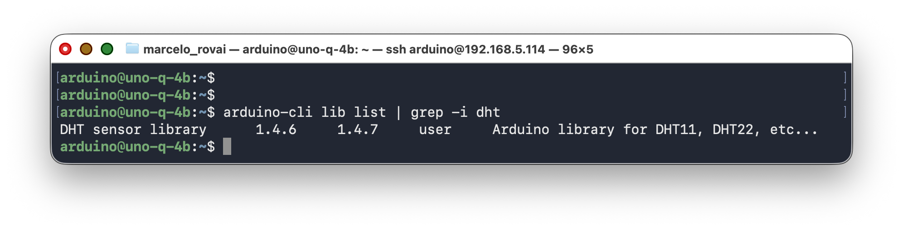

Next, if necessary, adapt the `sketch.yaml` according to the libraries:

```yaml
profiles:
  default:
    fqbn: 
    platforms:
      - platform: arduino:zephyr
    libraries:
      - DHT sensor library (1.4.6)
      - dependency: Adafruit Unified Sensor (1.1.14)
      - dependency: Arduino_RPClite (0.2.1)

default_profile: default
```

## 9. Running the Full Application

### Step 1 — Confirm llama-server Is Running

```bash
systemctl status llama-server --no-pager
curl -s http://127.0.0.1:8081/health
```

You should see `"status":"ok"`.

### Step 2 — Start the App

From inside `~/ArduinoApps/risk-classifier/`:

```bash
arduino-app-cli app start .
```

(or the `[Start]` button if you're using the Arduino App Lab)

The first run takes 2–3 minutes. `arduino-app-cli` builds the Python container, installs Flask and requests, compiles the sketch, and flashes the MCU.

**How to use it for testing:**

1. Power on. All LEDs blink three times, then the green LED stays on.
2. Press the button. The Serial Monitor (in Arduino App Lab) prints `[btn] water_state -> YES`. Press again to flip it back to `no`. The state holds between inferences.
3. Every 30 seconds, the sketch fires an inference. You'll see `Classifying: 25.30C, 60.20%, water=yes` (or no), then all three LEDs come on for ~30 s during inference, then back to the corresponding color depending on the "risk" when it's done.

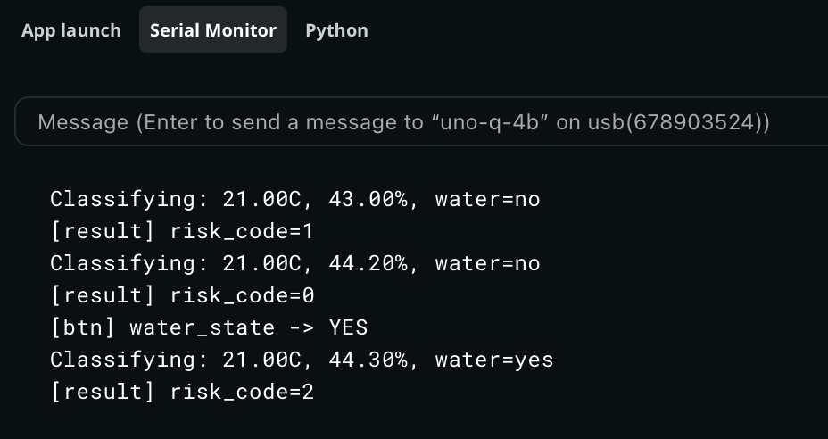

### Step 3 — Follow the Logs

In a second terminal (or the Arduino App Lab `Python` tab):

```bash
arduino-app-cli app logs . --follow
```

Every 30 seconds you should see lines like:

`Test Condition: Ambient temperature in the lab, button not pressed ("no water").`

```bash
[main] [classify] {'temp_c': 24.299999237060547, 'humidity_pct': 38.70000076293945, 'standing_water': False} -> {'risk': 'low', 'reason': 'Cool and dry temperatures with no standing water make dengue risk low.', 'latency_ms': 10772.6}
```

`Test Condition: Pressing the sensor between fingers, button pressed ("water").`

```bash
[main] [classify] {'temp_c': 27.600000381469727, 'humidity_pct': 87.80000305175781, 'standing_water': True} -> {'risk': 'high', 'reason': 'Warm humid conditions with standing water create ideal Aedes breeding habitat.', 'latency_ms': 10618.3}
```

Watch the RGB LEDs on the board. After each inference cycle, exactly one LED stays on: **green** for low risk, **yellow** for medium, **red** for high. Under ambient lab conditions (cool, dry, no water), you should see green; pressing the button and warming the sensor by hand should eventually turn it yellow or red.

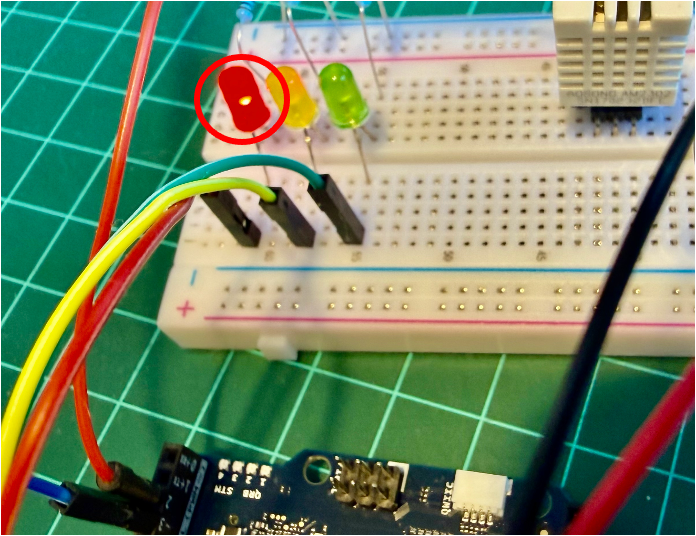

### Step 4 — Stop the App

```bash
arduino-app-cli app stop .
```

## 10. The Optional Flask Endpoint: Exposing the SLM Over HTTP

While the app is running, the Flask endpoint at port 7000 is available to any device on the same Wi-Fi network. From your host computer:

```bash
curl -X POST http://<UNO_Q_IP>:7000/classify \
  -H "Content-Type: application/json" \
  -d '{"temp_c": 30.1, "humidity_pct": 85, "standing_water": true}'
```

```bash
curl -X POST http://192.168.5.114:7000/classify \
  -H "Content-Type: application/json" \
  -d '{"temp_c": 30.1, "humidity_pct": 85, "standing_water": true}'
```

You should see:

```json
{
  "risk": "high",
  "reason": "Warm humid conditions with standing water create ideal Aedes breeding habitat.",
  "latency_ms": 8234.7
}
```

This is the same `classify()` function the MCU calls via Bridge — one logic path, two interfaces. From a phone, browser, or another UNO Q on the same network, the SLM is now a microservice.

### Creating a Live Dashboard for Exhibiting the Inference Result

Once the Flask server is running, add a `GET /status` endpoint that returns the latest result, and a `GET /` route that serves a live dashboard. Two small additions to `main.py`, no new dependencies needed.

#### Changes to `python/main.py`

**1 — Add a global to store the last reading** (near the top, after `FLASK_PORT`):

```python
# Latest classification result — updated on every MCU reading
_last_status = {
    "risk": "unknown",
    "reason": "No reading yet.",
    "temp_c": None,
    "humidity_pct": None,
    "standing_water": None,
    "latency_ms": 0,
}
```

**2 — Update `classify_risk` to save the full state:**

```python
def classify_risk(temp_c, humidity_pct, standing_water):
    """Bridge-facing wrapper. Returns a float code: 0=low, 1=medium, 2=high.
    Also updates _last_status so the dashboard can show the latest verdict."""
    global _last_status
    verdict = classify(float(temp_c), float(humidity_pct), bool(standing_water))
    _last_status = {
        "risk":          verdict.get("risk", "unknown"),
        "reason":        verdict.get("reason", ""),
        "temp_c":        round(float(temp_c), 1),
        "humidity_pct":  round(float(humidity_pct), 1),
        "standing_water": bool(standing_water),
        "latency_ms":    verdict.get("latency_ms", 0),
    }
    return RISK_CODE.get(verdict.get("risk", "unknown"), -1.0)
```

**3 — Add two Flask routes** (alongside the existing `/classify` and `/healthz`):

```python
from flask import render_template_string   # add to the existing flask import line

@flask_app.route("/status", methods=["GET"])
def status_endpoint():
    return jsonify(_last_status), 200

@flask_app.route("/", methods=["GET"])
def dashboard():
    return render_template_string(DASHBOARD_HTML)
```

**4 — Add the dashboard HTML** (paste this constant before `flask_app = Flask(__name__)`):

```python
DASHBOARD_HTML = """
<!doctype html>
<html lang="en">
<head>
  <meta charset="utf-8">
  <meta name="viewport" content="width=device-width, initial-scale=1">
  <title>Dengue Risk Monitor · UNO Q</title>
  <style>
    * { box-sizing: border-box; margin: 0; padding: 0; }
    body { font-family: system-ui, sans-serif; background: #0f172a; color: #e2e8f0;
           display: flex; flex-direction: column; align-items: center;
           min-height: 100vh; padding: 2rem 1rem; }
    h1   { font-size: 1.3rem; letter-spacing: .05em; color: #94a3b8; margin-bottom: 2rem; }
    #card {
      width: 100%; max-width: 420px; border-radius: 1.5rem;
      padding: 2.5rem 2rem; text-align: center;
      transition: background .6s, box-shadow .6s;
      background: #1e293b; box-shadow: 0 0 0 0 transparent;
    }
    #card.low    { background: #14532d; box-shadow: 0 0 40px 4px #22c55e55; }
    #card.medium { background: #713f12; box-shadow: 0 0 40px 4px #eab30855; }
    #card.high   { background: #7f1d1d; box-shadow: 0 0 40px 4px #ef444455; }
    #risk-label  { font-size: 4rem; font-weight: 800; letter-spacing: .04em;
                   text-transform: uppercase; margin-bottom: .5rem; }
    #reason      { font-size: 1rem; color: #cbd5e1; margin-bottom: 2rem; min-height: 2.5em; }
    .metrics     { display: grid; grid-template-columns: 1fr 1fr 1fr;
                   gap: .75rem; margin-bottom: 1.5rem; }
    .metric      { background: #ffffff18; border-radius: .75rem; padding: .75rem .5rem; }
    .metric .val { font-size: 1.4rem; font-weight: 700; }
    .metric .lbl { font-size: .7rem; color: #94a3b8; text-transform: uppercase; }
    #meta        { font-size: .75rem; color: #64748b; }
    #dot         { display: inline-block; width: .5rem; height: .5rem;
                   border-radius: 50%; background: #64748b;
                   margin-right: .3rem; vertical-align: middle; }
    #dot.live    { background: #22c55e; animation: pulse 1.5s infinite; }
    @keyframes pulse { 0%,100%{opacity:1} 50%{opacity:.3} }
  </style>
</head>
<body>
  <h1>🦟 Dengue Risk Monitor &nbsp;·&nbsp; Arduino UNO Q</h1>
  <div id="card">
    <div id="risk-label">—</div>
    <div id="reason">Waiting for first reading…</div>
    <div class="metrics">
      <div class="metric"><div class="val" id="temp">—</div><div class="lbl">°C</div></div>
      <div class="metric"><div class="val" id="hum">—</div><div class="lbl">Humidity %</div></div>
      <div class="metric"><div class="val" id="water">—</div><div class="lbl">Water</div></div>
    </div>
    <div id="meta"><span id="dot"></span><span id="ts">connecting…</span></div>
  </div>

  <script>
    const COLORS = { low: "low", medium: "medium", high: "high" };
    const EMOJI  = { low: "🟢", medium: "🟡", high: "🔴", unknown: "⚪" };

    async function refresh() {
      try {
        const r = await fetch("/status");
        const d = await r.json();
        const card = document.getElementById("card");

        card.className = COLORS[d.risk] || "";
        document.getElementById("risk-label").textContent =
          (EMOJI[d.risk] || "") + " " + (d.risk || "unknown").toUpperCase();
        document.getElementById("reason").textContent = d.reason || "";
        document.getElementById("temp").textContent  =
          d.temp_c   !== null ? d.temp_c.toFixed(1)   : "—";
        document.getElementById("hum").textContent   =
          d.humidity_pct !== null ? d.humidity_pct.toFixed(1) : "—";
        document.getElementById("water").textContent =
          d.standing_water === null ? "—" : d.standing_water ? "YES" : "no";

        const dot = document.getElementById("dot");
        dot.className = "live";
        setTimeout(() => dot.className = "", 800);

        document.getElementById("ts").textContent =
          "Last reading: " + new Date().toLocaleTimeString() +
          "  ·  " + (d.latency_ms / 1000).toFixed(1) + " s inference";
      } catch(e) {
        document.getElementById("ts").textContent = "⚠ fetch error – retrying";
      }
    }

    refresh();
    setInterval(refresh, 5000);   // poll every 5 s
  </script>
</body>
</html>
"""
```

> The complete `main.py` can be found on the [project repo](https://github.com/Mjrovai/ARDUINO-UNO-Q/blob/main/Gen_AI_Edge/Scripts/main.py).

#### Usage

While the app is running, open a browser on any device on the same Wi-Fi network:

```
http://<UNO_Q_IP>:7000/
```

The page polls `/status` every 5 seconds and updates without a full reload. The card background changes color to match the risk level (green, amber, or red), matching the LED on the board.

The raw JSON endpoint is still available for other clients:

```
http://<UNO_Q_IP>:7000/status
```
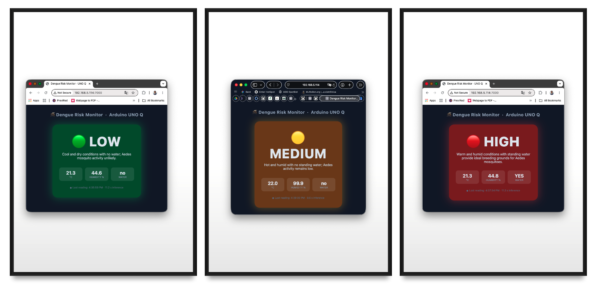

## 11. Performance: What to Actually Expect

Chapter 2 measured raw `llama-server` throughput in isolation. These numbers are for the full application — Bridge RPC, JSON parsing, and prompt-building overhead included — measured on a UNO Q 4 GB with the factory image, Qwen3.5-0.8B Q8_0, no heatsink, no fan:

| Metric | Value |
|---|---|
| Cold model load (boot of llama-server) | ~4 s |
| Idle RAM (llama-server + app running) | ~700–800 MB |
| Model + context memory usage | ~1,122 MiB |
| Prompt processing throughput | ~9.9 tokens/s |
| Generation throughput | ~4.75 tokens/s |
| End-to-end `classify()` latency | 6–12 s |
| CPU usage during decode | 4 cores @ 100% |
| Idle board temperature (no inference) | ~34 °C |
| Temperature during normal inference | ~54 °C |
| Temperature during sustained long answers | ~62 °C |
| Thermal throttle threshold | 70–80 °C (never reached) |
| Power consuption (Max.) | 3.1 W |

Honest takeaways:

- **Usable but not desktop-class.** Prompt processing at ~9.9 tok/s and generation at ~4.75 tok/s make the setup workable for periodic classification calls, but responses take 6–12 seconds depending on length. The ~1122 MiB memory footprint (model + context) leaves about 2.5 GB for the OS, App Lab container, and your Python app. Tight but viable on the 4 GB board.
- **Q4 quantization shows quality tradeoffs.** At 0.8B parameters, the model has less redundancy than a 7B model, so Q4 compression removes information that matters. Strong few-shot prompting and `presence_penalty=1.5` compensate for most of it, but some responses are weaker than a 1B+ model would produce. **Use Q8_0** or the Unsloth Dynamic quant if storage allows.
- **Thermal behavior is not a concern.** The +20 °C rise from idle to inference is modest, and even sustained workloads only reach ~62 °C, well under the 70–80 °C throttle threshold. The UNO Q runs cooler than a Raspberry Pi 5 under comparable loads. No heatsink is required for normal lab use.
- **Thinking mode kills the board.** With thinking enabled, the model spends 30–60 seconds generating internal reasoning chains before producing any output, and often loops without reaching a conclusion. Always run Qwen3.5 Small with `--reasoning off --reasoning-budget 0`.
- **Repetition loops.** Without `presence_penalty=1.5`, the model tends to repeat phrases or produce circular responses. A known behavior of small Qwen3.5 variants, well-documented in the Unsloth guide.

> **Token throughput vs. wall-clock latency**
>
> People often optimize for tokens/second when wall-clock latency is what actually matters. A 30-token verdict at 10 tok/s (3 s) feels twice as responsive as a 100-token verdict at 10 tok/s (10 s). Cap `max_tokens` aggressively and design prompts to keep responses short.

## 12. Tips, Tricks, and Troubleshooting

### llama-server Won't Start

Check the journal:

```bash
journalctl -u llama-server -n 50 --no-pager
```

Common causes: model file path wrong in the unit file, port 8080 already in use (`sudo lsof -i :8080`), or the GGUF file is incompatible with your llama.cpp version (rebuild or download newer binaries).

### Model Loops or Produces Very Long Responses

This almost always means thinking mode is active — see chapter 2 for why. Verify the `--reasoning off --reasoning-budget 0` flags are present in your systemd service (`ExecStart` line), not just something you once typed in a terminal. Also check that `presence_penalty` is set to 1.5 in your API calls.

If you see the deprecation warning about `--chat-template-kwargs`, update your command line to use `--reasoning off --reasoning-budget 0` instead.

### Bridge.call Times Out

If the MCU times out waiting for `classify()`:

- Confirm Python logs show the request arriving (`arduino-app-cli app logs .`).
- Increase the Bridge call timeout on the MCU side (check `Arduino_RouterBridge` examples; some versions default to 5 seconds, which is less than the 6–12 s inference takes).
- Confirm llama-server is responding: `curl http://127.0.0.1:8081/health`.

### Out-of-Memory Crashes

If the kernel OOM-killer takes out your Python container:

- Confirm swap is enabled. Running `free -h` should show a non-zero swap size.
- Reduce the context length in the systemd service to 1024.

### JSON Parse Failures from the Model

Even with `response_format: json_object`, occasional models output stray text. The `parse_verdict` function in `main.py` already retries once. If failures persist:

- Strengthen the system prompt: add `"Output MUST start with { and end with }"`.
- Switch to llama.cpp grammar-based decoding.
  - Replace `response_format: {"type":"json_object"}` with a GBNF grammar that constrains output to exactly `{"risk": "<low|medium|high>", "reason": "<string>"}`.
- Try the Unsloth Dynamic quant (`UD-Q4_K_XL`), which sometimes produces cleaner output.

### Disk Space Running Low

```bash
df -h /
```

The root partition is ~9.8 GB total. If you're running low:

```bash
# Check what is using space
sudo du -sh /var/lib/docker 2>/dev/null
sudo du -sh /home/arduino/* | sort -h

# Clean unused Docker images from arduino-app-cli
arduino-app-cli system cleanup

# Clean apt cache
sudo apt clean
sudo apt autoremove -y
```

If you deleted the llama.cpp source tree and still need to rebuild later, use a shallow clone: `git clone --depth 1 https://github.com/ggml-org/llama.cpp`

### The Flask Endpoint Is Not Reachable From Outside

- Confirm `ports: [7000]` is in `app.yaml`.
- Confirm the host is on the same Wi-Fi network: `ping <UNO_Q_IP>`.
- Confirm Flask is bound to `0.0.0.0`, not `127.0.0.1`.
- Some networks isolate clients from each other. Try a hotspot from your phone.

## 13. Going Further

### Alternative Model (Qwen 3.5 2B)

> **2B Q4 is a better choice for projects, such as the dengue classifier**, but **0.8B Q8 is the better choice for interactive demos**.

The general rule from the empirical Qwen3.5 work is that parameter count beats quantization. A 4-bit version of Qwen3.5 27B can still be substantially stronger than Qwen3.5 9B while using nearly the same amount of memory, and the same pattern holds further down the stack. The jump from 0.8B to 2B is the largest for agent tasks and long contexts. That is where the extra parameters really show up. The Kaitchup's broader review concludes that Q4 overall is very safe for Qwen3.5, so the 2B at Q4 keeps most of its raw capability.

On the UNO Q specifically:

| Dimension                                 | 0.8B Q8_0                   | 2B UD-Q4_K_XL          |
| ----------------------------------------- | --------------------------- | ---------------------- |
| Model file size                           | ~880 MB                     | ~1.25 GB               |
| RAM footprint (model + 1024 ctx)          | ~1.1 GB                     | ~1.9–2.0 GB            |
| Free RAM after load (out of ~3 GB usable) | ~1.7 GB                     | ~0.8 GB                |
| Generation speed (measured / estimated)   | ~4.75 tok/s                 | ~1.8–2.5 tok/s         |
| End-to-end `classify()` latency           | 6–12 s                      | 15–25 s (est.)         |
| Quality on structured JSON                | Good with a strong few-shot | Noticeably more robust |
| Quality on free-form chat                 | Adequate                    | Meaningfully better    |
| Thermal load                              | ~54 °C inference            | ~58–62 °C inference    |
| Storage room left on `/home/arduino`      | comfortable                 | comfortable            |

What this means in practice:

- **For the dengue classifier (a Bridge call every 30 s):** the 2B Q4 wins on quality, and the extra ~10 s latency is invisible inside a 30 s polling window. The structured JSON path becomes more reliable — fewer parse-and-retry rounds, better adherence to the few-shot pattern, less reliance on `presence_penalty` tricks.
- **For the WebUI / chat demos:** the 0.8B Q8 stays responsive. At ~2 tok/s, a 100-token answer on the 2B takes 50 seconds, which feels broken in a chat context even if the answer is better.
- **For headroom:** 0.8B Q8 leaves ~1.7 GB free. 2B Q4 leaves ~0.8 GB. Tight but workable, as long as nothing else on the board spikes (browsers, App Lab build, large Flask request bursts). If you ever want to run two models, or expand context beyond 1024, the 0.8B is the safer foundation.

Two things worth trying before committing:

1. **Try the Unsloth `UD-Q4_K_XL` variant of the 2B**, not vanilla Q4_K_M. UD‑Q4-K‑XL outperforming other Q4 quants, while being ~8GB smaller in the Unsloth benchmarks — they upcast the sensitive tensors automatically, so you get most of Q6 quality at near-Q4 size. The same trick that helps Q4 on big models helps even more on small ones.
2. **Run the same test prompt on both** and compare wall-clock time and JSON quality. With `llama-server`, swapping models is a matter of editing the systemd unit's `ExecStart` line, then `sudo systemctl daemon-reload && sudo systemctl restart llama-server` — the same swap pattern chapter 3 covers for the interactive (non-service) case.

### Function Calling with the SLM

Qwen3.5 supports function-calling formats. The natural pattern on the UNO Q is to register the **MCU sketch's** capabilities as tools the SLM can call: "read humidity," "set LED color," "trigger buzzer." The Python side mediates: the SLM emits a tool-call, Python forwards it over Bridge to the sketch, the sketch executes, the result goes back to the SLM, which then generates a final reply.

This inverts the data flow from this chapter — instead of the MCU calling Python, the SLM (via Python) calls the MCU. Both patterns are valid; function calling is more flexible but adds an extra round trip per tool use.

### Multimodal SLMs (Vision-Language Models)

Qwen3.5 has native multimodal capabilities, covered hands-on in [Multimodal AI at the Edge](../3-Multimodal_AI_Edge/README.md): the same 0.8B weights used here run a vision pathway with a matching `mmproj` file. A natural extension of this project replaces the button (a stand-in for a water-presence sensor) with a camera and that vision pathway — the MCU triggers a capture, the vision-enabled `classify()` describes and judges the frame, and the same LED output logic applies unchanged.

### Agentic AI Assistant

This chapter's `classify()` is a single fixed call: sensors in, one verdict out. [Agentic AI at the Edge](../5-Agentic_AI/README.md) builds the next step — an agent loop where the SLM decides *which* tool to call, reads the result, and decides what to do next, rather than following a script you wrote. It starts hardware-free (system info, a calculator, the onboard LED and LED matrix) and then shows how this chapter's own sensor/actuator tools plug into that same loop unchanged. For where the pattern scales beyond that, see **[QClaw](https://github.com/laurenvil/Uno-QClaw)**, an on-device agentic AI assistant for the Arduino Uno Q developed by [David Laurenvill](https://www.linkedin.com/in/david-laurenvil-3a223410/), which writes, compiles, and uploads Arduino sketches; captures camera frames; drives Linux-side LEDs; reports network state; and scans I²C buses — all running entirely on the board. No internet. No API keys. No cloud.

### Edge Impulse Integration

For applications where you want a *trained* classifier (rather than a general-purpose SLM doing zero-shot reasoning), Edge Impulse is the production path. The UNO Q has first-class Edge Impulse support. A practical hybrid: an Edge Impulse model handles high-frequency classification, while an SLM handles rare "I'm not sure" cases that need richer reasoning.

For example, the YOLO model mentioned at the beginning of this tutorial could be trained in Edge Impulse Studio to detect standing water in tires, automatically triggering the "Water Switch" input of the Dengue Risk Classifier and thereby replacing the button used in the project.

## 14. Conclusion

This tutorial wrapped the SLM tooling from chapter 2 into a complete generative-AI application: `llama-server` running as a persistent systemd service with Qwen3.5-0.8B, a Python application that exposes it both to the on-board MCU via Bridge RPC and to off-board clients via Flask, and an Arduino sketch that drives an RGB LED based on the SLM's verdict. We addressed the real constraints of the hardware (a single 9.8 GB partition with limited free space, 4 GB of shared RAM, and CPU-only inference on four Cortex-A53 cores) and found practical workarounds for each.

### Advantages of the UNO Q Approach for Generative AI

**For ML System Engineering:**

- **Local generative AI on Arduino hardware.** Until the UNO Q, "running an LLM on an Arduino" was a contradiction. Now, on the same board used for Blink, a language model classifies sensor data without an internet connection.
- **The dual-brain story comes to life.** Generative AI on the MPU plus real-time actuation on the MCU is exactly the boundary the dual-brain architecture was designed to expose. You see *why* you'd want both processors, not just *that* the board has them.
- **Standard production patterns.** systemd services, OpenAI-compatible HTTP APIs, structured-output JSON, Bridge RPC for IPC, Flask microservices. All real techniques you'll use in real edge-AI projects.

**Technical advantages:**

- The OpenAI-compatible API surface means the code can switch from local SLM to a cloud LLM (and back) with a one-line URL change.
- `response_format: json_object` and grammar-constrained decoding mean the SLM's output is reliable enough to drive actuators directly.
- Bridge RPC handles the IPC details so you can focus on logic rather than wire formats.

### Limitations and Considerations

Being honest about what doesn't work well at this scale:

- **Storage is tight.** The factory image leaves ~830 MB free on a single 9.8 GB partition. Building llama.cpp, downloading a model, and running an App Lab container all compete for that space. Students need to learn disk management as part of the tutorial — a useful skill, but also a friction point.
- **Q4 quantization degrades sub-1B models noticeably.** A 0.8B model at Q4 loses more quality than a 7B model at Q4 — less redundancy to exploit. Strong few-shot prompting and `presence_penalty` mitigate this, but don't eliminate it.
- **No NPU acceleration.** The QRB2210's Adreno 702 GPU is not a reliable llama.cpp target. CPU is the only option, and that means four A53 cores at 2 GHz doing all the work.
- **Thinking mode is unusable on this hardware.** Qwen3.5's reasoning mode produces multi-minute inference times and frequent loops on the UNO Q. Always use `--reasoning off --reasoning-budget 0`.
- **Ollama.** Ollama supports Qwen3.5, but with a higher memory overhead (~250 MB for the daemon). On the 4 GB UNO Q, llama.cpp's lighter footprint is the better fit.
- **SLM quality at this size is still uneven.** A 0.8B-parameter model will sometimes produce nonsense JSON, refuse benign prompts, or hallucinate reasons. Keep a human in the loop for any safety-critical decision.

### Where Generative AI Fits in the Edge AI Curriculum

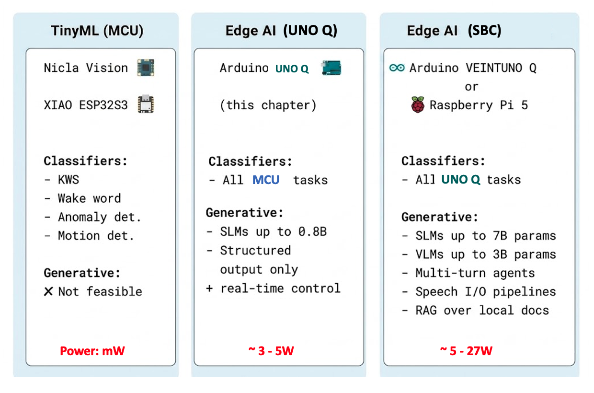

The UNO Q is where generative AI becomes possible at the edge but stays bounded: small models, short outputs, batch-rate inference. Students who understand the constraints here won't be surprised when they hit the same constraints on a real production deployment.

### What's Next

- **Function Calling and Tool Use on the UNO Q** — using the SLM to call MCU capabilities (read sensors, drive actuators) rather than just classify sensor data.
- **Vision-Language Models** — you've already got this one: see [Multimodal AI at the Edge](../3-Multimodal_AI_Edge/README.md) for adding a camera and running a VLM that describes what it sees, with the MCU triggering snapshots and the MPU generating captions.
- **Edge RAG on the UNO Q** — embedding local documents (datasheets, manuals, course notes) and using the SLM to answer questions about them, fully offline.
- **Agentic Mode on the UNO Q** — see [Agentic AI at the Edge](../5-Agentic_AI/README.md): the SLM decides *which* tool to call, reads the result, and decides what to do next, rather than following a fixed script like this chapter's `classify()`.

## 15. Resources

### Useful Resources

| Resource | URL |
|---|---|
| Generative AI at the Edge (prerequisite chapter) | [2-Gen_AI/README.md](../2-Gen_AI/README.md) |
| Multimodal AI at the Edge (related project) | [3-Multimodal_AI_Edge/README.md](../3-Multimodal_AI_Edge/README.md) |
| Project repository | <https://github.com/Mjrovai/ARDUINO-UNO-Q/tree/main/Gen_AI_Edge> |
| llama.cpp repository | <https://github.com/ggml-org/llama.cpp> |
| llama.cpp HTTP server docs | <https://github.com/ggml-org/llama.cpp/blob/master/tools/server/README.md> |
| Qwen3.5-0.8B GGUF (Bartowski) | <https://huggingface.co/bartowski/Qwen_Qwen3.5-0.8B-GGUF> |
| Qwen3.5-0.8B GGUF (Unsloth Dynamic) | <https://huggingface.co/unsloth/Qwen3.5-0.8B-GGUF> |
| Unsloth Qwen3.5 inference guide | <https://unsloth.ai/docs/models/qwen3.5> |
| Qwen3.5 reasoning control discussion | <https://github.com/ggml-org/llama.cpp/discussions/20476> |
| SmolLM2 GGUF family (Bartowski) | <https://huggingface.co/bartowski?search=SmolLM2> |
| Arduino UNO Q Documentation | <https://docs.arduino.cc/hardware/uno-q> |
| Arduino_RouterBridge library | <https://github.com/arduino-libraries/Arduino_RouterBridge> |
| Running LLMs on UNO Q with yzma | <https://projecthub.arduino.cc/marc-edgeimpulse/running-local-llms-and-vlms-on-the-arduino-uno-q-with-yzma-74e288> |
| LiteRT-LM (alternative SLM runtime) | <https://github.com/google-ai-edge/LiteRT-LM> |
| yzma (Go wrapper for llama.cpp) | <https://github.com/hybridgroup/yzma> |
| QClaw | <https://github.com/laurenvil/Uno-QClaw> |

### References

1. Qwen Team, "Qwen3.5 Small Model Series," Alibaba Cloud, March 2026.
2. Unsloth, "Qwen3.5 — How to Run Locally," <https://unsloth.ai/docs/models/qwen3.5>, March 2026.
3. Gerganov, G., "llama.cpp: Inference of Meta's LLaMA model (and others) in pure C/C++," <https://github.com/ggml-org/llama.cpp>
4. Bartowski, "Qwen_Qwen3.5-0.8B-GGUF," <https://huggingface.co/bartowski/Qwen_Qwen3.5-0.8B-GGUF>
5. llama.cpp discussion, "Qwen3.5 Small: How to truly disable thinking?" <https://github.com/ggml-org/llama.cpp/discussions/20476>
6. llama.cpp issue, "enable_thinking param cannot turn off thinking for qwen3.5," <https://github.com/ggml-org/llama.cpp/issues/20182>
7. Arduino, "Arduino UNO Q Product Page," <https://www.arduino.cc/product-uno-q/>
8. Arduino, "App CLI Documentation," <https://docs.arduino.cc/software/app-lab/tutorials/cli>
9. Pous, M., "Running local LLMs and VLMs on the Arduino UNO Q with yzma," Arduino Project Hub, Feb 2026.
10. Edge Impulse, "Arduino UNO Q," <https://docs.edgeimpulse.com/hardware/boards/arduino-uno-q>

---

*Tutorial created for IESTI05 — Edge AI Machine Learning System Engineering, UNIFEI. Licensed under GNU General Public License 3.0.*
