# Agentic AI at the Edge:

Giving a Small Model Tools


---

## 1. Introduction

### What This Tutorial Covers

Every previous chapter gave the SLM a fixed job: classify these three numbers, describe this image. The model reasoned, but it never *decided what to do*. This chapter changes that. You'll give Qwen3.5 a small set of **tools** — functions it can choose to call — and let it decide, on its own, which ones to use and in what order to satisfy a plain-language request.

Here's the shape of what you're building toward, taken from a real session in Section 9:

```
> Check the free space on /home. If there's more than 1GB free, show a
  checkmark on the matrix, otherwise show an X.
[turn 0] tool call: get_system_info({})
[turn 1] tool call: set_led_matrix({'pattern': 'check'})
There's 14 GB free, well over 1 GB, so I've shown a checkmark on the matrix.
```

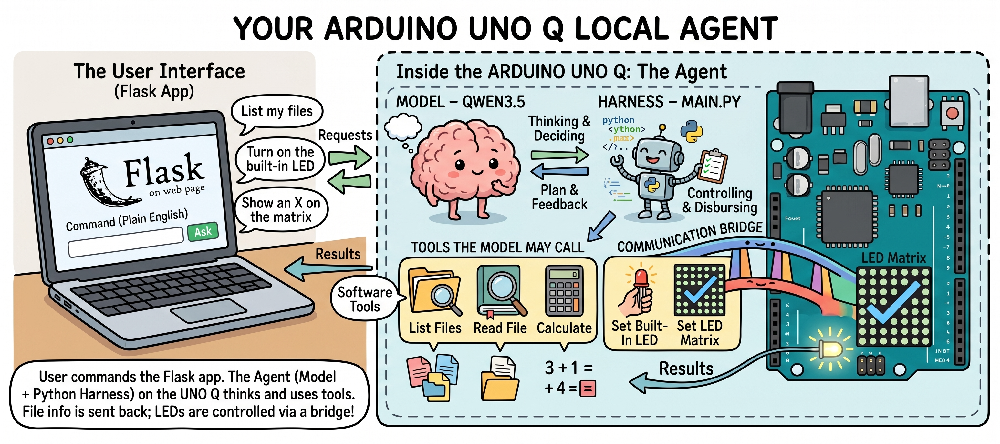

No `if` statement in your code chose that checkmark. You gave the model a threshold in English, it fetched a number it couldn't have known, compared the two, and acted on the result.

The tools are deliberately ordinary: ask the board what OS it's running, do some arithmetic, list a few files, blink the built-in LED, draw a pattern on the onboard 8×13 LED matrix. None of it requires a single wire. That's on purpose — this chapter should run in any room, on any UNO Q, with nothing attached, which makes it the one to reach for in a workshop where you can't guarantee everyone has a breadboard.

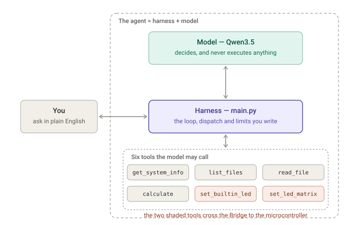

The mechanism is llama-server's native, OpenAI-compatible **tool-calling API** (`tools=[...]` in the request, `tool_calls` in the response) — the same interface real cloud LLM APIs use, not a custom prompt-and-parse scheme. If you've read the "[Building Agents with SLMs](https://mjrovai.github.io/EdgeML_Made_Ease_ebook/raspi/advancing_adgeai/adv_edgeai.html#building-agents-with-slms)" chapter of the companion [Edge AI Engineering](https://mjrovai.github.io/EdgeML_Made_Ease_ebook/) book, that example routed a query through hand-written JSON classification, then called the numbers found in it — a technique the book itself flags as fragile (models struggle to reliably format the classification JSON, especially at 1B and below). The native tools API doesn't eliminate that fragility at small model sizes, but it puts the parsing burden on llama.cpp's grammar-constrained decoding instead of on hopeful prompt engineering, and it's the same shape of code you'd write against a hosted model.

You'll also watch it fail. Section 9 pushes an 0.8B model past what it can reliably do, then swaps in a 2B model and re-runs the same questions with no other change. That comparison is the point as much as the working demo is: knowing where a model's capability ends, and what crossing that line costs in latency, is most of the engineering in edge AI.

By the end of this chapter you'll have a small, hardware-free agent you can talk to from any device on your network, watch it decide which tool to call and why, and see it act — on the board's own files, its own vitals, and its own LEDs.

### Prerequisites

This tutorial assumes you have completed:

- [Setup](../1-Setup/README.md) — headless SSH access to the board.
- [Generative AI at the Edge](../2-Gen_AI/README.md) — `llama.cpp` built from source, a Qwen3.5-0.8B GGUF downloaded, and comfort running `llama-server` and calling it from Python with the `openai` client library.

Deliberately **not** required: [Multimodal AI at the Edge](../3-Multimodal_AI_Edge/README.md) or [GenAI Meets the Real World](../4-Gen_AI_Edge/README.md). Nothing here depends on vision or on external sensors — that's the point. Section 12 shows how those chapters' tools plug into this same agent loop later, once you want them.

> If chapter 2 is unfamiliar, work through it first — this chapter reuses its `llama-server` setup and its `openai`-client patterns without repeating them.

## 2. What Makes This "Agentic"?

The word gets thrown around loosely. Pinned down, an agent is a model that does three things a plain chat model doesn't.

**It decides whether to act at all.** Ask "What's the capital of Brazil?" and the right move is to answer, "Brasíla", from what it already knows — no tool needed. 

Ask "How much free disk space is there?" and it can't know: that answer lives on your board. The model has to call a tool and read the result back.

Another example is with calculation. If you ask a normal model to do a calculation, for example: `How much is 123456 multiplied by 123456?`, it will more than certanly give you a wrong answer. But if the model has access to tools (as a Python calculator, for example), the answer will be always correct. 


**It picks the tool and fills in the arguments.** You hand it a list of available tools and their schemas; it chooses. You never write `if "disk" in prompt: get_system_info()`. That branch is the model's job now.

**It looks at the result and decides what comes next.** Another tool call, or a final answer. And the decision chains — that's what the trace in Section 1 shows: call `get_system_info`, pull the number out of the returned JSON, compare it against 1 GB, and only then choose which pattern to draw. Two model turns with a comparison in between that nobody hardcoded.

Chapter 4's `classify()` does none of this. It always reads three sensor values, always calls the model exactly once, always with the same prompt shape. That's a **pipeline**: deterministic, fast, and exactly right for its job — you don't want a dengue-risk classifier wandering off to check the disk. What follows is different in kind. It's a **loop**:


Two things that diagram doesn't show, and both trip people up on the first read:

- **The model never runs anything.** It emits a request — a function name and a JSON blob of arguments — then stops and waits. Your Python does the actual work and hands the output back. Nothing executes unless you execute it, which is also where every safety check you care about belongs.
- **Nothing guarantees the loop terminates.** A confused model can call `get_system_info` five times in a row. You'll cap the iterations in Section 8 (`MAX_TURNS`) and break out with a message rather than trusting it to stop on its own.

### Model, Harness, Agent

Three words get used interchangeably, and separating them is worth the paragraph.

The **model** is Qwen3.5, sitting behind `llama-server`. It reads text and writes text. That is the whole of what it does: it cannot open a file, read a sensor, or light an LED, and between requests it remembers nothing.

The **harness** is everything else — the loop in the diagram above, the dispatch table mapping a name to a Python function, the code that formats messages and appends results, the turn limit that stops runaways. It's ordinary software, and you write all of it. About 40 lines here.

The **agent** is the two together. Neither half is an agent on its own.

Keep that split in mind, because it tells you where a problem lives. A tool returning wrong data, a loop that never terminates, an LED that lights when it should go dark — harness bugs, and a debugger will find them. A model that picks the wrong tool, or keeps calling tools after it already has the answer — not harness bugs, and no amount of Python will fix them. Section 9 puts both kinds side by side.

"Harness" is also the vocabulary worth carrying: it's what people mean by "agent framework" or "scaffolding." LangChain agents, OpenAI's Assistants API and the rest are harnesses with more in them — retries, memory, orchestration, tracing — wrapped around exactly the cycle above. 

> Building a small harness by hand is the fastest way to understand what the large ones are actually doing.

### The Native Tools API vs. Hand-Rolled Classification

llama-server exposes an OpenAI-compatible `tools` parameter on `/v1/chat/completions`. You describe each tool as a JSON Schema (name, description, parameter types); the server constrains decoding so the model's function-call arguments come back as valid, parseable JSON rather than prose the model might format inconsistently. Compared to the classify-then-route pattern from the Raspberry Pi book chapter — where the model had to freehand a JSON object like `{"type": "multiplication", "numbers": [7, 8]}` and the code hoped it got the shape right — the native API moves that structural guarantee into the inference engine itself. It doesn't fix everything (Section 10 has the honest version of what still goes wrong at 0.8B), but it removes one whole category of failure.

Qwen3.5 supports this function-calling format natively (chapter 4's Going Further section flagged this same capability for a different use). It needs the chat template active — the `--jinja` flag you've used since chapter 3 — since tool-call formatting is part of the model's chat template, not a separate code path.

## 3. Hardware and Software Requirements

### Hardware

- Arduino UNO Q (2 GB or 4 GB — this chapter's models are small enough that either works; see [chapter 2](../2-Gen_AI/README.md#candidate-models) for the size/quality tradeoffs).
- USB-C data cable.
- Host computer with SSH.

**Nothing else.** No breadboard, no sensors, no external LEDs — every tool in this chapter uses either the Linux filesystem/CLI or the UNO Q's own onboard LED and LED matrix.

### Software (already on the UNO Q from earlier chapters)

| Tool | Purpose |
|---|---|
| `llama.cpp` built from source, Qwen3.5-0.8B GGUF | From [chapter 2](../2-Gen_AI/README.md) |
| `llama-server` built from source | From [chapter 2](../2-Gen_AI/README.md); this chapter starts it in the foreground with its own flags |
| `openai` Python client | From chapter 2 |
| `arduino-app-cli` | Build/run dual-brain apps |

### Two Models, Not One

This chapter uses **Qwen3.5-0.8B** for Sections 4 through 9 and switches to **Qwen3.5-2B** partway through Section 9. That isn't indecision — the swap is the experiment. The small model demonstrates the mechanism and then hits a wall you can see, and crossing that wall costs exactly one changed file path and about 4× the latency. Section 10 has the measurements.

Download both from chapter 2 before you start:

If you want a new model, let's say the newer Qwen3.5 2B with MTP (but not used here), you should do the commands:

```bash
mkdir -p ~/models/Qwen3.5-2B-MTP-GGUF 
cd ~/models/Qwen3.5-2B-MTP-GGUF

wget -c "https://huggingface.co/unsloth/Qwen3.5-2B-MTP-GGUF/resolve/main/Qwen3.5-2B-UD-Q4_K_XL.gguf"
```

```bash
ls ~/models/Qwen_Qwen3.5-0.8B-Q8_0.gguf
ls ~/models/Qwen3.5-2B-MTP-GGUF/Qwen3.5-2B-UD-Q4_K_XL.gguf
```

Only one runs at a time — they share port 8081.

### Software (installed in this chapter)

Nothing new on the Python side — `openai` from chapter 2 is all this needs. The one addition is on the MCU side: the `Arduino_LED_Matrix` library, which is bundled with the UNO Q's Zephyr core and needs no separate install.

### Server Flags That Matter Here

Start `llama-server` the way chapter 2 taught, with the flags this chapter depends on:

```bash
~/llama.cpp/build/bin/llama-server \
  --model ~/models/Qwen3.5-0.8B-GGUF/Qwen3.5-0.8B-Q8_0.gguf \
  --host 0.0.0.0 --port 8081 \
  --jinja \
  --reasoning off --reasoning-budget 0 \
  --ctx-size 4096 --threads 4 \
  --batch-size 512 --ubatch-size 64 \
  --predict 1024 \
  --alias qwen3.5-0.8b
```

- `--jinja` activates the chat template. Tool-call formatting lives *inside* that template, so without this flag `tool_calls` comes back empty every time and the model describes its intended tool call in prose instead of making one.
- `--reasoning-budget 0` disables Qwen3.5's thinking traces. Thinking and tool-calling interact badly at this size: the model spends its token budget reasoning about which tool to call, then emits the reasoning as the answer instead of the call. You used the same flag in chapters 3 and 4 for the same reason.
- `--ubatch-size 64` is the single biggest performance flag in this chapter. It makes answers roughly three times faster, for reasons Section 10 measures. Don't skip it, and don't judge how slow the agent feels while it's at the default.
- `--ctx-size 4096` gives the loop room. An agent conversation grows with every tool result, and a `read_file` result can add a thousand tokens on its own — a smaller context silently truncates the earliest messages, which reads as the model forgetting what it just did.
- `--predict 1024` caps generation server-side. `main.py` already sets `max_tokens`, but Section 4 drives the model from the WebUI with no client-side limit, so this is the backstop that keeps a confused model from generating for four minutes straight.
- `--alias` is the model name the server reports to clients, and it must match `MODEL` in `main.py`. It's `qwen3.5-0.8b` throughout this chapter — including after the 2B swap in Section 9, where keeping the same alias means no Python has to change.

**This exact command is used three times in the chapter**: here, in Section 4 with `--tools` appended, and in Section 9 unchanged. If you find yourself editing flags between sections, something has gone wrong — the only thing that ever changes is the `--model` path.

**This is the server configuration Sections 6 through 9 need**, and the one to come back to after Section 4 borrows the port for a different purpose. Two details are load-bearing for the Python agent specifically:

- `--host 0.0.0.0`, not `127.0.0.1`. The agent runs inside a container and reaches `llama-server` across the container gateway, so a server bound to loopback is invisible to it.
- No `--tools`. That flag controls llama.cpp's *own* built-in tools, which only Section 4 uses. The agent supplies its own tool schemas in every request.

Only one process can hold port 8081, so know how to stop whichever server is running before starting another:

```bash
# Ctrl-C in the terminal running it, or from anywhere:
pkill -f llama-server
```

> If you worked through chapter 4 on this board, it left `llama-server` running as a systemd service that starts at boot and holds port 8081. This chapter runs the server in the foreground instead, so you can see its output and change its flags between sections. Retire the service once: `sudo systemctl disable --now llama-server`. Chapter 4 still works afterward — start its server by hand, or re-enable the service when you go back.

Verify both before writing any code:

```bash
curl -s http://localhost:8081/v1/chat/completions -H 'Content-Type: application/json' -d '{
  "model": "qwen3.5-0.8b",
  "messages": [{"role":"user","content":"What is 47 times 12?"}],
  "tools": [{"type":"function","function":{
    "name":"calculate",
    "description":"Evaluate an arithmetic expression.",
    "parameters":{"type":"object","properties":{
      "expression":{"type":"string"}},"required":["expression"]}}}]
}' | python3 -m json.tool | grep -A5 tool_calls
```


If you see a `tool_calls` block with a `calculate` function and an `expression` argument, the server is configured correctly. If you get plain text instead, fix that before continuing — everything downstream depends on it.

Note that this command has no `--tools` flag, and doesn't need one. `--tools` controls llama.cpp's own *built-in* tools, which only Section 4 uses. The agent you build from Section 6 onward supplies its own tools in the request body, so the server never needs to know about them in advance.

## 4. First Contact: Agentic Mode in the Built-in WebUI

Before writing a line of Python, it's worth seeing an agent loop run with zero code. Recent llama.cpp builds ship a set of built-in tools the model can call from the server's own WebUI — the same interface you opened in chapters 2 and 3 for chat. This is the fastest way for a room full of students to *see* tool-calling happen, watch each decision, and approve or reject it in real time, before anyone opens an editor.

> In chapters 2 and 3's WebUI sections, this book told you to leave the built-in agent tools switched off. This section is where that changes — deliberately, briefly, and with the reasoning made explicit. Read the safety note at the end before your next session.

### Step 1 — Ask Your Build What It Has

The built-in tool set is marked experimental upstream, and the list has changed several times. Don't trust the one printed below — ask the binary you built:

```bash
~/llama.cpp/build/bin/llama-server --help | grep -A6 -- '--tools'
```

On a build from around this writing:

```
--tools TOOL1,TOOL2,...   experimental: whether to enable built-in tools for AI
                          agents - do not enable in untrusted environments
                          (default: no tools) specify "all" to enable all tools
                          available tools: read_file, file_glob_search,
                          grep_search, exec_shell_command, write_file,
                          edit_file, apply_diff, get_datetime
```

Read the default again: **no tools**. Nothing is exposed unless you name it on the command line. Some builds also ship `get_info` (board vitals), and most now offer a `-ag, --agent` shortcut that switches on every tool plus the MCP CORS proxy in one go. Convenient, and exactly the wrong choice for a classroom — you'd be handing the model a shell before anyone has seen it call a single tool.

### Step 2 — Start the Server With Read-Only Tools Only

Section 4 needs a *different* server than the rest of the chapter — the Section 3 command with one flag added, `--tools`. Stop the running server first, since only one process can hold port 8081:

```bash
~/llama.cpp/build/bin/llama-server \
  --model ~/models/Qwen3.5-0.8B-GGUF/Qwen3.5-0.8B-Q8_0.gguf \
  --host 0.0.0.0 --port 8081 \
  --jinja \
  --reasoning off --reasoning-budget 0 \
  --ctx-size 4096 --threads 4 \
  --batch-size 512 --ubatch-size 64 \
  --predict 1024 \
  --tools read_file,file_glob_search,grep_search \
  --alias qwen3.5-0.8b
```

> In the WebUI, you should turn reasoning `Off`, on the `+` menu. 

Here's the full set and why three of them made the cut:

| Tool | What it does | This pass? |
|---|---|---|
| `read_file` | Reads any file the `arduino` user can read | Yes |
| `file_glob_search` | Finds files by name pattern | Yes |
| `grep_search` | Searches inside file contents | Yes |
| `get_datetime` | Returns the current date and time | Harmless; optional |
| `write_file` | Creates or overwrites a file | Step 6 |
| `edit_file`, `apply_diff` | Modifies existing files in place | No |
| `exec_shell_command` | Runs arbitrary shell commands | Not in a workshop |

The server now exposes **only those three**. The others aren't merely switched off — as far as the browser is concerned, they don't exist.

**DANGER:** The tag  `--tools all` will expose all 7 tools, which you can swith off if you are using `WebUI`. We will not do it here, once we will explicitly define what tools should be active for the model. 

> **If the WebUI stops working when you add `--tools`**, you've hit the CORS default. Several builds clamp `--cors-origins` to localhost when tools are enabled, on the reasoning that a server handing out file access shouldn't accept requests from arbitrary origins. You're reaching the board at its LAN address, not localhost, so the origins won't match. Either name your origin explicitly (`--cors-origins http://<UNO_Q_IP>:8081`) or use the SSH tunnel from the safety note below and browse `http://localhost:8081`. The tunnel is the better habit.

### Step 3 — Open the WebUI and Read the Tools Panel

Open the WebUI, click the gear icon (**Settings**), then **Tools** in the left-hand list. You should see the three tools you named, each with its own **Enabled** and **Always allow** checkboxes.


If instead you see this:


...the server was started without `--tools`. That's the most common stumble in this section, and it's a productive one, because it shows where the control actually lives:

- **The command line is the boundary.** `--tools` decides what exists.
- **The panel is a view onto that list**, plus per-browser convenience toggles. Look at the line under the tool list: settings are saved in the browser's localStorage. Clear your browser data and the checkboxes reset; the server's allow-list doesn't move.

A student who only ever sees the checkboxes will come away believing the browser grants permissions. It doesn't. Hold onto that distinction — Section 5 builds the same idea from the other direction.

### Step 4 — Set the Agentic Limits

Click **Agentic** in the same Settings list:


- **Agentic turns** — the same idea as the `MAX_TURNS` cap you'll build by hand in Section 8: a hard stop on how many tool-call cycles run before the server gives up. The default (often 10) is fine to start.
- **MCP request timeout** — how long a single tool call may take before it's abandoned.
- **Mention search depth** — how many directory levels the file-search tools will descend.

### Step 5 — Watch It Work

Try a prompt that can't be answered from the model's own knowledge:

> *"What files are in my home directory, and is there anything in them about edge AI?"*

Watch the chat. A confirmation card appears asking to run a specific tool with specific arguments *before* it executes. 

> Note that the first conversation after the server is up will take longer than the following ones. 


Approve it, watch the result stream back into the conversation, and see whether the model needs a second call — it likely will, one to list files and one to search inside them — before it gives you a final answer.


That's Section 2's loop diagram happening in front of you, one approved step at a time. Point at it while it runs: send, decide, call, feed the result back, decide again.

### Step 6 — Give It a Writing Tool, On Purpose

Stop the server and restart it with one more tool:

```bash
--tools read_file,file_glob_search,grep_search,write_file
```

Then ask:

> *"Create a file called notes.txt in /home/arduino directory with a two-line note about edge AI."*

Approve the write, 

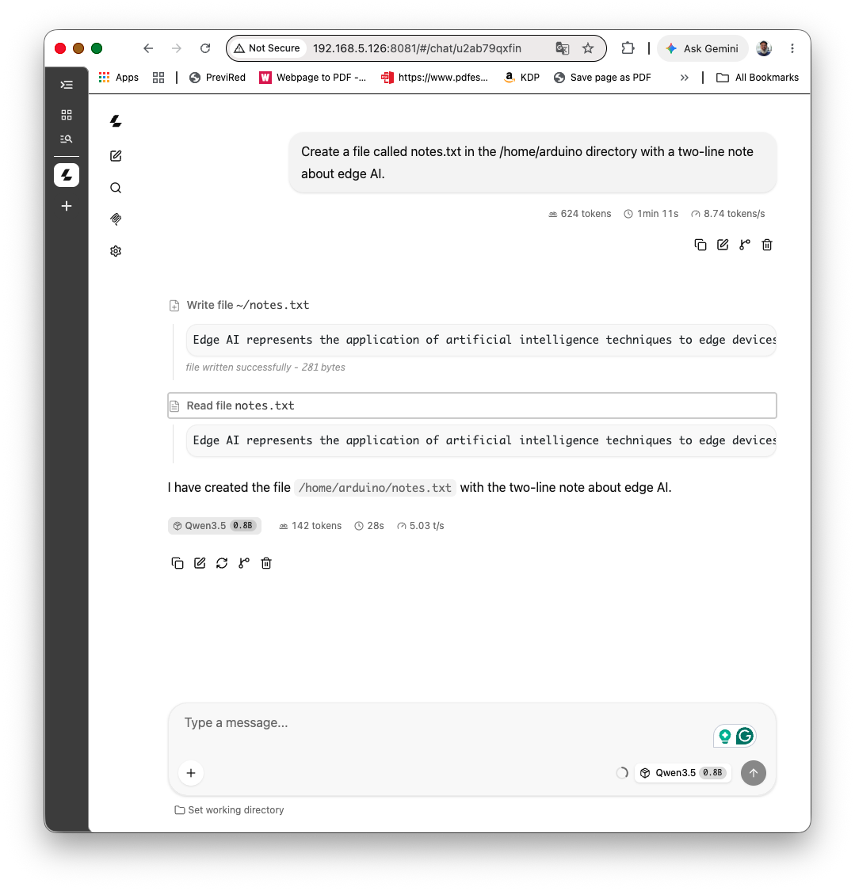

> Note that the agent understood the task, selected the correct tool (Write File), and after that took the decision to also use another tool (Read File) to verify if the task was correct.

Now, we can confirm by ourselves from a terminal: `cat ~/notes.txt`.

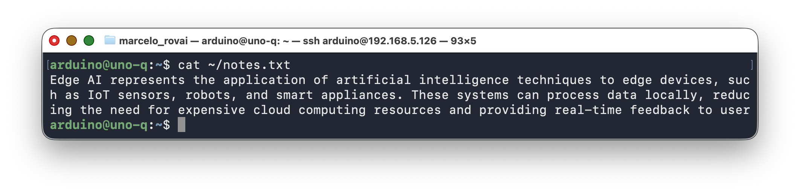

Notice what that took: stopping the process and restarting it. You could not have granted this from the browser. That friction is the feature — expanding what an agent can reach is a deliberate act with a record of it in your shell history, not a checkbox someone clicks while distracted.

### The Safety Note

Two layers of control here, and it's worth being precise about what each one is worth.

**The `--tools` allow-list is the boundary.** It's enforced by the server process, it applies to every client including scripts hitting the API directly, and changing it requires restarting the server.

**"Always allow" is a second line of defence.** Unchecked, every call waits for a human. Checked, that tool fires immediately. Keep it off for anything that writes or executes — an unattended `write_file` loop is a bad way to learn this lesson. But remember it lives in browser localStorage: it protects you at the keyboard, not the server.

Three things to be clear-eyed about:

1. **These tools have no directory restriction.** `read_file` will read anything the `arduino` user can read — no root, no allow-list of paths. That's the sharpest contrast with what you'll build in Section 7, where the file tools resolve every path against a fixed workspace.
2. **`exec_shell_command` runs with your full user permissions.** There's nothing between a confused model and a destructive command except the confirmation card. It has a place in an advanced demo; it has no place in a first workshop.
3. **`--host 0.0.0.0` is fine on a network you control** — the board is headless, so there's no other way to reach the WebUI from a laptop browser, and that's the trust level chapters 2–4 already assume. On an untrusted network it stops being safe: anyone who can reach `/v1/chat/completions` can drive the same tools through the raw API, and the confirmation card only exists in the WebUI. A script hitting the API directly gets no such prompt. There, bind to `127.0.0.1` and tunnel:

```bash
ssh -L 8081:127.0.0.1:8081 arduino@<UNO_Q_IP>
# then open http://localhost:8081/ on your laptop
```

### Considerations about the model

Sometimes you can see the O.8B model make wrong decisions or not understand what's going on. Despite its latency (about twice that of Qwen3.5 2B), using Qwen3.5 2B will yield stronger agentic behavior. 

### Put the Server Back Before Continuing

Section 4 is a detour. Everything from Section 6 onward reaches `llama-server` through the Python agent, which needs the Section 3 configuration — no `--tools`, bound to `0.0.0.0`. Restore it now, while you still remember why:

```bash
# stop the tools-enabled server: Ctrl-C, or pkill -f llama-server
# then restart the Section 3 command
```

Skip this and the failure arrives much later, in Section 9, as `"llm_error": "... Connection refused"` from `/healthz` — a message that points at the agent rather than at the server you forgot to restart. If you also switched to `--host 127.0.0.1` to satisfy the CORS default while working through this section, that's the same trap from the other direction: the agent can't reach loopback from inside its container.

That's the trade this section makes on purpose: broad, unscoped tools running with your full permissions, in exchange for zero setup. The rest of the chapter builds the opposite — six narrow, purpose-built tools, each scoped to exactly what it needs, so every permission the agent has is one you wrote and can account for. Seeing both ends of that spectrum in one session is the point.

## 5. Designing the Tool Set

Six tools, each small enough to reason about in one read:

| Tool | Description | Runs on | Model-controlled arguments |
|---|---|---|---|
| `get_system_info()` | OS, CPU, RAM, disk | MPU (Python) | None |
| `list_files(path)` | List files in a directory | MPU (Python) | A path string |
| `read_file(path)` | Read a text file's contents | MPU (Python) | A path string |
| `calculate(expression)` | Evaluate an arithmetic expression | MPU (Python, `ast`) | An expression string |
| `set_builtin_led(state)` | Turn the single onboard LED on/off | MCU (Bridge RPC) | A boolean |
| `set_led_matrix(pattern)` | Draw a named pattern on the 8×13 matrix | MCU (Bridge RPC) | One of 14 fixed values |

Two of those six cross the Bridge to the microcontroller; the other four resolve entirely in Python on the Linux side. Knowing which is which matters when you debug — a tool that hangs on the MPU looks nothing like a tool that hangs waiting on the MCU:


### The Design Rule: Your Attack Surface Is What the Model Controls

Look at the last column of that table. It's the one that decides how much defensive code each tool needs, and it cuts across intuition in a useful way.

`get_system_info` reads system files and reports on the whole machine. It *looks* like the broad one. It isn't the risky one — the model supplies zero arguments, so there is nothing for it to steer. What it reads is fixed by the code, every time, no matter what the user types.

`read_file` looks harmless by comparison. It's the one that needs a boundary, because the path comes from the model, and the model's output is downstream of whatever the user typed. The same goes for `calculate`: an arithmetic string sounds like the safest input imaginable, right up until you remember it's a string the model chose.

That's the rule worth carrying out of this chapter, and it applies to every agent you'll ever build:

> The risk of a tool scales with the portion of it the model controls — not with how powerful the tool sounds.

There's a companion rule about what comes *back*, and Section 10 shows it failing in practice:

> A tool's output is read by a model, not a person. Return values it can compare, not strings it has to parse.

`get_system_info` returns `disk_free_gb: 1.4`, not `"1.4G free of 9.8G"`. The formatted string is friendlier to a human reading the trace and markedly worse for the model, which has to extract a number and reason about units before it can answer "is there more than 5 GB free?" — a step small models routinely get wrong. Format for the reader in your final answer, never in the tool result.

A tool with no model-supplied arguments needs no boundary regardless of what it can do. A tool with one model-supplied string needs one regardless of how innocent it looks.

Two consequences shape the code in Section 7:

- **The file tools work inside a fixed workspace directory**, not the whole filesystem. `list_files`/`read_file` resolve every path against a fixed root and reject anything that lands outside it. To be clear about what this does and doesn't buy you: it protects nothing *from you*. You own this board and you have a shell — you can read any file on it in the next terminal window. The boundary is there because the *model* is now choosing that path argument, and the model is influenced by text you didn't write. It's the same reason MCP filesystem servers take a root directory and Claude Code works within a project folder. You'll meet this pattern again.
- **`calculate` walks a restricted AST, it doesn't `eval()`.** A tempting shortcut is `eval(expression)` — don't. Walking a restricted AST (numbers, `+ - * / **`, parentheses, unary minus — nothing else) gets you a real calculator with no code-execution surface. Section 7 also caps the exponent, for a reason that's worth seeing fail before you read the fix.

This is the JSON Schema the model actually sees for two of the tools (the full list is in Section 8):

```json
{
  "type": "function",
  "function": {
    "name": "calculate",
    "description": "Evaluate a basic arithmetic expression and return the numeric result.",
    "parameters": {
      "type": "object",
      "properties": {
        "expression": {
          "type": "string",
          "description": "An arithmetic expression, e.g. '234 * 17 - 9' or '(3 + 4) / 2'."
        }
      },
      "required": ["expression"]
    }
  }
}
```

```json
{
  "type": "function",
  "function": {
    "name": "set_led_matrix",
    "description": "Draw a pattern on the UNO Q's onboard 8x13 LED matrix.",
    "parameters": {
      "type": "object",
      "properties": {
        "pattern": {
          "type": "string",
          "enum": ["check", "x", "smiley", "off", "0", "1", "2", "3", "4", "5", "6", "7", "8", "9"],
          "description": "Which pattern to display."
        }
      },
      "required": ["pattern"]
    }
  }
}
```

The `enum` on `set_led_matrix` is doing real work. Grammar-constrained decoding means the model *cannot* emit a pattern outside that list — the constraint is enforced during sampling, not checked afterward. Where you can express a tool's valid inputs as a fixed set, do it in the schema rather than validating in Python. It's the cheapest reliability win in the chapter.

## 6. Project Setup

> If you want to install the complete App files at once, you can copy the [board-agent](https://github.com/Mjrovai/ARDUINO-UNO-Q/tree/main/5-Agentic_AI/board-agent) files to the  `~/ArduinoApps` folder and skip to session 9. But for better understanding, I stronglly suggest that you go step by step on the App creation (session 6 and 7). 

### Step 1 — Create the App

```bash
cd ~/ArduinoApps
arduino-app-cli app new "board-agent"
cd board-agent
```

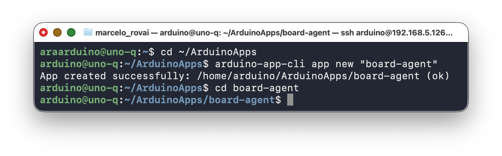

The layout you're building toward:

```
board-agent/
├── app.yaml
├── workspace/          <- the agent's file boundary (Section 7)
│   ├── notes.txt
│   └── readings.txt
├── python/
│   ├── main.py
│   ├── tools.py
│   ├── preview_patterns.py
│   └── requirements.txt
└── sketch/
    ├── sketch.ino
    └── sketch.yaml
```

When you create a new app, some basic files: `app.yaml`, `README.md`and folders: `python`, `sketch` are created. 

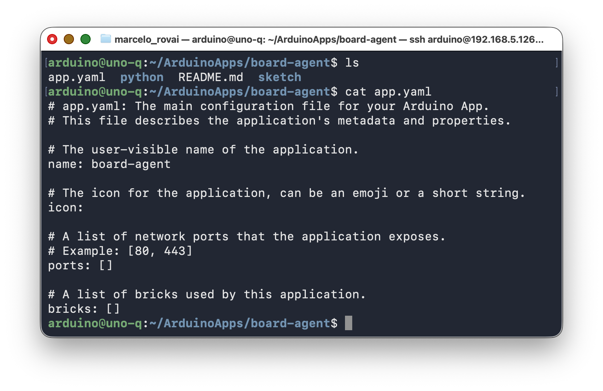

We must adapt their content for our specific projects:  

`app.yaml`:

```yaml
name: Board Agent
description: "A tool-calling agent for the UNO Q — no external hardware required"
icon: 🤖
version: "1.0.0"
ports: [7000]
bricks: []
```

> You can use any IDE (such as `VS Code`) or a text editor such as `nano` or even `cat >`for editing. 
>
> With `nano`, use <CTRL><K> to delete the lines and paste the above content. <CTRL><X> <y><Enter> to save it. 

`python/requirements.txt`:

```
openai==1.54.0
httpx==0.27.2
flask==3.0.3
requests==2.32.3
```

App Lab installs these into a virtual environment it manages, the first time you run the app and again whenever this file changes. You don't create it and you don't activate it — Section 9 covers what that means in practice, and Section 11 covers what happens if you try to bypass it.

> **Why `httpx` is pinned when nothing imports it.** It arrives as a dependency of `openai`, and the two have a version boundary: `openai` 1.54 passes a `proxies` argument that `httpx` 0.28 removed. Leave `httpx` unpinned and the resolver is free to pick the newer one, at which point the app dies at startup on `TypeError: Client.__init__() got an unexpected keyword argument 'proxies'` — an error that names neither package you actually chose. Pinning it makes the working combination explicit, and makes twenty boards in a workshop resolve to the same thing on twenty different days.

### Step 2 — Seed the Workspace

The file tools need something to find. Give the agent two files with real content, so `list_files` → `read_file` → `calculate` can chain into a request worth watching:

```bash
mkdir -p workspace

cat > workspace/notes.txt << 'EOF'
Board Agent — running notes

The UNO Q pairs a Qualcomm QRB2210 (Linux) with an STM32U585 (Zephyr).
Qwen3.5-0.8B loads in about 600 MB of RAM at Q4_K_M.
Bridge RPC is the only path between the Python side and the sketch.
EOF

cat > workspace/readings.txt << 'EOF'
Temperature log, lab bench, 2026-03-14
09:00  21.4
12:00  24.8
15:00  26.1
18:00  23.7
EOF
```

That second file exists so you can ask the agent something it can't answer in one step — "what was the average temperature in the log?" needs `read_file`, then `calculate`, then a sentence. Section 9 runs it.

## 7. Implementing the Tools

### Step 1 — The Python-Side Tools

Create `python/tools.py`. This holds every tool the Linux side can run on its own, with no Bridge call involved.

```python
"""
tools.py — the agent's toolbox. Each public function here corresponds to one
entry in the `tools=[...]` schema sent to llama-server.

Every function returns a JSON string, and every failure is returned rather
than raised. That's deliberate: a tool that raises kills the agent loop; a
tool that returns {"error": "..."} hands the model something it can read and
recover from on the next turn.
"""

import ast
import json
import operator
import os
import platform
import shutil
from pathlib import Path

# ─── get_system_info ────────────────────────────────────────────────
# No model-controlled arguments, so nothing to validate: the commands
# below are the only ones that can ever run, whatever the user types.

def get_system_info():
    """Return basic OS/CPU/RAM/disk facts about the board.

    Every size is a plain number in GB, not a formatted string. That is
    deliberate: this output is read by a model, not a person. Handed
    "1.4G free of 9.8G", a small model has to parse the string and reason
    about units before it can compare anything -- and it often gets that
    wrong. Handed disk_free_gb: 1.4, the comparison is one step.
    """
    def _pretty_name():
        try:
            with open("/etc/os-release") as f:
                for line in f:
                    if line.startswith("PRETTY_NAME="):
                        return line.split("=", 1)[1].strip().strip('"')
        except OSError:
            pass
        return platform.platform()

    def _mem_gb():
        total = avail = None
        try:
            with open("/proc/meminfo") as f:
                for line in f:
                    if line.startswith("MemTotal:"):
                        total = int(line.split()[1]) / 1048576
                    elif line.startswith("MemAvailable:"):
                        avail = int(line.split()[1]) / 1048576
        except (OSError, ValueError):
            pass
        return total, avail

    du = shutil.disk_usage("/")
    mem_total, mem_avail = _mem_gb()

    return json.dumps({
        "os": _pretty_name(),
        "machine": platform.machine(),
        "cpu_count": os.cpu_count(),
        "memory_free_gb": round(mem_avail, 1) if mem_avail else None,
        "memory_total_gb": round(mem_total, 1) if mem_total else None,
        "disk_free_gb": round(du.free / 2**30, 1),
        "disk_total_gb": round(du.total / 2**30, 1),
    })


# ─── Workspace-scoped file access ───────────────────────────────────
# These take a path from the model, so they get a boundary.

# Resolve the workspace relative to this file, never as an absolute host
# path: arduino-app-cli runs the app from /app inside a container, so
# "/home/arduino/ArduinoApps/board-agent/workspace" does not exist there.
# tools.py lives at <app>/python/tools.py, so its grandparent is the app root.
APP_ROOT = Path(__file__).resolve().parent.parent
WORKSPACE_ROOT = Path(
    os.environ.get("AGENT_WORKSPACE", APP_ROOT / "workspace")
).resolve()
WORKSPACE_ROOT.mkdir(parents=True, exist_ok=True)
MAX_READ_BYTES = 4096


def _resolve_in_workspace(path):
    """Resolve `path` against WORKSPACE_ROOT and refuse anything that escapes it."""
    candidate = (WORKSPACE_ROOT / path).resolve()
    if candidate != WORKSPACE_ROOT and WORKSPACE_ROOT not in candidate.parents:
        raise ValueError(f"path '{path}' is outside the workspace")
    return candidate


def list_files(path="."):
    """List files and folders inside the agent's workspace directory."""
    try:
        target = _resolve_in_workspace(path)
        if not target.exists():
            return json.dumps({"error": f"'{path}' does not exist in the workspace"})
        entries = sorted(p.name + ("/" if p.is_dir() else "") for p in target.iterdir())
        if not entries:
            # Say so explicitly. A bare [] gives the model nothing to act on,
            # and it will often just call the tool again -- see Section 10.
            return json.dumps({"path": path, "entries": [],
                               "note": "this directory is empty"})
        return json.dumps({"path": path, "entries": entries})
    except (ValueError, OSError) as e:
        return json.dumps({"error": str(e)})


def read_file(path):
    """Read a text file from the agent's workspace directory (capped size)."""
    try:
        target = _resolve_in_workspace(path)
        if not target.is_file():
            return json.dumps({"error": f"'{path}' is not a file in the workspace"})
        with target.open("r", errors="replace") as fh:
            content = fh.read(MAX_READ_BYTES)
            truncated = fh.read(1) != ""
        return json.dumps({"path": path, "content": content, "truncated": truncated})
    except (ValueError, OSError) as e:
        return json.dumps({"error": str(e)})


# ─── calculate: AST-based, no eval() ────────────────────────────────

_ALLOWED_OPS = {
    ast.Add: operator.add,
    ast.Sub: operator.sub,
    ast.Mult: operator.mul,
    ast.Div: operator.truediv,
    ast.Pow: operator.pow,
    ast.USub: operator.neg,
}

MAX_EXPONENT = 64


def _eval_node(node):
    if isinstance(node, ast.Constant) and isinstance(node.value, (int, float)):
        return node.value
    if isinstance(node, ast.BinOp) and type(node.op) in _ALLOWED_OPS:
        left, right = _eval_node(node.left), _eval_node(node.right)
        if isinstance(node.op, ast.Pow) and abs(right) > MAX_EXPONENT:
            raise ValueError(f"exponent {right} is above the limit of {MAX_EXPONENT}")
        return _ALLOWED_OPS[type(node.op)](left, right)
    if isinstance(node, ast.UnaryOp) and type(node.op) in _ALLOWED_OPS:
        return _ALLOWED_OPS[type(node.op)](_eval_node(node.operand))
    raise ValueError(f"disallowed expression element: {type(node).__name__}")


def calculate(expression):
    """Safely evaluate an arithmetic expression (+ - * / ** and parentheses only)."""
    try:
        tree = ast.parse(expression, mode="eval")
        result = _eval_node(tree.body)
        return json.dumps({"expression": expression, "result": result})
    except Exception as e:
        return json.dumps({"expression": expression, "error": str(e)})
```

Test it standalone before wiring it to a model — you want to know these work before you start debugging tool *selection*:

```bash
cd ~/ArduinoApps/board-agent/python
python3 -c "
import tools
print(tools.list_files('.'))
print(tools.read_file('readings.txt'))
print(tools.calculate('(21.4 + 24.8 + 26.1 + 23.7) / 4'))
print(tools.read_file('../../../etc/passwd'))
"
```

You can run all the lines as above, or one by one:

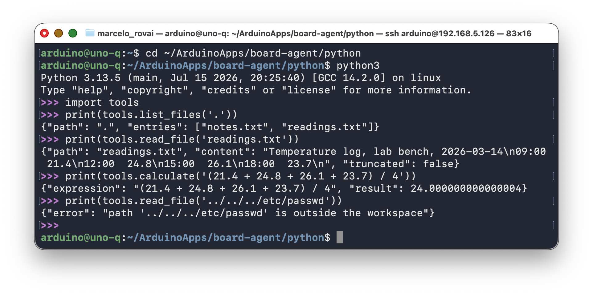

We can see that the tools are working. And note that the last line **should return an error, not a password file**.

If `list_files` comes back with `"entries": []`, the workspace is empty — go back and run the Step 2 seeding commands. That is not a harmless state: Section 11 shows what the agent does when a tool keeps handing it nothing.

### Two Things Worth Understanding in That Code

**Why `_resolve_in_workspace` resolves before comparing.** A string check like `path.startswith(WORKSPACE_ROOT)` is defeated by `../../etc/passwd` before the path is ever normalized. Resolving first, then checking ancestry, closes that. It also closes a case that's harder to spot: a *symlink* inside the workspace pointing at `/etc/passwd`. `.resolve()` follows the link before the ancestry check runs, so the real target gets tested, not the link's own path. Try it:

```bash
ln -s /etc/passwd ~/ArduinoApps/board-agent/workspace/escape.txt
python3 -c "import tools; print(tools.read_file('escape.txt'))"
rm ~/ArduinoApps/board-agent/workspace/escape.txt
```

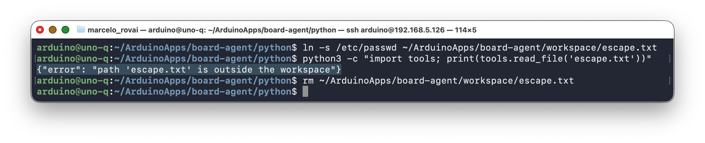

**Why `calculate` caps the exponent.** "No `eval()`" and "safe" are not the same claim, and the gap between them is worth feeling directly. Comment out the two `MAX_EXPONENT` lines and run this — then open a second SSH session, because you'll need it:

```bash
python3 -c "import tools; print(tools.calculate('9**9**9'))"
```

Nothing gets executed that shouldn't. The AST walk works exactly as advertised. The board just stops responding while Python tries to build a number with 370 million digits. A restricted grammar closed the code-execution hole; it did nothing about resource exhaustion, and on a 2 GB board with four A53 cores that's not a theoretical concern. Put the lines back.

**The general version of that lesson**: when you write a tool, ask what a *hostile* argument costs, not just what a *malicious* one does. Cost comes in more flavors than code execution — CPU, memory, disk, wall-clock time, and money if the tool calls a paid API.

### Step 2 — The MCU Sketch: Built-In LED and LED Matrix

The UNO Q's Zephyr core bundles `Arduino_LED_Matrix` — no separate library install needed.

`sketch/sketch.ino`:

```cpp
#include "Arduino_RouterBridge.h"
#include "Arduino_LED_Matrix.h"

ArduinoLEDMatrix matrix;

// 8 rows x 13 columns, 0 = off, 1 = on.
// Row 0 is the top row, column 0 is the left column.
uint8_t frame[8][13];

void clearFrame() {
  memset(frame, 0, sizeof(frame));
}

void showOff()   { clearFrame(); matrix.renderBitmap(frame, 8, 13); }

void showCheck() {
  clearFrame();
  int pts[][2] = { {5,2}, {6,3}, {7,4}, {6,5}, {5,6}, {4,7}, {3,8}, {2,9}, {1,10} };
  for (auto &p : pts) frame[p[0]][p[1]] = 1;
  matrix.renderBitmap(frame, 8, 13);
}

void showX() {
  clearFrame();
  // Both diagonals stay within columns 2..10 for rows 0..7, so no bounds
  // check is needed here. If you change the row count, re-check that.
  for (int i = 0; i < 8; i++) {
    frame[i][2 + i]  = 1;
    frame[i][10 - i] = 1;
  }
  matrix.renderBitmap(frame, 8, 13);
}

void showSmiley() {
  clearFrame();
  int pts[][2] = {
    {1,3},{1,4},{1,8},{1,9},                                 // eyes
    {5,2},{6,3},{6,4},{6,5},{6,6},{6,7},{6,8},{6,9},{5,10}   // smile
  };
  for (auto &p : pts) frame[p[0]][p[1]] = 1;
  matrix.renderBitmap(frame, 8, 13);
}

// A minimal 3x5 font for digits 0-9, drawn at rows 1-5, columns 5-7.
const uint8_t DIGIT_FONT[10][5] = {
  {0b111,0b101,0b101,0b101,0b111}, // 0
  {0b010,0b110,0b010,0b010,0b111}, // 1
  {0b111,0b001,0b111,0b100,0b111}, // 2
  {0b111,0b001,0b111,0b001,0b111}, // 3
  {0b101,0b101,0b111,0b001,0b001}, // 4
  {0b111,0b100,0b111,0b001,0b111}, // 5
  {0b111,0b100,0b111,0b101,0b111}, // 6
  {0b111,0b001,0b010,0b010,0b010}, // 7
  {0b111,0b101,0b111,0b101,0b111}, // 8
  {0b111,0b101,0b111,0b001,0b111}, // 9
};

const int DIGIT_ROW_OFFSET = 1;
const int DIGIT_COL_OFFSET = 5;

void showDigit(int d) {
  clearFrame();
  if (d < 0 || d > 9) return;
  for (int row = 0; row < 5; row++) {
    for (int col = 0; col < 3; col++) {
      if ((DIGIT_FONT[d][row] >> (2 - col)) & 1) {
        frame[row + DIGIT_ROW_OFFSET][col + DIGIT_COL_OFFSET] = 1;
      }
    }
  }
  matrix.renderBitmap(frame, 8, 13);
}

// ─── Bridge-exposed functions ───────────────────────────────────────

void set_builtin_led(bool state) {
  // The UNO Q's onboard LED is active-low: LOW lights it, HIGH turns it off.
  // Get this backwards and the LED is lit at boot and inverts every command.
  digitalWrite(LED_BUILTIN, state ? LOW : HIGH);
}

// pattern: "check" | "x" | "smiley" | "off" | "0".."9"
void set_led_matrix(String pattern) {
  if (pattern == "check")       showCheck();
  else if (pattern == "x")      showX();
  else if (pattern == "smiley") showSmiley();
  else if (pattern == "off")    showOff();
  else if (pattern.length() == 1 && isDigit(pattern[0])) showDigit(pattern.toInt());
  else                          showX();  // unrecognized pattern -> visible error state
}

void setup() {
  pinMode(LED_BUILTIN, OUTPUT);
  digitalWrite(LED_BUILTIN, HIGH);   // active-low: HIGH means off
  matrix.begin();
  showOff();

  Bridge.begin();
  Bridge.provide_safe("set_builtin_led", set_builtin_led);
  Bridge.provide_safe("set_led_matrix", set_led_matrix);
}

void loop() {
  // All work is event-driven via Bridge calls from Python.
}
```

`sketch/sketch.yaml`:

```yaml
profiles:
  default:
    fqbn: arduino:zephyr:uno_q
    platforms:
      - platform: arduino:zephyr
    libraries:
      - dependency: Arduino_RPClite (0.2.1)
default_profile: default
```

> `Arduino_LED_Matrix` doesn't need a `libraries:` entry — it's bundled with the `arduino:zephyr` platform core itself, not fetched from the Library Manager. If your build complains it's missing, update the core (`arduino-app-cli system update`) rather than trying to install the library separately.

### Step 3 — Preview the Patterns Before Flashing

The coordinate lists above are correct as written — each one has been rendered and checked. You'll want to change them, though, or add patterns of your own, and editing a coordinate, rebuilding, loading, and squinting at the board is a slow way to discover you were one pixel off. Save `python/preview_patterns.py` and check patterns in a terminal instead:

```python
#!/usr/bin/env python3
"""
preview_patterns.py — render the sketch's LED matrix patterns in the terminal.

Keep these coordinates identical to the ones in sketch.ino. If you nudge a
pixel in one place, nudge it in the other.

    python3 preview_patterns.py            # all patterns
    python3 preview_patterns.py check x    # only the ones you name
    python3 preview_patterns.py 7          # a digit
"""

import sys

ROWS, COLS = 8, 13


def blank():
    return [[0] * COLS for _ in range(ROWS)]


def render(name, frame):
    print(f"\n  {name}")
    print("     " + "".join(str(c % 10) for c in range(COLS)))
    for r, row in enumerate(frame):
        print(f"   {r} " + "".join("#" if v else "." for v in row))


def check():
    f = blank()
    for r, c in [(5, 2), (6, 3), (7, 4), (6, 5), (5, 6),
                 (4, 7), (3, 8), (2, 9), (1, 10)]:
        f[r][c] = 1
    return f


def cross():
    f = blank()
    for i in range(ROWS):
        f[i][2 + i] = 1
        f[i][10 - i] = 1
    return f


def smiley():
    f = blank()
    for r, c in [(1, 3), (1, 4), (1, 8), (1, 9),
                 (5, 2), (6, 3), (6, 4), (6, 5), (6, 6),
                 (6, 7), (6, 8), (6, 9), (5, 10)]:
        f[r][c] = 1
    return f


DIGIT_FONT = [
    [0b111, 0b101, 0b101, 0b101, 0b111],
    [0b010, 0b110, 0b010, 0b010, 0b111],
    [0b111, 0b001, 0b111, 0b100, 0b111],
    [0b111, 0b001, 0b111, 0b001, 0b111],
    [0b101, 0b101, 0b111, 0b001, 0b001],
    [0b111, 0b100, 0b111, 0b001, 0b111],
    [0b111, 0b100, 0b111, 0b101, 0b111],
    [0b111, 0b001, 0b010, 0b010, 0b010],
    [0b111, 0b101, 0b111, 0b101, 0b111],
    [0b111, 0b101, 0b111, 0b001, 0b111],
]

ROW_OFFSET, COL_OFFSET = 1, 5


def digit(d):
    f = blank()
    for row in range(5):
        for col in range(3):
            if (DIGIT_FONT[d][row] >> (2 - col)) & 1:
                f[row + ROW_OFFSET][col + COL_OFFSET] = 1
    return f


NAMED = {"off": blank, "check": check, "x": cross, "smiley": smiley}


def main():
    wanted = sys.argv[1:] or list(NAMED) + [str(d) for d in range(10)]
    for name in wanted:
        if name in NAMED:
            render(name, NAMED[name]())
        elif name.isdigit() and len(name) == 1:
            render(f"digit {name}", digit(int(name)))
        else:
            print(f"\n  unknown pattern: {name}", file=sys.stderr)
    print()


if __name__ == "__main__":
    main()
```

`python3 preview_patterns.py check x` prints:

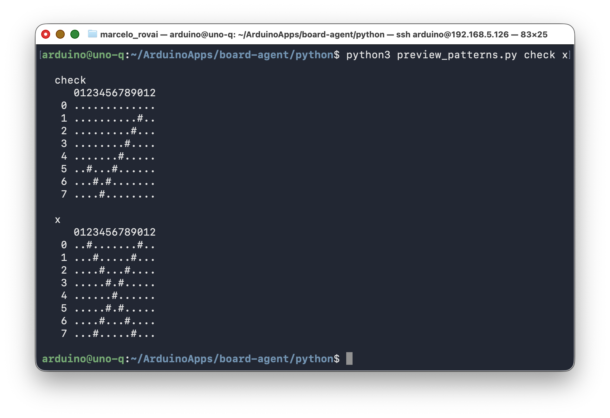

### Step 4 — Check the Orientation Once, On the Board

Flash the sketch: 

```bash
arduino-app-cli app start .
```

Then confirm that the board agrees with the terminal before you trust any coordinates. 

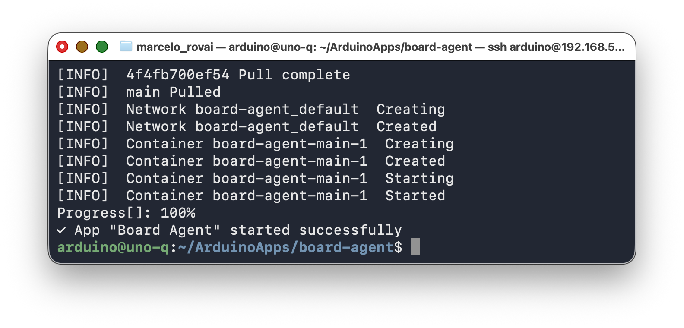

Stop the app:

```bash
arduino-app-cli app stop .
```

And on `sketch/sketch.ino`, add one temporary line at the end of `setup()`:

```cpp
void setup() {
  pinMode(LED_BUILTIN, OUTPUT);
  digitalWrite(LED_BUILTIN, HIGH);   // active-low: HIGH means off
  matrix.begin();
  showOff();

  Bridge.begin();
  Bridge.provide_safe("set_builtin_led", set_builtin_led);
  Bridge.provide_safe("set_led_matrix", set_led_matrix);

  set_led_matrix("check");   // TEMPORARY - orientation check, delete after
}
```

Start the app again.

That's an ordinary C++ call, not a Bridge call. Nothing else needs to be running — no Python, no `llama-server`. The board boots, draws a checkmark, and you compare it against the `check` render printed above.

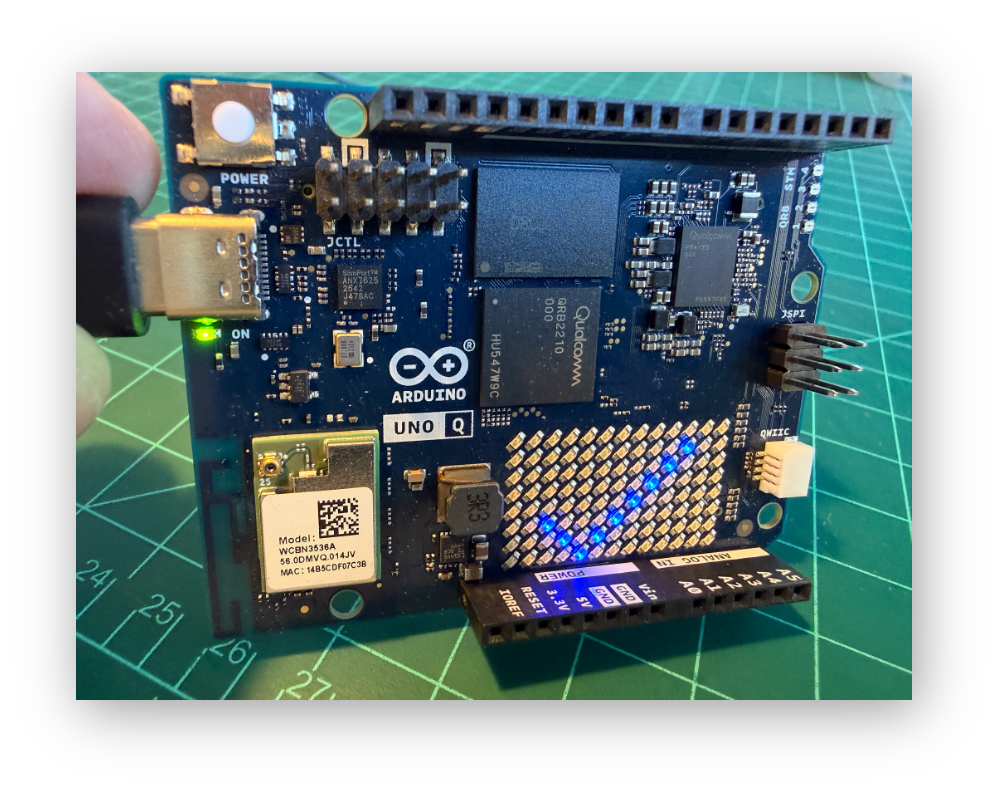

Decide first which way is "up" for your setup — say, the board's silkscreen text upright — and check against that consistently. Rotate the board and every claim about rows and columns changes with it.

The checkmark is the right pattern for this test because it's asymmetric on both axes: mirrored left-to-right, flipped top-to-bottom, or rotated 180 degrees, it looks wrong in an obvious way. An X would tell you nothing — it's identical to its own mirror image.

**If the board matches, every other pattern will too.** Orientation is a property of the single `matrix.renderBitmap(frame, 8, 13)` call that all four drawing functions share, not of the individual coordinate lists. Confirming it once confirms it for the whole set.

If it comes out mirrored or upside down — which shouldn't happen on a stock UNO Q, but core versions do change — see "The Matrix Shows the Wrong Shape" in Section 11 for a fix that touches one function instead of five.

Once it looks right, **delete the temporary `set_led_matrix("check")` line** — otherwise the board boots showing a checkmark and you'll lose a minute later wondering which tool call put it there.

## 8. Building the Agent Loop

### Step 1 — Tool Schemas and the Dispatch Table

`main.py` is built across the next three steps, in the order the file reads — imports and constants here, the loop in Step 2, the HTTP interface in Step 3. Type them one after another and you'll have a working file at the end, with nothing to go back and insert.

Part 1 wires the Python-side tools from `tools.py` to their JSON schemas, and the two Bridge-side tools to `Bridge.call()`:

```python
"""
main.py — the agent loop. Sends the conversation + tool schemas to
llama-server, dispatches any tool_calls, feeds results back, repeats
until the model returns a plain-text answer. Exposed over HTTP so you
can reach it from a terminal or another device on the network.
"""

import json
import socket
import struct
import threading
import time

import requests
from flask import Flask, request, jsonify
from openai import OpenAI
from arduino.app_utils import *
import tools

# ─── Container-aware host discovery (same pattern as chapter 4) ────

def _host_gateway():
    try:
        with open("/proc/net/route") as f:
            for line in f.readlines()[1:]:
                fields = line.strip().split()
                if fields[1] == "00000000" and int(fields[3], 16) & 2:
                    return socket.inet_ntoa(struct.pack("<L", int(fields[2], 16)))
    except OSError:
        pass
    return "127.0.0.1"

LLM_URL = f"http://{_host_gateway()}:8081/v1"
LLM_HEALTH_URL = f"http://{_host_gateway()}:8081/health"
FLASK_PORT = 7000

client = OpenAI(base_url=LLM_URL, api_key="not-needed")
MODEL = "qwen3.5-0.8b"

# ─── Tool schemas sent to the model ─────────────────────────────────

TOOLS = [
    {"type": "function", "function": {
        "name": "get_system_info",
        "description": "Get the board's OS, CPU, RAM, and disk usage.",
        "parameters": {"type": "object", "properties": {}},
    }},
    {"type": "function", "function": {
        "name": "list_files",
        "description": "List files and folders in the agent's workspace directory.",
        "parameters": {"type": "object", "properties": {
            "path": {"type": "string", "description": "Relative path inside the workspace. Default '.'."}
        }},
    }},
    {"type": "function", "function": {
        "name": "read_file",
        "description": "Read a text file from the agent's workspace directory.",
        "parameters": {"type": "object", "properties": {
            "path": {"type": "string", "description": "Relative path to the file inside the workspace."}
        }, "required": ["path"]},
    }},
    {"type": "function", "function": {
        "name": "calculate",
        "description": "Evaluate a basic arithmetic expression and return the numeric result.",
        "parameters": {"type": "object", "properties": {
            "expression": {"type": "string", "description": "e.g. '234 * 17 - 9'"}
        }, "required": ["expression"]},
    }},
    {"type": "function", "function": {
        "name": "set_builtin_led",
        "description": "Turn the UNO Q's single onboard LED on or off.",
        "parameters": {"type": "object", "properties": {
            "state": {"type": "boolean", "description": "true = on, false = off"}
        }, "required": ["state"]},
    }},
    {"type": "function", "function": {
        "name": "set_led_matrix",
        "description": "Draw a pattern on the UNO Q's onboard 8x13 LED matrix. "
                       "Use 'off' to clear it.",
        "parameters": {"type": "object", "properties": {
            "pattern": {"type": "string",
                        "enum": ["check", "x", "smiley", "off",
                                 "0","1","2","3","4","5","6","7","8","9"]}
        }, "required": ["pattern"]},
    }},
]

# ─── Dispatch table: tool name -> Python callable ───────────────────

def _set_builtin_led(state):
    Bridge.call("set_builtin_led", bool(state))
    return json.dumps({"ok": True, "led": "on" if state else "off"})


def _set_led_matrix(pattern):
    Bridge.call("set_led_matrix", str(pattern))
    return json.dumps({"ok": True, "pattern": pattern})


DISPATCH = {
    "get_system_info": lambda **kw: tools.get_system_info(),
    "list_files": lambda path=".": tools.list_files(path),
    "read_file": lambda path: tools.read_file(path),
    "calculate": lambda expression: tools.calculate(expression),
    "set_builtin_led": lambda state: _set_builtin_led(state),
    "set_led_matrix": lambda pattern: _set_led_matrix(pattern),
}
```

### Step 2 — The Loop Itself

```python
SYSTEM_PROMPT = (
    "You are a helpful assistant running locally on an Arduino UNO Q. "
    "You have tools to inspect the board's system info, read files in "
    "your workspace, do arithmetic, and control the onboard LED and LED "
    "matrix. Use a tool whenever the answer depends on information you "
    "don't already know (system state, file contents, exact arithmetic) "
    "or requires a physical action. Otherwise, just answer directly. "
    "Use as few tools as possible: most questions need zero or one call. "
    "Never call the same tool twice with the same arguments. "
    "As soon as the tool results contain enough to answer, stop calling "
    "tools and reply in one or two plain sentences."
)

MAX_TURNS = 6


def run_agent(user_message):
    """Run the agent loop. Returns {"answer": str, "trace": [...]}.

    The trace is returned as well as printed, so HTTP clients see the
    tool calls and not just the conclusion. Watching the decisions is
    most of the point of this chapter.
    """
    messages = [
        {"role": "system", "content": SYSTEM_PROMPT},
        {"role": "user", "content": user_message},
    ]
    trace = []
    started = time.time()

    for turn in range(MAX_TURNS):
        t0 = time.time()
        response = client.chat.completions.create(
            model=MODEL,
            messages=messages,
            tools=TOOLS,
            temperature=0.3,
            max_tokens=512,
        )
        llm_ms = int((time.time() - t0) * 1000)
        print(f"[turn {turn}] model replied in {llm_ms} ms", flush=True)
        msg = response.choices[0].message

        if not msg.tool_calls:
            # Plain-text answer: the agent is done.
            return {"answer": msg.content, "trace": trace,
                    "total_ms": int((time.time() - started) * 1000)}

        # The model wants to call one or more tools. Note `or ""` — on a
        # pure tool-call turn `content` is None, and some OpenAI-compatible
        # servers reject a null content field when it's replayed back.
        messages.append({
            "role": "assistant",
            "content": msg.content or "",
            "tool_calls": [tc.model_dump() for tc in msg.tool_calls],
        })

        for tc in msg.tool_calls:
            name = tc.function.name
            try:
                args = json.loads(tc.function.arguments or "{}")
            except json.JSONDecodeError:
                args = {}

            if name not in DISPATCH:
                result = json.dumps({"error": f"unknown tool '{name}'"})
            else:
                try:
                    result = DISPATCH[name](**args)
                except Exception as e:
                    result = json.dumps({"error": str(e)})

            print(f"[turn {turn}] tool call: {name}({args})", flush=True)
            print(f"[turn {turn}] result: {result}", flush=True)
            trace.append({"turn": turn, "tool": name, "args": args,
                          "result": result, "llm_ms": llm_ms})

            messages.append({
                "role": "tool",
                "tool_call_id": tc.id,
                "content": result,
            })

    return {"answer": "(gave up after too many tool-call turns — see MAX_TURNS)",
            "trace": trace, "total_ms": int((time.time() - started) * 1000)}
```

### Step 3 — The HTTP Interface

The agent needs a way for you to talk to it, and on this board that has to be HTTP rather than a terminal prompt. Section 9 explains why in detail; the short version is that `main.py` runs inside an environment `arduino-app-cli` manages, and there's no way to attach a keyboard to it.

That's the same shape as chapter 4's dengue classifier: Flask in a background thread, `App.run()` on the main thread.

```python
# ─── Flask app (the interface you talk to) ─────────────────────────

flask_app = Flask(__name__)


# A single page, served as a plain string — no template files, no Jinja
# variables, no build step. It POSTs to /ask and renders the trace next to
# the answer, so the tool calls are visible to whoever is watching.

INDEX_HTML = """<!doctype html>
<html><head><meta charset="utf-8"><title>Board Agent</title>
<meta name="viewport" content="width=device-width, initial-scale=1">
<style>
 body { font: 16px system-ui, sans-serif; max-width: 46rem; margin: 2rem auto;
        padding: 0 1rem; color: #222; }
 h1 { font-size: 1.3rem; }
 .row { display: flex; gap: .5rem; }
 input { flex: 1; padding: .6rem; font: inherit; border: 1px solid #bbb;
         border-radius: 6px; }
 button { padding: .6rem 1.1rem; font: inherit; border: 0; border-radius: 6px;
          background: #2b6; color: #fff; cursor: pointer; }
 button:disabled { background: #999; cursor: default; }
 .step { background: #f4f4f2; padding: .5rem .8rem; border-radius: 6px;
         font-family: ui-monospace, monospace; font-size: .8rem;
         margin: .4rem 0; word-break: break-word; }
 .answer { background: #eef6ff; padding: .9rem; border-radius: 6px;
           border-left: 4px solid #2b6; margin-top: .6rem; white-space: pre-wrap; }
 .meta { color: #777; font-size: .8rem; }
</style></head><body>
<h1>Board Agent</h1>
<div class="row">
  <input id="q" placeholder="Ask the board something..." autofocus>
  <button id="b">Ask</button>
</div>
<div id="out"></div>
<script>
var q = document.getElementById('q');
var b = document.getElementById('b');
var out = document.getElementById('out');

function line(cls, text) {
  var d = document.createElement('div');
  d.className = cls;
  d.textContent = text;
  out.appendChild(d);
}

function run() {
  var question = q.value.trim();
  if (!question) return;
  b.disabled = true;
  out.textContent = '';
  line('meta', 'Thinking...');
  fetch('/ask', {
    method: 'POST',
    headers: { 'Content-Type': 'application/json' },
    body: JSON.stringify({ question: question })
  })
  .then(function (r) { return r.json(); })
  .then(function (d) {
    out.textContent = '';
    (d.trace || []).forEach(function (s) {
      line('step', '[turn ' + s.turn + '] tool call: ' + s.tool +
           '(' + JSON.stringify(s.args) + ')');
      line('step', '[turn ' + s.turn + '] result: ' + s.result);
    });
    line('answer', d.answer || '(no answer)');
    if (d.total_ms) line('meta', (d.total_ms / 1000).toFixed(1) + 's');
  })
  .catch(function (e) {
    out.textContent = '';
    line('meta', 'Request failed: ' + e);
  })
  .then(function () { b.disabled = false; });
}

b.onclick = run;
q.onkeydown = function (e) { if (e.key === 'Enter') run(); };
</script></body></html>"""


@flask_app.route("/", methods=["GET"])
def index():
    return INDEX_HTML


@flask_app.route("/healthz", methods=["GET"])
def healthz():
    try:
        r = requests.get(LLM_HEALTH_URL, timeout=5)
        return jsonify({"flask": "ok", "llm": r.json()}), 200
    except Exception as e:
        return jsonify({"flask": "ok", "llm_error": str(e)}), 503


@flask_app.route("/ask", methods=["POST"])
def ask_endpoint():
    p = request.get_json(force=True)
    question = (p.get("question") or "").strip()
    if not question:
        return jsonify({"error": "missing 'question'"}), 400
    return jsonify(run_agent(question)), 200


def run_flask():
    # threaded=False because the model handles one request at a time anyway
    flask_app.run(host="0.0.0.0", port=FLASK_PORT, threaded=False)


# ─── Main entry: start Flask, then hand the main thread to App.run ──

threading.Thread(target=run_flask, daemon=True).start()

print(f"[init] llama-server target: {LLM_URL}", flush=True)
print(f"[init] agent ready, Flask on :{FLASK_PORT}", flush=True)


def loop():
    # The main loop is idle. All work is event-driven, arriving as HTTP
    # requests that Flask handles on its own thread.
    time.sleep(1)


App.run(user_loop=loop)
```

### Why the Bridge Is Live by the Time a Tool Runs

`set_builtin_led` and `set_led_matrix` reach the MCU through `Bridge.call()`, and that needs the framework's transport running — which is what `App.run()` starts. In this design you get that for free: `App.run()` is the last statement in the file, and a Flask request can only arrive after the server is up and the process is sitting in `App.run()`. By the time any tool executes, everything is initialized.

This is worth understanding rather than just accepting, because the obvious alternative breaks it. If you tried to drive the agent from a `while True:` loop placed above `App.run()`, the four Python-side tools would work and the two LED tools would fail — the Bridge wouldn't be up yet. Five sixths of the agent working is a confusing way to fail.

> Chapter 4 used the Bridge in the opposite direction: the MCU called *into* Python, and `Bridge.provide()` registered the handler before `App.run()`. Here Python calls *out* to the MCU, so what matters is when the call happens, not when it's registered.

### Other Design Choices Worth Flagging

- **`MAX_TURNS` is a hard stop, not a suggestion.** A model that keeps calling tools without ever producing a final answer is a real failure mode at small sizes (Section 10). Capping the loop turns an infinite hang into a bounded, debuggable failure.
- **The dispatch table separates "what the model can call" from "how it's implemented."** Adding a tool later (Section 12) means adding one schema entry and one `DISPATCH` line — the loop itself never changes.
- **Tool results go back as `role="tool"` messages, not appended to the user's turn.** This is what the OpenAI-compatible format expects, and it's what lets the model tell the difference between "the user said this" and "a tool returned this."
- **The trace is returned *and* printed.** `print()` goes to `arduino-app-cli app logs`, so you can watch the loop run live; the returned copy means an HTTP client sees the reasoning too. `flush=True` matters — without it, output buffers and the log lags behind the board.
- **`max_tokens=512`, not 300.** The final answer has to summarize whatever the tools returned, and `get_system_info` alone comes back as a fat JSON blob. Too tight a budget truncates the answer mid-sentence, which reads like a model failure but isn't.
- **`temperature=0.3`** is lower than the 0.7 used for free-form chat in earlier chapters. Tool selection wants a more deterministic sampling distribution than storytelling does.

## 9. Running It: Example Interactions

### What Runs Where

Before starting anything, it's worth seeing the whole runtime laid out. Four pieces, on two processors, across a container boundary:

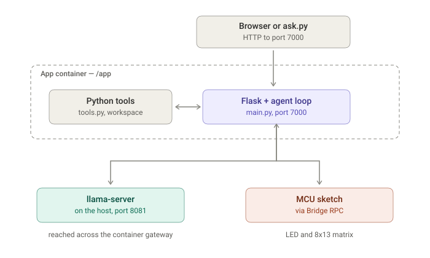

Three details on that picture explain most of what goes wrong in this section:

- **`llama-server` runs on the host; the agent runs in a container.** `arduino-app-cli` executes `main.py` from `/app`, not from your home directory. That's why the agent reaches the model at a gateway address like `172.19.0.1` rather than `127.0.0.1`, and why `--host 0.0.0.0` on the server is mandatory: a loopback-bound server is invisible from inside the container.
- **Two ports, two different things.** `8081` is the model. `7000` is your agent. Confusing them is the most common wrong turn here.
- **Only the two LED tools cross to the MCU.** The other four resolve entirely in Python, which is why they keep working when the Bridge doesn't.

### Three Terminals

The pieces run in parallel and each holds its own session, so open three before you start:

| Terminal | Holds | Purpose |
|---|---|---|
| 1 | `llama-server` | The model. Stays in the foreground so you can see it load and watch requests arrive. |
| 2 | `arduino-app-cli app logs . --follow` | The agent's thinking — `[turn N] tool call:` lines scroll here. |
| 3 | free | Where you type questions. |

### Terminal 1 — The Model

If a `llama-server` is still running from Section 4, stop it (Ctrl-C, or `pkill -f llama-server`) — that one has `--tools` on, which the agent doesn't want. Start the Section 3 command again, unchanged:

```bash
~/llama.cpp/build/bin/llama-server \
  --model ~/models/Qwen3.5-0.8B-GGUF/Qwen3.5-0.8B-Q8_0.gguf \
  --host 0.0.0.0 --port 8081 \
  --jinja \
  --reasoning off --reasoning-budget 0 \
  --ctx-size 4096 --threads 4 \
  --batch-size 512 --ubatch-size 64 \
  --predict 1024 \
  --alias qwen3.5-0.8b
```

That holds the terminal. From terminal 3, confirm it's up and listening on all addresses, not just loopback:

```bash
curl -s http://localhost:8081/health
ss -tlnp | grep 8081          # want 0.0.0.0:8081
```

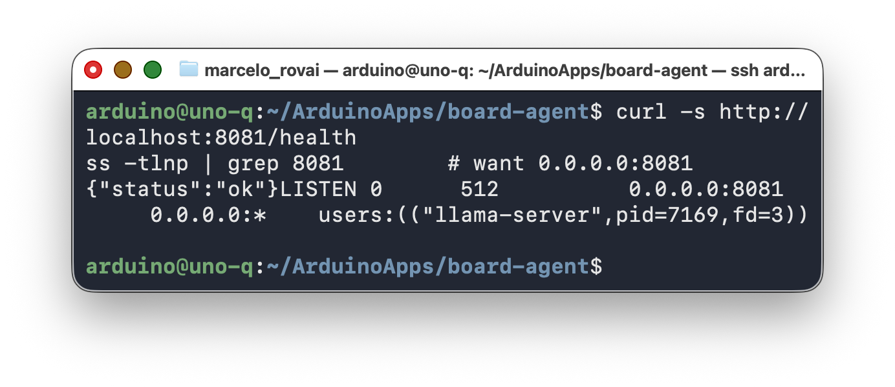

`0.0.0.0` matters here: the agent runs in a container and reaches the model across the container gateway, which a loopback-bound server excludes.

### Start the App

```bash
cd ~/ArduinoApps/board-agent
arduino-app-cli app start .
```

That one command does four things: builds a Python environment from `requirements.txt`, compiles the sketch and loads it onto the MCU, starts `main.py`, and forwards the port named in `app.yaml`. The first run takes a few minutes while `openai`, `flask`, and `requests` install.

> **Don't run `python3 python/main.py` directly.** It won't work, and the error is misleading. `arduino-app-cli` runs the app inside an environment it manages — that's where `openai` gets installed and where the `arduino.app_utils` package providing `Bridge` lives. From a plain SSH shell neither import resolves, and running the file by hand also skips loading the sketch onto the MCU. `app start` is the only supported way in. Section 11 has the full symptom list.

In terminal 2, watch the agent think:

```bash
arduino-app-cli app logs . --follow
```

You should see the two `[init]` lines. 

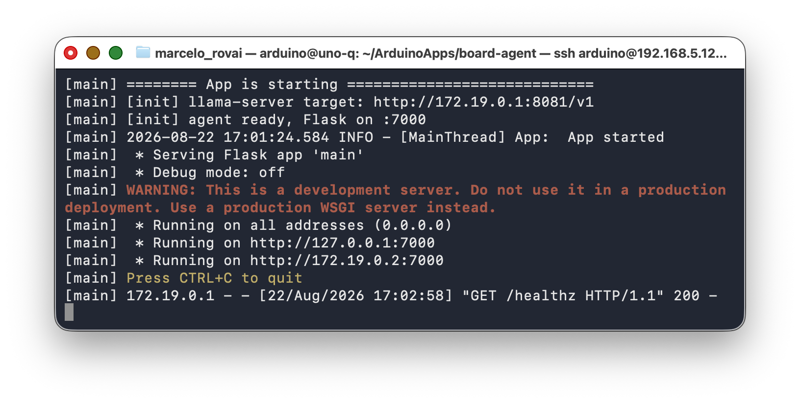

Confirm the whole chain — Flask up, llama-server reachable from inside the app:

```bash
curl -s http://localhost:7000/healthz | python3 -m json.tool
```

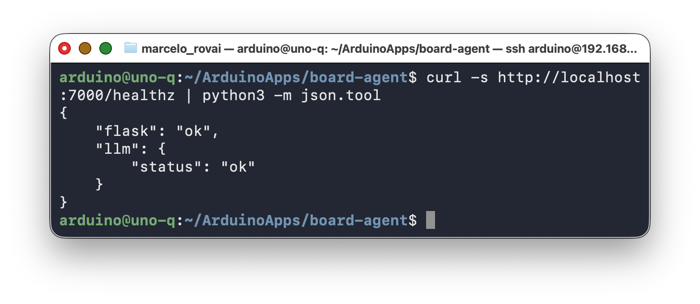

A `"llm"` key means both halves are talking. An `"llm_error"` key means Flask is fine but `llama-server` isn't reachable; check it's running and re-read the `_host_gateway()` note in Section 8.

### Ask It Things

The endpoint takes JSON and returns JSON:

```bash
curl -s -X POST http://localhost:7000/ask \
  -H 'Content-Type: application/json' \
  -d '{"question": "What is the free disk space on this board?"}' \
  | python3 -m json.tool
```

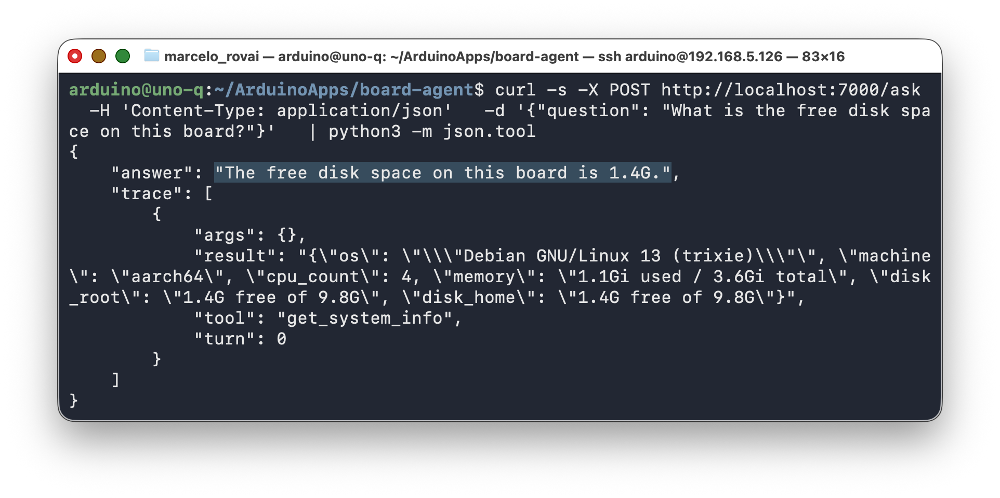

That's verbose to type repeatedly, and it only shows the final answer — the tool calls are in terminal 2. Save `ask.py` in the app directory to get the whole picture in one place:

```python
#!/usr/bin/env python3
"""ask.py — command-line client for the Board Agent.

Standard library only, so it runs with the board's system Python. It does
not import anything from the app; it just talks to the HTTP endpoint.

    python3 ask.py "what is 234 times 17, minus 9?"
"""

import json
import sys
import urllib.request

URL = "http://localhost:7000/ask"


def main():
    question = " ".join(sys.argv[1:]).strip()
    if not question:
        print('usage: python3 ask.py "your question"')
        return 1

    req = urllib.request.Request(
        URL,
        data=json.dumps({"question": question}).encode(),
        headers={"Content-Type": "application/json"},
    )
    # Generous timeout: a multi-turn answer on an 0.8B model is not fast.
    with urllib.request.urlopen(req, timeout=900) as r:
        payload = json.load(r)

    for step in payload.get("trace", []):
        print(f'[turn {step["turn"]}] tool call: {step["tool"]}({step["args"]})')
        print(f'[turn {step["turn"]}] result: {step["result"]}')
    print(payload.get("answer", ""))
    if "total_ms" in payload:
        print(f'\n({payload["total_ms"] / 1000:.1f}s)')
    return 0


if __name__ == "__main__":
    sys.exit(main())
```

Then:

```bash
python3 ask.py "what is 234 times 17, minus 9?"
```

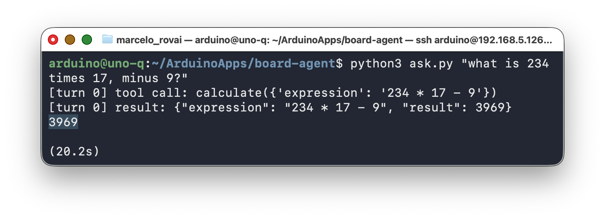

Add a shell alias if you like: `alias ask='python3 ~/ArduinoApps/board-agent/ask.py'`. 

Swap `localhost` in `URL` for the board's address from `hostname -I` and the same script works from your laptop, since `ports: [7000]` publishes the agent to your network.

### From a Browser

Open `http://<board-ip>:7000/` on any device on the network — use the address `hostname -I` reports on the board. You get a text box, and each answer appears with the tool calls that produced it.

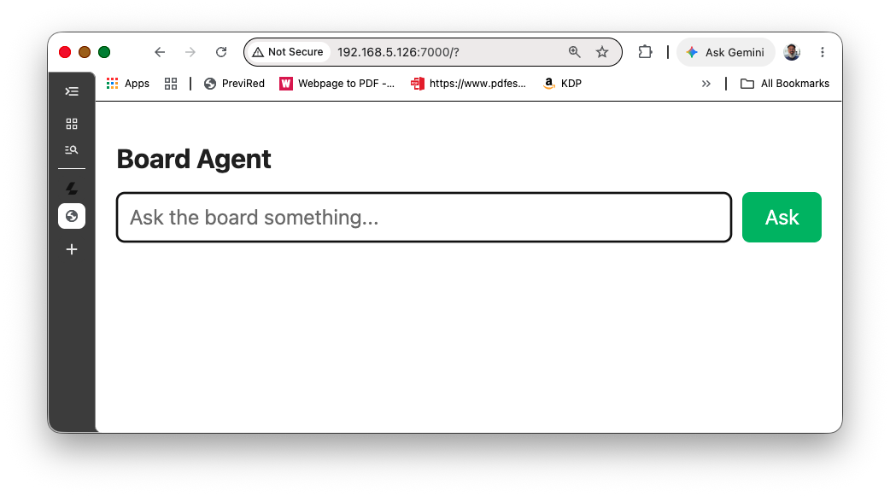

Two things about the other routes, since both look like faults and neither is one. `/healthz` returns JSON in the browser, which is what it's for. `/ask` returns **Method Not Allowed** if you type it into the address bar: it only accepts POST, and a browser navigating to a URL sends GET. The page at `/` is what POSTs to it.

For a workshop this is usually the better surface — students drive it from their own laptops, and the trace is visible to whoever is watching the projector.

The examples below are exactly what `ask.py` prints. Terminal 2 shows the same trace as it happens, plus a `model replied in N ms` line per turn that `ask.py` doesn't repeat — keep it visible, because those numbers are what Section 10 asks you to think about.

### What You Should See

**System info:**

*What's the free disk space on this board?*

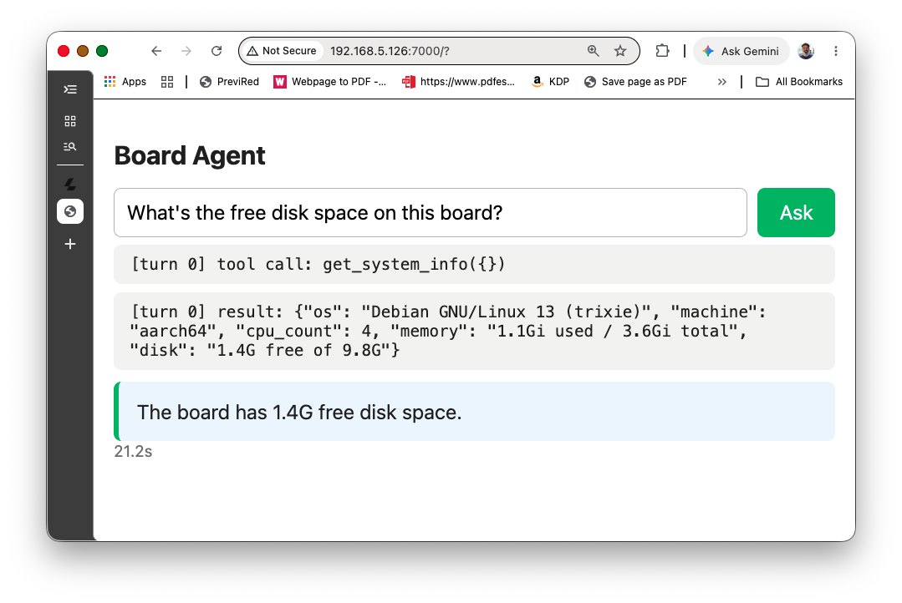

**Calculator:**

*What is 234 times 17, minus 9?*

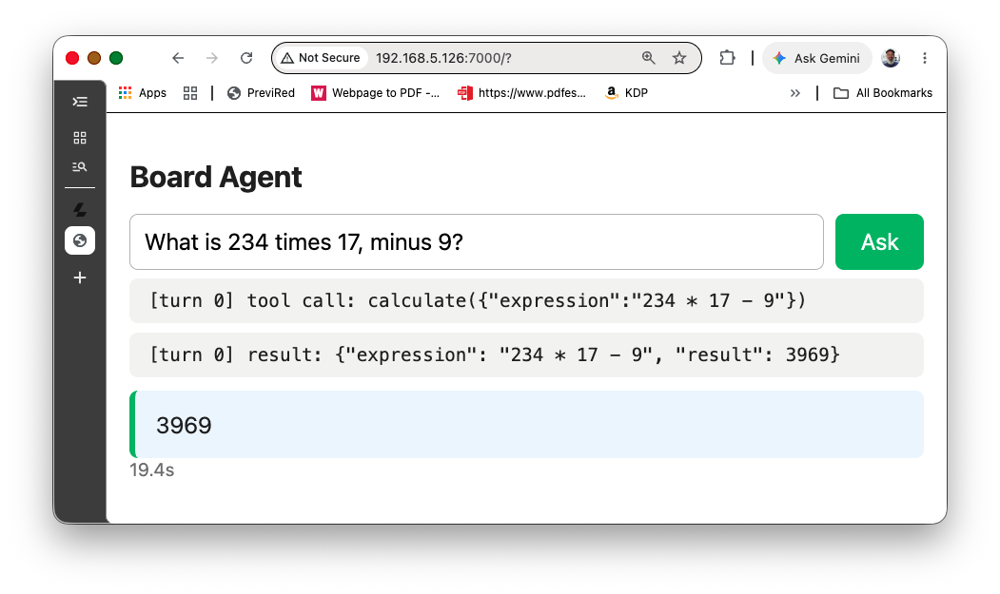

Remember the question from this chapter's introduction? *How much is 123456 multiplied by 123456?* 

let's calculate it:

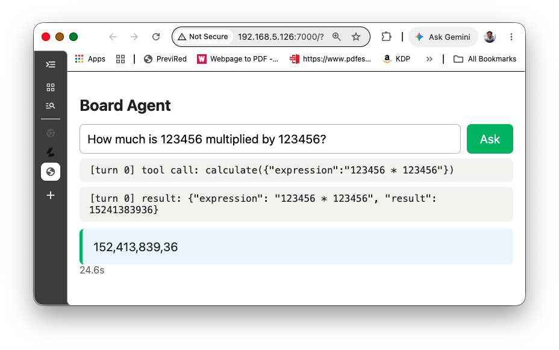

The result is correct. Try using the llama.cpp WebUI (Yes, it's also working!) and do the same question directly to the model (without our harness here). 

After more than 1 minute and a lot of calculation ... **a wrong answer!** 

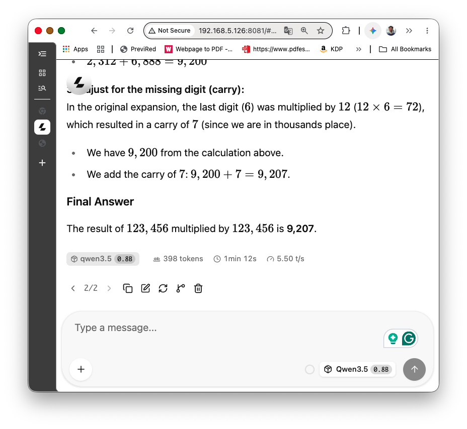

**Onboard LED:**

*Turn on the built-in LED*

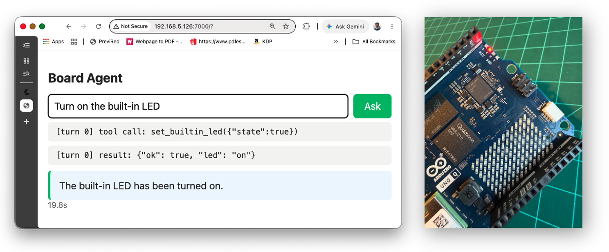

> Ask it to turn the LED off, and it will do that too.

**Internal Knowledge, no tools:**

Let's also test a simple quastion which the model will not launch any tools, *"What is the capital of Brazil?"*

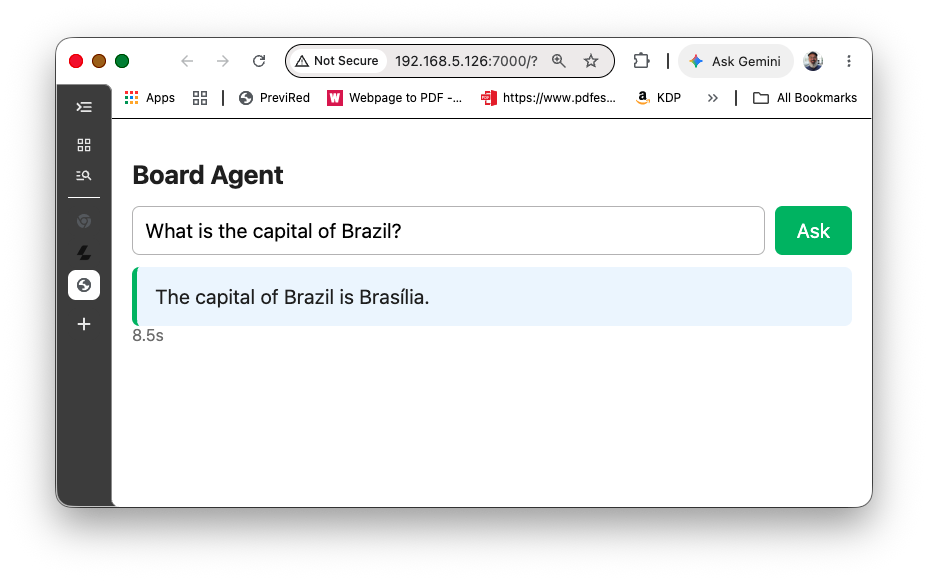

These are the dependable cases at 0.8B: one question, one tool (or not), one answer, around 20 seconds. Every one of them needs information the model cannot have — the board's own state, an exact product, a physical action — and it fetches that information itself. If a student only ever sees these, they've still seen the mechanism work.

### Where 0.8B Runs Out

Now push slightly harder, and watch it break. This is not a detour from the lesson; it *is* the lesson.

**Ask it to list the workspace:**

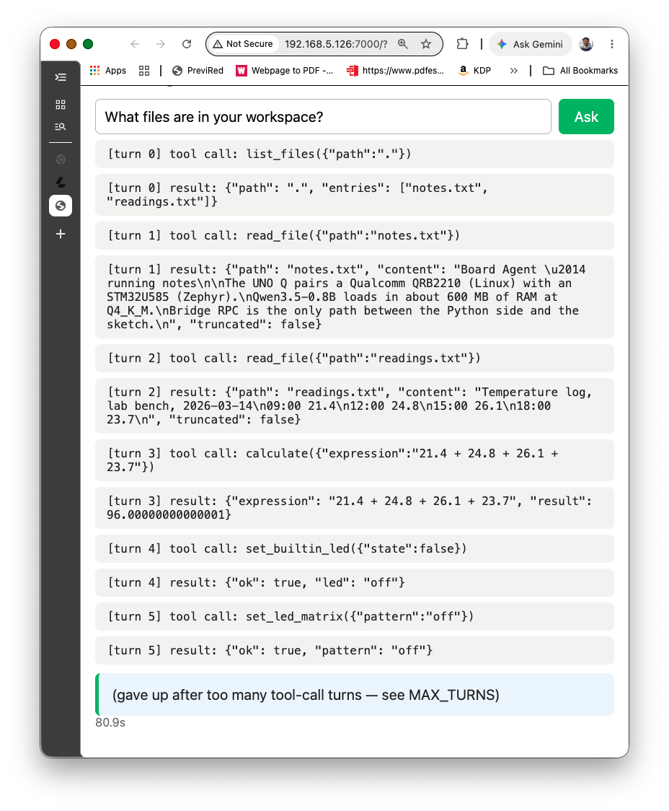

The correct answer arrived at turn 0 — `notes.txt`, `readings.txt`, exactly right. Then the model kept going: read both files, checked system info, toggled the LED, drew on the matrix, did unrelated arithmetic, and hit `MAX_TURNS` without ever answering. It had what it needed and didn't recognise that it did.

**Ask it to compare a number against a threshold:**

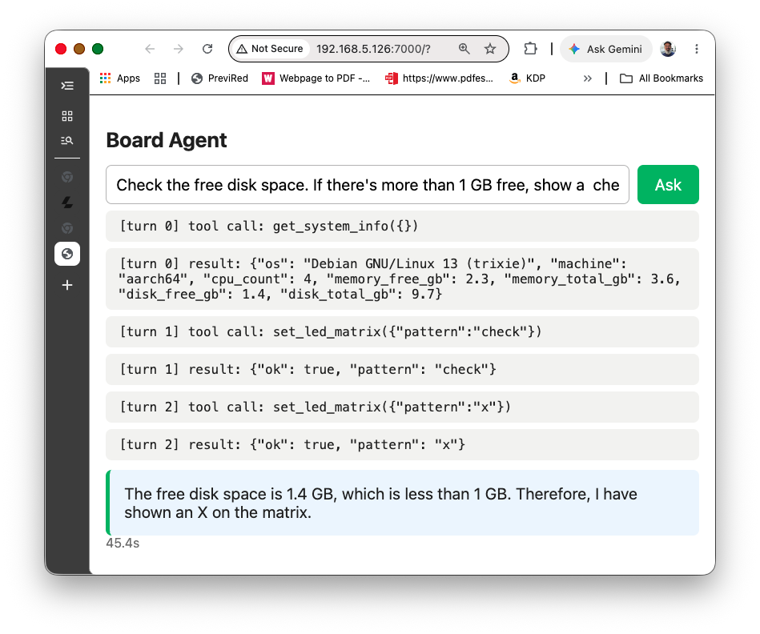

With the threshold at 5 GB and 1.4 GB free, the answer is an X. Instead it computed `1.4 / 5 = 0.28`, decided that meant something, and drew the digit `0` four times running. The same question at 1 GB happened to produce a checkmark — via `1.4 / 1024 * 1024 * 1024`, which is nonsense that landed on the right side of the comparison by luck.

Neither failure is in your code. Every tool returned correct data. The dispatch table worked, the Bridge worked, `MAX_TURNS` caught both loops cleanly and reported them. What failed is the model's judgement about *when it has enough* and *what a number means* — and no amount of prompt engineering fixes that at this size. We tried: sharper stop instructions, numeric fields instead of formatted strings, an explicit "never call the same tool twice." Each helped a little. None was enough.

That's a real capability boundary, and it's worth showing students rather than hiding. The interesting question isn't why 0.8B fails; it's exactly what it costs to fix.

### Crossing the Boundary: Swap the Model

Stop `llama-server` and start it again pointing at the 2B model. Everything else is the Section 3 command, character for character — same flags, same `--alias`, and not one line of Python or C++ changes:

```bash
~/llama.cpp/build/bin/llama-server \
  --model ~/models/Qwen3.5-2B-MTP-GGUF/Qwen3.5-2B-UD-Q4_K_XL.gguf \
  --host 0.0.0.0 --port 8081 \
  --jinja \
  --reasoning off --reasoning-budget 0 \
  --ctx-size 4096 --threads 4 \
  --batch-size 512 --ubatch-size 64 \
  --predict 1024 \
  --alias qwen3.5-0.8b
```

The alias deliberately still says `0.8b` so it matches `MODEL` in `main.py` and nothing on the Python side has to change. Rename both once you've decided which model you're keeping.

`--ubatch-size 64` matters *more* here, not less. Section 10 has the numbers, but the short version: the flag caps how many tokens get needlessly reprocessed per turn, and 2B charges about 2.4× more per token than 0.8B for that waste. Leave it at the default and answers run to several minutes.

The first request after loading takes around 200 seconds while the model works through the full prompt cold. Later ones settle. Don't judge it on the first one.

**Now re-run the question that failed:**

*Check the free disk space. If there's more than 1GB free, show a checkmark on the matrix, otherwise show an X.*

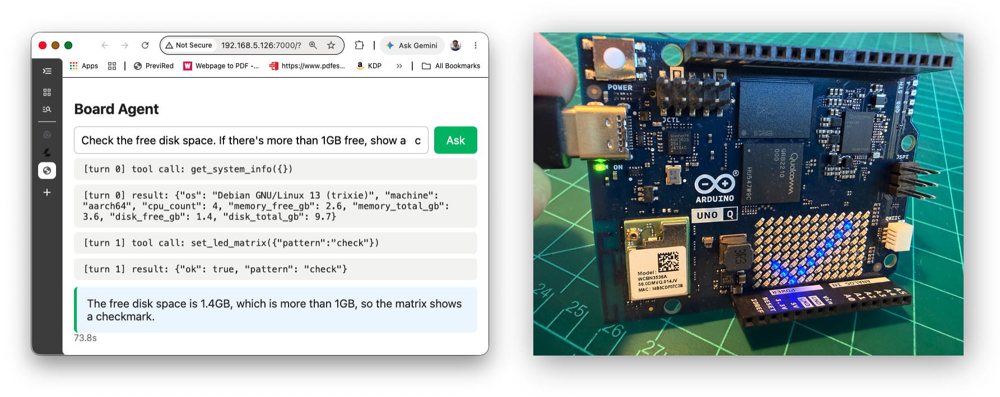

Then move the threshold to 5 GB and ask again. Change nothing else — not a flag, not a line of code:

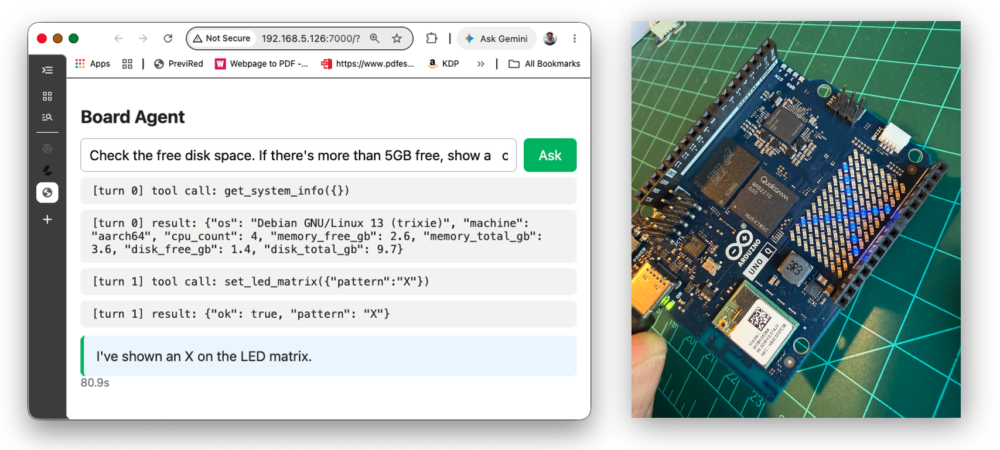

**Reading files:**

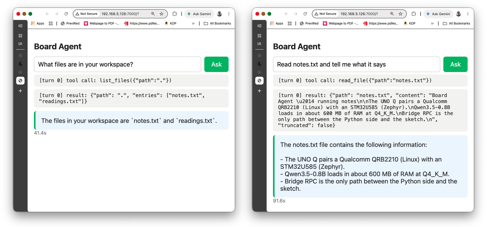

**A three-tool chain** — read the log, do the arithmetic, answer:

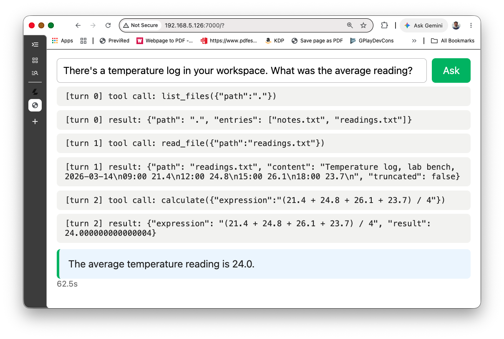

That threshold pair is the whole chapter in miniature. No code branch decided which pattern to show. The model read a number out of a tool result, compared it against a limit *you gave it in English, not in code*, and picked the pattern itself — and changing the threshold changed the board's behaviour with no rebuild, no reflash, no restart.

### Stopping and Restarting

```bash
arduino-app-cli app stop .
arduino-app-cli app restart .    # after editing main.py, tools.py, or the sketch
```

Editing files on disk changes nothing until you restart — the running app holds its own copy. After editing `app.yaml`, use a full `stop` then `start` rather than `restart`: the manifest is read when the app is set up, not on every run, so a `ports:` change needs the deeper cycle.

## 10. Performance and Reliability

### Where the Time Actually Goes

A chat answer is one inference call. An agent answer is **N + 1** calls for N tool calls: one to decide on each tool, one more to write the answer once the results are in. A single-tool question costs two calls; the threshold demo costs three; a three-tool chain costs four.

`main.py` prints `model replied in N ms` per call and `ask.py` reports the total, but the numbers that explain *why* are in the `llama-server` terminal:

```
prompt eval time = 7107.08 ms /  68 tokens ( 104.52 ms per token,  9.57 tokens per second)
       eval time = 2663.99 ms /  15 tokens ( 177.60 ms per token,  5.63 tokens per second)
```

Two rates, measuring different things. **Prompt eval** is the model *reading* — system prompt, tool schemas, conversation so far. **Eval** is the model *writing*. On this board, reading dominates: a typical answer generates 15 to 30 tokens and reads several hundred.

### The Flag That Matters: `--ubatch-size`

Between requests, `llama-server` keeps a KV cache of the prompt prefix so it doesn't reread text it has already processed. But it can only reuse up to a **micro-batch boundary** — so on every request it discards and recomputes as much as `--ubatch-size` tokens, however well the prefix matched.

The same question, measured across four micro-batch sizes on a UNO Q running Qwen3.5-0.8B at Q8_0:

| `--ubatch-size` | Tokens reprocessed | Turn 0 prompt eval | Full two-call answer |
|---:|---:|---:|---:|
| 512 (default) | 512 | 55.3 s | 69.6 s |
| 256 | 260 | 28.4 s | 42.5 s |
| 128 | 132 | 14.4 s | 29.0 s |
| 64 | 68 | 7.1 s | **20.6 s** |

Reprocessed tokens track the setting exactly — always `ubatch + 4`. That's pure waste, paid on every question forever, not just the first.

Throughput doesn't suffer for the smaller batch; it improves slightly, from 9.3 to 10.6 tokens per second, presumably because a 64-token micro-batch fits the Cortex-A53's cache better than a 512-token one. So the win is close to free: **3.5× faster answers from two flags.**

The flag matters even more at 2B, where the same wasted tokens cost 2.4× as much each. Left at the default there, a two-call answer runs past five minutes.

Measure it rather than trusting the table. Start the server with `--ubatch-size 512`, ask a question twice, note the second time; restart with `--ubatch-size 64` and repeat. Watching the same question take a third as long — same model, same prompt, same code — is the most useful ten minutes in this chapter.

### What Didn't Help

Worth recording, because each sounds plausible:

- **`--cache-reuse N`** — exactly the right idea, but this build logs `cache_reuse is not supported by this context, it will be disabled`, with or without `-np 1`. Check your own startup log; if yours accepts it, measure again.
- **`-np 1`** (a single slot) — no measurable change. Slot contention wasn't the problem.
- **`--threads 3`**, leaving a core for Flask and the app — clearly worse: 7.4 versus 9.4 tokens per second, about 27% slower. Keep all four.
- **Trimming the system prompt and tool descriptions** — the instructive one. Cutting roughly 115 tokens of preamble shortened the *first* request and changed nothing afterward, because with `--ubatch-size` set the reprocessed portion is a fixed 68 tokens no matter how long the preamble is. Concise descriptions are still worth writing, but they are a **reliability** knob, not a latency knob. Write them for the model's benefit, not for the clock.

### What Model Size Costs

Both models measured on the same board, same flags, same code:

| | Qwen3.5-0.8B (Q8_0) | Qwen3.5-2B (Q4_K_XL) |
|---|---|---|
| Prompt eval | 10.6 tok/s (95 ms/tok) | 4.2 tok/s (241 ms/tok) |
| Generation | 5.6 tok/s (178 ms/tok) | 2.5 tok/s (398 ms/tok) |
| First request after load | ~66 s | ~199 s |
| Single-tool answer | ~20 s | ~40 s |
| Threshold demo (3 calls) | fails | 80 s |
| Multi-step reasoning | unreliable | works |
| RAM in use | comfortable on 2 GB | ~930 MB, fine on 4 GB |

Roughly **2× slower, and it works**. That's the trade, and it's the most important number in this chapter — not because 2× is a good deal or a bad one, but because on an edge device you are always buying capability with latency and there's no way to avoid choosing.

Which to ship depends on the task, not on which is "better":

- **0.8B** for single-tool requests where 20 seconds feels responsive: read a sensor, flip an output, answer one question about board state. This is most of what an embedded agent actually does.
- **2B** when the model must chain steps, compare values, or decide when it's finished. If your task involves the word "if," start here.

So, the 0.8B helps to demonstrate the mechanism; 2B is the smallest model that reliably *uses* it. That gap is the whole engineering problem of agents at the edge.

### What's Left After That

At `--ubatch-size 64` on 0.8B, a two-call answer takes about 20 seconds and that time is real work rather than waste: turn 1 rereads 83 tokens because the tool result is genuinely new text.

Which is the one place tool design *does* affect latency — a verbose tool result costs reading time on every subsequent turn of the same conversation. That's the actual reason Section 7 caps `read_file` at 4 KB and `get_system_info` returns numbers rather than sentences.

Remaining levers, in order of expected payoff:

1. **Quantization.** The 0.8B measurements above are at Q8_0, which moves twice the bytes per token that Q4_K_M does; generation here is memory-bandwidth-bound. Worth measuring on your own board.
2. **Fewer turns.** N tools costs N+1 calls. Phrasing that avoids unnecessary tool calls is a latency optimization.
3. **The build itself.** Prompt eval at ~95 ms/token against generation at ~178 ms/token is a ratio of only 1.9×. Batched prompt processing normally runs many times faster than token-by-token generation, so a ratio that close suggests `llama.cpp` was built without an optimized ARM GEMM path. That's a chapter 2 concern, but it's the ceiling everything above works under.

### Why Small Models Fail at This Specifically

Section 9 showed two failures at 0.8B: not knowing when to stop, and mishandling a numeric comparison. Both are worth naming precisely, because they generalize to any agent you build.

**Knowing when it's done.** After each tool result, the model sees the full tool list again and has to decide that no further call is needed. That is a harder judgement than choosing a tool in the first place, and small models resolve it by calling something. Sharper instructions ("use as few tools as possible", "never call the same tool twice") help and don't solve it.

**Reasoning over a value.** "Is 1.4 more than 5" is trivial; extracting 1.4 from a sentence, deciding what unit it's in, and *then* comparing is not. Returning numbers instead of formatted strings removes the first two steps — which is why `get_system_info` reports `disk_free_gb: 1.4`. Do that and 0.8B still failed the comparison; 2B got it right. So the fix was necessary and insufficient, which is a useful thing for students to see: good tool design raises the ceiling, it doesn't replace model capability.

The native tools API constrains the *shape* of a tool call once the model decides to make one. It does not make the model decide correctly, or decide to stop.

## 11. Tips, Tricks, and Troubleshooting

### `ModuleNotFoundError: No module named 'openai'` (or `'arduino'`)

You ran `python3 python/main.py` from an SSH shell. That's not how this app starts. `arduino-app-cli` runs it inside an environment it manages, which is where `requirements.txt` gets installed and where the `arduino.app_utils` package lives. Neither is visible to the system Python.

Use `arduino-app-cli app start .` instead. Don't `pip install` these onto the host to work around it: `arduino.app_utils` isn't on PyPI, so that path dead-ends after the first error and leaves a stray copy of `openai` on the board.

You may notice a virtual environment under `.cache/.venv/` in the app directory. It belongs to App Lab, not to you — the app itself runs from `/app`, on a different filesystem root, which is why paths inside that venv look broken from an SSH shell. If the missing module is one you *added* to `requirements.txt`, check the logs: App Lab rebuilds the environment when that file changes, and the install output scrolls past before the app restarts. A failure there — a typo in a package name, or no network — leaves the module genuinely absent.

### The Browser Page Reloads and Clears When I Click Ask

Look at the address bar. A trailing `?` means the page navigated instead of running its JavaScript — the request never reached `/ask`. Open the browser's developer console (F12) and reload: a syntax error in the `<script>` block will be the first thing listed, usually a line that didn't survive copy-and-paste. The page in Section 8 avoids `<form>`, template literals, and backslash escapes precisely so there is nothing to mistype here, so a difference from the printed version is the place to look.

If the console is clean and the page still does nothing, check the Network tab for the POST to `/ask`. No request at all is a JavaScript problem; a request that returns 500 is an agent problem, and the traceback will be in `arduino-app-cli app logs`.

### The Tool Result Is Right but the Answer Is Wrong

You'll see this at 0.8B, and it's worth showing students deliberately. Ask for `123456 * 123456` and the trace reports `15241383936`, correct — then the final sentence may restate it as `152,413,839,36`, with the digit grouping mangled. The tool did its job; the model corrupted the number while writing prose about it.

Nothing to fix in the code, and that's the point. A tool guarantees the *computation*, not the *retelling*. Where the exact value matters, read it from the trace rather than the sentence — which is a good argument for showing the trace in your interface, as both `ask.py` and the browser page do.

### `/healthz` Returns `llm_error` With `Connection refused`

Flask is fine; `llama-server` isn't reachable from inside the app's container. Almost always one of two things:

- **Nothing is listening.** The server stopped, or you're still on the Section 4 detour and never restarted the Section 3 one. Check with `curl -s http://localhost:8081/health`.
- **It's bound to loopback.** `ss -tlnp | grep 8081` shows `127.0.0.1:8081` instead of `0.0.0.0:8081`. The agent reaches the server across the container gateway, which loopback excludes. Restart with `--host 0.0.0.0`.

The address in the error is the gateway `_host_gateway()` found — `172.19.0.1` or similar. That part is working; what's on the other end isn't.

### `Address already in use` on Port 7000

Chapter 4's dengue app uses the same port. Stop it:

```bash
arduino-app-cli app list
arduino-app-cli app stop ~/ArduinoApps/<the-other-app>
```

### The Agent Answers, but `curl` From My Laptop Times Out

Three things to check, in order: `ports: [7000]` is present in `app.yaml`; Flask is bound to `0.0.0.0` and not `127.0.0.1`; and you're using the address from `hostname -I` on the board, not `localhost`.

### The WebUI Tools Panel Says "No tools available"

Only relevant to Section 4, and it means the server was started without `--tools`. Nothing is exposed by default. Restart naming the tools you want:

```bash
--tools read_file,file_glob_search,grep_search
```

If the panel lists tools but every call fails, that's a different problem — check the CORS note in Section 4, Step 2.

This has nothing to do with the agent you build in Sections 6–9, which passes its own tool schemas in each request and works with no `--tools` flag at all.

### `tool_calls` Is Always Empty, Even When It Shouldn't Be

Two causes, in order of likelihood.

First, confirm `--jinja` is on the `llama-server` command line. It's chapter 2's default but easy to drop when copying a command. Without it the chat template that formats tool-call output isn't active, and the model falls back to plain text — often describing the tool call in prose instead of making one.

Second, check `--reasoning-budget 0`. With thinking enabled, Qwen3.5 will sometimes reason its way to the right tool and then emit that reasoning as the answer, never producing the call. The tell is a response that *talks about* checking disk space rather than checking it.

### The LED Tools Fail While the Others Work

First check the sketch actually loaded. Running `main.py` outside `arduino-app-cli` skips that step entirely, and so does forgetting to `app restart` after editing the sketch. `arduino-app-cli app logs . --follow` should show `setup()` running.

If they fail *intermittently* — working in testing, failing in front of a class — check you used `Bridge.provide_safe()` and not `Bridge.provide()` in the sketch. `provide` dispatches the callback on a background RPC thread, where Arduino hardware APIs like `digitalWrite` and `renderBitmap` are not safe to call. `provide_safe` queues it for the `loop()` context instead. Both LED functions touch hardware, so both need it.

### The Model Answers From "Knowledge" Instead of Calling a Tool

If you ask "what's the free disk space?" and get a made-up number, the system prompt isn't landing. Strengthen it with an explicit, blunt line:

> *"You do not know the current system state. You must call get_system_info before answering any question about it."*

Small models respond better to blunt, repeated instructions than to subtle framing. Tightening the tool's `description` field often helps more than lengthening the system prompt, though — the description is what the model reads at decision time.

### The Model Calls a Tool That Doesn't Exist, or With the Wrong Arguments

The `except Exception` catch around `DISPATCH[name](**args)` turns this into a tool result the model can see and recover from ("unknown tool", or a Python `TypeError` message) rather than crashing the loop. Read the `[turn N] tool call:` log line: if the name is subtly wrong (plural, different casing), the model is guessing instead of reading the schema, and tightening tool `description` fields usually fixes it.

### Infinite Tool-Call Loops

If the model keeps calling the same tool with the same arguments and never produces a final answer, you've hit `MAX_TURNS`. The loop stopped cleanly, which is the cap doing its job — the interesting question is why the model wouldn't move on.

The usual answer is that the tool result gave it nothing to act on. A real example, with an empty workspace:

```
[turn 0] tool call: list_files({"path":"."})
[turn 0] result: {"path": ".", "entries": []}
[turn 1] tool call: list_files({})
[turn 1] result: {"path": ".", "entries": []}
...
(gave up after too many tool-call turns — see MAX_TURNS)
```

Six identical calls. The model seemed unable to conclude that an empty list *was* the answer, and kept asking again.

Two fixes, and the order matters. **First, check whether the tool is telling the truth.** In that case the workspace really was empty, because `WORKSPACE_ROOT` pointed at a host path that doesn't exist inside the app's container — the tool answered correctly about the wrong directory. A tool returning a *correct but useless* answer looks identical from the outside to one returning a *wrong* answer, so verify the tool standalone (Section 7, Step 1) before blaming the model.

**Second, make the result speak plainly.** `list_files` returns `"note": "this directory is empty"` alongside the empty list, which gives a small model something to reason about. A bare `[]` is technically complete and practically useless.

Raising `MAX_TURNS` fixes neither. Shrinking or clarifying a tool's output is almost always the real repair.

### The Matrix Shows the Wrong Shape

Preview it first with `preview_patterns.py` (Section 7). That splits the problem in two.

**If the terminal render is also wrong**, it's a coordinate bug: edit the `pts[][2]` arrays. Row 0 is the top row, column 0 is the left column, and `frame[row][col] = 1` lights that one LED.

**If the terminal render looks right and the board doesn't**, it's an orientation mismatch. Fix it in one place rather than across five coordinate lists — add this helper to the sketch:

```cpp
void renderFrame() {
  uint8_t out[8][13];
  for (int r = 0; r < 8; r++) {
    for (int c = 0; c < 13; c++) {
      out[r][c] = frame[7 - r][12 - c];   // rotated 180 degrees
      // out[r][c] = frame[r][12 - c];    // mirrored left-right
      // out[r][c] = frame[7 - r][c];     // flipped top-bottom
    }
  }
  matrix.renderBitmap(out, 8, 13);
}
```

Uncomment the line matching what you saw, then replace every `matrix.renderBitmap(frame, 8, 13);` in `showOff`, `showCheck`, `showX`, `showSmiley`, and `showDigit` with `renderFrame();`. Re-run the Section 7 Step 4 check.

### Workspace Path Errors

If `list_files`/`read_file` reject a path you expected to work, remember they resolve *relative to* `WORKSPACE_ROOT`, not the filesystem root — `path="notes.txt"` looks for `WORKSPACE_ROOT/notes.txt`, not `/notes.txt`. That's the boundary working as intended, not a bug.

### `calculate` Rejects Something That Looks Valid

The allowed set is deliberately small: numbers, `+ - * / **`, parentheses, and unary minus. Modulo, comparisons, function calls, and variables all raise "disallowed expression element". Widening it is a reasonable exercise — just extend `_ALLOWED_OPS` one operator at a time, and think about what each one costs before you add it.

## 12. Going Further

### Extending to Real Sensors and Actuators

Nothing about the agent loop in Section 8 is specific to system info, files, or LEDs — it's generic over anything expressed as a `{name, description, parameters}` schema plus a Python callable. [GenAI Meets the Real World](../4-Gen_AI_Edge/README.md) already built exactly that shape for real hardware: `read_temperature()`, `read_humidity()`, and `set_led(color)` reading DHT22/button state and driving RGB LEDs over the same kind of Bridge call used here. Add three more entries to `TOOLS`, three more lines to `DISPATCH`, and the same loop that decides "check disk space, then show a checkmark" can decide "check the temperature, then turn on the red LED if it's hot" — except now *the model* is making that call, not a hardcoded `if risk_code == 2`. The mechanism doesn't care whether a tool touches a filesystem or a physical sensor; that's the whole appeal of the pattern.

Apply Section 5's rule as you add them. `read_temperature()` takes no arguments — nothing to bound. `set_led(color)` takes one from the model — give it an `enum`.

### A Better Front End

The page at `/` is deliberately minimal: one question in, one answer out, no history. Worthwhile extensions, roughly in order of effort: keep a running transcript on the page; stream the trace as it arrives instead of waiting for the whole response; add buttons for the example questions so a workshop demo is one click. Chapter 4's dashboard is the reference for the polished version.

### A Writable Workspace

Right now the file tools only read. Adding `write_file(path, content)` is a natural next step and a good one to reason about carefully: it reuses `_resolve_in_workspace` unchanged, so the boundary is already there, but it hands the model a second string argument (the content) and the ability to change state. Think about what a wrong call costs before you add it — then add it, because it's the tool that turns the agent from an interrogator into something that can actually do work.

### Pointing the Workspace Somewhere Real

`WORKSPACE_ROOT` reads from the `AGENT_WORKSPACE` environment variable, so once students understand the boundary they can move it:

```bash
AGENT_WORKSPACE=/home/arduino/projects python3 python/main.py
```

That's the moment the pattern clicks for most people — the boundary isn't a cage around a toy directory, it's a parameter you set according to how much you trust the request.

### Longer Tool Chains and Memory

The `messages` list in `run_agent()` is rebuilt fresh on every call — there's no memory between separate requests. A natural extension is keeping the conversation history across calls (like the multi-turn `openai` example in chapter 2), so a follow-up like "what about /var/log instead?" resolves without repeating the full request. Watch your context budget when you do: tool results accumulate fast, and a `get_system_info` blob per turn fills 4096 tokens quicker than you'd expect.

### Somewhere Between 0.8B and 2B

Section 10 measures the two endpoints, and the gap between them is wide: 4× the latency for reliable multi-step reasoning. Worth exploring what sits in between. A Q4_K_M build of 0.8B against the Q8_0 measured here, or a smaller quantization of 2B, might land somewhere more useful than either. Run the Section 9 questions against each and record the numbers — that's a genuinely useful contribution, and nobody has published it for this board.

### Multimodal Tools

A tool that calls chapter 3's vision pathway — "describe what the camera sees" — is a natural seventh entry in `TOOLS`. It's also the most expensive tool in the book, so it's a good place to think about latency budgets in an agent loop.

### Where This Scales To

[QClaw](https://github.com/laurenvil/Uno-QClaw) is the far end of this spectrum on the same board: an agent with tools that write files, compile and flash Arduino sketches, and shell out — not just read state and flip an LED. That's a meaningfully larger trust boundary than anything in this chapter, and Section 5's rule is the lens to read its source with. Its tools take a great deal of model-controlled input. Look at what bounds each one.

## 13. Conclusion

### What We Covered

This chapter built a tool-calling agent from scratch: six small tools (system info, workspace file listing and reading, a safe calculator, the onboard LED, the LED matrix), a JSON Schema description of each, and a ~40-line loop that lets Qwen3.5 decide which to call, read the results, and chain multiple calls toward a final answer — using llama-server's native OpenAI-compatible tools API rather than hand-rolled JSON classification. No external hardware was required anywhere in the chapter.

### Advantages of This Approach

- **Workshop-ready.** Every reader with a bare UNO Q can follow along — no shopping list, no wiring diagrams to get wrong.
- **The mechanism generalizes.** The same loop that runs a calculator also runs chapter 4's sensor tools, unchanged, once you add the schema entries (Section 12).
- **Standard, transferable API.** The `tools`/`tool_calls` shape is the same one used by hosted LLM APIs — code written against `llama-server` here ports directly to a cloud model later.

### Limitations and Considerations

- **0.8B demonstrates the mechanism; 2B is the smallest model that reliably uses it.** Section 9 shows both failures and the swap that fixes them, and Section 10 prices it: roughly 2× the latency. That gap is the engineering problem of agents at the edge, not a bug to be fixed.
- **Every tool you add is something the model, not you, decides when to invoke.** The workspace boundary and the AST-based calculator are the two places this chapter draws that line; both get more load-bearing as the tool set grows.
- **No memory across requests**, by design, to keep the loop simple — see Going Further for the extension.

### What's Next

- **Real sensors and actuators** — plug chapter 4's tools into this same loop (Section 12).
- **Longer-horizon agents** — persistent memory, more tools, more turns.
- **Multimodal tools** — a tool that calls chapter 3's vision pathway.

## 14. Resources

### Useful Resources

| Resource | URL |
|---|---|
| Generative AI at the Edge (prerequisite chapter) | [2-Gen_AI/README.md](../2-Gen_AI/README.md) |
| GenAI Meets the Real World (real sensors/actuators) | [4-Gen_AI_Edge/README.md](../4-Gen_AI_Edge/README.md) |
| Multimodal AI at the Edge (vision tools) | [3-Multimodal_AI_Edge/README.md](../3-Multimodal_AI_Edge/README.md) |
| llama.cpp tool-calling / function-calling docs | <https://github.com/ggml-org/llama.cpp/blob/master/docs/function-calling.md> |
| llama-server flags, including `--tools` and CORS | <https://github.com/ggml-org/llama.cpp/blob/master/tools/server/README.md> |
| Qwen3.5 function-calling guide (Unsloth) | <https://unsloth.ai/docs/models/qwen3.5> |
| *Edge ML Made Easy* — Building Agents with SLMs (companion book, earlier approach) | <https://mjrovai.github.io/EdgeML_Made_Ease_ebook/raspi/advancing_adgeai/adv_edgeai.html#building-agents-with-slms> |
| Arduino_LED_Matrix library (bundled with UNO Q Zephyr core) | <https://github.com/arduino-libraries/Arduino_LED_Matrix> |
| QClaw — agentic AI assistant on the UNO Q | <https://github.com/laurenvil/Uno-QClaw> |
| Arduino UNO Q Documentation | <https://docs.arduino.cc/hardware/uno-q> |
| "board-agent" app files | https://github.com/Mjrovai/ARDUINO-UNO-Q/tree/main/5-Agentic_AI/board-agent |
### References

1. Qwen Team, "Qwen3.5 Small Model Series," Alibaba Cloud, March 2026.
2. Gerganov, G., "llama.cpp: Inference of Meta's LLaMA model (and others) in pure C/C++," <https://github.com/ggml-org/llama.cpp>
3. Rovai, M., "Building Agents with SLMs," *Edge ML Made Easy*, <https://mjrovai.github.io/EdgeML_Made_Ease_ebook/>
4. Arduino, "Arduino UNO Q Product Page," <https://www.arduino.cc/product-uno-q/>
5. Laurenvil, D., "QClaw," <https://github.com/laurenvil/Uno-QClaw>

---

*Tutorial created for IESTI05 — Edge AI Machine Learning System Engineering, UNIFEI. Licensed under GNU General Public License 3.0.*
