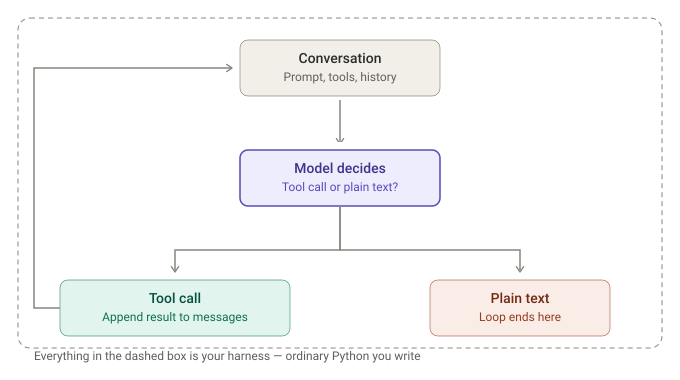
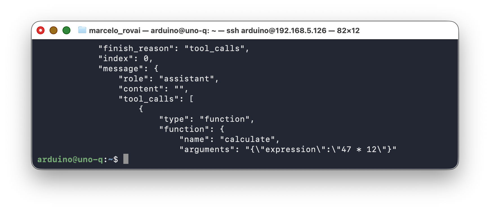
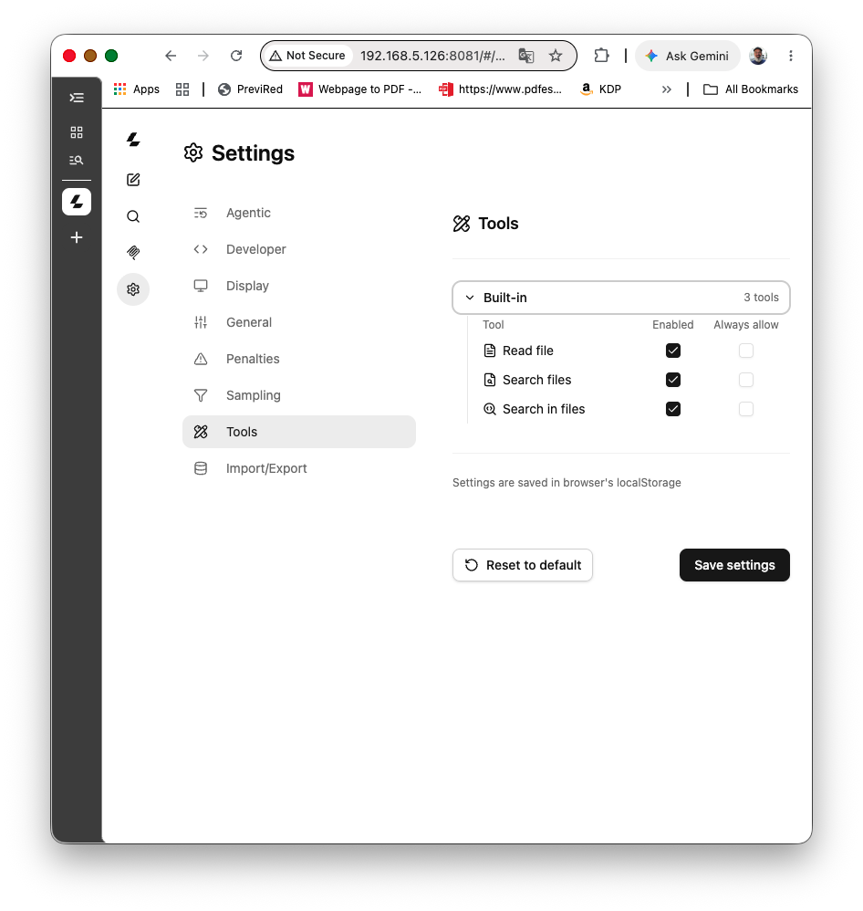
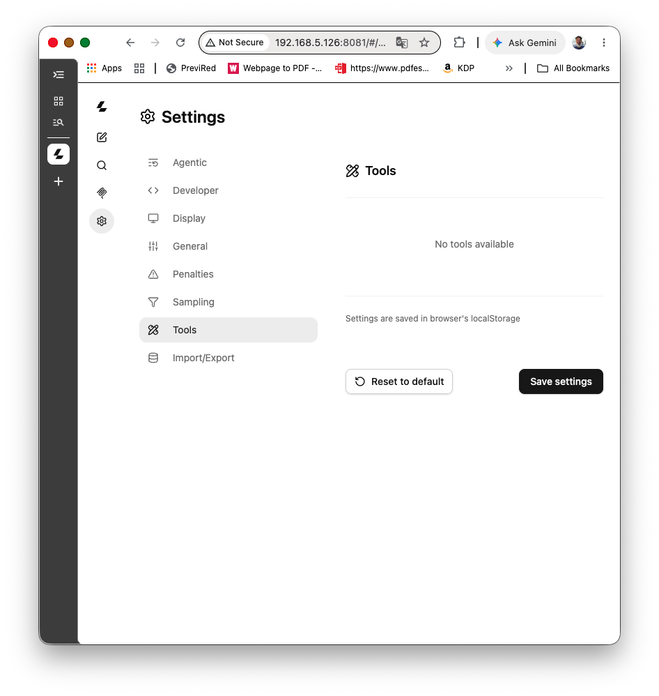
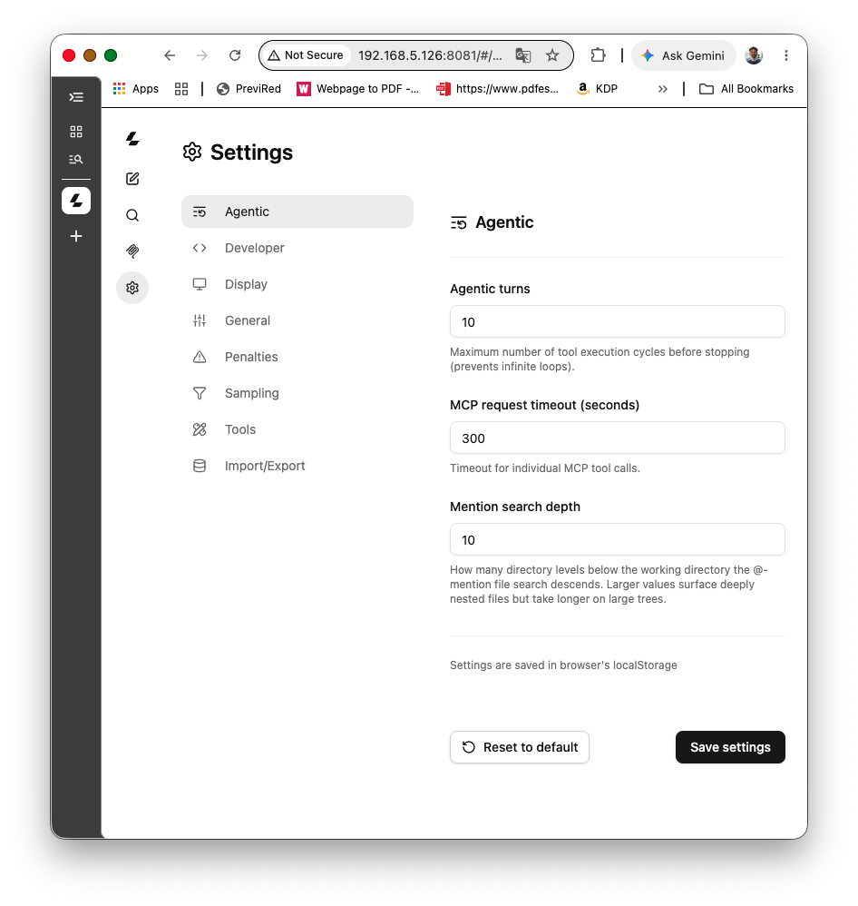
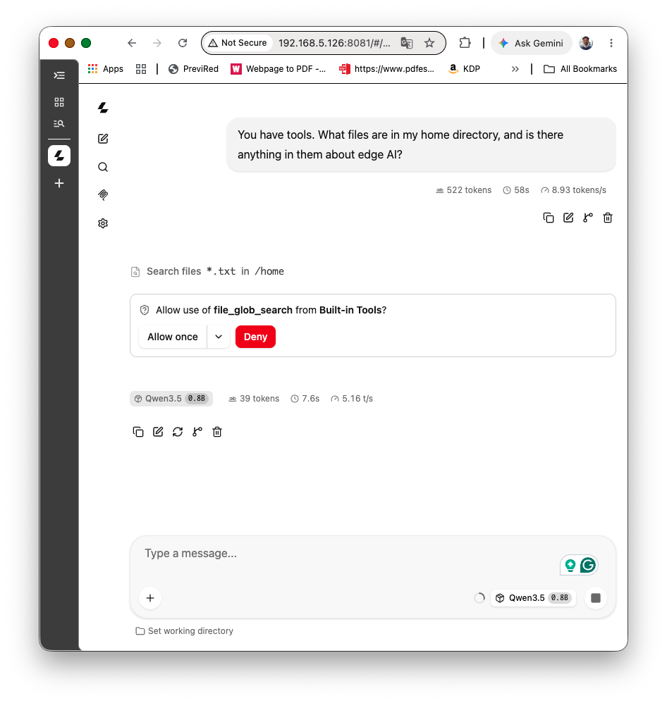
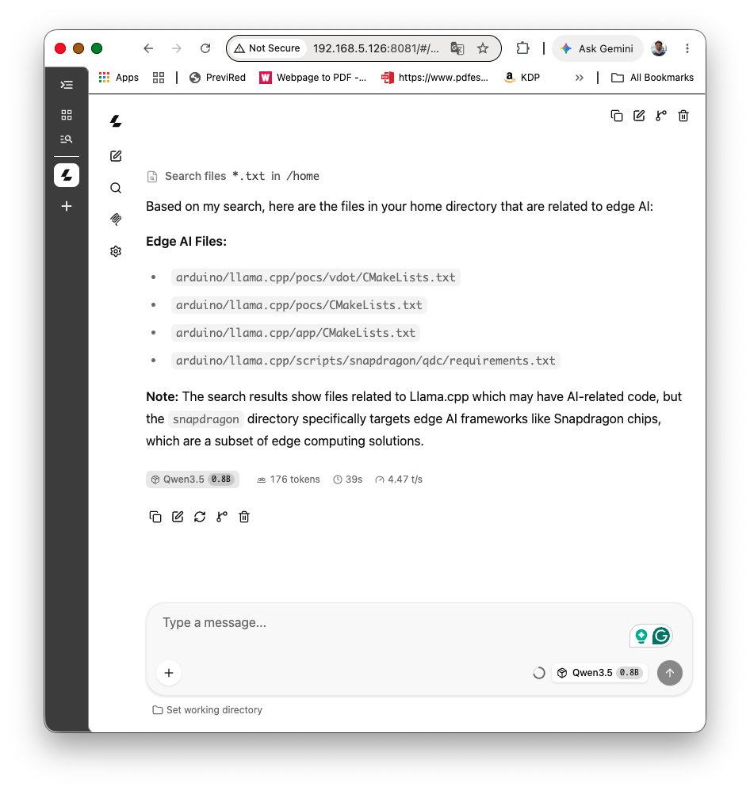
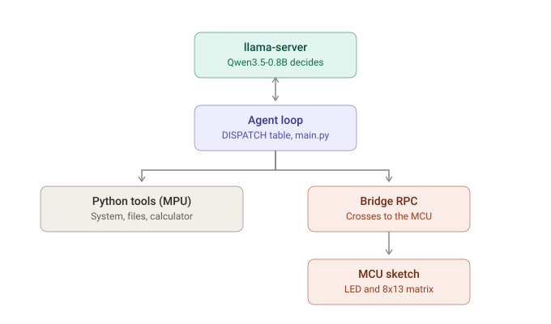

# Agentic AI at the Edge:

Giving a Small Model Tools


---

## 1. Introduction

### What This Tutorial Covers

Every previous chapter gave the SLM a fixed job: classify these three numbers, describe this image. The model reasoned, but it never *decided what to do*. This chapter changes that. You'll give Qwen3.5 a small set of **tools** — functions it can choose to call — and let it decide, on its own, which ones to use and in what order to satisfy a plain-language request.

Here's the shape of what you're building toward, taken from a real session in Section 9:

```
> Check the free space on /home. If there's more than 1GB free, show a
  checkmark on the matrix, otherwise show an X.
[turn 0] tool call: get_system_info({})
[turn 1] tool call: set_led_matrix({'pattern': 'check'})
There's 14 GB free, well over 1 GB, so I've shown a checkmark on the matrix.
```

No `if` statement in your code chose that checkmark. You gave the model a threshold in English, it fetched a number it couldn't have known, compared the two, and acted on the result.

The tools are deliberately ordinary: ask the board what OS it's running, do some arithmetic, list a few files, blink the built-in LED, draw a pattern on the onboard 8×13 LED matrix. None of it requires a single wire. That's on purpose — this chapter should run in any room, on any UNO Q, with nothing attached, which makes it the one to reach for in a workshop where you can't guarantee everyone has a breadboard.


The mechanism is llama-server's native, OpenAI-compatible **tool-calling API** (`tools=[...]` in the request, `tool_calls` in the response) — the same interface real cloud LLM APIs use, not a custom prompt-and-parse scheme. If you've read the "[Building Agents with SLMs](https://mjrovai.github.io/EdgeML_Made_Ease_ebook/raspi/advancing_adgeai/adv_edgeai.html#building-agents-with-slms)" chapter of the companion [Edge AI Engineering](https://mjrovai.github.io/EdgeML_Made_Ease_ebook/) book, that example routed a query through hand-written JSON classification, then called the numbers found in it — a technique the book itself flags as fragile (models struggle to reliably format the classification JSON, especially at 1B and below). The native tools API doesn't eliminate that fragility at small model sizes, but it puts the parsing burden on llama.cpp's grammar-constrained decoding instead of on hopeful prompt engineering, and it's the same shape of code you'd write against a hosted model.

By the end of this chapter you'll have a small, hardware-free agent you can talk to from a terminal, watch it decide which tool to call and why, and see it act — on the board's own files, its own vitals, and its own LEDs.

### Prerequisites

This tutorial assumes you have completed:

- [Setup](../1-Setup/README.md) — headless SSH access to the board.
- [Generative AI at the Edge](../2-Gen_AI/README.md) — `llama.cpp` built from source, a Qwen3.5-0.8B GGUF downloaded, and comfort running `llama-server` and calling it from Python with the `openai` client library.

Deliberately **not** required: [Multimodal AI at the Edge](../3-Multimodal_AI_Edge/README.md) or [GenAI Meets the Real World](../4-Gen_AI_Edge/README.md). Nothing here depends on vision or on external sensors — that's the point. Section 12 shows how those chapters' tools plug into this same agent loop later, once you want them.

> If chapter 2 is unfamiliar, work through it first — this chapter reuses its `llama-server` setup and its `openai`-client patterns without repeating them.

## 2. What Makes This "Agentic"?

The word gets thrown around loosely. Pinned down, an agent is a model that does three things a plain chat model doesn't.

**It decides whether to act at all.** Ask "What's the capital of Brazil?" and the right move is to answer from what it already knows — no tool needed. Ask "How much free disk space is there?" and it can't know: that answer lives on your board. The model has to call a tool and read the result back.

**It picks the tool and fills in the arguments.** You hand it a list of available tools and their schemas; it chooses. You never write `if "disk" in prompt: get_system_info()`. That branch is the model's job now.

**It looks at the result and decides what comes next.** Another tool call, or a final answer. And the decision chains — that's what the trace in Section 1 shows: call `get_system_info`, pull the number out of the returned JSON, compare it against 1 GB, and only then choose which pattern to draw. Two model turns with a comparison in between that nobody hardcoded.

Chapter 4's `classify()` does none of this. It always reads three sensor values, always calls the model exactly once, always with the same prompt shape. That's a **pipeline**: deterministic, fast, and exactly right for its job — you don't want a dengue-risk classifier wandering off to check the disk. What follows is different in kind. It's a **loop**:



Two things that diagram doesn't show, and both trip people up on the first read:

- **The model never runs anything.** It emits a request — a function name and a JSON blob of arguments — then stops and waits. Your Python does the actual work and hands the output back. Nothing executes unless you execute it, which is also where every safety check you care about belongs.
- **Nothing guarantees the loop terminates.** A confused model can call `get_system_info` five times in a row. You'll cap the iterations in Section 8 (`MAX_TURNS`) and break out with a message rather than trusting it to stop on its own.

This is the same loop that sits under every "agent framework" you've heard of — LangChain agents, OpenAI's Assistants API, and the rest. They wrap it in retries, memory, and orchestration, but the cycle above is the whole mechanism. Writing it yourself, in about 40 lines of Python, is the point of this chapter: once you've built the loop by hand, there's nothing left to demystify.

### The Native Tools API vs. Hand-Rolled Classification

llama-server exposes an OpenAI-compatible `tools` parameter on `/v1/chat/completions`. You describe each tool as a JSON Schema (name, description, parameter types); the server constrains decoding so the model's function-call arguments come back as valid, parseable JSON rather than prose the model might format inconsistently. Compared to the classify-then-route pattern from the Raspberry Pi book chapter — where the model had to freehand a JSON object like `{"type": "multiplication", "numbers": [7, 8]}` and the code hoped it got the shape right — the native API moves that structural guarantee into the inference engine itself. It doesn't fix everything (Section 10 has the honest version of what still goes wrong at 0.8B), but it removes one whole category of failure.

Qwen3.5 supports this function-calling format natively (chapter 4's Going Further section flagged this same capability for a different use). It needs the chat template active — the `--jinja` flag you've used since chapter 3 — since tool-call formatting is part of the model's chat template, not a separate code path.

## 3. Hardware and Software Requirements

### Hardware

- Arduino UNO Q (2 GB or 4 GB — this chapter's models are small enough that either works; see [chapter 2](../2-Gen_AI/README.md#candidate-models) for the size/quality tradeoffs).
- USB-C data cable.
- Host computer with SSH.

**Nothing else.** No breadboard, no sensors, no external LEDs — every tool in this chapter uses either the Linux filesystem/CLI or the UNO Q's own onboard LED and LED matrix.

### Software (already on the UNO Q from earlier chapters)

| Tool | Purpose |
|---|---|
| `llama.cpp` built from source, Qwen3.5-0.8B GGUF | From [chapter 2](../2-Gen_AI/README.md) |
| `llama-server` reachable at `localhost:8081` | Foreground (chapter 2) or systemd service (chapter 4) — this chapter doesn't care which |
| `openai` Python client | From chapter 2 |
| `arduino-app-cli` | Build/run dual-brain apps |

### Software (installed in this chapter)

Nothing new on the Python side — `openai` from chapter 2 is all this needs. The one addition is on the MCU side: the `Arduino_LED_Matrix` library, which is bundled with the UNO Q's Zephyr core and needs no separate install.

### Server Flags That Matter Here

Start `llama-server` the way chapter 2 taught, with two flags this chapter depends on:

```bash
~/llama.cpp/build/bin/llama-server \
  --model ~/models/Qwen_Qwen3.5-0.8B-Q8_0.gguf \
  --host 0.0.0.0 --port 8081 \
  --jinja \
  --ctx-size 1024
  --reasoning off \
  --reasoning-budget 0 \
  --alias qwen3.5-0.8b
```

- `--jinja` activates the chat template. Tool-call formatting lives *inside* that template, so without this flag `tool_calls` comes back empty every time and the model describes its intended tool call in prose instead of making one.
- `--reasoning-budget 0` disables Qwen3.5's thinking traces. Thinking and tool-calling interact badly at this size: the model spends its token budget reasoning about which tool to call, then emits the reasoning as the answer instead of the call. You used the same flag in chapters 3 and 4 for the same reason. 

Verify both before writing any code:

```bash
curl -s http://localhost:8081/v1/chat/completions -H 'Content-Type: application/json' -d '{
  "model": "qwen3.5-0.8b",
  "messages": [{"role":"user","content":"What is 47 times 12?"}],
  "tools": [{"type":"function","function":{
    "name":"calculate",
    "description":"Evaluate an arithmetic expression.",
    "parameters":{"type":"object","properties":{
      "expression":{"type":"string"}},"required":["expression"]}}}]
}' | python3 -m json.tool | grep -A5 tool_calls
```



If you see a `tool_calls` block with a `calculate` function and an `expression` argument, the server is configured correctly. If you get plain text instead, fix that before continuing — everything downstream depends on it.

Note that this command has no `--tools` flag, and doesn't need one. `--tools` controls llama.cpp's own *built-in* tools, which only Section 4 uses. The agent you build from Section 6 onward supplies its own tools in the request body, so the server never needs to know about them in advance.

## 4. First Contact: Agentic Mode in the Built-in WebUI

Before writing a line of Python, it's worth seeing an agent loop run with zero code. Recent llama.cpp builds ship a set of built-in tools the model can call from the server's own WebUI — the same interface you opened in chapters 2 and 3 for chat. This is the fastest way for a room full of students to *see* tool-calling happen, watch each decision, and approve or reject it in real time, before anyone opens an editor.

> In chapters 2 and 3's WebUI sections, this book told you to leave the built-in agent tools switched off. This section is where that changes — deliberately, briefly, and with the reasoning made explicit. Read the safety note at the end before your next session.

### Step 1 — Ask Your Build What It Has

The built-in tool set is marked experimental upstream, and the list has changed several times. Don't trust the one printed below — ask the binary you built:

```bash
~/llama.cpp/build/bin/llama-server --help | grep -A6 -- '--tools'
```

On a build from around this writing:

```
--tools TOOL1,TOOL2,...   experimental: whether to enable built-in tools for AI
                          agents - do not enable in untrusted environments
                          (default: no tools) specify "all" to enable all tools
                          available tools: read_file, file_glob_search,
                          grep_search, exec_shell_command, write_file,
                          edit_file, apply_diff, get_datetime
```

Read the default again: **no tools**. Nothing is exposed unless you name it on the command line. Some builds also ship `get_info` (board vitals), and most now offer a `-ag, --agent` shortcut that switches on every tool plus the MCP CORS proxy in one go. Convenient, and exactly the wrong choice for a classroom — you'd be handing the model a shell before anyone has seen it call a single tool.

### Step 2 — Start the Server With Read-Only Tools Only

Stop the server if it's running, and restar,t it naming three tools explicitly:

```bash
~/llama.cpp/build/bin/llama-server \
  --model ~/models/Qwen_Qwen3.5-0.8B-Q8_0.gguf \
  --host 0.0.0.0 --port 8081 \
  -c 4096 -t 4 -n 1024 \
  --jinja \
  --tools read_file,file_glob_search,grep_search \
  --alias Qwen3.5-0.8B
```

> In the WebUI, you should turn reasoning `Off`, on the `+` menu. 

Here's the full set and why three of them made the cut:

| Tool | What it does | This pass? |
|---|---|---|
| `read_file` | Reads any file the `arduino` user can read | Yes |
| `file_glob_search` | Finds files by name pattern | Yes |
| `grep_search` | Searches inside file contents | Yes |
| `get_datetime` | Returns the current date and time | Harmless; optional |
| `write_file` | Creates or overwrites a file | Step 6 |
| `edit_file`, `apply_diff` | Modifies existing files in place | No |
| `exec_shell_command` | Runs arbitrary shell commands | Not in a workshop |

The server now exposes those three and nothing else. The others aren't merely switched off — as far as the browser is concerned, they don't exist.

> **If the WebUI stops working when you add `--tools`**, you've hit the CORS default. Several builds clamp `--cors-origins` to localhost when tools are enabled, on the reasoning that a server handing out file access shouldn't accept requests from arbitrary origins. You're reaching the board at its LAN address, not localhost, so the origins won't match. Either name your origin explicitly (`--cors-origins http://<UNO_Q_IP>:8081`) or use the SSH tunnel from the safety note below and browse `http://localhost:8081`. The tunnel is the better habit.

### Step 3 — Open the WebUI and Read the Tools Panel

Open the WebUI, click the gear icon (**Settings**), then **Tools** in the left-hand list. You should see the three tools you named, each with its own **Enabled** and **Always allow** checkboxes.



If instead you see this:



...the server was started without `--tools`. That's the most common stumble in this section, and it's a productive one, because it shows where the control actually lives:

- **The command line is the boundary.** `--tools` decides what exists.
- **The panel is a view onto that list**, plus per-browser convenience toggles. Look at the line under the tool list: settings are saved in the browser's localStorage. Clear your browser data and the checkboxes reset; the server's allow-list doesn't move.

A student who only ever sees the checkboxes will come away believing the browser grants permissions. It doesn't. Hold onto that distinction — Section 5 builds the same idea from the other direction.

### Step 4 — Set the Agentic Limits

Click **Agentic** in the same Settings list:



- **Agentic turns** — the same idea as the `MAX_TURNS` cap you'll build by hand in Section 8: a hard stop on how many tool-call cycles run before the server gives up. The default (often 10) is fine to start.
- **MCP request timeout** — how long a single tool call may take before it's abandoned.
- **Mention search depth** — how many directory levels the file-search tools will descend.

### Step 5 — Watch It Work

Try a prompt that can't be answered from the model's own knowledge:

> *"What files are in my home directory, and is there anything in them about edge AI?"*

Watch the chat. A confirmation card appears asking to run a specific tool with specific arguments *before* it executes. 



Approve it, watch the result stream back into the conversation, and see whether the model needs a second call — it likely will, one to list files and one to search inside them — before it gives you a final answer.



That's Section 2's loop diagram happening in front of you, one approved step at a time. Point at it while it runs: send, decide, call, feed the result back, decide again.

### Step 6 — Give It a Writing Tool, On Purpose

Stop the server and restart it with one more tool:

```bash
--tools read_file,file_glob_search,grep_search,write_file
```

Then ask:

> *"Create a file called notes.txt in my home directory with a two-line note about edge AI."*

Approve the write, and confirm from a terminal: `cat ~/notes.txt`.

Notice what that took: stopping the process and restarting it. You could not have granted this from the browser. That friction is the feature — expanding what an agent can reach is a deliberate act with a record of it in your shell history, not a checkbox someone clicks while distracted.

### The Safety Note

Two layers of control here, and it's worth being precise about what each one is worth.

**The `--tools` allow-list is the boundary.** It's enforced by the server process, it applies to every client including scripts hitting the API directly, and changing it requires restarting the server.

**"Always allow" is a second line of defence.** Unchecked, every call waits for a human. Checked, that tool fires immediately. Keep it off for anything that writes or executes — an unattended `write_file` loop is a bad way to learn this lesson. But remember it lives in browser localStorage: it protects you at the keyboard, not the server.

Three things to be clear-eyed about:

1. **These tools have no directory restriction.** `read_file` will read anything the `arduino` user can read — no root, no allow-list of paths. That's the sharpest contrast with what you'll build in Section 7, where the file tools resolve every path against a fixed workspace.
2. **`exec_shell_command` runs with your full user permissions.** There's nothing between a confused model and a destructive command except the confirmation card. It has a place in an advanced demo; it has no place in a first workshop.
3. **`--host 0.0.0.0` is fine on a network you control** — the board is headless, so there's no other way to reach the WebUI from a laptop browser, and that's the trust level chapters 2–4 already assume. On an untrusted network it stops being safe: anyone who can reach `/v1/chat/completions` can drive the same tools through the raw API, and the confirmation card only exists in the WebUI. A script hitting the API directly gets no such prompt. There, bind to `127.0.0.1` and tunnel:

```bash
ssh -L 8081:127.0.0.1:8081 arduino@<UNO_Q_IP>
# then open http://localhost:8081/ on your laptop
```

That's the trade this section makes on purpose: broad, unscoped tools running with your full permissions, in exchange for zero setup. The rest of the chapter builds the opposite — six narrow, purpose-built tools, each scoped to exactly what it needs, so every permission the agent has is one you wrote and can account for. Seeing both ends of that spectrum in one session is the point.

## 5. Designing the Tool Set

Six tools, each small enough to reason about in one read:

| Tool | Description | Runs on | Model-controlled arguments |
|---|---|---|---|
| `get_system_info()` | OS, CPU, RAM, disk | MPU (Python, `subprocess`) | None |
| `list_files(path)` | List files in a directory | MPU (Python) | A path string |
| `read_file(path)` | Read a text file's contents | MPU (Python) | A path string |
| `calculate(expression)` | Evaluate an arithmetic expression | MPU (Python, `ast`) | An expression string |
| `set_builtin_led(state)` | Turn the single onboard LED on/off | MCU (Bridge RPC) | A boolean |
| `set_led_matrix(pattern)` | Draw a named pattern on the 8×13 matrix | MCU (Bridge RPC) | One of 14 fixed values |

Two of those six cross the Bridge to the microcontroller; the other four resolve entirely in Python on the Linux side. Knowing which is which matters when you debug — a tool that hangs on the MPU looks nothing like a tool that hangs waiting on the MCU:



### The Design Rule: Your Attack Surface Is What the Model Controls

Look at the last column of that table. It's the one that decides how much defensive code each tool needs, and it cuts across intuition in a useful way.

`get_system_info` shells out to real commands with the board's full permissions. It *looks* like the dangerous one. It isn't — the model supplies zero arguments, so there is nothing for it to steer. The commands that run are the ones you wrote, every time, no matter what the user types.

`read_file` looks harmless by comparison. It's the one that needs a boundary, because the path comes from the model, and the model's output is downstream of whatever the user typed. The same goes for `calculate`: an arithmetic string sounds like the safest input imaginable, right up until you remember it's a string the model chose.

That's the rule worth carrying out of this chapter, and it applies to every agent you'll ever build:

> The risk of a tool scales with the portion of it the model controls — not with how powerful the tool sounds.

A tool with no model-supplied arguments needs no boundary regardless of what it can do. A tool with one model-supplied string needs one regardless of how innocent it looks.

Two consequences shape the code in Section 7:

- **The file tools work inside a fixed workspace directory**, not the whole filesystem. `list_files`/`read_file` resolve every path against a fixed root and reject anything that lands outside it. To be clear about what this does and doesn't buy you: it protects nothing *from you*. You own this board and you have a shell — you can read any file on it in the next terminal window. The boundary is there because the *model* is now choosing that path argument, and the model is influenced by text you didn't write. It's the same reason MCP filesystem servers take a root directory and Claude Code works within a project folder. You'll meet this pattern again.
- **`calculate` walks a restricted AST, it doesn't `eval()`.** A tempting shortcut is `eval(expression)` — don't. Walking a restricted AST (numbers, `+ - * / **`, parentheses, unary minus — nothing else) gets you a real calculator with no code-execution surface. Section 7 also caps the exponent, for a reason that's worth seeing fail before you read the fix.

This is the JSON Schema the model actually sees for two of the tools (the full list is in Section 8):

```json
{
  "type": "function",
  "function": {
    "name": "calculate",
    "description": "Evaluate a basic arithmetic expression and return the numeric result.",
    "parameters": {
      "type": "object",
      "properties": {
        "expression": {
          "type": "string",
          "description": "An arithmetic expression, e.g. '234 * 17 - 9' or '(3 + 4) / 2'."
        }
      },
      "required": ["expression"]
    }
  }
}
```

```json
{
  "type": "function",
  "function": {
    "name": "set_led_matrix",
    "description": "Draw a pattern on the UNO Q's onboard 8x13 LED matrix.",
    "parameters": {
      "type": "object",
      "properties": {
        "pattern": {
          "type": "string",
          "enum": ["check", "x", "smiley", "off", "0", "1", "2", "3", "4", "5", "6", "7", "8", "9"],
          "description": "Which pattern to display."
        }
      },
      "required": ["pattern"]
    }
  }
}
```

The `enum` on `set_led_matrix` is doing real work. Grammar-constrained decoding means the model *cannot* emit a pattern outside that list — the constraint is enforced during sampling, not checked afterward. Where you can express a tool's valid inputs as a fixed set, do it in the schema rather than validating in Python. It's the cheapest reliability win in the chapter.

## 6. Project Setup

### Step 1 — Create the App

```bash
cd ~/ArduinoApps
arduino-app-cli app new "board-agent"
cd board-agent
```

The layout you're building toward:

```
board-agent/
├── app.yaml
├── workspace/          <- the agent's file boundary (Section 7)
│   ├── notes.txt
│   └── readings.txt
├── python/
│   ├── main.py
│   ├── tools.py
│   ├── preview_patterns.py
│   └── requirements.txt
└── sketch/
    ├── sketch.ino
    └── sketch.yaml
```

`app.yaml`:

```yaml
name: Board Agent
description: "A tool-calling agent for the UNO Q — no external hardware required"
icon: 🤖
version: "1.0.0"
ports: []
bricks: []
```

`python/requirements.txt`:

```
openai==1.54.0
```

### Step 2 — Seed the Workspace

The file tools need something to find. Give the agent two files with real content, so `list_files` → `read_file` → `calculate` can chain into a request worth watching:

```bash
mkdir -p workspace

cat > workspace/notes.txt << 'EOF'
Board Agent — running notes

The UNO Q pairs a Qualcomm QRB2210 (Linux) with an STM32U585 (Zephyr).
Qwen3.5-0.8B loads in about 600 MB of RAM at Q4_K_M.
Bridge RPC is the only path between the Python side and the sketch.
EOF

cat > workspace/readings.txt << 'EOF'
Temperature log, lab bench, 2026-03-14
09:00  21.4
12:00  24.8
15:00  26.1
18:00  23.7
EOF
```

That second file exists so you can ask the agent something it can't answer in one step — "what was the average temperature in the log?" needs `read_file`, then `calculate`, then a sentence. Section 9 runs it.

## 7. Implementing the Tools

### Step 1 — The Python-Side Tools

Create `python/tools.py`. This holds every tool the Linux side can run on its own, with no Bridge call involved.

```python
"""
tools.py — the agent's toolbox. Each public function here corresponds to one
entry in the `tools=[...]` schema sent to llama-server.

Every function returns a JSON string, and every failure is returned rather
than raised. That's deliberate: a tool that raises kills the agent loop; a
tool that returns {"error": "..."} hands the model something it can read and
recover from on the next turn.
"""

import ast
import json
import operator
import os
import platform
import subprocess
from pathlib import Path

# ─── get_system_info ────────────────────────────────────────────────
# No model-controlled arguments, so nothing to validate: the commands
# below are the only ones that can ever run, whatever the user types.

def get_system_info():
    """Return basic OS/CPU/RAM/disk facts about the board."""
    def run(cmd):
        try:
            return subprocess.check_output(cmd, shell=True, text=True, timeout=5).strip()
        except Exception as e:
            return f"(unavailable: {e})"

    return json.dumps({
        "os": run("cat /etc/os-release | grep PRETTY_NAME | cut -d= -f2"),
        "machine": platform.machine(),
        "cpu_count": os.cpu_count(),
        "memory": run("free -h | awk '/Mem:/ {print $3\" used / \"$2\" total\"}'"),
        "disk_root": run("df -h / | awk 'NR==2 {print $4\" free of \"$2}'"),
        "disk_home": run("df -h /home/arduino | awk 'NR==2 {print $4\" free of \"$2}'"),
    })


# ─── Workspace-scoped file access ───────────────────────────────────
# These take a path from the model, so they get a boundary.

WORKSPACE_ROOT = Path(os.environ.get(
    "AGENT_WORKSPACE",
    "/home/arduino/ArduinoApps/board-agent/workspace",
)).resolve()
WORKSPACE_ROOT.mkdir(parents=True, exist_ok=True)
MAX_READ_BYTES = 4096


def _resolve_in_workspace(path):
    """Resolve `path` against WORKSPACE_ROOT and refuse anything that escapes it."""
    candidate = (WORKSPACE_ROOT / path).resolve()
    if candidate != WORKSPACE_ROOT and WORKSPACE_ROOT not in candidate.parents:
        raise ValueError(f"path '{path}' is outside the workspace")
    return candidate


def list_files(path="."):
    """List files and folders inside the agent's workspace directory."""
    try:
        target = _resolve_in_workspace(path)
        if not target.exists():
            return json.dumps({"error": f"'{path}' does not exist in the workspace"})
        entries = sorted(p.name + ("/" if p.is_dir() else "") for p in target.iterdir())
        return json.dumps({"path": path, "entries": entries})
    except (ValueError, OSError) as e:
        return json.dumps({"error": str(e)})


def read_file(path):
    """Read a text file from the agent's workspace directory (capped size)."""
    try:
        target = _resolve_in_workspace(path)
        if not target.is_file():
            return json.dumps({"error": f"'{path}' is not a file in the workspace"})
        with target.open("r", errors="replace") as fh:
            content = fh.read(MAX_READ_BYTES)
            truncated = fh.read(1) != ""
        return json.dumps({"path": path, "content": content, "truncated": truncated})
    except (ValueError, OSError) as e:
        return json.dumps({"error": str(e)})


# ─── calculate: AST-based, no eval() ────────────────────────────────

_ALLOWED_OPS = {
    ast.Add: operator.add,
    ast.Sub: operator.sub,
    ast.Mult: operator.mul,
    ast.Div: operator.truediv,
    ast.Pow: operator.pow,
    ast.USub: operator.neg,
}

MAX_EXPONENT = 64


def _eval_node(node):
    if isinstance(node, ast.Constant) and isinstance(node.value, (int, float)):
        return node.value
    if isinstance(node, ast.BinOp) and type(node.op) in _ALLOWED_OPS:
        left, right = _eval_node(node.left), _eval_node(node.right)
        if isinstance(node.op, ast.Pow) and abs(right) > MAX_EXPONENT:
            raise ValueError(f"exponent {right} is above the limit of {MAX_EXPONENT}")
        return _ALLOWED_OPS[type(node.op)](left, right)
    if isinstance(node, ast.UnaryOp) and type(node.op) in _ALLOWED_OPS:
        return _ALLOWED_OPS[type(node.op)](_eval_node(node.operand))
    raise ValueError(f"disallowed expression element: {type(node).__name__}")


def calculate(expression):
    """Safely evaluate an arithmetic expression (+ - * / ** and parentheses only)."""
    try:
        tree = ast.parse(expression, mode="eval")
        result = _eval_node(tree.body)
        return json.dumps({"expression": expression, "result": result})
    except Exception as e:
        return json.dumps({"expression": expression, "error": str(e)})
```

Test it standalone before wiring it to a model — you want to know these work before you start debugging tool *selection*:

```bash
cd ~/ArduinoApps/board-agent/python
python3 -c "
import tools
print(tools.list_files('.'))
print(tools.read_file('readings.txt'))
print(tools.calculate('(21.4 + 24.8 + 26.1 + 23.7) / 4'))
print(tools.read_file('../../../etc/passwd'))
"
```

The last line should come back as an error, not a password file.

### Two Things Worth Understanding in That Code

**Why `_resolve_in_workspace` resolves before comparing.** A string check like `path.startswith(WORKSPACE_ROOT)` is defeated by `../../etc/passwd` before the path is ever normalized. Resolving first, then checking ancestry, closes that. It also closes a case that's harder to spot: a *symlink* inside the workspace pointing at `/etc/passwd`. `.resolve()` follows the link before the ancestry check runs, so the real target gets tested, not the link's own path. Try it:

```bash
ln -s /etc/passwd ~/ArduinoApps/board-agent/workspace/escape.txt
python3 -c "import tools; print(tools.read_file('escape.txt'))"
rm ~/ArduinoApps/board-agent/workspace/escape.txt
```

**Why `calculate` caps the exponent.** "No `eval()`" and "safe" are not the same claim, and the gap between them is worth feeling directly. Comment out the two `MAX_EXPONENT` lines and run this — then open a second SSH session, because you'll need it:

```bash
python3 -c "import tools; print(tools.calculate('9**9**9'))"
```

Nothing gets executed that shouldn't. The AST walk works exactly as advertised. The board just stops responding while Python tries to build a number with 370 million digits. A restricted grammar closed the code-execution hole; it did nothing about resource exhaustion, and on a 2 GB board with four A53 cores that's not a theoretical concern. Put the lines back.

The general version of that lesson: when you write a tool, ask what a *hostile* argument costs, not just what a *malicious* one does. Cost comes in more flavors than code execution — CPU, memory, disk, wall-clock time, and money if the tool calls a paid API.

### Step 2 — The MCU Sketch: Built-In LED and LED Matrix

The UNO Q's Zephyr core bundles `Arduino_LED_Matrix` — no separate library install needed.

`sketch/sketch.ino`:

```cpp
#include "Arduino_RouterBridge.h"
#include "Arduino_LED_Matrix.h"

ArduinoLEDMatrix matrix;

// 8 rows x 13 columns, 0 = off, 1 = on.
// Row 0 is the top row, column 0 is the left column.
uint8_t frame[8][13];

void clearFrame() {
  memset(frame, 0, sizeof(frame));
}

void showOff()   { clearFrame(); matrix.renderBitmap(frame, 8, 13); }

void showCheck() {
  clearFrame();
  int pts[][2] = { {5,2}, {6,3}, {7,4}, {6,5}, {5,6}, {4,7}, {3,8}, {2,9}, {1,10} };
  for (auto &p : pts) frame[p[0]][p[1]] = 1;
  matrix.renderBitmap(frame, 8, 13);
}

void showX() {
  clearFrame();
  // Both diagonals stay within columns 2..10 for rows 0..7, so no bounds
  // check is needed here. If you change the row count, re-check that.
  for (int i = 0; i < 8; i++) {
    frame[i][2 + i]  = 1;
    frame[i][10 - i] = 1;
  }
  matrix.renderBitmap(frame, 8, 13);
}

void showSmiley() {
  clearFrame();
  int pts[][2] = {
    {1,3},{1,4},{1,8},{1,9},                                 // eyes
    {5,2},{6,3},{6,4},{6,5},{6,6},{6,7},{6,8},{6,9},{5,10}   // smile
  };
  for (auto &p : pts) frame[p[0]][p[1]] = 1;
  matrix.renderBitmap(frame, 8, 13);
}

// A minimal 3x5 font for digits 0-9, drawn at rows 1-5, columns 5-7.
const uint8_t DIGIT_FONT[10][5] = {
  {0b111,0b101,0b101,0b101,0b111}, // 0
  {0b010,0b110,0b010,0b010,0b111}, // 1
  {0b111,0b001,0b111,0b100,0b111}, // 2
  {0b111,0b001,0b111,0b001,0b111}, // 3
  {0b101,0b101,0b111,0b001,0b001}, // 4
  {0b111,0b100,0b111,0b001,0b111}, // 5
  {0b111,0b100,0b111,0b101,0b111}, // 6
  {0b111,0b001,0b010,0b010,0b010}, // 7
  {0b111,0b101,0b111,0b101,0b111}, // 8
  {0b111,0b101,0b111,0b001,0b111}, // 9
};

const int DIGIT_ROW_OFFSET = 1;
const int DIGIT_COL_OFFSET = 5;

void showDigit(int d) {
  clearFrame();
  if (d < 0 || d > 9) return;
  for (int row = 0; row < 5; row++) {
    for (int col = 0; col < 3; col++) {
      if ((DIGIT_FONT[d][row] >> (2 - col)) & 1) {
        frame[row + DIGIT_ROW_OFFSET][col + DIGIT_COL_OFFSET] = 1;
      }
    }
  }
  matrix.renderBitmap(frame, 8, 13);
}

// ─── Bridge-exposed functions ───────────────────────────────────────

void set_builtin_led(bool state) {
  digitalWrite(LED_BUILTIN, state ? HIGH : LOW);
}

// pattern: "check" | "x" | "smiley" | "off" | "0".."9"
void set_led_matrix(String pattern) {
  if (pattern == "check")       showCheck();
  else if (pattern == "x")      showX();
  else if (pattern == "smiley") showSmiley();
  else if (pattern == "off")    showOff();
  else if (pattern.length() == 1 && isDigit(pattern[0])) showDigit(pattern.toInt());
  else                          showX();  // unrecognized pattern -> visible error state
}

void setup() {
  pinMode(LED_BUILTIN, OUTPUT);
  matrix.begin();
  showOff();

  Bridge.begin();
  Bridge.provide("set_builtin_led", set_builtin_led);
  Bridge.provide("set_led_matrix", set_led_matrix);
}

void loop() {
  // All work is event-driven via Bridge calls from Python.
}
```

`sketch/sketch.yaml`:

```yaml
profiles:
  default:
    fqbn: arduino:zephyr:uno_q
    platforms:
      - platform: arduino:zephyr
    libraries:
      - dependency: Arduino_RPClite (0.2.1)
default_profile: default
```

> `Arduino_LED_Matrix` doesn't need a `libraries:` entry — it's bundled with the `arduino:zephyr` platform core itself, not fetched from the Library Manager. If your build complains it's missing, update the core (`arduino-app-cli system update`) rather than trying to install the library separately.

### Step 3 — Preview the Patterns Before You Flash

The coordinate lists above are correct as written — each one has been rendered and checked. What they *assume* is that `renderBitmap` treats row 0 as the top row and column 0 as the left column on your board. If a pattern comes out mirrored or upside down, that's the assumption failing, not the coordinates.

Editing a coordinate, compiling, flashing, and squinting at the board is a slow way to find out. Save `python/preview_patterns.py` and check patterns in a terminal instead:

```python
#!/usr/bin/env python3
"""
preview_patterns.py — render the sketch's LED matrix patterns in the terminal.

Keep these coordinates identical to the ones in sketch.ino. If you nudge a
pixel in one place, nudge it in the other.

    python3 preview_patterns.py            # all patterns
    python3 preview_patterns.py check x    # only the ones you name
    python3 preview_patterns.py 7          # a digit
"""

import sys

ROWS, COLS = 8, 13


def blank():
    return [[0] * COLS for _ in range(ROWS)]


def render(name, frame):
    print(f"\n  {name}")
    print("     " + "".join(str(c % 10) for c in range(COLS)))
    for r, row in enumerate(frame):
        print(f"   {r} " + "".join("#" if v else "." for v in row))


def check():
    f = blank()
    for r, c in [(5, 2), (6, 3), (7, 4), (6, 5), (5, 6),
                 (4, 7), (3, 8), (2, 9), (1, 10)]:
        f[r][c] = 1
    return f


def cross():
    f = blank()
    for i in range(ROWS):
        f[i][2 + i] = 1
        f[i][10 - i] = 1
    return f


def smiley():
    f = blank()
    for r, c in [(1, 3), (1, 4), (1, 8), (1, 9),
                 (5, 2), (6, 3), (6, 4), (6, 5), (6, 6),
                 (6, 7), (6, 8), (6, 9), (5, 10)]:
        f[r][c] = 1
    return f


DIGIT_FONT = [
    [0b111, 0b101, 0b101, 0b101, 0b111],
    [0b010, 0b110, 0b010, 0b010, 0b111],
    [0b111, 0b001, 0b111, 0b100, 0b111],
    [0b111, 0b001, 0b111, 0b001, 0b111],
    [0b101, 0b101, 0b111, 0b001, 0b001],
    [0b111, 0b100, 0b111, 0b001, 0b111],
    [0b111, 0b100, 0b111, 0b101, 0b111],
    [0b111, 0b001, 0b010, 0b010, 0b010],
    [0b111, 0b101, 0b111, 0b101, 0b111],
    [0b111, 0b101, 0b111, 0b001, 0b111],
]

ROW_OFFSET, COL_OFFSET = 1, 5


def digit(d):
    f = blank()
    for row in range(5):
        for col in range(3):
            if (DIGIT_FONT[d][row] >> (2 - col)) & 1:
                f[row + ROW_OFFSET][col + COL_OFFSET] = 1
    return f


NAMED = {"off": blank, "check": check, "x": cross, "smiley": smiley}


def main():
    wanted = sys.argv[1:] or list(NAMED) + [str(d) for d in range(10)]
    for name in wanted:
        if name in NAMED:
            render(name, NAMED[name]())
        elif name.isdigit() and len(name) == 1:
            render(f"digit {name}", digit(int(name)))
        else:
            print(f"\n  unknown pattern: {name}", file=sys.stderr)
    print()


if __name__ == "__main__":
    main()
```

`python3 preview_patterns.py check x` prints:

```
  check
     0123456789012
   0 .............
   1 ..........#..
   2 .........#...
   3 ........#....
   4 .......#.....
   5 ..#...#......
   6 ...#.#.......
   7 ....#........

  x
     0123456789012
   0 ..#.......#..
   1 ...#.....#...
   2 ....#...#....
   3 .....#.#.....
   4 ......#......
   5 .....#.#.....
   6 ....#...#....
   7 ...#.....#...
```

Flash once, run `set_led_matrix("check")` from `setup()`, and compare the board against that. If they match, every other pattern will too.

## 8. Building the Agent Loop

### Step 1 — Tool Schemas and the Dispatch Table

`python/main.py`, part 1 — wire the Python-side tools from `tools.py` to their JSON schemas, and the two Bridge-side tools to `Bridge.call()`:

```python
"""
main.py — the agent loop. Sends the conversation + tool schemas to
llama-server, dispatches any tool_calls, feeds results back, repeats
until the model returns a plain-text answer.
"""

import json
import socket
import struct
from openai import OpenAI
from arduino.app_utils import *
import tools

# ─── Container-aware host discovery (same pattern as chapter 4) ────

def _host_gateway():
    try:
        with open("/proc/net/route") as f:
            for line in f.readlines()[1:]:
                fields = line.strip().split()
                if fields[1] == "00000000" and int(fields[3], 16) & 2:
                    return socket.inet_ntoa(struct.pack("<L", int(fields[2], 16)))
    except OSError:
        pass
    return "127.0.0.1"

client = OpenAI(base_url=f"http://{_host_gateway()}:8081/v1", api_key="not-needed")
MODEL = "qwen3.5-0.8b"

# ─── Tool schemas sent to the model ─────────────────────────────────

TOOLS = [
    {"type": "function", "function": {
        "name": "get_system_info",
        "description": "Get the board's OS, CPU, RAM, and disk usage.",
        "parameters": {"type": "object", "properties": {}},
    }},
    {"type": "function", "function": {
        "name": "list_files",
        "description": "List files and folders in the agent's workspace directory.",
        "parameters": {"type": "object", "properties": {
            "path": {"type": "string", "description": "Relative path inside the workspace. Default '.'."}
        }},
    }},
    {"type": "function", "function": {
        "name": "read_file",
        "description": "Read a text file from the agent's workspace directory.",
        "parameters": {"type": "object", "properties": {
            "path": {"type": "string", "description": "Relative path to the file inside the workspace."}
        }, "required": ["path"]},
    }},
    {"type": "function", "function": {
        "name": "calculate",
        "description": "Evaluate a basic arithmetic expression and return the numeric result.",
        "parameters": {"type": "object", "properties": {
            "expression": {"type": "string", "description": "e.g. '234 * 17 - 9'"}
        }, "required": ["expression"]},
    }},
    {"type": "function", "function": {
        "name": "set_builtin_led",
        "description": "Turn the UNO Q's single onboard LED on or off.",
        "parameters": {"type": "object", "properties": {
            "state": {"type": "boolean", "description": "true = on, false = off"}
        }, "required": ["state"]},
    }},
    {"type": "function", "function": {
        "name": "set_led_matrix",
        "description": "Draw a pattern on the UNO Q's onboard 8x13 LED matrix.",
        "parameters": {"type": "object", "properties": {
            "pattern": {"type": "string",
                        "enum": ["check", "x", "smiley", "off",
                                 "0","1","2","3","4","5","6","7","8","9"]}
        }, "required": ["pattern"]},
    }},
]

# ─── Dispatch table: tool name -> Python callable ───────────────────

def _set_builtin_led(state):
    Bridge.call("set_builtin_led", bool(state))
    return json.dumps({"ok": True, "led": "on" if state else "off"})


def _set_led_matrix(pattern):
    Bridge.call("set_led_matrix", str(pattern))
    return json.dumps({"ok": True, "pattern": pattern})


DISPATCH = {
    "get_system_info": lambda **kw: tools.get_system_info(),
    "list_files": lambda path=".": tools.list_files(path),
    "read_file": lambda path: tools.read_file(path),
    "calculate": lambda expression: tools.calculate(expression),
    "set_builtin_led": lambda state: _set_builtin_led(state),
    "set_led_matrix": lambda pattern: _set_led_matrix(pattern),
}
```

### Step 2 — The Loop Itself

```python
SYSTEM_PROMPT = (
    "You are a helpful assistant running locally on an Arduino UNO Q. "
    "You have tools to inspect the board's system info, read files in "
    "your workspace, do arithmetic, and control the onboard LED and LED "
    "matrix. Use a tool whenever the answer depends on information you "
    "don't already know (system state, file contents, exact arithmetic) "
    "or requires a physical action. Otherwise, just answer directly. "
    "After you have enough information, give a short final answer in plain text."
)

MAX_TURNS = 6


def run_agent(user_message, verbose=True):
    messages = [
        {"role": "system", "content": SYSTEM_PROMPT},
        {"role": "user", "content": user_message},
    ]

    for turn in range(MAX_TURNS):
        response = client.chat.completions.create(
            model=MODEL,
            messages=messages,
            tools=TOOLS,
            temperature=0.3,
            max_tokens=512,
        )
        msg = response.choices[0].message

        if not msg.tool_calls:
            # Plain-text answer: the agent is done.
            return msg.content

        # The model wants to call one or more tools. Note `or ""` — on a
        # pure tool-call turn `content` is None, and some OpenAI-compatible
        # servers reject a null content field when it's replayed back.
        messages.append({
            "role": "assistant",
            "content": msg.content or "",
            "tool_calls": [tc.model_dump() for tc in msg.tool_calls],
        })

        for tc in msg.tool_calls:
            name = tc.function.name
            try:
                args = json.loads(tc.function.arguments or "{}")
            except json.JSONDecodeError:
                args = {}

            if verbose:
                print(f"[turn {turn}] tool call: {name}({args})")

            if name not in DISPATCH:
                result = json.dumps({"error": f"unknown tool '{name}'"})
            else:
                try:
                    result = DISPATCH[name](**args)
                except Exception as e:
                    result = json.dumps({"error": str(e)})

            if verbose:
                print(f"[turn {turn}] result: {result}")

            messages.append({
                "role": "tool",
                "tool_call_id": tc.id,
                "content": result,
            })

    return "(gave up after too many tool-call turns — see MAX_TURNS)"


def loop():
    """Called repeatedly by App.run(). Bridge is already up by the time
    this runs, which is why the REPL lives here and not under __main__."""
    try:
        question = input("> ").strip()
    except EOFError:
        raise SystemExit(0)
    if question:
        print(run_agent(question))
        print()


print("Board Agent ready. Ctrl+C to exit.\n")
App.run(user_loop=loop)
```

### Why the REPL Lives Inside `loop()`

This is the one structural detail that will cost you an hour if you get it wrong, so it's worth being explicit. The obvious way to write an interactive script is:

```python
if __name__ == "__main__":
    while True:
        print(run_agent(input("> ")))

App.run(user_loop=loop)     # <- never reached until you Ctrl-C out
```

That runs. The four Python-side tools work. And then `set_builtin_led` fails, because `App.run()` is what brings the Bridge up — and it's sitting *after* the REPL, so it hasn't executed yet. The failure is confusing because five sixths of the agent works fine.

Putting the REPL inside `user_loop` inverts the order: `App.run()` initializes the framework, brings up the Bridge, and *then* starts calling your function. Everything is live before the first prompt appears.

> Confirm on your board that `App.run(user_loop=...)` calls the function repeatedly rather than once — behaviour has shifted between App Lab versions. If yours calls it a single time, wrap the body in `while True:` and keep it inside `loop()` regardless. The point is that the Bridge comes up first.

### Other Design Choices Worth Flagging

- **`MAX_TURNS` is a hard stop, not a suggestion.** A model that keeps calling tools without ever producing a final answer is a real failure mode at small sizes (Section 10). Capping the loop turns an infinite hang into a bounded, debuggable failure.
- **The dispatch table separates "what the model can call" from "how it's implemented."** Adding a tool later (Section 12) means adding one schema entry and one `DISPATCH` line — the loop itself never changes.
- **Tool results go back as `role="tool"` messages, not appended to the user's turn.** This is what the OpenAI-compatible format expects, and it's what lets the model tell the difference between "the user said this" and "a tool returned this."
- **`max_tokens=512`, not 300.** The final answer has to summarize whatever the tools returned, and `get_system_info` alone comes back as a fat JSON blob. Too tight a budget truncates the answer mid-sentence, which reads like a model failure but isn't.
- **`temperature=0.3`** is lower than the 0.7 used for free-form chat in earlier chapters. Tool selection wants a more deterministic sampling distribution than storytelling does.

## 9. Running It: Example Interactions

Two terminals make this comfortable. In the first, start the app:

```bash
cd ~/ArduinoApps/board-agent
python3 python/main.py
```

Run it directly rather than through `arduino-app-cli app start`: the `input()` prompt needs an interactive terminal, and `app start` doesn't give you one. The `App.run()` call still initializes the framework and the Bridge exactly the same way.

In the second terminal, keep an eye on the sketch side if you want it:

```bash
arduino-app-cli app logs . --follow
```

**System info:**

```
> What's the free disk space on this board?
[turn 0] tool call: get_system_info({})
[turn 0] result: {"os": "Debian GNU/Linux 12 (bookworm)", ..., "disk_home": "14G free of 18G"}
There's about 14 GB free on /home out of an 18 GB partition.
```

**Calculator:**

```
> What is 234 times 17, minus 9?
[turn 0] tool call: calculate({'expression': '234 * 17 - 9'})
[turn 0] result: {"expression": "234 * 17 - 9", "result": 3969}
234 x 17 - 9 = 3969.
```

**Files:**

```
> What files are in your workspace?
[turn 0] tool call: list_files({'path': '.'})
[turn 0] result: {"path": ".", "entries": ["notes.txt", "readings.txt"]}
Two files: notes.txt and readings.txt.
```

**Onboard LED:**

```
> Turn on the built-in LED
[turn 0] tool call: set_builtin_led({'state': True})
[turn 0] result: {"ok": true, "led": "on"}
Done — the onboard LED is on.
```

**A three-tool chain:**

```
> There's a temperature log in your workspace. What was the average reading?
[turn 0] tool call: list_files({'path': '.'})
[turn 0] result: {"path": ".", "entries": ["notes.txt", "readings.txt"]}
[turn 1] tool call: read_file({'path': 'readings.txt'})
[turn 1] result: {"path": "readings.txt", "content": "Temperature log, lab bench...", "truncated": false}
[turn 2] tool call: calculate({'expression': '(21.4 + 24.8 + 26.1 + 23.7) / 4'})
[turn 2] result: {"expression": "(21.4 + 24.8 + 26.1 + 23.7) / 4", "result": 24.0}
The average of the four readings is 24.0 °C.
```

**The one that closes the loop:**

```
> Check the free space on /home. If there's more than 1GB free, show a
  checkmark on the matrix, otherwise show an X.
[turn 0] tool call: get_system_info({})
[turn 0] result: {..., "disk_home": "14G free of 18G"}
[turn 1] tool call: set_led_matrix({'pattern': 'check'})
[turn 1] result: {"ok": true, "pattern": "check"}
There's 14 GB free, well over 1 GB, so I've shown a checkmark on the matrix.
```

That last one is the whole chapter in miniature. No code branch decided which pattern to show. The model read a number out of a tool result, compared it against a threshold *you gave it in English, not in code*, and picked the matrix pattern itself.

Be honest with your students about the failure rate here. The single-tool examples are dependable at 0.8B. The three-tool chain is not — expect it to work sometimes and to skip `list_files`, or to do the arithmetic in its head and get it wrong, on other runs. That gap between "the mechanism works" and "the model uses it reliably" is the real lesson of the next two sections, and watching it fail live teaches it better than reading about it.

## 10. Performance and Reliability

Everything measured in earlier chapters was a single inference call. A tool-using request costs at least two: the call where the model decides to use a tool, and the call where it reads the result. A request with no tool needed costs one. The chained example above costs four. So wall-clock latency tracks the number of turns in the trace, not the token count of any single generation — a two-turn request feels like two back-to-back chapter-2 queries, because that's exactly what it is.

That has a practical consequence for `MAX_TURNS`. Six turns on the 0.8B model is a meaningful wait if the model gets stuck; it's not a cheap guard. Set it to the shortest chain your use case actually needs, then add one.

**On tool selection at 0.8B:** it is not perfectly reliable, and no amount of prompt engineering makes it so. A 1B-class model sometimes picks a plausible-sounding wrong tool, calls a tool it doesn't need, or answers directly when it should have checked first. This mirrors what the companion book's Raspberry Pi chapter found with the older classify-then-route approach. The native tools API constrains the *shape* of a tool call once the model decides to make one; it does not make the model decide correctly.

If tool selection feels unreliable on your board, swapping to the 2B model using the pattern from [chapter 3](../3-Multimodal_AI_Edge/README.md#8-swapping-models-08b-for-speed-2b-for-depth) is the first thing to try — not the last. Parameter count helps this specific skill more than most other tasks in this book, and more than any prompt rewrite will.

Treat these as starting points for your own measurements on your board, not settled results the way chapter 4's latency table is.

## 11. Tips, Tricks, and Troubleshooting

### The WebUI Tools Panel Says "No tools available"

Only relevant to Section 4, and it means the server was started without `--tools`. Nothing is exposed by default. Restart naming the tools you want:

```bash
--tools read_file,file_glob_search,grep_search
```

If the panel lists tools but every call fails, that's a different problem — check the CORS note in Section 4, Step 2.

This has nothing to do with the agent you build in Sections 6–9, which passes its own tool schemas in each request and works with no `--tools` flag at all.

### `tool_calls` Is Always Empty, Even When It Shouldn't Be

Two causes, in order of likelihood.

First, confirm `--jinja` is on the `llama-server` command line. It's chapter 2's default but easy to drop when copying a command. Without it the chat template that formats tool-call output isn't active, and the model falls back to plain text — often describing the tool call in prose instead of making one.

Second, check `--reasoning-budget 0`. With thinking enabled, Qwen3.5 will sometimes reason its way to the right tool and then emit that reasoning as the answer, never producing the call. The tell is a response that *talks about* checking disk space rather than checking it.

### The LED Tools Fail While the Others Work

The Bridge isn't up. Check that `App.run(user_loop=loop)` runs *before* anything calls `Bridge.call()` — see the callout in Section 8. If five of six tools work and the two MCU tools don't, this is almost always why.

Second possibility: the sketch didn't flash, or flashed an older build. `arduino-app-cli app logs . --follow` should show the sketch's `setup()` running.

### The Model Answers From "Knowledge" Instead of Calling a Tool

If you ask "what's the free disk space?" and get a made-up number, the system prompt isn't landing. Strengthen it with an explicit, blunt line:

> *"You do not know the current system state. You must call get_system_info before answering any question about it."*

Small models respond better to blunt, repeated instructions than to subtle framing. Tightening the tool's `description` field often helps more than lengthening the system prompt, though — the description is what the model reads at decision time.

### The Model Calls a Tool That Doesn't Exist, or With the Wrong Arguments

The `except Exception` catch around `DISPATCH[name](**args)` turns this into a tool result the model can see and recover from ("unknown tool", or a Python `TypeError` message) rather than crashing the loop. Read the `[turn N] tool call:` log line: if the name is subtly wrong (plural, different casing), the model is guessing instead of reading the schema, and tightening tool `description` fields usually fixes it.

### Infinite Tool-Call Loops

If the model keeps calling the same tool with the same arguments and never produces a final answer, you've hit `MAX_TURNS`. Before raising the cap, check whether the tool result is actually *useful* to the model — a result that's too terse, or buried in a huge JSON blob, can leave it unable to tell that it already has what it needs. Shrinking a tool's output is a more common fix than raising the turn limit.

### The Matrix Shows the Wrong Shape

Preview it first with `preview_patterns.py` (Section 7). If the terminal render looks right and the board doesn't, you have an orientation mismatch, not a coordinate bug — try transposing rows and columns, or reversing one axis, in `renderBitmap`. If the terminal render is also wrong, edit the `pts[][2]` arrays; row 0 is the top row, column 0 is the left column, and `frame[row][col] = 1` lights that single LED.

### Workspace Path Errors

If `list_files`/`read_file` reject a path you expected to work, remember they resolve *relative to* `WORKSPACE_ROOT`, not the filesystem root — `path="notes.txt"` looks for `WORKSPACE_ROOT/notes.txt`, not `/notes.txt`. That's the boundary working as intended, not a bug.

### `calculate` Rejects Something That Looks Valid

The allowed set is deliberately small: numbers, `+ - * / **`, parentheses, and unary minus. Modulo, comparisons, function calls, and variables all raise "disallowed expression element". Widening it is a reasonable exercise — just extend `_ALLOWED_OPS` one operator at a time, and think about what each one costs before you add it.

## 12. Going Further

### Extending to Real Sensors and Actuators

Nothing about the agent loop in Section 8 is specific to system info, files, or LEDs — it's generic over anything expressed as a `{name, description, parameters}` schema plus a Python callable. [GenAI Meets the Real World](../4-Gen_AI_Edge/README.md) already built exactly that shape for real hardware: `read_temperature()`, `read_humidity()`, and `set_led(color)` reading DHT22/button state and driving RGB LEDs over the same kind of Bridge call used here. Add three more entries to `TOOLS`, three more lines to `DISPATCH`, and the same loop that decides "check disk space, then show a checkmark" can decide "check the temperature, then turn on the red LED if it's hot" — except now *the model* is making that call, not a hardcoded `if risk_code == 2`. The mechanism doesn't care whether a tool touches a filesystem or a physical sensor; that's the whole appeal of the pattern.

Apply Section 5's rule as you add them. `read_temperature()` takes no arguments — nothing to bound. `set_led(color)` takes one from the model — give it an `enum`.

### A Writable Workspace

Right now the file tools only read. Adding `write_file(path, content)` is a natural next step and a good one to reason about carefully: it reuses `_resolve_in_workspace` unchanged, so the boundary is already there, but it hands the model a second string argument (the content) and the ability to change state. Think about what a wrong call costs before you add it — then add it, because it's the tool that turns the agent from an interrogator into something that can actually do work.

### Pointing the Workspace Somewhere Real

`WORKSPACE_ROOT` reads from the `AGENT_WORKSPACE` environment variable, so once students understand the boundary they can move it:

```bash
AGENT_WORKSPACE=/home/arduino/projects python3 python/main.py
```

That's the moment the pattern clicks for most people — the boundary isn't a cage around a toy directory, it's a parameter you set according to how much you trust the request.

### Longer Tool Chains and Memory

The `messages` list in `run_agent()` is rebuilt fresh on every call — there's no memory between separate REPL turns. A natural extension is keeping the conversation history across calls (like the multi-turn `openai` example in chapter 2), so a follow-up like "what about /var/log instead?" resolves without repeating the full request. Watch your context budget when you do: tool results accumulate fast, and a `get_system_info` blob per turn fills 4096 tokens quicker than you'd expect.

### Bigger Models, More Reliable Agents

Section 10 already flagged this: if 0.8B's tool selection feels shaky for your use case, the 2B swap from chapter 3 is the first thing to try before reaching for prompt-engineering workarounds.

### Multimodal Tools

A tool that calls chapter 3's vision pathway — "describe what the camera sees" — is a natural seventh entry in `TOOLS`. It's also the most expensive tool in the book, so it's a good place to think about latency budgets in an agent loop.

### Where This Scales To

[QClaw](https://github.com/laurenvil/Uno-QClaw) is the far end of this spectrum on the same board: an agent with tools that write files, compile and flash Arduino sketches, and shell out — not just read state and flip an LED. That's a meaningfully larger trust boundary than anything in this chapter, and Section 5's rule is the lens to read its source with. Its tools take a great deal of model-controlled input. Look at what bounds each one.

## 13. Conclusion

### What We Covered

This chapter built a tool-calling agent from scratch: six small tools (system info, workspace file listing and reading, a safe calculator, the onboard LED, the LED matrix), a JSON Schema description of each, and a ~40-line loop that lets Qwen3.5 decide which to call, read the results, and chain multiple calls toward a final answer — using llama-server's native OpenAI-compatible tools API rather than hand-rolled JSON classification. No external hardware was required anywhere in the chapter.

### Advantages of This Approach

- **Workshop-ready.** Every reader with a bare UNO Q can follow along — no shopping list, no wiring diagrams to get wrong.
- **The mechanism generalizes.** The same loop that runs a calculator also runs chapter 4's sensor tools, unchanged, once you add the schema entries (Section 12).
- **Standard, transferable API.** The `tools`/`tool_calls` shape is the same one used by hosted LLM APIs — code written against `llama-server` here ports directly to a cloud model later.

### Limitations and Considerations

- **Small-model tool selection is genuinely unreliable sometimes.** This isn't a bug to fix so much as a property of running an agent on an 0.8B model — see Section 10 and the 2B escalation path.
- **Every tool you add is something the model, not you, decides when to invoke.** The workspace boundary and the AST-based calculator are the two places this chapter draws that line; both get more load-bearing as the tool set grows.
- **No memory across REPL turns**, by design, to keep the loop simple — see Going Further for the extension.

### What's Next

- **Real sensors and actuators** — plug chapter 4's tools into this same loop (Section 12).
- **Longer-horizon agents** — persistent memory, more tools, more turns.
- **Multimodal tools** — a tool that calls chapter 3's vision pathway.

## 14. Resources

### Useful Resources

| Resource | URL |
|---|---|
| Generative AI at the Edge (prerequisite chapter) | [2-Gen_AI/README.md](../2-Gen_AI/README.md) |
| GenAI Meets the Real World (real sensors/actuators) | [4-Gen_AI_Edge/README.md](../4-Gen_AI_Edge/README.md) |
| Multimodal AI at the Edge (vision tools) | [3-Multimodal_AI_Edge/README.md](../3-Multimodal_AI_Edge/README.md) |
| llama.cpp tool-calling / function-calling docs | <https://github.com/ggml-org/llama.cpp/blob/master/docs/function-calling.md> |
| llama-server flags, including `--tools` and CORS | <https://github.com/ggml-org/llama.cpp/blob/master/tools/server/README.md> |
| Qwen3.5 function-calling guide (Unsloth) | <https://unsloth.ai/docs/models/qwen3.5> |
| *Edge ML Made Easy* — Building Agents with SLMs (companion book, earlier approach) | <https://mjrovai.github.io/EdgeML_Made_Ease_ebook/raspi/advancing_adgeai/adv_edgeai.html#building-agents-with-slms> |
| Arduino_LED_Matrix library (bundled with UNO Q Zephyr core) | <https://github.com/arduino-libraries/Arduino_LED_Matrix> |
| QClaw — agentic AI assistant on the UNO Q | <https://github.com/laurenvil/Uno-QClaw> |
| Arduino UNO Q Documentation | <https://docs.arduino.cc/hardware/uno-q> |

### References

1. Qwen Team, "Qwen3.5 Small Model Series," Alibaba Cloud, March 2026.
2. Gerganov, G., "llama.cpp: Inference of Meta's LLaMA model (and others) in pure C/C++," <https://github.com/ggml-org/llama.cpp>
3. Rovai, M., "Building Agents with SLMs," *Edge ML Made Easy*, <https://mjrovai.github.io/EdgeML_Made_Ease_ebook/>
4. Arduino, "Arduino UNO Q Product Page," <https://www.arduino.cc/product-uno-q/>
5. Laurenvil, D., "QClaw," <https://github.com/laurenvil/Uno-QClaw>

---

*Tutorial created for IESTI05 — Edge AI Machine Learning System Engineering, UNIFEI. Licensed under GNU General Public License 3.0.*
