# Generative AI at the Edge:

Running Small Language Models with llama.cpp and Bridge RPC

![*Cover image prompt (Nano Banana: Here is the shortened, single-paragraph prompt to reproduce the image: A clean, colorful vector-style digital illustration of an electronics development board on a green cutting mat. In the exact center of the blue board is a large, prominent Qualcomm QRB2210 processor chip glowing with a bright cyan light, while a smaller STM32U585 chip sits to its right. The board is connected via colorful jumper wires to a variety of components scattered around it, including a servo motor, a small breadboard with a sensor, a row of vertical LEDs, and tactile push-buttons. The scene features crisp line art, smooth gradients, and a textbook-illustration style, softly lit by an overhead light source.*](images/jpeg/cover.jpg)

---

## Table of Contents

1. [Introduction](#1-introduction)
2. [Small Language Models on the Edge: What's Realistic on the UNO Q](#2-small-language-models-on-the-edge-whats-realistic-on-the-uno-q)
3. [Hardware and Software Requirements](#3-hardware-and-software-requirements)
4. [Preparing the Linux Side](#4-preparing-the-linux-side)
5. [Building llama.cpp from Source](#5-building-llamacpp-from-source)
6. [Choosing and Downloading a Model](#6-choosing-and-downloading-a-model)
7. [Llama-CLI](#7-llama-cli)
8. [Llama-Server](#8-llama-server)
9. [The Dual-Brain Architecture for Generative AI](#9-the-dual-brain-architecture-for-generative-ai)
10. [Project Structure for a Bridge + Flask SLM App](#10-project-structure-for-a-bridge--flask-slm-app)
11. [Building the Python Side](#11-building-the-python-side)
12. [Building the MCU Side](#12-building-the-mcu-side)
13. [Running the Full Application](#13-running-the-full-application)
14. [The Optional Flask Endpoint: Exposing the SLM Over HTTP](#14-the-optional-flask-endpoint-exposing-the-slm-over-http)
15. [Performance: What to Actually Expect](#15-performance-what-to-actually-expect)
16. [Tips, Tricks, and Troubleshooting](#16-tips-tricks-and-troubleshooting)
17. [Going Further](#17-going-further)
18. [Conclusion](#18-conclusion)
19. [Resources](#19-resources)

---

## 1. Introduction

### What This Tutorial Covers

This tutorial runs a Small Language Model (SLM) directly on the Arduino UNO Q, with no internet connection and no cloud API calls. The inference engine is `llama.cpp` running as a system service on the Linux (MPU) side. A Python application built with the `arduino-app-cli` framework uses Bridge RPC to expose the SLM to the STM32 sketch on the MCU side, and an optional Flask endpoint exposes the same service over HTTP to other devices on the network.

The worked example is a dengue risk classifier: the MCU reads temperature, humidity, and a water-presence signal from sensors; the SLM categorizes the situation as `low`, `medium`, or `high` risk with a one-sentence explanation; the MCU drives the RGB LEDs to match the risk level. The pattern generalizes to any application where sensors produce structured data and a language model produces a structured verdict.

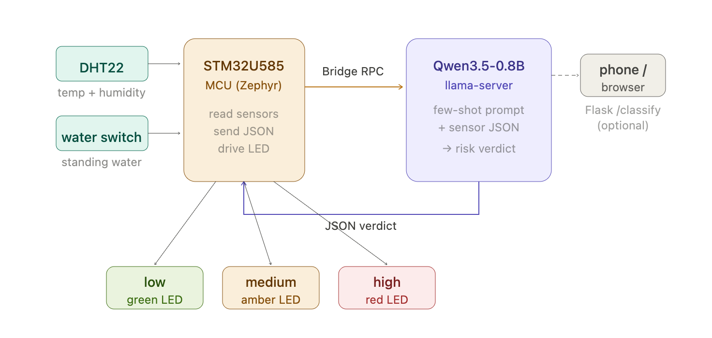

**Why this approach?**

- Full local inference. No API keys, no rate limits, and sensor data never leaves the device.
- The dual-brain architecture works as designed: real-time sensing and actuation on the MCU, AI reasoning on the Linux side, Bridge RPC connecting them.
- llama.cpp gives you fine-grained control over memory usage (KV cache quantization, context length, thread count), which matters when 4 GB of RAM is shared with the OS.
- The same llama.cpp `llama-server` binary speaks an OpenAI-compatible HTTP API, so the same Python code that talks to a local SLM today can fall back to a cloud LLM tomorrow with a one-line URL change.

By the end of this tutorial you will have a complete UNO Q application that runs from boot, reads sensor data on the MCU, classifies it on the MPU using Qwen3.5-0.8B, drives an RGB LED based on the verdict, and exposes a `/classify` HTTP endpoint for off-board clients (phones, browsers, other boards).

### Prerequisites

This tutorial assumes you have completed the [Setup](../Setup/README.md) chapter and are comfortable with:

- Connecting to the UNO Q via SSH and VS Code Remote-SSH (or Arduino App Lab).
- Creating and running applications with `arduino-app-cli`.
- The standard project structure (`app.yaml`, `python/main.py`, `sketch/sketch.ino`, `sketch/sketch.yaml`).
- Basic Bridge RPC patterns (`Bridge.call()` from the sketch, `Bridge.provide()` from Python).

> If any of these are unfamiliar, work through Setup first. This chapter builds on that foundation rather than repeating it.

## 2. Small Language Models on the Edge: What's Realistic on the UNO Q

A Small Language Model (SLM) here means a transformer-based language model with roughly 100 million to 7 billion parameters, optimized (pruned, distilled, and quantized) to run on CPU-only hardware with a few GB of RAM. The "small" is relative — modern GPTs have well over 1 trillion parameters — but these models are big enough to handle real classification, summarization, structured output, and short conversational tasks.

### Why SLMs Matter for Edge AI

Early TinyML models were single-purpose: a wake-word detector, an image classifier, a vibration anomaly detector. One model, one task. SLMs change that. A single sub-1B-parameter model can classify, summarize, reformat, translate, and reason about structured inputs, all at the edge, all without a network call. The cost is latency (seconds, not milliseconds) and the need for a Linux-capable platform with at least 2 GB of RAM. The UNO Q sits right at that threshold.

### The Memory Reality on a 4 GB UNO Q

The UNO Q 4 GB variant has 4 GB of LPDDR4X RAM shared between the OS, system services, the App Lab runtime, and your application. After boot, with no user app running, `free -h` typically shows about 2.8 to 3.0 GB available and 600 to 900 MB in use.

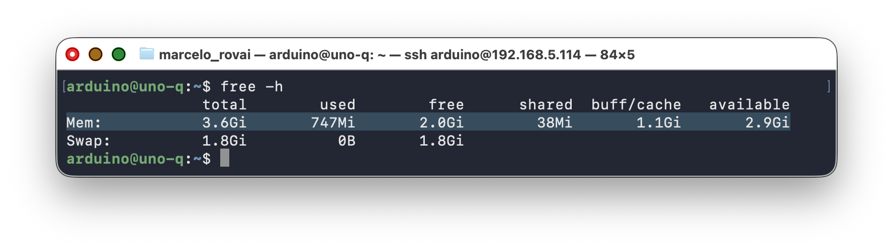

Below, `htop` shows the UNO Q 4GB running a 0.8B-parameter SLM at 8-bit quantization:

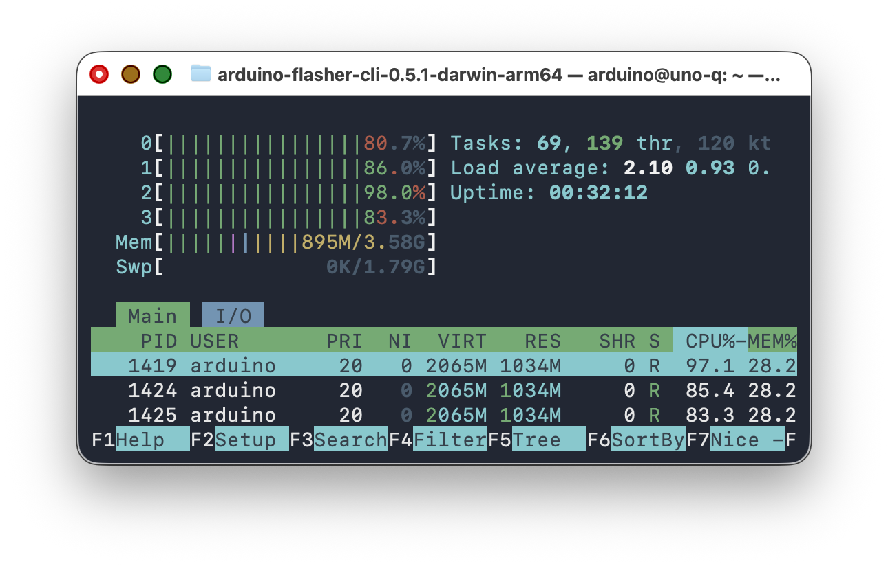

> The 2 GB variant can run the smallest models (SmolLM2-135M, SmolLM2-360M) but cannot comfortably fit 0.8B-parameter models. This chapter targets the 4 GB board.

### Storage Reality: A Single Partition

> **Storage layout depends on your factory image.** Run `df -h` to check. There are two layouts in the wild:
>
> - **Older images:** `/` and `/home` share a single ~9.8 GB partition with ~830 MB free after boot. Disk management matters; follow the cleanup steps in this chapter.
> - **Newer images:** `/home/arduino` is on a separate ~18 GB partition; llama.cpp source, models, and the App Lab project all land there. The 9.8 GB root partition stays mostly untouched by this tutorial, and you can skip the shallow-clone and build-tree-deletion steps.

Check your available space before starting:

```bash
df -h /home/arduino
```

You need at least **5 GB of free space** to complete the build and model download. If you have less, see [Section 16](#16-tips-tricks-and-troubleshooting) for cleanup tips.

### Why Qwen 3.5

[Qwen3.5-0.8B](https://qwen.ai/blog?id=qwen3.5) (released February 2026 by Alibaba's Qwen team) is the recommended SLM for the UNO Q for a few reasons:

- **Designed for edge devices.** The Qwen3.5 Small series (0.8B, 2B, 4B, 9B) uses a hybrid architecture combining Gated Delta Networks with sparse Attention, tuned for low-latency inference on constrained hardware.
- **Hybrid thinking/non-thinking mode.** In non-thinking mode the model answers directly without internal chain-of-thought, which keeps latency low and avoids the "reasoning loops" that plague thinking models on slow hardware.
- **201 languages.** Useful for multilingual teaching contexts (English/Portuguese/Spanish/etc.) and for Global South deployments.
- **Newer than LLama 3.2 and Gemma 3.** Better quality-per-parameter than earlier models at this size point on most benchmarks.
- **Apache 2.0 licensed.** No restrictions on academic or commercial deployment.

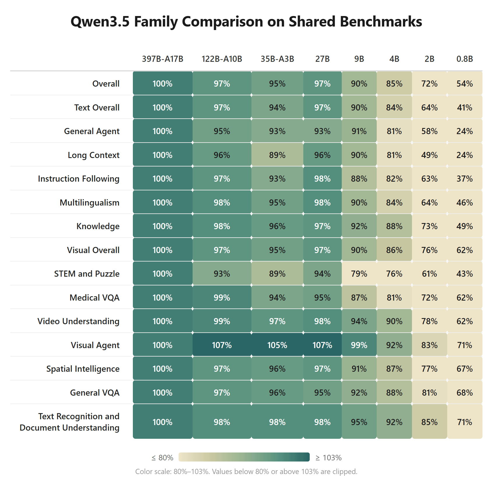

### Candidate Models

| Model | Params | Size | Notes |
|---|---|---|---|
| `SmolLM2-135M-Instruct Q4_K_M` | 135 M | ~95 MB | Very fast, limited reasoning. Good for routing/classification only. |
| `SmolLM2-360M-Instruct Q4_K_M` | 360 M | ~230 MB | Balanced. Recommended fallback if 0.8B is too tight on space. |
| `Qwen3.5-0.8B Q8.0` | 800 M | ~880 MB | **Our primary choice.** Best quality-per-parameter for edge. |
| `Qwen3.5-2B (Q4-Q8)` | 2B | 1.5 to 2 GB | Excellent, but could be too large without aggressive cleanup. |

### Quantization: Q4 vs Q8 for Sub-1B Models

During testing on the UNO Q, Q4_K_M quantization produced noticeably weaker output quality for sub-1B models compared to Q8_0. The aggressive 4-bit compression loses too much information when the model has only 800M parameters to begin with. There's less redundancy to exploit than in bigger models.

> At sub-1B scale, Q4 is aggressive. The quantization error compounds more on smaller models because there's less redundancy in the weights to absorb the precision loss. Q6 or Q8 helps a lot.
>
> Also, prefer `min_p` over `top_p` for sampling. Something like `min_p=0.05` with `temp=0.7` works better for small models because it dynamically adjusts the candidate pool based on the probability distribution rather than using a fixed cutoff. `top_p` at low temperatures produces a very narrow beam, and repetition becomes almost inevitable at these model sizes.

Recommendations:

- **Start with Q4_K_M** (~550 MB for Qwen3.5-0.8B) to verify the workflow fits on your board.
- **Try Unsloth Dynamic quants** (`UD-Q4_K_XL`). These upcast critical layers to 8 or 16 bits while keeping overall size close to Q4. Available from the [unsloth/Qwen3.5-0.8B-GGUF](https://huggingface.co/unsloth/Qwen3.5-0.8B-GGUF) repo.
- **Try Q8_0** if you have space (~850 MB). Quality is meaningfully better, but leaves very little headroom on the current factory image. (This is the choice for this tutorial.)
- **For production use, combine Q4 with strong few-shot prompting** and `response_format: json_object` to compensate for quantization noise.

## 3. Hardware and Software Requirements

### Hardware

- Arduino UNO Q **4 GB** variant (the 2 GB variant works with SmolLM2-360M or smaller only).
- USB-C data cable.
- Host computer with SSH and VS Code (see Setup chapter).
- DHT22 temperature/humidity sensor, water-presence switch, and RGB LEDs (and 220 ohm resistors).
- Breadboard and wiring.

### Software (already on the UNO Q from Setup)

| Tool | Purpose |
|---|---|
| Debian Linux (latest image) | Base OS on the MPU |
| `arduino-app-cli` | Build/run dual-brain apps |
| Python 3.13 | Application code |
| SSH server | Remote access |

### Software (installed in this tutorial)

| Tool | Purpose |
|---|---|
| `build-essential`, `cmake`, `git` | Build llama.cpp from source |
| `libcurl4-openssl-dev` | Enables in-binary model downloads |
| `flask`, `requests` | Python HTTP and API client (via `requirements.txt`) |

## 4. Preparing the Linux Side

SSH into the board (or open a VS Code Remote-SSH terminal or Arduino App Lab) and check what you have:

```bash
uname -m            # aarch64
free -h             # ~3.6 Gi total, ~3.0 Gi available
df -h /             # root partition — check available space
```

### Step 1 — Verify Swap Is Present

The current factory image includes **1.8 GB of swap** pre-configured. Verify:

```bash
free -h
```

You should see a `Swap:` line showing about 1.8 Gi total.

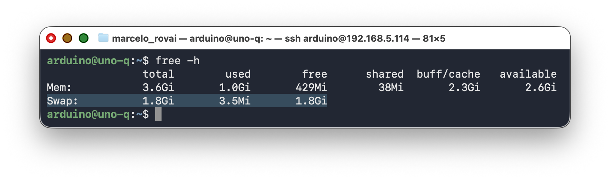

If swap is missing (older images), add it:

```bash
sudo fallocate -l 2G /home/swapfile
sudo chmod 600 /home/swapfile
sudo mkswap /home/swapfile
sudo swapon /home/swapfile
echo '/home/swapfile none swap sw 0 0' | sudo tee -a /etc/fstab
```

> Swap acts as a safety net during the brief model-loading phase. You don't want to hit it during inference (it would tank throughput), but having it prevents the OOM killer from ending your processes during the load spike.

### Step 2 — Install Build Tools

```bash
sudo apt update
sudo apt install -y build-essential cmake git pkg-config \
                    libcurl4-openssl-dev
```

> **Note**: `python3-flask` and `python3-requests` get installed inside the app's own environment by `arduino-app-cli` via `requirements.txt`. Don't install them system-wide.

## 5. Building llama.cpp from Source

llama.cpp's Makefile-based build is deprecated; the supported path is CMake. The old `LLAMA_CURL=1 make` recipe you may find in older tutorials fails with `make: command not found` on the UNO Q's factory image, which does not include `make` by default.

### Step 1 — Clone the Repository

```bash
cd /home/arduino
git clone https://github.com/ggerganov/llama.cpp
cd llama.cpp
```

**OPTIONAL:** A full clone of the llama.cpp repo pulls ~400 MB of git history you don't need. A shallow clone saves disk space:

```bash
cd /home/arduino
git clone --depth 1 https://github.com/ggml-org/llama.cpp
cd llama.cpp
```

This brings the clone down from ~550 MB to roughly 80–100 MB.

### Step 2 — Configure and Build

From the llama.cpp folder, run:

```bash
cmake -B build \
  -DLLAMA_CURL=ON \
  -DGGML_NATIVE=ON \
  -DCMAKE_BUILD_TYPE=Release
cmake --build build --config Release -j4
```

The flags:

- `LLAMA_CURL=ON` enables model downloads directly inside `llama-server` and `llama-cli`.
- `GGML_NATIVE=ON` detects the A53's NEON SIMD capabilities and emits the right CPU intrinsics.
- `-j4` uses all four cores. The build takes 20–25 minutes on the UNO Q.

> **If the build runs out of memory** (the board freezes or the build dies), drop to `-j2`. The build takes longer but stays under the OOM threshold. With the factory swap in place, `-j4` normally works.

### Step 3 — Verify the Binaries

```bash
ls build/bin/llama-cli build/bin/llama-server
./build/bin/llama-cli --version
```

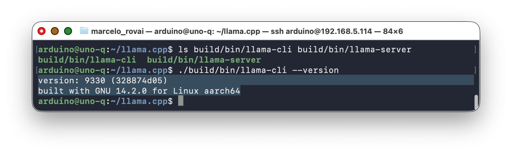

### Step 4 — Reclaim Disk Space (Optional)

The build tree adds about 142 MB of intermediate files. On a board with limited storage, copy the runtime binaries to a slim directory and delete the rest:

```bash
cd /home/arduino
mkdir -p llama-runtime
cp llama.cpp/build/bin/llama-server llama-runtime/
cp llama.cpp/build/bin/llama-cli    llama-runtime/
cp llama.cpp/build/bin/*.so*        llama-runtime/ 2>/dev/null

# Verify standalone operation
cd llama-runtime
LD_LIBRARY_PATH=. ./llama-cli --version

# Delete the source + build tree (saves ~690 MB)
rm -rf /home/arduino/llama.cpp
df -h /
```

After cleanup, you should have roughly 1.5 GB free — enough for the model, the App Lab container, and normal system operation.

> **Alternative: Use pre-built binaries.** llama.cpp publishes pre-built aarch64 Linux binaries on its [GitHub Releases page](https://github.com/ggml-org/llama.cpp/releases). Download the tarball, extract `llama-server` and `llama-cli`, and skip the whole build step. This turns this section into a 2-minute download instead of a 25-minute build, which is useful for classroom setups where you don't need to teach the build process.

## 6. Choosing and Downloading a Model

### Step 1 — Create the Models Directory

```bash
mkdir -p /home/arduino/models
cd /home/arduino/models
```

### Step 2 — Download Qwen3.5-0.8B

For this tutorial, the test was with 4-bit and 8-bit Bartowski quantization. The best result was with the [Q8_0 version](https://huggingface.co/bartowski/Qwen_Qwen3.5-0.8B-GGUF/blob/main/Qwen_Qwen3.5-0.8B-Q8_0.gguf) (about 797 MB).

```bash
wget https://huggingface.co/bartowski/Qwen_Qwen3.5-0.8B-GGUF/resolve/main/Qwen_Qwen3.5-0.8B-Q8_0.gguf
```

For 4-bit quantization (about 553 MB):

```bash
wget https://huggingface.co/bartowski/Qwen_Qwen3.5-0.8B-GGUF/resolve/main/Qwen_Qwen3.5-0.8B-Q4_K_M.gguf
ls -lh Qwen_Qwen3.5-0.8B-Q4_K_M.gguf
```

> **For better quality (if space permits):** Try the Unsloth Dynamic quant, which upcasts critical model layers to 8 or 16 bits while keeping the overall file size close to Q4:
> ```bash
> wget https://huggingface.co/unsloth/Qwen3.5-0.8B-GGUF/resolve/main/Qwen3.5-0.8B-UD-Q4_K_XL.gguf
> ```

> **For the 2 GB UNO Q or extremely tight storage:**
>
> ```bash
> wget https://huggingface.co/bartowski/SmolLM2-360M-Instruct-GGUF/resolve/main/SmolLM2-360M-Instruct-Q4_K_M.gguf
> ```
> Adjust the model path in Section 8 accordingly.

### A Note on Quantization Quality for Sub-1B Models

During testing, the Q4_K_M quantization of Qwen3.5-0.8B produced noticeably weaker structured outputs compared to larger models at the same quantization level. That's expected: aggressive 4-bit quantization removes information that a 0.8B model can't afford to lose, because smaller models have less redundancy.

Things that helped in the tests:

- **Strong few-shot prompting** (two examples in the system prompt). The most effective single fix.
- **`response_format: json_object`** to constrain decoding to valid JSON.
- **`presence_penalty=1.5`** to prevent repetition loops.
- **Low `max_tokens`** (60–80) to keep answers short and focused.
- **Trying the Unsloth `UD-Q4_K_XL` quant**, which upcasts sensitive layers automatically.

## 7. Llama-CLI

`llama-cli` is a self-contained, one-shot tool: no HTTP, no extra process, just "run a prompt, see the text, exit." `llama-server` is better once you want anything persistent, multi-client, or integrated into an app.

Use `llama-cli` for quick, ad-hoc tests and benchmarks directly in the terminal. For everything "real" (Python client, robot control, bridge to MCU, multiple prompts over time), use `llama-server`.

### Qwen 3.5 and Thinking Mode

Qwen3.5 is a hybrid reasoning model, and by default the models are in "thinking mode." For edge use, disable it. `llama-cli` needs to be told this explicitly via the `--reasoning` flags. Without them, the model may enter thinking mode, producing long internal reasoning chains that burn minutes of CPU time and often loop without reaching a conclusion.

In current llama.cpp builds, use `--reasoning off` and `--reasoning-budget 0` on the command line. The older `--chat-template-kwargs '{"enable_thinking":false}'` flag is **deprecated** and produces a warning. If you see it in other tutorials, replace it with the newer flags.

Recommended inference parameters for non-thinking mode (from the [Unsloth Qwen3.5 guide](https://unsloth.ai/docs/models/qwen3.5)):

| Parameter            | Value      | Purpose                                              |
| -------------------- | ---------- | ---------------------------------------------------- |
| `temperature`        | 0.7 to 1.0 | Moderate creativity for general tasks                |
| `top_p`              | 0.8        | Nucleus sampling                                     |
| `top_k`              | 20         | Limit token pool                                     |
| `min_p`              | 0.0        | Disabled                                             |
| `presence_penalty`   | 1.5        | Prevent repetition loops (critical for small models) |
| `repetition_penalty` | 1.0        | Disabled (presence_penalty handles it)               |

Call `llama-cli` with those settings:

```bash
cd ~/llama.cpp

./build/bin/llama-cli \
  --model ~/models/Qwen_Qwen3.5-0.8B-Q8_0.gguf \
  --threads 4 \
  --ctx-size 1024 \
  --temperature 0.7 \
  --top-p 0.8 \
  --top-k 20 \
  --min-p 0.0 \
  --presence-penalty 1.5 \
  --repeat-penalty 1.0 \
  --reasoning off \
  --reasoning-budget 0
```

At the prompt `>`, type a question, for example:

> `> What is the capital of Brazil. Answer with one word.`

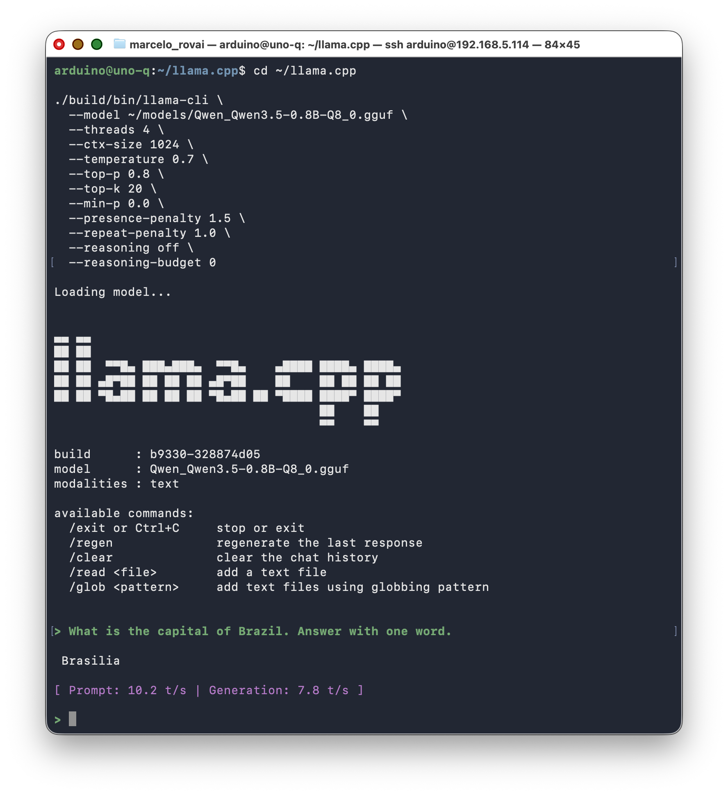

Latency in tokens/s is acceptable and usable, in the 5–10 tokens/s range.

While inference runs, monitor CPU use and temperature:

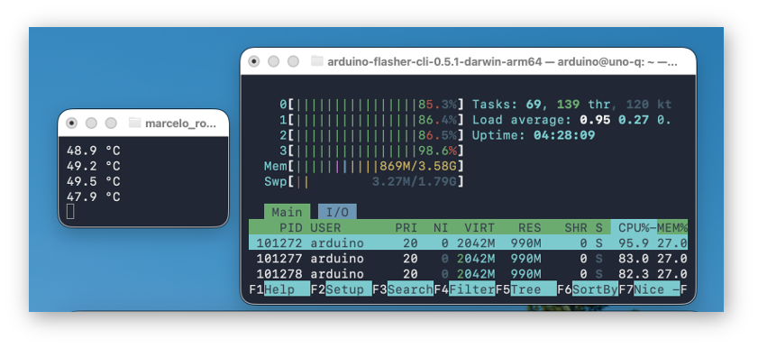

The UNO Q handles SLMs well. The inferences were done without any heatsink or fan. Internal temperature increased by about 20 °C (from ~30 °C to ~50 °C). For long answers, the temperature reached ~60 °C, which is lower than a Raspberry Pi 5 with an active cooler.

> The "Thermal Monitoring" section at the end of "Llama-Server" provides more detail on temperature monitoring. 

### Create a helper script

You can wrap the full `llama-cli` command in a small shell script and run it instead of typing all the flags every time.

On the UNO Q:

```bash
nano ~/qwen_cli_llama.sh
```

Paste:

```bash
#!/usr/bin/env bash
# Simple Qwen3.5 0.8B 8-bit CLI on UNO-Q without thinking

MODEL=~/models/Qwen_Qwen3.5-0.8B-Q8_0.gguf
LLAMA=~/llama.cpp/build/bin/llama-cli

"$LLAMA" \
  --model "$MODEL" \
  --threads 4 \
  --ctx-size 1024 \
  --temperature 0.7 \
  --top-p 0.8 \
  --top-k 20 \
  --min-p 0.0 \
  --presence-penalty 1.5 \
  --repeat-penalty 1.0 \
  --reasoning off \
  --reasoning-budget 0 \
  -p "$*"
```

Save and make it executable:

```bash
chmod +x ~/qwen_cli_llama.sh
```

> Optionally, add `~/` to your `PATH` in `~/.bashrc` or `~/.profile` so you can call it without the full path.

### Use it with a simple command

Now run:

```bash
~/qwen_cli_llama.sh "Explain edge AI in two sentences."
```

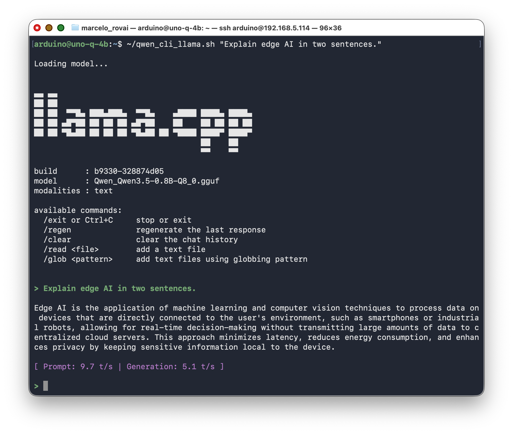

or, after adding `~/` to `PATH` and reloading the shell:

```bash
qwen_cli_llama.sh "Explain edge AI in two sentences."
```
## 8. Llama-server

The Arduino UNO Q can host a small language model directly on its Linux side, and the easiest way to expose that model to applications is through `llama-server`. Instead of calling the model via a one-shot CLI, `llama-server` loads the GGUF file into RAM once and exposes a simple HTTP API on localhost, so any script or service on the board can send prompts and receive completions via JSON. That fits the UNO Q's dual-brain architecture: the QRB2210 runs the SLM and higher-level logic; the MCU handles real-time I/O; both sides talk to a single long-lived model process rather than repeatedly spawning and tearing it down.

In practice, you start `llama-server` on the UNO Q with your chosen GGUF model and configuration (threads, context size, reasoning on/off), then interact with it using `curl` or a lightweight Python client. The server manages slots and caching internally (parallel request slots and KV prompt caching), so multiple prompts over time reuse the same loaded model and benefit from prompt caching, which matters on a 4 GB device. Once running, it becomes a generic "local AI endpoint" on the board that you can wire into robotics logic, sensor pipelines, or a bridge that forwards compact decisions to the MCU.

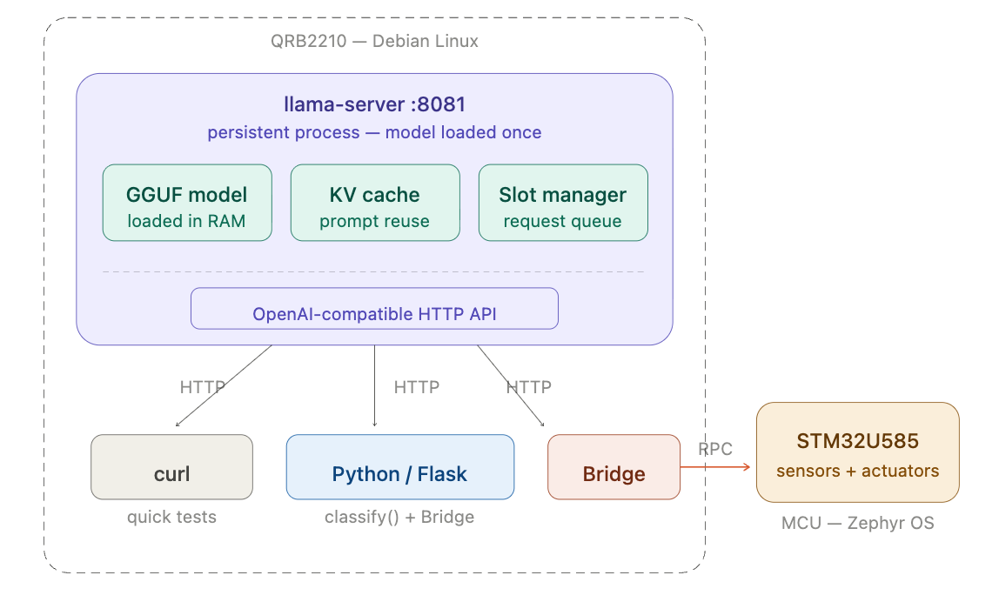

### Testing llama-server (two terminals)

Before wrapping llama-server in a systemd service, run it interactively first. This is simpler and lets you see the server logs in real time alongside your queries — useful for understanding what's happening under the hood.

You need **two SSH sessions** (or two VS Code terminals) open to the UNO Q at the same time:

- **Terminal 1** runs `llama-server` in the foreground (you'll see logs here).
- **Terminal 2** sends queries with `curl` and Python.

#### Step 1 — Start llama-server (Terminal 1)

In your first terminal:

```bash
cd ~/llama.cpp

./build/bin/llama-server \
  --model ~/models/Qwen_Qwen3.5-0.8B-Q8_0.gguf \
  --threads 4 \
  --ctx-size 1024 \
  --port 8081 \
  --reasoning off \
  --reasoning-budget 0
```

Watch the log output. You should see:

- The model loading (file path, parameter count, quantization type)
- `thinking = 0`, which confirms reasoning mode is disabled
- `HTTP server listening` on the port you chose

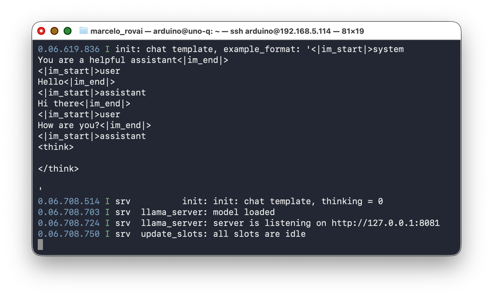

If port 8081 is busy, try another port:

```bash
sudo ss -ltnp | grep 8081
```

> **Do not close this terminal.** The server runs as long as this process is alive. When you're done testing, press `Ctrl+C` to stop it.

#### Step 2 — Quick test with curl (Terminal 2)

Open a second SSH session to the UNO Q. First, verify the server is alive:

```bash
curl -s http://127.0.0.1:8081/health | python3 -m json.tool
```

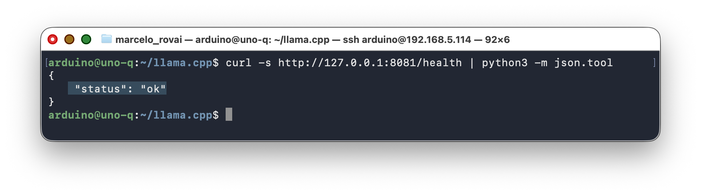

You should see `"status": "ok"`. Now send a prompt using the `/completion` endpoint:

```bash
curl http://127.0.0.1:8081/completion \
  -H "Content-Type: application/json" \
  -d '{
    "prompt": "In 2 sentences, what is the Olympic Games?",
    "n_predict": 128
  }'
```

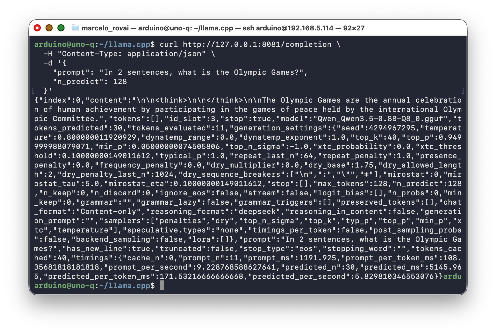

Switch back to **Terminal 1** while it processes. You'll see the server log each token as it generates, plus timing information. That's the main advantage of running in the foreground: you see exactly what the model is doing.

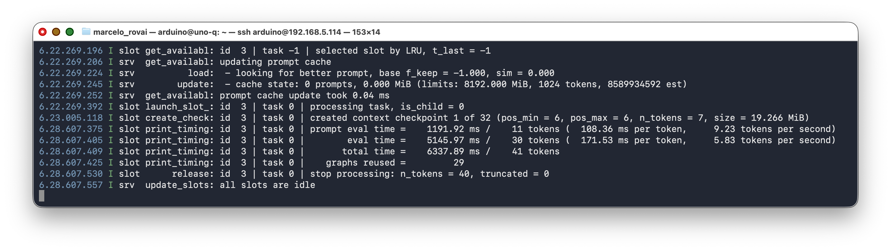

Now try the OpenAI-compatible `/v1/chat/completions` endpoint, which is what our Python applications will use later:

```bash
curl http://127.0.0.1:8081/v1/chat/completions \
  -H "Content-Type: application/json" \
  -d '{
    "model": "qwen3.5-0.8b",
    "messages": [
      {"role": "system", "content": "You are concise. Answer in one sentence."},
      {"role": "user", "content": "What is TinyML?"}
    ],
    "max_tokens": 80,
    "temperature": 0.7,
    "top_p": 0.8,
    "presence_penalty": 1.5
  }'
```

The response arrives as a JSON object. The model's answer is in `choices[0].message.content`.

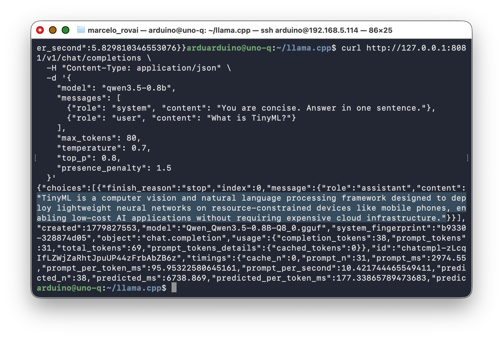

#### Step 3 — Python client (Terminal 2)

Still in your second terminal, create a small Python client that talks to the running server. This is the same pattern the Bridge app uses later, minus the Bridge plumbing.

Install `requests` (system-wide is fine for testing):

```bash
sudo apt install -y python3-requests
```

Create `~/qwen_server_test.py`:

```bash
nano ~/qwen_server_test.py
```

Paste:

```python
#!/usr/bin/env python3
"""
Simple test client for llama-server on the UNO Q.
Run llama-server in another terminal first, then call this script.
"""
import re
import sys
import json
import requests

SERVER_URL = "http://127.0.0.1:8081"

def strip_think(text):
    """Remove residual <think>...</think> tags from Qwen3.5 output."""
    return re.sub(r"<think>.*?</think>", "", text, flags=re.DOTALL).strip()

def ask(prompt, system="You are concise.", max_tokens=128):
    """Send a chat completion request and return the cleaned response."""
    r = requests.post(
        f"{SERVER_URL}/v1/chat/completions",
        json={
            "model": "qwen3.5-0.8b",
            "messages": [
                {"role": "system", "content": system},
                {"role": "user", "content": prompt},
            ],
            "max_tokens": max_tokens,
            "temperature": 0.7,
            "top_p": 0.8,
            "presence_penalty": 1.5,
        },
        timeout=120,
    )
    r.raise_for_status()
    content = r.json()["choices"][0]["message"]["content"]
    return strip_think(content)

if __name__ == "__main__":
    # One-shot mode: pass the prompt as arguments
    if len(sys.argv) > 1:
        prompt = " ".join(sys.argv[1:])
        print(ask(prompt))
    else:
        # Interactive REPL mode
        print("Qwen3.5 on UNO Q (via llama-server). Ctrl+C to exit.\n")
        try:
            while True:
                prompt = input("> ").strip()
                if not prompt:
                    continue
                print()
                print(ask(prompt))
                print()
        except (KeyboardInterrupt, EOFError):
            print("\nBye!")
```

Make it executable and test:

```bash
chmod +x ~/qwen_server_test.py

# One-shot test
~/qwen_server_test.py "In one sentence, what causes dengue fever?"
```

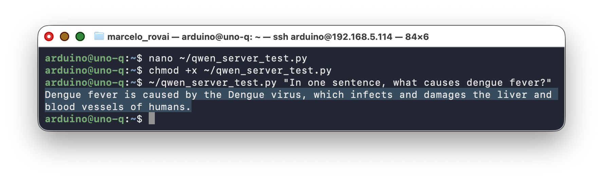

```bash
# Interactive REPL
~/qwen_server_test.py
```

In the interactive REPL, try a few queries and watch **Terminal 1**. You'll see the server processing each request, the timing breakdown (prompt processing vs generation), and memory usage. This feedback loop helps you tune parameters before committing to a systemd service.

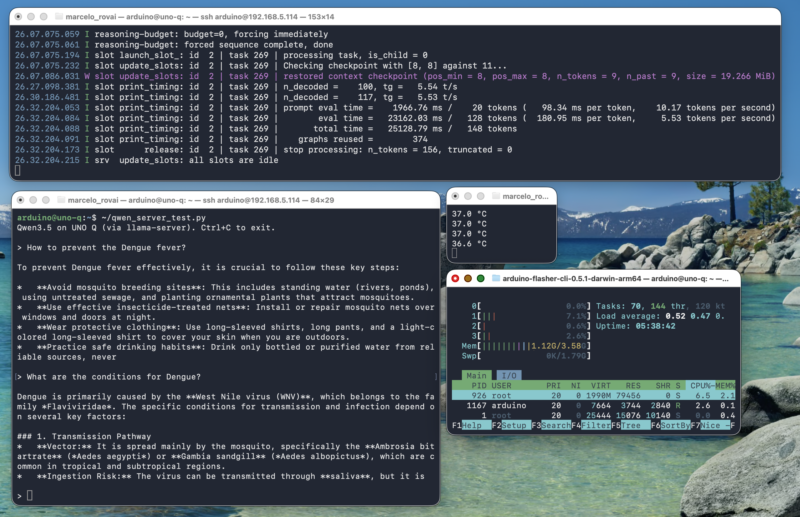

#### Step 4 — Test structured JSON output

This is the pattern the dengue-risk classifier uses. Ask the model to produce structured JSON:

```bash
~/qwen_server_test.py "Given: temp=30.2C, humidity=85%, standing water=yes. Classify dengue risk as low/medium/high. Reply ONLY with JSON: {\"risk\":\"...\", \"reason\":\"...\"}"
```

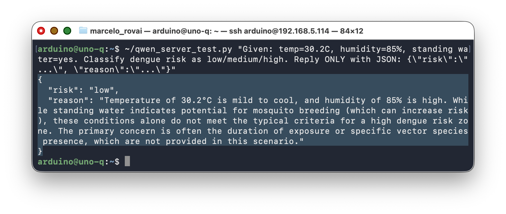

The model returns valid JSON, which confirms the structured-output pipeline will work. If it wraps the JSON in prose or adds code fences, that's what the `parse_verdict()` function in the full app handles. At Q8 quantization, Qwen3.5-0.8B follows JSON formatting instructions reliably most of the time.

#### Step 5 — Stop the server

When you're done testing, go back to **Terminal 1** and press `Ctrl+C`. The model unloads and the port is freed.

At this point you've validated that llama-server works, the model produces usable output, and the Python client can talk to it. The next step is to make this permanent by wrapping it in a systemd service so it starts on boot and restarts on failure.

---

### llama-server as a systemd service

Once you're confident the server works (from the interactive testing above), wrap it in a systemd unit so it runs on boot without a terminal:

#### Step 1 — Create the service file

Since the UNO Q is on the local network, binding to `0.0.0.0` exposes the SLM endpoint to any device on that LAN, which is exactly what the next section ("The Optional Flask Endpoint: Exposing the SLM Over HTTP") already plans to do via Flask.

```bash
sudo nano /etc/systemd/system/llama-server.service
```

Paste:

```ini
[Unit]
Description=llama.cpp server (Qwen3.5-0.8B on UNO Q)
After=network-online.target

[Service]
User=arduino
WorkingDirectory=/home/arduino/llama.cpp
ExecStart=/home/arduino/llama.cpp/build/bin/llama-server \
  -m /home/arduino/models/Qwen_Qwen3.5-0.8B-Q8_0.gguf \
  --host 0.0.0.0 --port 8081 \
  -c 1024 -t 4 \
  --reasoning off \
  --reasoning-budget 0
Restart=on-failure
RestartSec=10
Nice=-5

[Install]
WantedBy=multi-user.target
```

> **Note**: If you moved the binaries to `~/llama-runtime/`, adjust `WorkingDirectory` and `ExecStart` accordingly, and add `Environment=LD_LIBRARY_PATH=/home/arduino/llama-runtime`.

Key flags:

- `--reasoning off --reasoning-budget 0` — **critical**. Disables Qwen 3.5's thinking mode. Without this, the model enters long internal reasoning chains (`[Start thinking]` blocks) that consume minutes of CPU time and often loop without reaching a conclusion. The server log should report `thinking = 0` when this is working.
- `-c 1024` — context length. Larger values eat KV-cache RAM; 1024 is enough for structured classification and short Q&A.
- `-t 4` — uses all four A53 cores.
- `--port 8081` — port 8080 is often already in use on the UNO Q (App Lab services). Check with `sudo ss -ltnp | grep 8080`; if occupied, use 8081 or any free port.
- `Nice=-5` gives llama-server slightly higher scheduling priority than user-space apps. Don't go lower than -5 or you risk starving the kernel.

#### Step 2 — Enable and start

```bash
sudo systemctl daemon-reload
sudo systemctl enable --now llama-server.service
systemctl status llama-server --no-pager
journalctl -u llama-server -f
```

Wait for `HTTP server listening` in the journal output, then `Ctrl+C` to exit the log tail.

#### Step 3 — Verify it survives a reboot

```bash
sudo reboot
```

After the board comes back up, SSH in and check:

```bash
systemctl status llama-server --no-pager
curl -s http://127.0.0.1:8081/health
~/qwen_server_test.py "Hello from after reboot!"
```

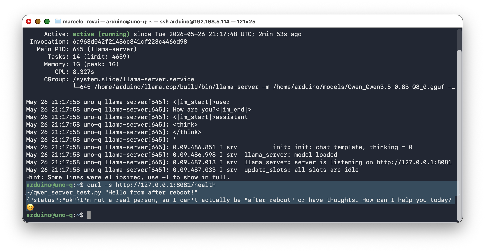

If all three work, the service is solid. You now have a persistent local AI endpoint that starts on boot, restarts on failure, and serves any client on the board via HTTP.

### Thermal Monitoring

The UNO Q exposes Qualcomm thermal data through Linux thermal and hwmon interfaces. To monitor the MPU temperature in real time during inference:

```bash
# Check thermal zone type
cat /sys/class/thermal/thermal_zone0/type

# Read current temperature (in millidegrees Celsius)
cat /sys/class/thermal/thermal_zone0/temp

# Live monitor (updates every second)
watch -n 1 "cat /sys/class/hwmon/hwmon0/temp1_input"
```

For a friendlier readout, drop a small Python script in `~/q_temp_monitor.py`:

```python
#!/usr/bin/env python3
import time
from pathlib import Path

# The mapss_thermal zone exposes the QRB2210 SoC temperature
TEMP_PATH = Path("/sys/class/hwmon/hwmon0/temp1_input")

def read_temp_c():
    raw = int(TEMP_PATH.read_text().strip())
    return raw / 1000.0

if __name__ == "__main__":
    try:
        while True:
            print(f"{read_temp_c():.1f} °C")
            time.sleep(1.0)
    except KeyboardInterrupt:
        pass
```

Make it executable and run it in a side terminal while the SLM works:

```bash
chmod +x ~/q_temp_monitor.py
~/q_temp_monitor.py
```

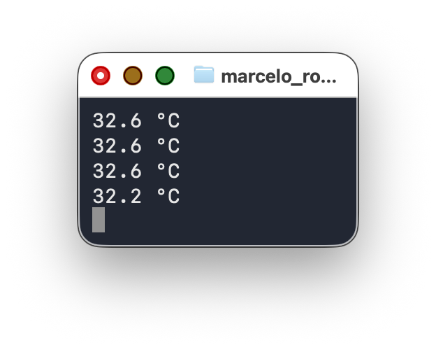

You should see the reading climb from ~32 °C at idle to whatever your workload pushes it to during inference.

### Thermal Behavior (Measured)

During testing on a UNO Q 4 GB **without any heatsink or fan**:

| Condition | Internal CPU Temperature |
|---|---|
| Idle (no inference) | ~34 °C |
| Normal inference (short prompts) | ~54 °C (+20 °C above idle) |
| Sustained inference (long answers) | ~62 °C |

All of these are well under the 70–80 °C range where ARM cores begin to throttle. The UNO Q runs cooler than a Raspberry Pi 5 under comparable loads. **No heatsink or fan is required** for normal SLM workloads, even in sustained use. For enclosures with poor ventilation (outdoor sensor boxes, stacked classroom boards), a small adhesive heatsink is cheap insurance but not strictly necessary.

### Bonus: The Built-In WebUI

Recent llama.cpp builds ship a SvelteKit-based chat interface embedded directly into the `llama-server` binary. No extra install, no extra flag. If the build from Section 5 is recent enough, the UI is already running on the same port as the API.

From the UNO Q itself, use `http://127.0.0.1:8081/`, or tunnel from your laptop with `ssh -L 8081:127.0.0.1:8081 arduino@<UNO_Q_IP>` and open `http://localhost:8081/` in the host browser.

From any device on the same Wi-Fi, open:

**http://<UNO_Q_IP>:8081/**  (for example, in my case: http://192.168.5.114:8081/)

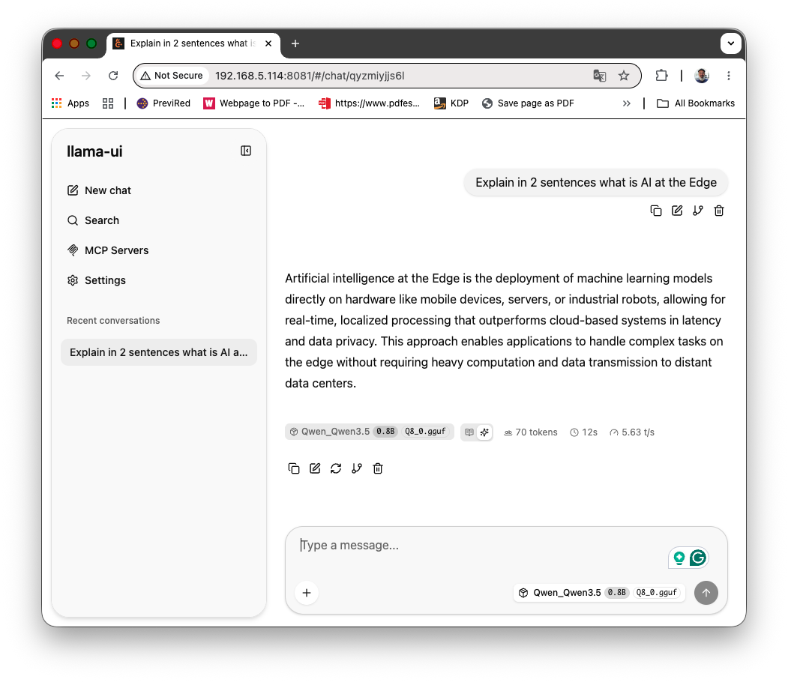

What's useful for this tutorial:

- Streaming chat against your local Qwen3.5-0.8B, no extra app needed.
- A live sampling panel for `temperature`, `top_p`, `presence_penalty`, and friends. Useful for tuning before you bake values into `main.py` on the next phase of the project.
- Reasoning/thinking blocks render in their own collapsible section. With `--reasoning off --reasoning-budget 0` the section stays empty, which is a quick visual confirmation that the flag worked.
- Runs alongside the next section, Flask dashboard on `port 7000`, without conflict. You can demo the raw model on `:8081` and the structured dengue app on `:7000` in the same session.
- For more informations, visit [guide : using `llama-ui` — the new WebUI of llama.cpp](https://github.com/ggml-org/llama.cpp/discussions/16938).

What to skip on a 4 GB UNO Q:

- **File uploads.** The UI accepts images and PDFs, but Qwen3.5-0.8B is text-only. Dropping an image either gets ignored or produces a hallucination. Vision-capable GGUFs (Qwen3.5-VL, LLaVA variants) don't fit comfortably in this board's RAM.
- **MCP tool calling and built-in agent tools.** Available in the UI, but enabling filesystem or shell tools on a server bound to `0.0.0.0` is a security footgun. Keep them off in this setup.

> If the URL returns a bare JSON error instead of a UI, your `llama-server` build predates the embedded WebUI. Rebuild from the latest llama.cpp `master`, or grab a recent pre-built aarch64 binary from the GitHub Releases page.

## 9. The Dual-Brain Architecture for Generative AI

The UNO Q's dual-brain architecture maps naturally onto the SLM use case: real-time sensing on the MCU, AI reasoning on the MPU, with **Bridge RPC** as the glue between them.

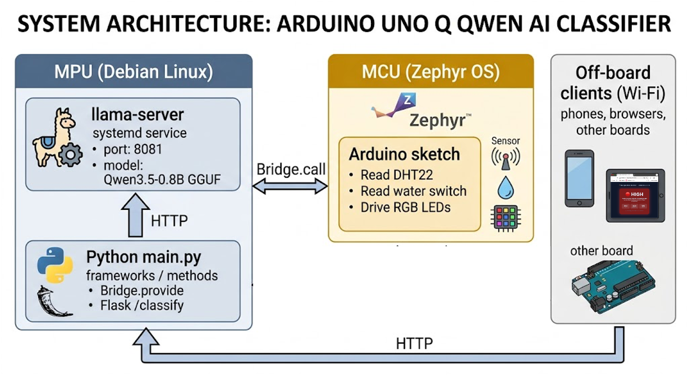

Three data paths run through this architecture:

1. **MCU → MPU (Bridge RPC)** — the sketch calls `Bridge.call("classify", ...)` and gets a verdict back. This is the on-board, low-latency path.
2. **MPU → llama-server (HTTP)** — the Python code calls `localhost:8081` to run inference. Internal to the Linux side.
3. **External → MPU (Flask)** — other devices on the network call `http://<UNO_Q_IP>:7000/classify`. The *optional* off-board path.

The same `classify()` logic powers all three. That's the design.

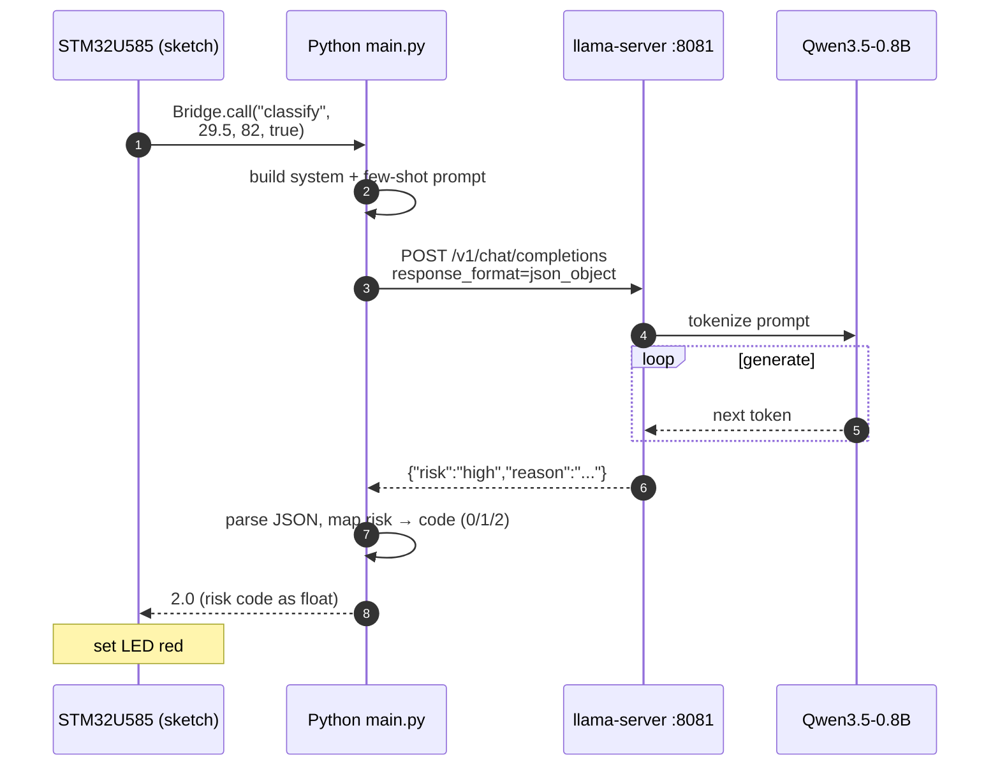
```mermaid
sequenceDiagram
    autonumber
    participant S as STM32U585 (sketch)
    participant P as Python main.py
    participant L as llama-server :8081
    participant M as Qwen3.5-0.8B

    S->>P: Bridge.call("classify",<br/>29.5, 82, true)
    P->>P: build system + few-shot prompt
    P->>L: POST /v1/chat/completions<br/>response_format=json_object
    L->>M: tokenize prompt
    loop generate
        M-->>L: next token
    end
    L-->>P: {"risk":"high","reason":"..."}
    P->>P: parse JSON, map risk → code (0/1/2)
    P-->>S: 2.0  (risk code as float)
    Note over S: set LED red
```

## 10. Project Structure for a Bridge + Flask SLM App

Create a standard UNO Q app following the structure introduced in the Setup chapter. The app is called `risk-classifier`.

```
risk-classifier/
├── app.yaml
├── README.md
├── python/
│   ├── main.py
│   └── requirements.txt
└── sketch/
    ├── sketch.ino
    └── sketch.yaml
```

### Step 1 — Create the App Skeleton

On the UNO Q:

```bash
cd ~/ArduinoApps
arduino-app-cli app new "risk-classifier"
cd risk-classifier
```

You can also create the project directly in [VS Code with Remote-SSH](https://github.com/Mjrovai/ARDUINO-UNO-Q/blob/main/Setup/README.md#9-setting-up-vs-code-with-remote-ssh).

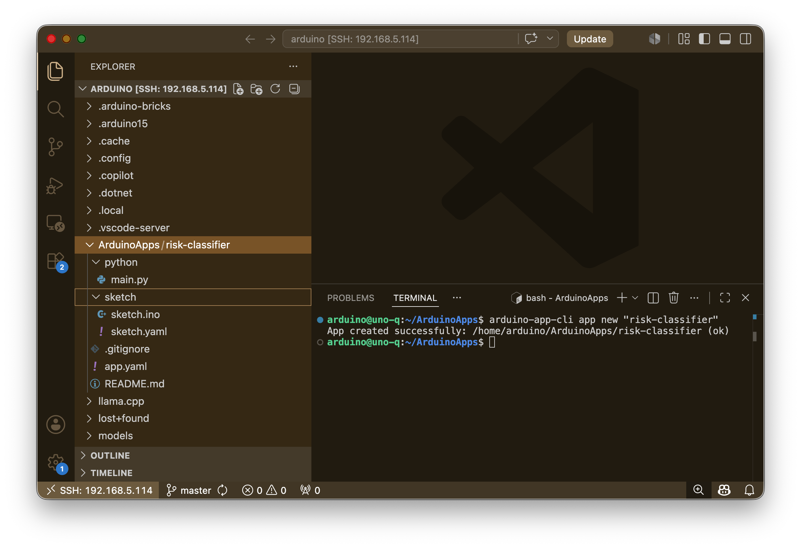

Or in the Arduino App Lab:

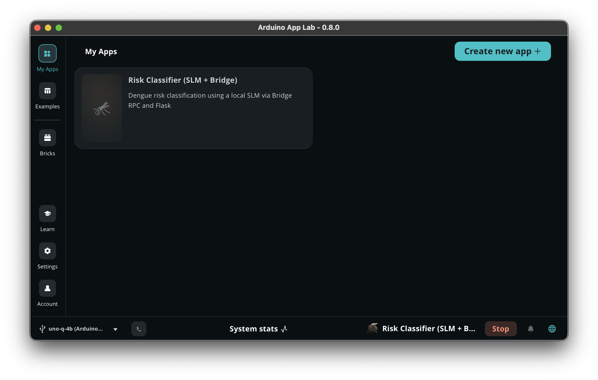

### Step 2 — Edit `app.yaml`

```yaml
name: Risk Classifier (SLM + Bridge)
description: "Dengue risk classification using a local SLM via Bridge RPC and Flask"
icon: 🦟
version: "1.0.0"
ports:
  - 7000
bricks: []
```

The `ports: [7000]` line tells the App Lab runtime to forward port 7000 so external clients can reach the Flask endpoint. Without this, Flask binds inside the container only and is invisible from outside the board.

## 11. Building the Python Side

The Python side does three jobs:

1. Provides a `classify_risk()` function to the MCU sketch over Bridge RPC (returns a numeric code the sketch can use directly).
2. Calls llama-server via HTTP to do the actual inference.
3. Serves the same logic as an HTTP endpoint via Flask for off-board clients (returns the full JSON verdict).

### Step 1 — `python/requirements.txt`

Under the `python` folder, create `requirements.txt`:

```
flask==3.0.3
requests==2.32.3
```

### Step 2 — `python/main.py`

```python
"""
risk-classifier: Dengue risk classification on the UNO Q.

Two interfaces over the same classify() function:
  1. Bridge RPC for the on-board MCU sketch (returns a float code).
  2. Flask HTTP endpoint for off-board clients (returns the full JSON verdict).
"""

import json
import re
import socket
import struct
import threading
import time
import requests
from flask import Flask, request, jsonify
from arduino.app_utils import *

# ─── Container-aware host discovery ────────────────────────────────
# Inside the App Lab container, 127.0.0.1 is the *container's* loopback,
# not the UNO Q's. The default gateway in /proc/net/route is the host
# as seen from this container, which is where llama-server listens.

def _host_gateway():
    """Return the default gateway IP (the UNO Q host from inside the container)."""
    try:
        with open("/proc/net/route") as f:
            for line in f.readlines()[1:]:
                fields = line.strip().split()
                if fields[1] == "00000000" and int(fields[3], 16) & 2:
                    return socket.inet_ntoa(struct.pack("<L", int(fields[2], 16)))
    except OSError:
        pass
    return "127.0.0.1"  # fallback when running outside a container

# ─── Configuration ─────────────────────────────────────────────────
LLM_HOST = _host_gateway()
LLM_URL = f"http://{LLM_HOST}:8081/v1/chat/completions"
LLM_HEALTH_URL = f"http://{LLM_HOST}:8081/health"
TIMEOUT_S = 120
FLASK_PORT = 7000

# Mapping from risk label to numeric code for the MCU
RISK_CODE = {"low": 0.0, "medium": 1.0, "high": 2.0}

# Qwen3.5 non-thinking mode parameters (from Unsloth docs)
LLM_PARAMS = {
    "temperature": 0.7,
    "top_p": 0.8,
    "presence_penalty": 1.5,
}

SYSTEM_PROMPT = (
    "You are an environmental risk classifier for dengue surveillance. "
    "Given temperature (Celsius), humidity (%), and whether standing water "
    "is reported, output ONLY a JSON object with two fields: "
    '"risk" (one of: low, medium, high) and '
    '"reason" (one short sentence, max 20 words). '
    "Do not include any prose outside the JSON."
)

FEW_SHOTS = [
    {"role": "user",
     "content": '{"temp_c": 18.0, "humidity_pct": 40, "standing_water": false}'},
    {"role": "assistant",
     "content": '{"risk":"low","reason":"Cool and dry conditions with no water; Aedes mosquito activity unlikely."}'},
    {"role": "user",
     "content": '{"temp_c": 29.5, "humidity_pct": 82, "standing_water": true}'},
    {"role": "assistant",
     "content": '{"risk":"high","reason":"Warm humid conditions plus standing water create ideal Aedes breeding habitat."}'},
]

# ─── Core inference function (used by both Bridge and Flask) ───────

def strip_think_blocks(text):
    """Remove residual <think>...</think> tags that Qwen3.5 emits even with
    --reasoning off. A known behavior in current llama.cpp builds."""
    cleaned = re.sub(r"<think>.*?</think>", "", text, flags=re.DOTALL)
    return cleaned.strip()


def build_messages(payload):
    user_msg = {"role": "user",
                "content": json.dumps(payload, ensure_ascii=False)}
    return [{"role": "system", "content": SYSTEM_PROMPT}, *FEW_SHOTS, user_msg]


def call_llm(messages, max_tokens=80):
    body = {
        "model": "qwen3.5-0.8b",
        "messages": messages,
        "max_tokens": max_tokens,
        "response_format": {"type": "json_object"},
        **LLM_PARAMS,
    }
    t0 = time.perf_counter()
    r = requests.post(LLM_URL, json=body, timeout=TIMEOUT_S)
    r.raise_for_status()
    latency_ms = (time.perf_counter() - t0) * 1000
    content = r.json()["choices"][0]["message"]["content"]
    content = strip_think_blocks(content)  # remove residual <think> tags
    return content, latency_ms


def parse_verdict(content):
    """Defensive parse: tolerate stray code fences if the model adds them."""
    try:
        verdict = json.loads(content)
    except json.JSONDecodeError:
        cleaned = content.strip().lstrip("`").rstrip("`").strip()
        if cleaned.startswith("json"):
            cleaned = cleaned[4:].lstrip()
        verdict = json.loads(cleaned)
    if verdict.get("risk") not in {"low", "medium", "high"}:
        raise ValueError(f"unexpected risk value: {verdict!r}")
    return verdict


def classify(temp_c, humidity_pct, standing_water):
    """Inner classifier. Returns the full verdict dict.
    Used by the Flask endpoint and wrapped by classify_risk() for Bridge."""
    payload = {
        "temp_c": float(temp_c),
        "humidity_pct": float(humidity_pct),
        "standing_water": bool(standing_water),
    }
    messages = build_messages(payload)
    content, latency_ms = call_llm(messages)
    try:
        verdict = parse_verdict(content)
    except (json.JSONDecodeError, ValueError):
        # one retry with stricter parameters
        content, latency_ms2 = call_llm(messages, max_tokens=60)
        verdict = parse_verdict(content)
        latency_ms += latency_ms2
    verdict["latency_ms"] = round(latency_ms, 1)
    print(f"[classify] {payload} -> {verdict}")
    return verdict


def classify_risk(temp_c, humidity_pct, standing_water):
    """Bridge-facing wrapper. Returns a float code: 0=low, 1=medium, 2=high.
    The Bridge serializes float cleanly in both directions; the sketch
    reads the code into a float and drives the LEDs."""
    verdict = classify(temp_c, humidity_pct, standing_water)
    return RISK_CODE.get(verdict.get("risk", "unknown"), -1.0)


# ─── Flask app (off-board interface) ───────────────────────────────

flask_app = Flask(__name__)

@flask_app.route("/healthz", methods=["GET"])
def healthz():
    try:
        r = requests.get(LLM_HEALTH_URL, timeout=5)
        return jsonify({"flask": "ok", "llm": r.json()}), 200
    except Exception as e:
        return jsonify({"flask": "ok", "llm_error": str(e)}), 503

@flask_app.route("/classify", methods=["POST"])
def classify_endpoint():
    p = request.get_json(force=True)
    required = {"temp_c", "humidity_pct", "standing_water"}
    if not required.issubset(p):
        return jsonify({"error": f"missing: {required - set(p)}"}), 400
    verdict = classify(p["temp_c"], p["humidity_pct"], p["standing_water"])
    return jsonify(verdict), 200


def run_flask():
    # threaded=False because the model handles one request at a time anyway
    flask_app.run(host="0.0.0.0", port=FLASK_PORT, threaded=False)


# ─── Main entry: register Bridge function, start Flask, run loop ──

# Expose the float-returning wrapper to the MCU sketch.
# (The sketch reads the result with rpc.result(float_var), so we MUST
#  return a numeric type, not a dict.)
Bridge.provide("classify", classify_risk)

# Start Flask in a background thread
threading.Thread(target=run_flask, daemon=True).start()

print(f"[init] llama-server target: {LLM_URL}")
print(f"[init] Bridge registered, Flask on :{FLASK_PORT}")


def loop():
    # The main loop is idle. All work is event-driven
    # (Bridge calls from MCU, HTTP requests from Flask).
    time.sleep(1)


App.run(user_loop=loop)
```

Design choices highlights:

- **One inference path, two interfaces.** Bridge RPC and Flask both end up calling the same `classify()` function. The Bridge gets a wrapper that returns a numeric code; Flask gets the full JSON verdict. Separation of concerns between interface and logic.
- **Float on the Bridge, dict over HTTP.** The sketch can only consume primitive types via `rpc.result()`, so the Bridge wrapper collapses the verdict to a float. Off-board HTTP clients get the richer JSON.
- **`response_format: json_object`** tells llama-server to constrain decoding to valid JSON. Not a prompt hint — a real grammar constraint on token selection.
- **`presence_penalty=1.5`** is critical for Qwen3.5 Small models to prevent repetition loops, per the Unsloth recommendation.
- **Few-shot in code, not in the prompt template.** Keeps the chat template clean and lets you swap models without rewriting prompts.
- **`threaded=False`** on Flask. The model serves one request at a time; threading just queues backpressure on a board with no extra cores to spare.

## 12. Building the MCU Side

The sketch reads sensors (temperature, humidity, water presence), calls `Bridge.call("classify", ...)`, and drives actuators (RGB LEDs).

### Step 1 — Hardware

Connect the sensors (DHT22 and button) and the actuators (RGB LEDs):

```text
Red LED     : D9  → LED → 220Ω → GND   (high risk)
Yellow LED  : D10 → LED → 220Ω → GND   (medium risk)
Green LED   : D11 → LED → 220Ω → GND   (low risk)

DHT22:
  VCC  → 3.3V          (NOT 5V — STM32U585 GPIO is 3.3V)
  GND  → GND
  DATA → D2
  10kΩ pull-up between DATA and VCC

Button: one leg → D3
        other leg → GND
```

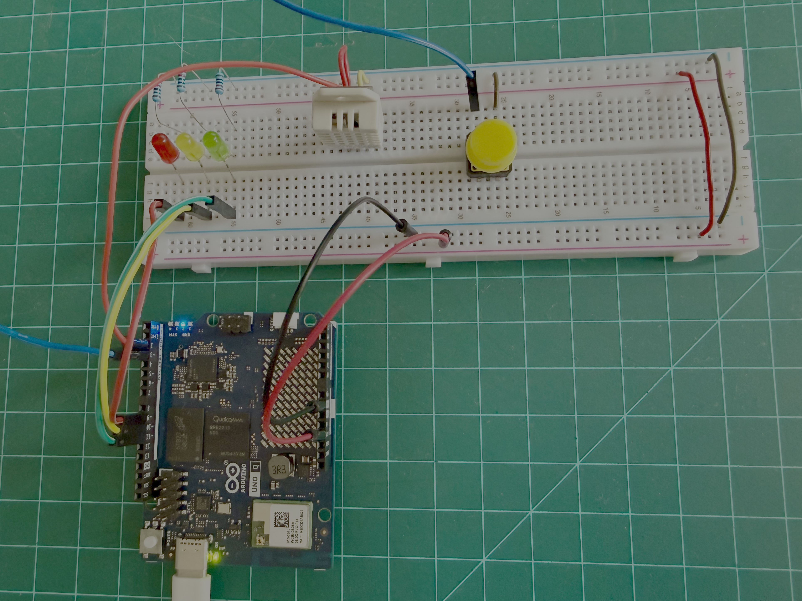

### Step 2 — `sketch/sketch.ino`

```cpp
#include "Arduino_RouterBridge.h"
#include <DHT.h>

#define DHTPIN  2
#define DHTTYPE DHT22

const int BTN_PIN = 3;
const int LED_R   = 9;    // red   = high risk
const int LED_Y   = 10;   // amber = medium risk
const int LED_G   = 11;   // green = low risk

DHT dht(DHTPIN, DHTTYPE);

unsigned long lastReading = 0;
const unsigned long READING_PERIOD_MS = 30000;

// ── Button state with debounce ──────────────────────────────
bool water_state = false;
int  last_btn_reading = HIGH;
int  btn_state        = HIGH;
unsigned long last_debounce_time = 0;
const unsigned long DEBOUNCE_MS = 50;

void updateButton() {
  int reading = digitalRead(BTN_PIN);
  if (reading != last_btn_reading) {
    last_debounce_time = millis();
  }
  if ((millis() - last_debounce_time) > DEBOUNCE_MS) {
    if (reading != btn_state) {
      btn_state = reading;
      if (btn_state == LOW) {            // falling edge = press
        water_state = !water_state;
        Serial.print("[btn] water_state -> ");
        Serial.println(water_state ? "YES" : "no");
      }
    }
  }
  last_btn_reading = reading;
}

void setLEDs(bool r, bool y, bool g) {
  digitalWrite(LED_R, r ? HIGH : LOW);
  digitalWrite(LED_Y, y ? HIGH : LOW);
  digitalWrite(LED_G, g ? HIGH : LOW);
}

// Print float as "X.YY" without depending on dtostrf or printf-float support.
void printFloat2(float v) {
  if (isnan(v)) { Serial.print("nan"); return; }
  if (v < 0)    { Serial.print("-"); v = -v; }
  int whole = (int)v;
  int frac  = (int)((v - whole) * 100.0f + 0.5f);
  if (frac >= 100) { whole++; frac -= 100; }
  Serial.print(whole);
  Serial.print(".");
  if (frac < 10) Serial.print("0");
  Serial.print(frac);
}

void setup() {
  pinMode(LED_R, OUTPUT);
  pinMode(LED_Y, OUTPUT);
  pinMode(LED_G, OUTPUT);
  pinMode(BTN_PIN, INPUT_PULLUP);

  Serial.begin(115200);
  dht.begin();
  Bridge.begin();

  // boot blink
  for (int i = 0; i < 3; i++) {
    setLEDs(true, true, true);  delay(150);
    setLEDs(false, false, false); delay(150);
  }
  setLEDs(false, false, true);  // green = ready
}

void loop() {
  updateButton();   // poll button every loop pass

  if (millis() - lastReading < READING_PERIOD_MS) return;
  lastReading = millis();

  float temp_c       = dht.readTemperature();
  float humidity_pct = dht.readHumidity();
  bool  standing_water = water_state;

  if (isnan(temp_c) || isnan(humidity_pct)) {
    Serial.println("DHT22 read failed");
    setLEDs(true, true, false);  // R+Y = sensor error
    return;
  }

  Serial.print("Classifying: ");
  printFloat2(temp_c);       Serial.print("C, ");
  printFloat2(humidity_pct); Serial.print("%, water=");
  Serial.println(standing_water ? "yes" : "no");

  setLEDs(true, true, true);   // all three on = inference in progress

  // Bridge.call() returns an RpcCall object — do NOT assign to String or use >>.
  // Use .result(var) to extract the return value: returns true on success.
  float risk_f = -1.0f;
  RpcCall rpc = Bridge.call("classify", temp_c, humidity_pct, standing_water);

  if (rpc.result(risk_f)) {
    int risk_code = (int)(risk_f + 0.5f);   // 0 = low, 1 = medium, 2 = high

    Serial.print("[result] risk_code=");
    Serial.println(risk_code);

    if      (risk_code == 0) setLEDs(false, false, true);   // green  — low
    else if (risk_code == 1) setLEDs(false, true,  false);  // yellow — medium
    else if (risk_code == 2) setLEDs(true,  false, false);  // red    — high
    else                     setLEDs(true,  false, true);   // R+G    — unexpected
  } else {
    Serial.print("[rpc error] code=");
    Serial.println(rpc.getErrorCode());
    Serial.print("[rpc error] msg=");
    Serial.println(rpc.getErrorMessage());
    setLEDs(true, false, true);   // R+G = RPC-level error
  }
}
```

**`RpcCall` API note:** `Bridge.call()` returns an `RpcCall` object. To extract the Python function's return value, call `.result(variable)` — it returns `true` on success and fills `variable` by reference. Don't attempt direct assignment (`String s = Bridge.call(...)`) or the stream operator (`>> variable`); neither is defined for `RpcCall`. On failure, `.getErrorCode()` and `.getErrorMessage()` give diagnostics. The Python wrapper returns a `float` (0/1/2), which the Bridge serializes cleanly in both directions.

**Common mistake:** `Bridge.call()` returns a value. Forgetting to capture it (or treating the call as fire-and-forget) is a silent bug: the sketch compiles and runs, but the MCU never sees what the SLM decided. Always capture the return value and validate it.

> **Note**: The exact `Bridge.call` return-value access syntax depends on the version of `Arduino_RouterBridge`. Check the library's `examples/` directory for the version installed on your board if the lines above do not compile cleanly.

### Step 3 — `sketch/sketch.yaml`

The `fqbn` (`arduino:zephyr:uno_q`) tells the compiler which board target to use. The DHT sensor library and its Adafruit Unified Sensor dependency are fetched from the Arduino Library Manager. `Arduino_RPClite` is the low-level transport backing Bridge RPC.

**Verify the library is available before the first build:**

```bash
arduino-cli lib list | grep -i dht
```

If nothing appears, install it manually:

```bash
arduino-cli lib install "DHT sensor library"@1.4.6
arduino-cli lib install "Adafruit Unified Sensor"@1.1.14
arduino-cli lib list | grep -i dht   # confirm it's there
```

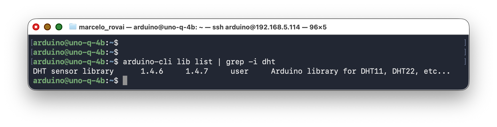

Next, if necessary, adapt the `sketch.yaml` according to the libraries:

```yaml
profiles:
  default:
    fqbn: 
    platforms:
      - platform: arduino:zephyr
    libraries:
      - DHT sensor library (1.4.6)
      - dependency: Adafruit Unified Sensor (1.1.14)
      - dependency: Arduino_RPClite (0.2.1)

default_profile: default
```

## 13. Running the Full Application

### Step 1 — Confirm llama-server Is Running

```bash
systemctl status llama-server --no-pager
curl -s http://127.0.0.1:8081/health
```

You should see `"status":"ok"`.

### Step 2 — Start the App

From inside `~/ArduinoApps/risk-classifier/`:

```bash
arduino-app-cli app start .
```

(or the `[Start]` button if you're using the Arduino App Lab)

The first run takes 2–3 minutes. `arduino-app-cli` builds the Python container, installs Flask and requests, compiles the sketch, and flashes the MCU.

**How to use it for testing:**

1. Power on. All LEDs blink three times, then the green LED stays on.
2. Press the button. The Serial Monitor (in Arduino App Lab) prints `[btn] water_state -> YES`. Press again to flip it back to `no`. The state holds between inferences.
3. Every 30 seconds, the sketch fires an inference. You'll see `Classifying: 25.30C, 60.20%, water=yes` (or no), then all three LEDs come on for ~30 s during inference, then back to the corresponding color depending on the "risk" when it's done.

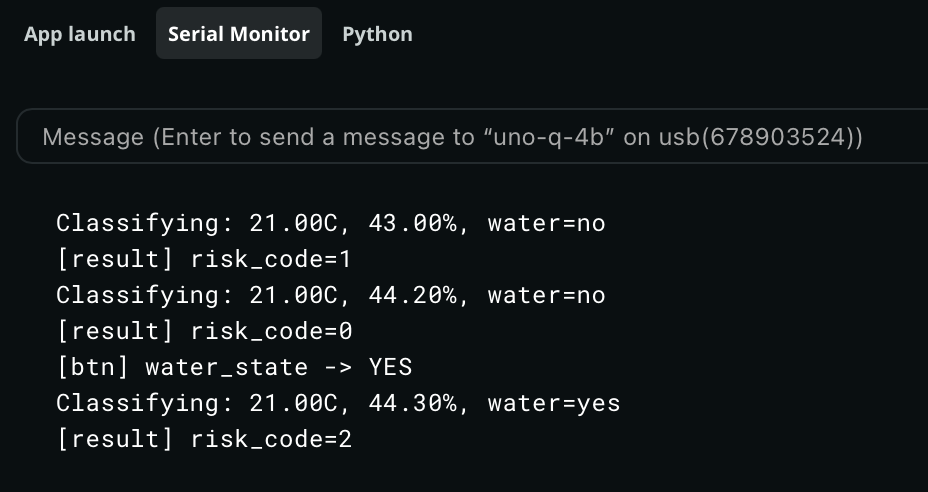

### Step 3 — Follow the Logs

In a second terminal (or the Arduino App Lab `Python` tab):

```bash
arduino-app-cli app logs . --follow
```

Every 30 seconds you should see lines like:

`Test Condition: Ambient temperature in the lab, button not pressed ("no water").`

```bash
[main] [classify] {'temp_c': 24.299999237060547, 'humidity_pct': 38.70000076293945, 'standing_water': False} -> {'risk': 'low', 'reason': 'Cool and dry temperatures with no standing water make dengue risk low.', 'latency_ms': 10772.6}
```

`Test Condition: Pressing the sensor between fingers, button pressed ("water").`

```bash
[main] [classify] {'temp_c': 27.600000381469727, 'humidity_pct': 87.80000305175781, 'standing_water': True} -> {'risk': 'high', 'reason': 'Warm humid conditions with standing water create ideal Aedes breeding habitat.', 'latency_ms': 10618.3}
```

Watch the RGB LEDs on the board. After each inference cycle, exactly one LED stays on: **green** for low risk, **yellow** for medium, **red** for high. Under ambient lab conditions (cool, dry, no water), you should see green; pressing the button and warming the sensor by hand should eventually turn it yellow or red.

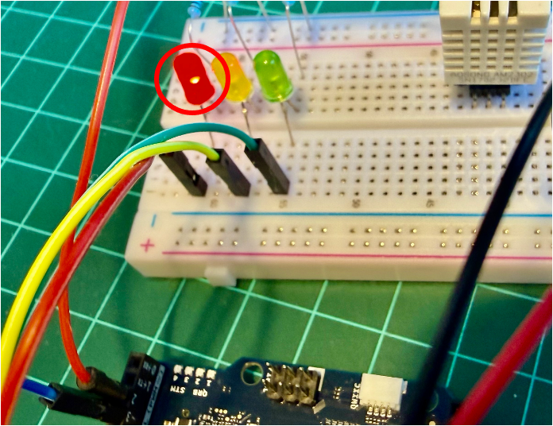

### Step 4 — Stop the App

```bash
arduino-app-cli app stop .
```

## 14. The Optional Flask Endpoint: Exposing the SLM Over HTTP

While the app is running, the Flask endpoint at port 7000 is available to any device on the same Wi-Fi network. From your host computer:

```bash
curl -X POST http://<UNO_Q_IP>:7000/classify \
  -H "Content-Type: application/json" \
  -d '{"temp_c": 30.1, "humidity_pct": 85, "standing_water": true}'
```

```bash
curl -X POST http://192.168.5.114:7000/classify \
  -H "Content-Type: application/json" \
  -d '{"temp_c": 30.1, "humidity_pct": 85, "standing_water": true}'
```

You should see:

```json
{
  "risk": "high",
  "reason": "Warm humid conditions with standing water create ideal Aedes breeding habitat.",
  "latency_ms": 8234.7
}
```

This is the same `classify()` function the MCU calls via Bridge — one logic path, two interfaces. From a phone, browser, or another UNO Q on the same network, the SLM is now a microservice.

### Creating a live dashboard for exhibiting the inference result

Once the Flask server is running, add a `GET /status` endpoint that returns the latest result, and a `GET /` route that serves a live dashboard. Two small additions to `main.py`, no new dependencies needed.

#### Changes to `python/main.py`

**1 — Add a global to store the last reading** (near the top, after `FLASK_PORT`):

```python
# Latest classification result — updated on every MCU reading
_last_status = {
    "risk": "unknown",
    "reason": "No reading yet.",
    "temp_c": None,
    "humidity_pct": None,
    "standing_water": None,
    "latency_ms": 0,
}
```

**2 — Update `classify_risk` to save the full state:**

```python
def classify_risk(temp_c, humidity_pct, standing_water):
    """Bridge-facing wrapper. Returns a float code: 0=low, 1=medium, 2=high.
    Also updates _last_status so the dashboard can show the latest verdict."""
    global _last_status
    verdict = classify(float(temp_c), float(humidity_pct), bool(standing_water))
    _last_status = {
        "risk":          verdict.get("risk", "unknown"),
        "reason":        verdict.get("reason", ""),
        "temp_c":        round(float(temp_c), 1),
        "humidity_pct":  round(float(humidity_pct), 1),
        "standing_water": bool(standing_water),
        "latency_ms":    verdict.get("latency_ms", 0),
    }
    return RISK_CODE.get(verdict.get("risk", "unknown"), -1.0)
```

**3 — Add two Flask routes** (alongside the existing `/classify` and `/healthz`):

```python
from flask import render_template_string   # add to the existing flask import line

@flask_app.route("/status", methods=["GET"])
def status_endpoint():
    return jsonify(_last_status), 200

@flask_app.route("/", methods=["GET"])
def dashboard():
    return render_template_string(DASHBOARD_HTML)
```

**4 — Add the dashboard HTML** (paste this constant before `flask_app = Flask(__name__)`):

```python
DASHBOARD_HTML = """
<!doctype html>
<html lang="en">
<head>
  <meta charset="utf-8">
  <meta name="viewport" content="width=device-width, initial-scale=1">
  <title>Dengue Risk Monitor · UNO Q</title>
  <style>
    * { box-sizing: border-box; margin: 0; padding: 0; }
    body { font-family: system-ui, sans-serif; background: #0f172a; color: #e2e8f0;
           display: flex; flex-direction: column; align-items: center;
           min-height: 100vh; padding: 2rem 1rem; }
    h1   { font-size: 1.3rem; letter-spacing: .05em; color: #94a3b8; margin-bottom: 2rem; }
    #card {
      width: 100%; max-width: 420px; border-radius: 1.5rem;
      padding: 2.5rem 2rem; text-align: center;
      transition: background .6s, box-shadow .6s;
      background: #1e293b; box-shadow: 0 0 0 0 transparent;
    }
    #card.low    { background: #14532d; box-shadow: 0 0 40px 4px #22c55e55; }
    #card.medium { background: #713f12; box-shadow: 0 0 40px 4px #eab30855; }
    #card.high   { background: #7f1d1d; box-shadow: 0 0 40px 4px #ef444455; }
    #risk-label  { font-size: 4rem; font-weight: 800; letter-spacing: .04em;
                   text-transform: uppercase; margin-bottom: .5rem; }
    #reason      { font-size: 1rem; color: #cbd5e1; margin-bottom: 2rem; min-height: 2.5em; }
    .metrics     { display: grid; grid-template-columns: 1fr 1fr 1fr;
                   gap: .75rem; margin-bottom: 1.5rem; }
    .metric      { background: #ffffff18; border-radius: .75rem; padding: .75rem .5rem; }
    .metric .val { font-size: 1.4rem; font-weight: 700; }
    .metric .lbl { font-size: .7rem; color: #94a3b8; text-transform: uppercase; }
    #meta        { font-size: .75rem; color: #64748b; }
    #dot         { display: inline-block; width: .5rem; height: .5rem;
                   border-radius: 50%; background: #64748b;
                   margin-right: .3rem; vertical-align: middle; }
    #dot.live    { background: #22c55e; animation: pulse 1.5s infinite; }
    @keyframes pulse { 0%,100%{opacity:1} 50%{opacity:.3} }
  </style>
</head>
<body>
  <h1>🦟 Dengue Risk Monitor &nbsp;·&nbsp; Arduino UNO Q</h1>
  <div id="card">
    <div id="risk-label">—</div>
    <div id="reason">Waiting for first reading…</div>
    <div class="metrics">
      <div class="metric"><div class="val" id="temp">—</div><div class="lbl">°C</div></div>
      <div class="metric"><div class="val" id="hum">—</div><div class="lbl">Humidity %</div></div>
      <div class="metric"><div class="val" id="water">—</div><div class="lbl">Water</div></div>
    </div>
    <div id="meta"><span id="dot"></span><span id="ts">connecting…</span></div>
  </div>

  <script>
    const COLORS = { low: "low", medium: "medium", high: "high" };
    const EMOJI  = { low: "🟢", medium: "🟡", high: "🔴", unknown: "⚪" };

    async function refresh() {
      try {
        const r = await fetch("/status");
        const d = await r.json();
        const card = document.getElementById("card");

        card.className = COLORS[d.risk] || "";
        document.getElementById("risk-label").textContent =
          (EMOJI[d.risk] || "") + " " + (d.risk || "unknown").toUpperCase();
        document.getElementById("reason").textContent = d.reason || "";
        document.getElementById("temp").textContent  =
          d.temp_c   !== null ? d.temp_c.toFixed(1)   : "—";
        document.getElementById("hum").textContent   =
          d.humidity_pct !== null ? d.humidity_pct.toFixed(1) : "—";
        document.getElementById("water").textContent =
          d.standing_water === null ? "—" : d.standing_water ? "YES" : "no";

        const dot = document.getElementById("dot");
        dot.className = "live";
        setTimeout(() => dot.className = "", 800);

        document.getElementById("ts").textContent =
          "Last reading: " + new Date().toLocaleTimeString() +
          "  ·  " + (d.latency_ms / 1000).toFixed(1) + " s inference";
      } catch(e) {
        document.getElementById("ts").textContent = "⚠ fetch error – retrying";
      }
    }

    refresh();
    setInterval(refresh, 5000);   // poll every 5 s
  </script>
</body>
</html>
"""
```

> The complete `main.py` can be found on the [project repo](https://github.com/Mjrovai/ARDUINO-UNO-Q/blob/main/Gen_AI_Edge/Scripts/main.py).

#### Usage

While the app is running, open a browser on any device on the same Wi-Fi network:

```
http://<UNO_Q_IP>:7000/
```

The page polls `/status` every 5 seconds and updates without a full reload. The card background changes color to match the risk level (green, amber, or red), matching the LED on the board.

The raw JSON endpoint is still available for other clients:

```
http://<UNO_Q_IP>:7000/status
```
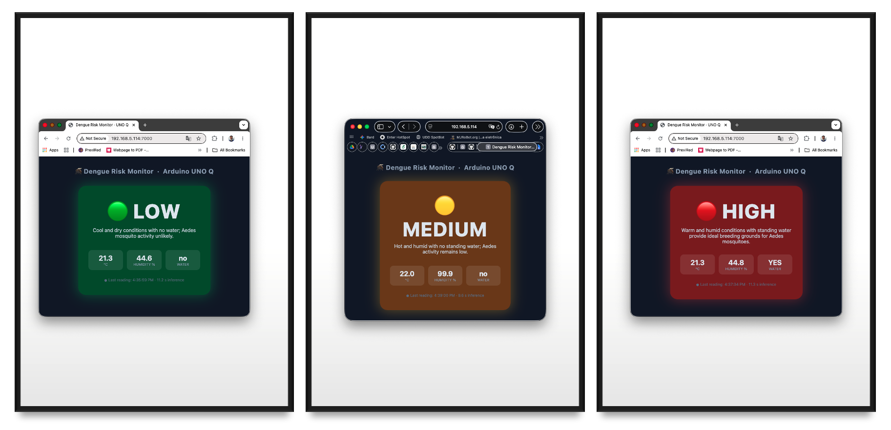

## 15. Performance: What to Actually Expect

Measured on a UNO Q 4 GB with the factory image, Qwen3.5-0.8B Q8_0, no heatsink, no fan:

| Metric | Value |
|---|---|
| Cold model load (boot of llama-server) | ~4 s |
| Idle RAM (llama-server + app running) | ~700–800 MB |
| Model + context memory usage | ~1,122 MiB |
| Prompt processing throughput | ~9.9 tokens/s |
| Generation throughput | ~4.75 tokens/s |
| End-to-end `classify()` latency | 6–12 s |
| CPU usage during decode | 4 cores @ 100% |
| Idle board temperature (no inference) | ~34 °C |
| Temperature during normal inference | ~54 °C |
| Temperature during sustained long answers | ~62 °C |
| Thermal throttle threshold | 70–80 °C (never reached) |

Honest takeaways:

- **Usable but not desktop-class.** Prompt processing at ~9.9 tok/s and generation at ~4.75 tok/s make the setup workable for periodic classification calls, but responses take 6–12 seconds depending on length. The ~1122 MiB memory footprint (model + context) leaves about 2.5 GB for the OS, App Lab container, and your Python app. Tight but viable on the 4 GB board.
- **Q4 quantization shows quality tradeoffs.** At 0.8B parameters, the model has less redundancy than a 7B model, so Q4 compression removes information that matters. Strong few-shot prompting and `presence_penalty=1.5` compensate for most of it, but some responses are weaker than a 1B+ model would produce. **Use Q8_0** or the Unsloth Dynamic quant if storage allows.
- **Thermal behavior is not a concern.** The +20 °C rise from idle to inference is modest, and even sustained workloads only reach ~62 °C, well under the 70–80 °C throttle threshold. The UNO Q runs cooler than a Raspberry Pi 5 under comparable loads. No heatsink is required for normal lab use.
- **Thinking mode kills the board.** With thinking enabled, the model spends 30–60 seconds generating internal reasoning chains before producing any output, and often loops without reaching a conclusion. Always run Qwen3.5 Small with `--reasoning off --reasoning-budget 0`.
- **Repetition loops.** Without `presence_penalty=1.5`, the model tends to repeat phrases or produce circular responses. A known behavior of small Qwen3.5 variants, well-documented in the Unsloth guide.

> **Token throughput vs. wall-clock latency**
>
> People often optimize for tokens/second when wall-clock latency is what actually matters. A 30-token verdict at 10 tok/s (3 s) feels twice as responsive as a 100-token verdict at 10 tok/s (10 s). Cap `max_tokens` aggressively and design prompts to keep responses short.

## 16. Tips, Tricks, and Troubleshooting

### llama-server Won't Start

Check the journal:

```bash
journalctl -u llama-server -n 50 --no-pager
```

Common causes: model file path wrong in the unit file, port 8080 already in use (`sudo lsof -i :8080`), or the GGUF file is incompatible with your llama.cpp version (rebuild or download newer binaries).

### Model Loops or Produces Very Long Responses

This almost always means thinking mode is active. Verify the `--reasoning off --reasoning-budget 0` flags are present in your systemd service. Also check that `presence_penalty` is set to 1.5 in your API calls.

Even with `--reasoning off`, Qwen3.5 may still emit an empty `<think></think>` tag in its output. That's cosmetic, and the `strip_think_blocks()` function in `main.py` handles it. The content inside the tags is empty, so no actual reasoning is happening.

If you see the deprecation warning about `--chat-template-kwargs`, update your command line to use `--reasoning off --reasoning-budget 0` instead.

### llama-cli Shows Reasoning Even With Flags

A known issue: `llama-cli` is less reliable than `llama-server` for suppressing Qwen 3.5 reasoning traces. For application integration, always use `llama-server`. The CLI is best reserved for quick experiments.

### Bridge.call Times Out

If the MCU times out waiting for `classify()`:

- Confirm Python logs show the request arriving (`arduino-app-cli app logs .`).
- Increase the Bridge call timeout on the MCU side (check `Arduino_RouterBridge` examples; some versions default to 5 seconds, which is less than the 6–12 s inference takes).
- Confirm llama-server is responding: `curl http://127.0.0.1:8081/health`.

### Out-of-Memory Crashes

If the kernel OOM-killer takes out your Python container:

- Confirm swap is enabled. Running `free -h` should show a non-zero swap size.
- Reduce the context length in the systemd service to 1024.

### JSON Parse Failures from the Model

Even with `response_format: json_object`, occasional models output stray text. The `parse_verdict` function in `main.py` already retries once. If failures persist:

- Strengthen the system prompt: add `"Output MUST start with { and end with }"`.
- Switch to llama.cpp grammar-based decoding.
  - Replace `response_format: {"type":"json_object"}` with a GBNF grammar that constrains output to exactly `{"risk": "<low|medium|high>", "reason": "<string>"}`.
- Try the Unsloth Dynamic quant (`UD-Q4_K_XL`), which sometimes produces cleaner output.

### Disk Space Running Low

```bash
df -h /
```

The root partition is ~9.8 GB total. If you're running low:

```bash
# Check what is using space
sudo du -sh /var/lib/docker 2>/dev/null
sudo du -sh /home/arduino/* | sort -h

# Clean unused Docker images from arduino-app-cli
arduino-app-cli system cleanup

# Clean apt cache
sudo apt clean
sudo apt autoremove -y
```

If you deleted the llama.cpp source tree and still need to rebuild later, use a shallow clone: `git clone --depth 1 https://github.com/ggml-org/llama.cpp`

### The Flask Endpoint Is Not Reachable From Outside

- Confirm `ports: [7000]` is in `app.yaml`.
- Confirm the host is on the same Wi-Fi network: `ping <UNO_Q_IP>`.
- Confirm Flask is bound to `0.0.0.0`, not `127.0.0.1`.
- Some networks isolate clients from each other. Try a hotspot from your phone.

## 17. Going Further

### Alternative SLM Backends

This tutorial used llama.cpp because it's the lowest-overhead path on a CPU-only ARM64 board. Three other backends worth knowing about:

- **Ollama** — easier setup, slightly higher overhead.
- **LiteRT-LM** — Google's `.litertlm` format with built-in function calling and Python presets. Officially supports Raspberry Pi (and therefore the UNO Q's aarch64 Debian). Tradeoff: limited to Gemma family models.
- **yzma** — a Go wrapper around llama.cpp with `purego` instead of CGo. Single Go binary, no daemon needed. Useful when you want to package everything into one executable for robotics demos.

### Function Calling with the SLM

Qwen3.5 supports function-calling formats. The natural pattern on the UNO Q is to register the **MCU sketch's** capabilities as tools the SLM can call: "read humidity," "set LED color," "trigger buzzer." The Python side mediates: the SLM emits a tool-call, Python forwards it over Bridge to the sketch, the sketch executes, the result goes back to the SLM, which then generates a final reply.

This inverts the data flow from this chapter — instead of the MCU calling Python, the SLM (via Python) calls the MCU. Both patterns are valid; function calling is more flexible but adds an extra round trip per tool use.

### Multimodal SLMs (Vision-Language Models)

Qwen3.5 has native multimodal capabilities. The 4B variant processes both text and images in a unified latent space. On the UNO Q 4 GB, the 0.8B model is text-only, but the architecture hints at what the upcoming VENTUNO Q (16 GB RAM) will enable: a single model that sees, reads, and reasons.

### Agentic AI assistant

For example, implement the **[QClaw](https://github.com/laurenvil/Uno-QClaw)** an on-device agentic AI assistant for the Arduino Uno Q, developed by [David Laurenvill](https://www.linkedin.com/in/david-laurenvil-3a223410/). It writes, compiles, and uploads Arduino sketches; captures camera frames; drives Linux-side LEDs; reports network state; and scans I²C buses — all running entirely on the board. No internet. No API keys. No cloud.

### Edge Impulse Integration

For applications where you want a *trained* classifier (rather than a general-purpose SLM doing zero-shot reasoning), Edge Impulse is the production path. The UNO Q has first-class Edge Impulse support. A practical hybrid: an Edge Impulse model handles high-frequency classification, while an SLM handles rare "I'm not sure" cases that need richer reasoning.

For example, a YOLO model could detect standing water in tires, triggering the "Water Switch" sensor automatically.

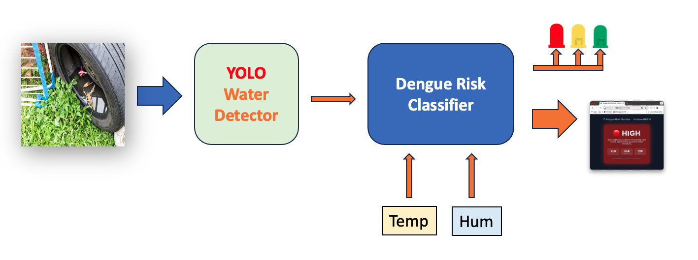

## 18. Conclusion

This tutorial built a complete generative-AI application on the UNO Q from scratch: we built llama.cpp from source, ran it as a system service with Qwen3.5-0.8B, wrote a Python application that exposes the SLM both to the on-board MCU via Bridge RPC and to off-board clients via Flask, and built an Arduino sketch that drives an RGB LED based on the SLM's verdict. We dealt with the real constraints of the hardware (a single 9.8 GB partition with limited free space, 4 GB of shared RAM, CPU-only inference on four Cortex-A53 cores) and found practical workarounds for each.

### Advantages of the UNO Q Approach for Generative AI

**For ML System Engineering:**

- **Local generative AI on Arduino hardware.** Until the UNO Q, "running an LLM on an Arduino" was a contradiction. Now, on the same board used for Blink, a language model classifies sensor data without an internet connection.
- **The dual-brain story comes to life.** Generative AI on the MPU plus real-time actuation on the MCU is exactly the boundary the dual-brain architecture was designed to expose. You see *why* you'd want both processors, not just *that* the board has them.
- **Standard production patterns.** systemd services, OpenAI-compatible HTTP APIs, structured-output JSON, Bridge RPC for IPC, Flask microservices. All real techniques you'll use in real edge-AI projects.

**Technical advantages:**

- The OpenAI-compatible API surface means the code can switch from local SLM to a cloud LLM (and back) with a one-line URL change.
- `response_format: json_object` and grammar-constrained decoding mean the SLM's output is reliable enough to drive actuators directly.
- Bridge RPC handles the IPC details so you can focus on logic rather than wire formats.

### Limitations and Considerations

Being honest about what doesn't work well at this scale:

- **Storage is tight.** The factory image leaves ~830 MB free on a single 9.8 GB partition. Building llama.cpp, downloading a model, and running an App Lab container all compete for that space. Students need to learn disk management as part of the tutorial — a useful skill, but also a friction point.
- **Q4 quantization degrades sub-1B models noticeably.** A 0.8B model at Q4 loses more quality than a 7B model at Q4 — less redundancy to exploit. Strong few-shot prompting and `presence_penalty` mitigate this, but don't eliminate it.
- **No NPU acceleration.** The QRB2210's Adreno 702 GPU is not a reliable llama.cpp target. CPU is the only option, and that means four A53 cores at 2 GHz doing all the work.
- **Thinking mode is unusable on this hardware.** Qwen3.5's reasoning mode produces multi-minute inference times and frequent loops on the UNO Q. Always use `--reasoning off --reasoning-budget 0`.
- **Ollama.** Ollama supports Qwen3.5, but with a higher memory overhead (~250 MB for the daemon). On the 4 GB UNO Q, llama.cpp's lighter footprint is the better fit.
- **SLM quality at this size is still uneven.** A 0.8B-parameter model will sometimes produce nonsense JSON, refuse benign prompts, or hallucinate reasons. Keep a human in the loop for any safety-critical decision.

### Where Generative AI Fits in the Edge AI Curriculum

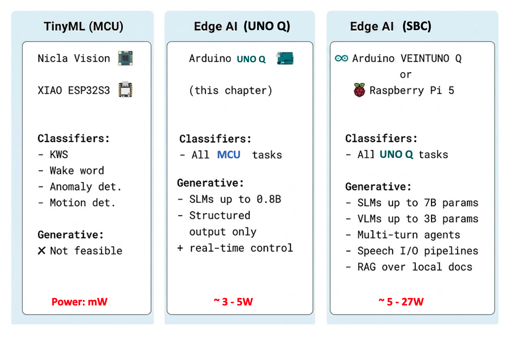

The UNO Q is where generative AI becomes possible at the edge but stays bounded: small models, short outputs, batch-rate inference. Students who understand the constraints here won't be surprised when they hit the same constraints on a real production deployment.

### What's Next

- **Function Calling and Tool Use on the UNO Q** — using the SLM to call MCU capabilities (read sensors, drive actuators) rather than just classify sensor data.
- **Vision-Language Models** — adding a USB camera and running a VLM that describes what it sees, with the MCU triggering snapshots and the MPU generating captions. Challenge with actual model sizes. 
- **Edge RAG on the UNO Q** — embedding local documents (datasheets, manuals, course notes) and using the SLM to answer questions about them, fully offline.

### A Note on the Arduino VENTUNO Q

The VENTUNO Q, with its 40 TOPS Dragonwing IQ8 NPU and 16 GB of RAM, will change what's realistic. SLMs with several billion parameters become interactive; multimodal Qwen3.5-4B (with native vision) becomes practical; multi-turn agents with tool use work in real time. The patterns from this chapter (Bridge RPC + Flask + systemd + OpenAI-compatible HTTP) port directly. Only the model sizes and the latency numbers change.

## 19. Resources

### Useful Resources

| Resource | URL |
|---|---|
| Project repository | <https://github.com/Mjrovai/ARDUINO-UNO-Q/tree/main/Gen_AI_Edge> |
| llama.cpp repository | <https://github.com/ggml-org/llama.cpp> |
| llama.cpp HTTP server docs | <https://github.com/ggml-org/llama.cpp/blob/master/tools/server/README.md> |
| Qwen3.5-0.8B GGUF (Bartowski) | <https://huggingface.co/bartowski/Qwen_Qwen3.5-0.8B-GGUF> |
| Qwen3.5-0.8B GGUF (Unsloth Dynamic) | <https://huggingface.co/unsloth/Qwen3.5-0.8B-GGUF> |
| Unsloth Qwen3.5 inference guide | <https://unsloth.ai/docs/models/qwen3.5> |
| Qwen3.5 reasoning control discussion | <https://github.com/ggml-org/llama.cpp/discussions/20476> |
| SmolLM2 GGUF family (Bartowski) | <https://huggingface.co/bartowski?search=SmolLM2> |
| Arduino UNO Q Documentation | <https://docs.arduino.cc/hardware/uno-q> |
| Arduino_RouterBridge library | <https://github.com/arduino-libraries/Arduino_RouterBridge> |
| Running LLMs on UNO Q with yzma | <https://projecthub.arduino.cc/marc-edgeimpulse/running-local-llms-and-vlms-on-the-arduino-uno-q-with-yzma-74e288> |
| LiteRT-LM (alternative SLM runtime) | <https://github.com/google-ai-edge/LiteRT-LM> |
| yzma (Go wrapper for llama.cpp) | <https://github.com/hybridgroup/yzma> |
| QClaw | <https://github.com/laurenvil/Uno-QClaw> |

### References

1. Qwen Team, "Qwen3.5 Small Model Series," Alibaba Cloud, March 2026.
2. Unsloth, "Qwen3.5 — How to Run Locally," <https://unsloth.ai/docs/models/qwen3.5>, March 2026.
3. Gerganov, G., "llama.cpp: Inference of Meta's LLaMA model (and others) in pure C/C++," <https://github.com/ggml-org/llama.cpp>
4. Bartowski, "Qwen_Qwen3.5-0.8B-GGUF," <https://huggingface.co/bartowski/Qwen_Qwen3.5-0.8B-GGUF>
5. llama.cpp discussion, "Qwen3.5 Small: How to truly disable thinking?" <https://github.com/ggml-org/llama.cpp/discussions/20476>
6. llama.cpp issue, "enable_thinking param cannot turn off thinking for qwen3.5," <https://github.com/ggml-org/llama.cpp/issues/20182>
7. Arduino, "Arduino UNO Q Product Page," <https://www.arduino.cc/product-uno-q/>
8. Arduino, "App CLI Documentation," <https://docs.arduino.cc/software/app-lab/tutorials/cli>
9. Pous, M., "Running local LLMs and VLMs on the Arduino UNO Q with yzma," Arduino Project Hub, Feb 2026.
10. Edge Impulse, "Arduino UNO Q," <https://docs.edgeimpulse.com/hardware/boards/arduino-uno-q>

---

*Tutorial created for IESTI05 — Edge AI Machine Learning System Engineering, UNIFEI. Licensed under GNU General Public License 3.0.*
