# Image Classification on the Arduino UNO Q

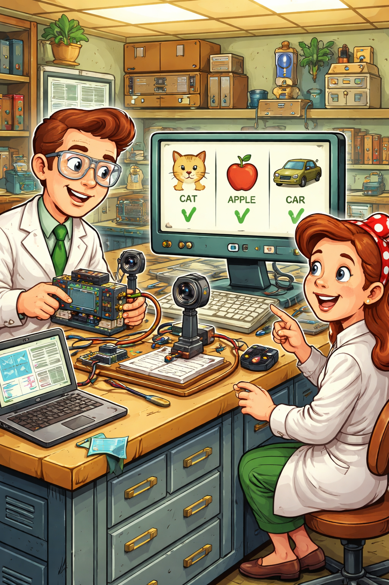

---

## Table of Contents

1. [Overview](#1-overview)
2. [Prerequisites](#2-prerequisites)
3. [Computer Vision and Image Classification](#3-computer-vision-and-image-classification)
4. [Part 1 — Running the Pre-Installed Image Classifier](#4-part-1--running-the-pre-installed-image-classifier)
5. [Part 2 — Building a Custom Image Classifier](#5-part-2--building-a-custom-image-classifier)
6. [Data Collection](#6-data-collection)
7. [Training the Model with Edge Impulse Studio](#7-training-the-model-with-edge-impulse-studio)
8. [Deploying to the UNO Q — Path A: App Lab Bricks (Static Images)](#8-deploying-to-the-uno-q--path-a-app-lab-bricks)
9. [Deploying to the UNO Q — Path B: Live Camera](#9-deploying-to-the-uno-q--path-b-live-camera)
10. [Post-Processing: MCU Actuation via Bridge](#10-post-processing-mcu-actuation-via-bridge)
11. [Performance Analysis](#11-performance-analysis)
12. [Exercises](#12-exercises)
13. [Conclusion](#13-conclusion)
14. [Resources](#14-resources)

---

## 1. Overview

In the [previous tutorial](../setup/setup.qmd), we set up the Arduino UNO Q for headless development using ADB, SSH, and VS Code Remote-SSH. Now, we put that foundation to work with our first Edge AI application: **Image Classification**.

Image classification is the "Hello World" of computer vision and machine learning — given an image, the model assigns it to one of several predefined categories. It is one of the most widely deployed ML tasks at the edge, powering applications from quality inspection in factories to wildlife monitoring in the field.

In this tutorial, we will:

- **Part 1**: Run the UNO Q's pre-installed image classification example — a **static image classifier** where you upload a photo through a web browser and receive the classification result.
- **Part 2**: Build a **custom image classifier** from scratch using Edge Impulse Studio — training it to distinguish between a toy robot and a small Brazilian parrot (Periquito) — and deploy it to the UNO Q using **two different approaches**: Using the App Lab Bricks for static images and live webcam inference.

Along the way, we will use the UNO Q's dual-brain architecture: **Python on the MPU** for AI inference and an **Arduino sketch on the MCU** for physical actuation (LEDs, LED matrix) — connected through Bridge RPC.

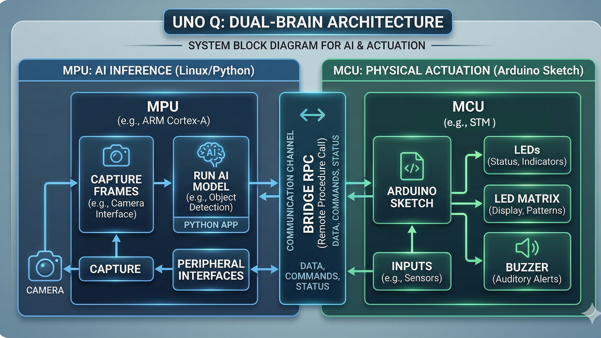

### What You Will Learn

- How the pre-installed image classification Brick works (static image → web UI)
- How to go from static classification to **live webcam inference**
- How to collect image data and train a custom classifier with Edge Impulse Studio
- How to deploy models via **App Lab Bricks**
- How to bridge inference results to the MCU for real-time physical feedback

---

## 2. Prerequisites

> **Before starting this tutorial, make sure you have:**
>
> - Completed the [Arduino UNO Q Setup Tutorial](../setup/setup.qmd) — UNO Q connected via SSH / VS Code Remote-SSH
> - An Edge Impulse account (free at [edgeimpulse.com](https://edgeimpulse.com))
> - A USB webcam (most USB webcams work — e.g., Logitech C270 or similar)
> - A USB hub with power delivery (to connect both the webcam and power to the UNO Q)

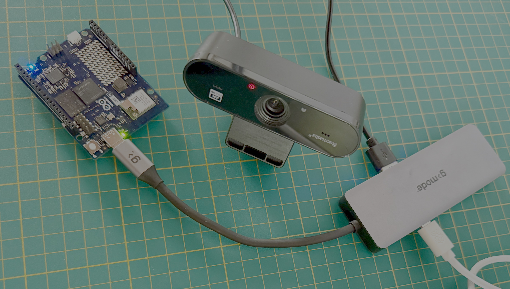

### Hardware

| Item | Purpose |
|---|---|
| Arduino UNO Q (2 GB or 4 GB) | Edge AI inference + MCU actuation |
| USB webcam | Image capture (for Part 2 — live inference) |
| USB hub with PD | Connect webcam + power to the single USB-C port |
| (Optional) Toy robot + Periquito | Classification targets for the custom model |

### Software

| Tool | Where |
|---|---|
| VS Code + Remote-SSH | On your host computer (connected to UNO Q) |
| Edge Impulse Studio | Browser: [studio.edgeimpulse.com](https://studio.edgeimpulse.com) |
| Edge Impulse Linux CLI + Python SDK | Installed on the UNO Q (in Part 2) |

---

## 3. Computer Vision and Image Classification

At its core, computer vision enables machines to interpret and make decisions based on visual data — essentially mimicking the capability of the human optical system. When we bring ML algorithms into computer vision projects, we supercharge the system's ability to understand, interpret, and react to visual stimuli.

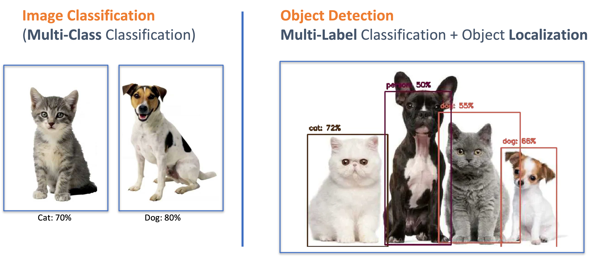

When discussing computer vision applied to embedded devices, the most common applications are **Image Classification** and **Object Detection**:

- **Image Classification**: Assigns a single label to the entire image ("This is a robot" or "This is a periquito").
- **Object Detection**: Locates objects in the image, drawing bounding boxes and assigning labels to each detected object.

In this chapter, we cover **Image Classification**. Object Detection will be covered in the [next tutorial](../object_detection/object_detection.qmd).

### From Nicla Vision to UNO Q

If you have worked through the [TinyML Made Easy](https://mjrovai.github.io/TinyML_Made_Easy_NiclaV_eBook/) e-book, you have already built an image classifier on the Arduino Nicla Vision. Here is how the UNO Q approach differs:

| Aspect | Nicla Vision | Arduino UNO Q |
|---|---|---|
| **Camera** | Built-in GC2145 (320x240) | External USB webcam (up to 1080p) |
| **Data Collection** | OpenMV IDE + built-in camera | Edge Impulse Studio (smartphone, webcam, or upload) |
| **Model size** | MobileNetV2 0.05/0.1 (96x96, INT8) | MobileNetV2 0.35 or larger (96x96 to 320x320) |
| **Inference engine** | TF Lite for Microcontrollers (C++) | Edge Impulse Linux SDK or App Lab Bricks (Python) |
| **RAM for model** | ~256 KB SRAM | 2-4 GB LPDDR4X |
| **Actuation** | Direct GPIO from MCU | MCU via Bridge RPC |
| **IDE** | OpenMV IDE / Arduino IDE | VS Code Remote-SSH + terminal CLI |

The UNO Q can handle **larger, more accurate models** and **higher-resolution input** because inference runs on the Linux MPU with gigabytes of RAM. But the Nicla wins on **power consumption** (milliwatts vs. watts) and **latency** for very small models.

---

## 4. Part 1 — Running the Pre-Installed Image Classifier

The UNO Q ships with a pre-installed image classification example. This example uses an **ImageClassification Brick** and a **WebUI Brick** to provide a browser-based interface for uploading an image and receiving classification results. 

> **No webcam is needed for this step.**

### Understanding the Architecture

The pre-installed `examples:image-classification` app works as follows:

```
Browser (your PC)                          UNO Q (MPU / Python)
+-------------------+                     +-------------------------+
|                   |   Upload image      |                         |
|  Web UI (port     | ------------------> |  ImageClassification    |
|  7000)            |   (base64 via       |  Brick                  |
|                   |    WebSocket)       |                         |
|  Shows results    | <------------------ |  Returns labels +       |
|  (labels +        |   Classification    |  confidence scores      |
|  confidence)      |   result            |                         |
+-------------------+                     +-------------------------+
```

Key points:

- The classification runs on **static images** that you upload through the browser — there is no live camera feed.
- Results are displayed in the browser, not in the terminal logs.
- There is no Bridge communication to the MCU in this example.
- The ImageClassification Brick handles model loading, image preprocessing, and inference internally.

### Step 1 — Start the Example

SSH into the UNO Q (or use the VS Code integrated terminal) and run:

```bash
arduino-app-cli app start examples:image-classification
```

Wait for the app to build and start.

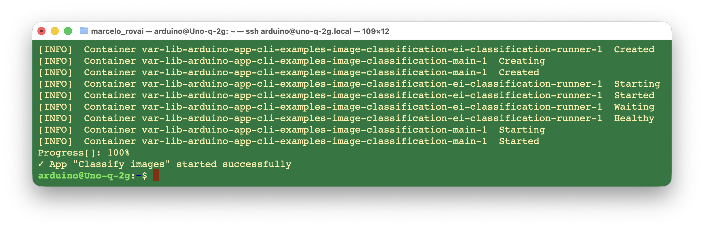

### Step 2 — Open the Web UI

On your host computer, open a web browser and navigate to:

```
http://<UNO_Q_IP_ADDRESS>:7000
```

You should see a web interface with an **upload button** that lets you select an image file from your computer.

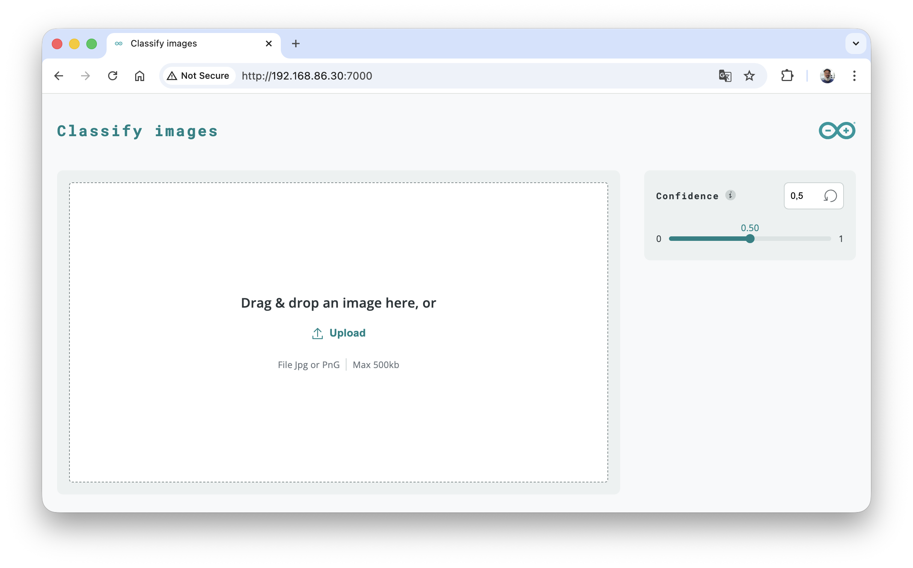

### Step 3 — Classify an Image

1. Click the upload button and select a photo from your computer (e.g., a picture of an animal, a car, a household object).
2. The image is sent to the UNO Q, where the ImageClassification Brick processes it.
3. After a moment, the classification result appears in the browser — showing the detected label(s), and the confidence scores..

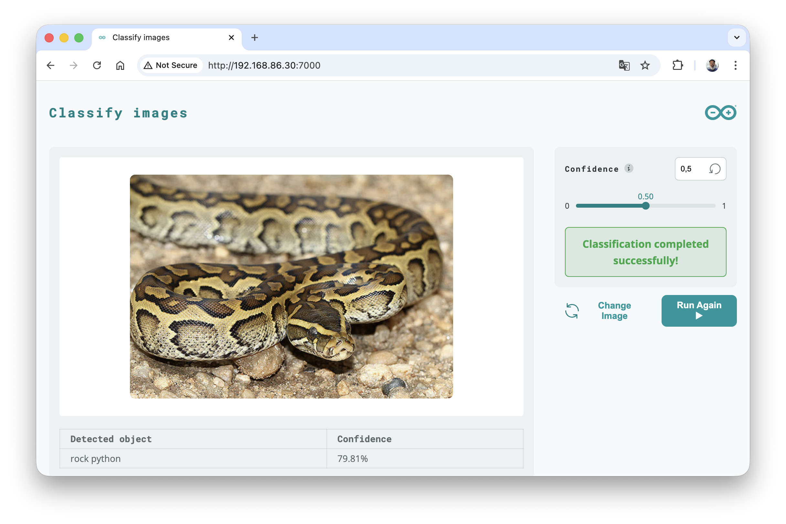

Try uploading different images and observe how the model classifies them.

> **Note**: The terminal logs (`arduino-app-cli app logs examples:image-classification`) will show the app startup messages but **will not show the classification results** — those are sent directly to the browser via WebSocket.

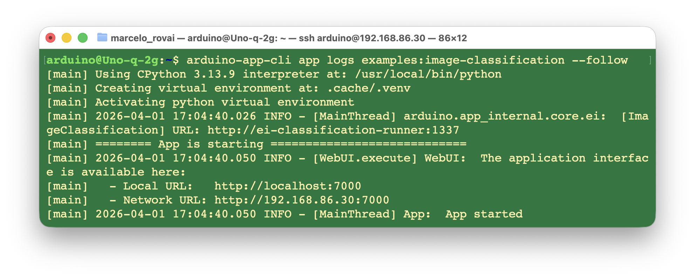

### Step 4 — Study the Source Code

Open the example in VS Code to understand how it works:

1. In VS Code (Remote-SSH), go to **File > Open Folder...**
2. Navigate to `var/lib/arduino-app-cli/examples/image-classification/`
3. Open `python/main.py`.

The key components:

```python
# The Bricks handle all the heavy lifting
from arduino.app_bricks.web_ui import WebUI
from arduino.app_bricks.image_classification import ImageClassification

# Initialize the classification brick (loads the model internally)
image_classification = ImageClassification()

# Callback: when the browser sends an image, classify it and return the result
def on_classify_image(client_id, data):
    image_data = data.get('image')              # Base64-encoded image from browser
    image_bytes = base64.b64decode(image_data)
    pil_image = Image.open(io.BytesIO(image_bytes))
    results = image_classification.classify(pil_image)   # Run inference
    ui.send_message('classification_result', response)   # Send back to browser

# Set up the WebUI and register the callback
ui = WebUI()
ui.on_message('classify_image', on_classify_image)
App.run()
```

Notice that:

- `ImageClassification()` is a **Brick**—a prebuilt module that encapsulates the model and inference logic.
- `WebUI()` provides the web server and WebSocket communication.
- `App.run()` starts the app **without a `user_loop`** — it is event-driven (triggered by browser uploads).
- There is **no `Bridge.call()`** — the MCU is not involved.

### Step 5 — Stop the Example

```bash
arduino-app-cli app stop examples:image-classification
```

### Runing an Example from Arduino App Lab

We will not go into more detail here because there is plenty of documentation on it. But the main steps are:

1. Open the Arduino App Lab on your main computer and connect your Arduino UnoQ via WiFi
2. Enter your password (8 digits)
3. On `Examples`, go to `Classify Images`

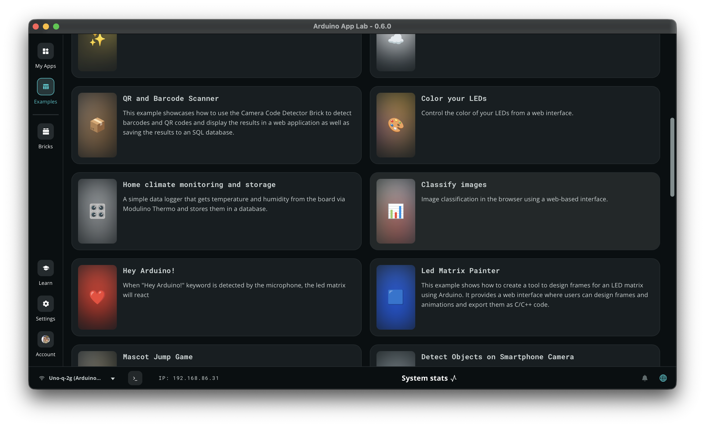

4. Run it. The Web GUI will be opened automatically, as we saw before. 

### What We Learned from Part 1

The pre-installed example demonstrates the **Brick-based approach**: high-level components that abstract away model loading, image processing, and web communication. This is convenient for quick demos, but it has limitations:

- Static images only (no live camera feed)
- Results stay in the browser (no MCU actuation)
- Limited control over the inference pipeline

In Part 2, we will build our own classifier that overcomes all of these limitations.

---

## 5. Part 2 — Building a Custom Image Classifier

Now we build a custom classifier from scratch. Following the same project used in the [TinyML Made Easy](https://mjrovai.github.io/TinyML_Made_Easy_NiclaV_eBook/content/image_classification/image_classification.html) e-book, we will train a model to classify three categories:

- **Robot** — a small toy robot
- **Periquito** — a small Brazilian parrot toy
- **Background** — no object present

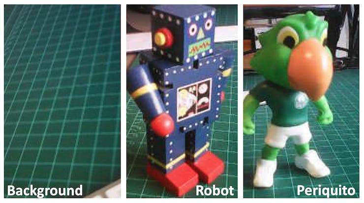

### Project Goal

Build a system that **continuously** captures frames from a USB webcam, classifies what it sees, and provides physical feedback through the MCU:

```
USB Webcam -> Python (MPU) -> EI model -> "robot" / "periquito" / "background"
                                               |
                                   Bridge.call("show_result", label, confidence)
                                               |
                                       MCU (Arduino sketch)
                                       -> RGB LEDs (color per class)
                                       -> LED matrix (icon per class)
```

This is fundamentally different from Part 1: **live inference** (not static uploads), **MCU actuation** (not just browser display), and a **custom model** (not a generic pre-trained one).

We show **two deployment paths** — you can choose one or try both:

- **Path A (Section 8)**: Deploy via **App Lab Bricks** — uses the same Brick architecture as the pre-installed example, but with your custom Edge Impulse model. Quick to set up, but limited to static uploads.
- **Path B (Section 9)**: Deploy via the **Edge Impulse Linux Python SDK** — gives you full control over the inference pipeline, live camera capture, and Bridge communication. **Recommended for real projects.**

---

## 6. Data Collection

The most crucial step in any ML project is collecting a high-quality dataset.

### Option A: Using Edge Impulse Studio with a Smartphone (Recommended)

1. Go to [Edge Impulse Studio](https://studio.edgeimpulse.com) and create a new project (e.g., "[UNO-Q Image Classification](https://studio.edgeimpulse.com/studio/947334)").
2. Go to **Devices** and click **Connect a new device**.
3. Select **Use your mobile phone** — a QR code will appear.
4. Scan the QR code with your smartphone.
5. Once connected, go to **Data acquisition**.
6. Set the **Label** (e.g., "periquito"), select **Camera**, and click **Start sampling**.
7. Capture **~50-60 images** from different angles, distances, and lighting conditions.
8. Repeat for "robot" and "background".

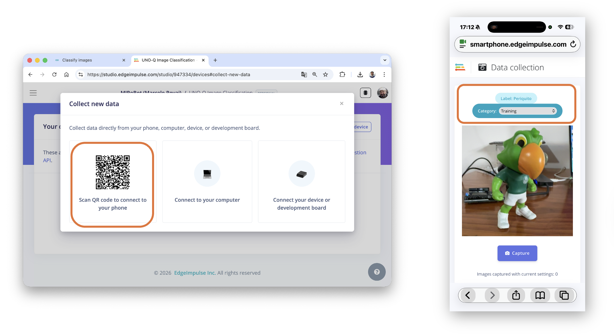

### Option B: Capturing Images on the UNO Q

You can capture images directly from the USB webcam on the UNO Q. For that, create a script, for example:  `capture_images.py`:

```python
import cv2
import os
import time

label = "robot"  # Change for each class
output_dir = f"/home/arduino/dataset/{label}"
os.makedirs(output_dir, exist_ok=True)

cap = cv2.VideoCapture(0)
cap.set(cv2.CAP_PROP_FRAME_WIDTH, 320)
cap.set(cv2.CAP_PROP_FRAME_HEIGHT, 240)

count = 0
print(f"Capturing images for class '{label}'. Press Ctrl+C to stop.")
try:
    while count < 60:
        ret, frame = cap.read()
        if ret:
            filename = f"{output_dir}/{label}_{count:03d}.jpg"
            cv2.imwrite(filename, frame)
            print(f"Saved: {filename}")
            count += 1
            time.sleep(0.5)
except KeyboardInterrupt:
    pass
cap.release()
print(f"Captured {count} images for '{label}'.")
```

Install OpenCV if needed:

```bash
# On Debian/Ubuntu systems, you need to install the python3-venv package using the following command.

sudo apt install python3.13-venv

# 1) criar o env (ainda NÃO existe a pasta cv2-env)
python3.13 -m venv ~/envs/cv2-env

# 2) ativar o env
source ~/envs/cv2-env/bin/activate

# 3) instalar OpenCV (melhor a versão headless)
pip install --upgrade pip
pip install opencv-python-headless

# 4) run the script:
python3 capture_images.py
```

> The images will be stored on the Uno-Q (dataset/robot, periquito, etc.). Using VSCode, copy the images to your computer, then upload them to Edge Impulse Studio via **Data acquisition > Upload data**.

### Option C: Reusing Images from the Nicla Vision Tutorial

If you already have images from the TinyML Made Easy e-book, upload them to Edge Impulse Studio via **Data acquisition > Upload data**, selecting the correct label for each batch.

### Dataset Guidelines

- **~50-60 images per class** (minimum)
- **Varied angles, lighting, and backgrounds**
- **Include a "background" class** (images with no target objects)

> **Tip**: More diverse training data produces more robust models.

---

## 7. Training the Model with Edge Impulse Studio

### Step 1 — Verify the Dataset

In Edge Impulse Studio, go to **Data acquisition** and verify your data is correctly labeled and balanced.

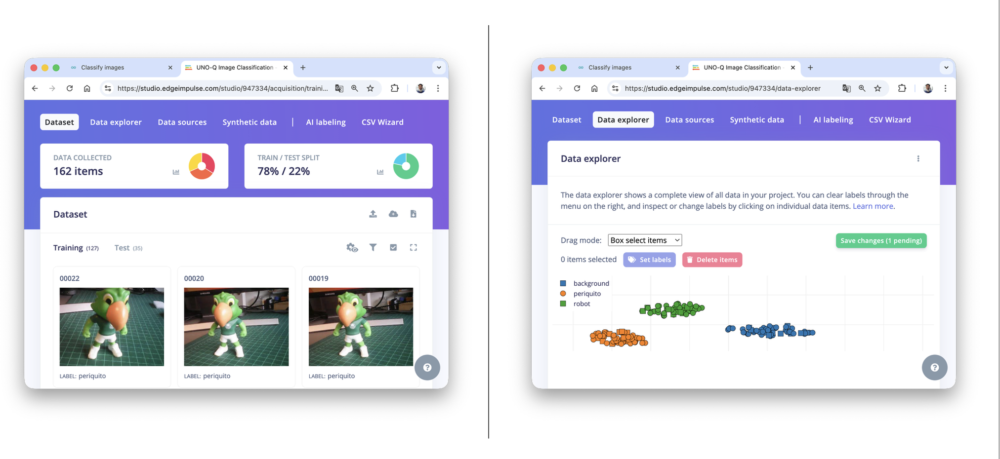

> You can clone a similar project: [NICLA-Vision_Image_Classification](https://studio.edgeimpulse.com/public/273858/latest)

### Step 2 — Create the Impulse

1. Go to **Create impulse**.
2. Set input size: **160x160** for higher accuracy on UNO Q.
3. Add **Image** as the processing block.
4. Add **Transfer Learning (Images)** as the learning block.
5. Set output features: `robot`, `periquito`, `background`.
6. Click **Save Impulse**.

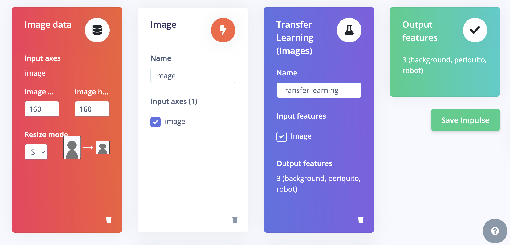

### Step 3 — Generate Features

1. Go to the **Image** tab.
2. Set color depth to **RGB**.
3. Click **Save parameters**, then **Generate features**.

### Step 4 — Train the Model

1. Go to the **Transfer Learning** tab.
2. Select **MobileNetV2 160x160 1.0** (recommended for UNO Q).
3. Set training cycles to **20**.
4. Enable **Data augmentation**.
5. Click **Start training**.

Review the accuracy, confusion matrix, and on-device performance.

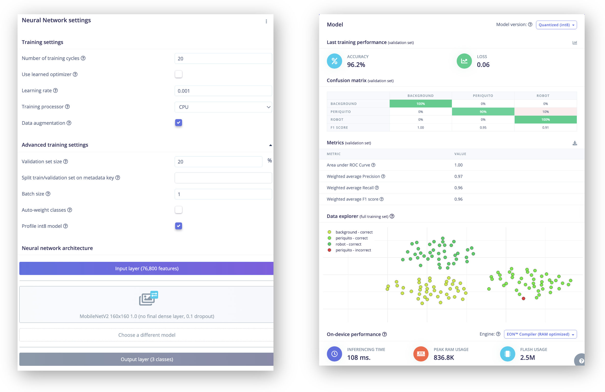

On Training, the model reached a high accuraccy (with a estimated latency of 100ms). With models with smaller alphas (0.35, for example), we can get faster inferences with similar accuraccy. you should test the better parameters for you project.

### Step 5 — Test the Model

Go to **Model testing**. On settings, **enable Int8** and click **Classify all** to validate on the test dataset.

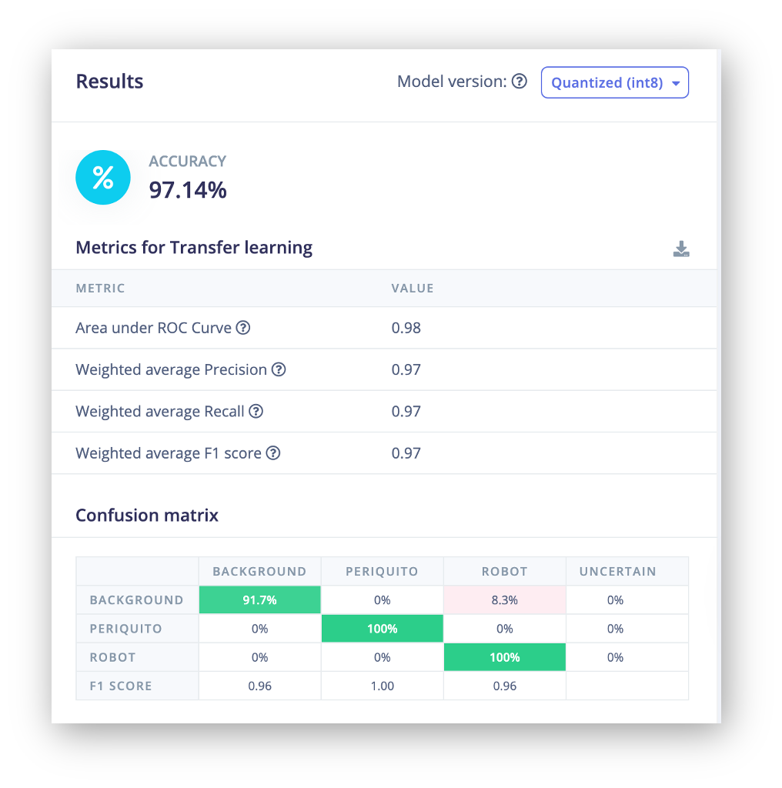

---

## 8. Deploying to the UNO Q — Path A: App Lab Bricks

This path uses the Brick architecture with your custom model. Quick to set up, but limited to **static image uploads** via the browser.

### Step 1 — Copy the Pre-Installed Example

We can copy an example using CLI as below 

```bash
cp -r /var/lib/arduino-app-cli/examples/image-classification/ ~/ArduinoApps/my-classifier-bricks
```

Or directly on the Arduino App Lab, giving it a new name. The project will be copied to `My Apps` area. 

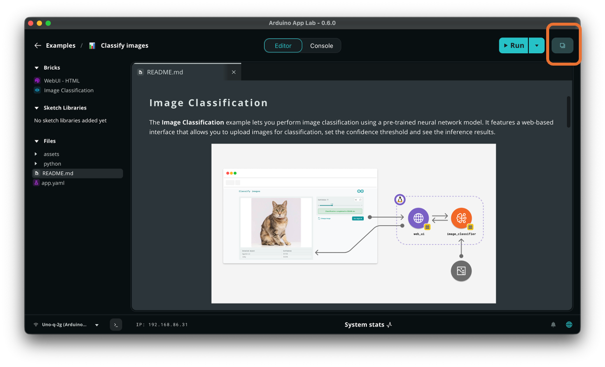

### Step 2 — Export the Model from Edge Impulse to the Arduino App Lab

1. In the copied example, stored on the `My Apps` area, go to the `Bricks/Image Classification`, select `AI models` and `Train new AI model`

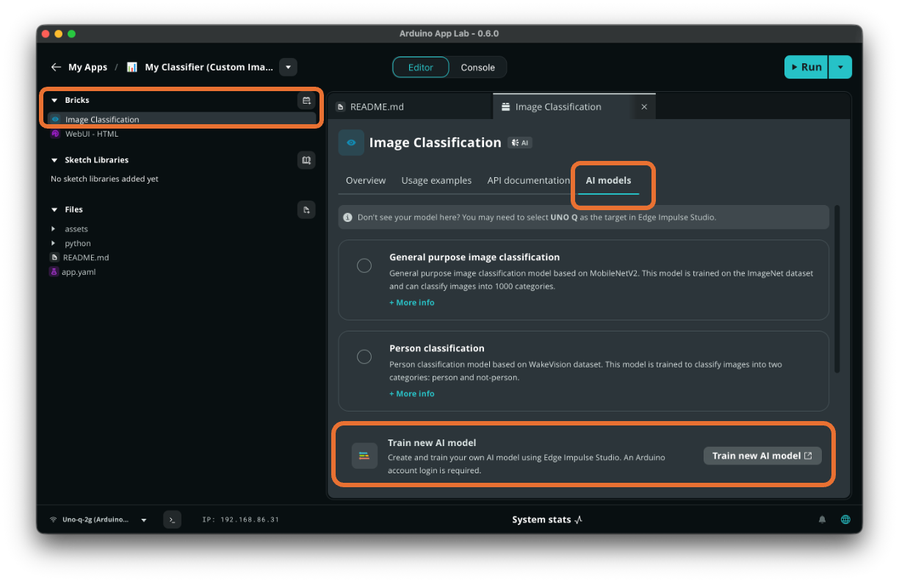

2. An window will ask you to log in the Arduino/Edge Impulse account. Do it and you will be direct your Edge Impulse Studio project list. Enter in your project (in my case: [UNO-Q Image Classification](https://studio.edgeimpulse.com/studio/947334))
3. In the project, go to **Deployment**.
4. Select **Arduino UNO Q** as the target (or **Linux AARCH64**).
5. Click **Build** and download the model file.

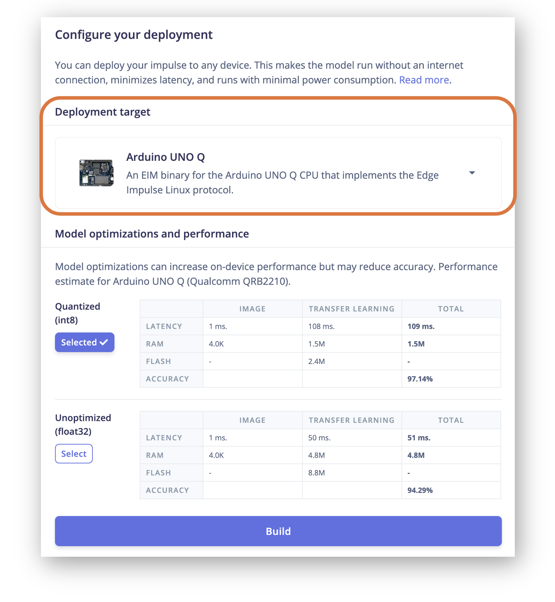

When the project is built, the .eim file will be downloded directly to your computer and a Pop-up window will appear, with a button `Go to Arduino`. When you do it, the model will be sent to App Lab.

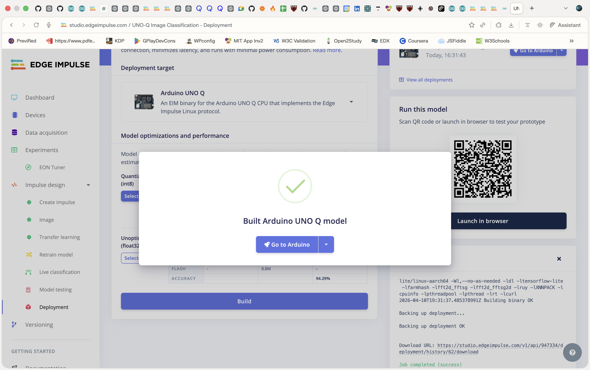

> Note that you can test your model, downloading it to your mobile of PC, using the Bar code availabel on the deploy page. 

### Step 3 — Replace the Model on the Uno-Q

At the `AI Models` area of your project, the model will be available, download it to the Uno-Q and after that select it.

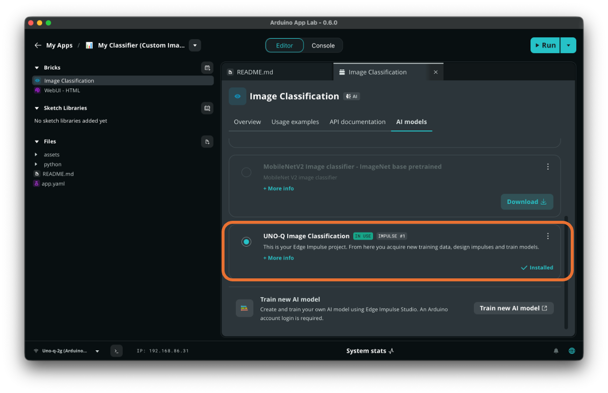

On the project folder (`~/ArduinoApps/my-classifier-bricks`) , the Brick configuration in `app.yaml` is automatically updated to point to your custom model.:

```python
name: My Classifier (Custom Images)
description: Custom Image classification in the browser using a web-based interface.
ports: []
bricks:
- arduino:image_classification:
    model: ei-model-947334-1
- arduino:web_ui: {}
icon: 📊
```

The model (`model.eim`), will be saved on `/home/arduino/.arduino-bricks/models/custom-ei/ei-model-947334-1`

### Step 4 — Run the App

```bash
cd ~/ArduinoApps/my-classifier-bricks
arduino-app-cli app start .
```

Open `http://<UNO_Q_IP>:7000` in your browser. Upload images of your robot, periquito, or background — the classifier now uses **your custom model**.

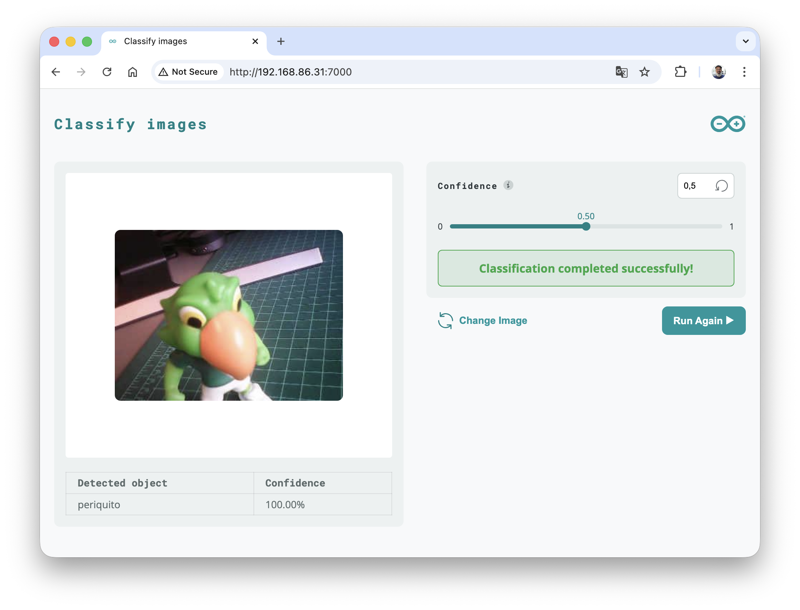

> **Limitation**: This approach still uses **static image uploads** via the browser. For **live webcam inference** with MCU actuation, proceed to Path B.

But, before it, let's change the `main.c` file to show the info about our new model and to print the inference result. 

First, stop the app:

```bash
arduino-app-cli app stop .
```

On the `main.c` file, enter with the code:

```python
from arduino.app_utils import App
from arduino.app_bricks.web_ui import WebUI
from arduino.app_bricks.image_classification import ImageClassification
from PIL import Image
import io
import base64
import time

image_classification = ImageClassification()

def print_model_info(image_classification):
    info = image_classification.get_model_info()
    if info is not None:
        print("Model info:")
        for attr in dir(info):
            if not attr.startswith("_") and not callable(getattr(info, attr)):
                print(f"  {attr}: {getattr(info, attr)}")
    else:
        print("Failed to retrieve model info.")

def on_classify_image(client_id, data):
    """Callback function to handle image classification requests."""
    try:
        image_data = data.get('image')
        image_type_raw = data.get('image_type')
        if image_type_raw:
            image_type = image_type_raw.split('/')[-1]
        else:
            image_type = 'jpeg'
        confidence = data.get('confidence', 0.25)
        if not image_data:
            ui.send_message('classification_error', {'error': 'No image data'})
            return

        image_bytes = base64.b64decode(image_data)
        pil_image = Image.open(io.BytesIO(image_bytes))

        start_time = time.time() * 1000
        results = image_classification.classify(pil_image, image_type=image_type, \
                                                confidence=confidence)
        print(f"\nInference: {results}")
        diff = time.time() * 1000 - start_time
        print(f"Latency: {diff:.2f} ms")
        if results is None:
            ui.send_message('classification_error', {'error': 'No results returned'})
            return

        response = {
            'success': True,
            'results': results,
            'processing_time': f"{diff:.2f} ms"
        }
        ui.send_message('classification_result', response)

    except Exception as e:
        ui.send_message('classification_error', {'error': str(e)})

print_model_info(image_classification)
ui = WebUI()
ui.on_message('classify_image', on_classify_image)

App.run()
```

Run the app:

```bash
arduino-app-cli app start .
```

Open a second terminal, go to the project folder and run:

```bash
cd ~/ArduinoApps/my-classifier-bricks
arduino-app-cli app logs . --follow
```

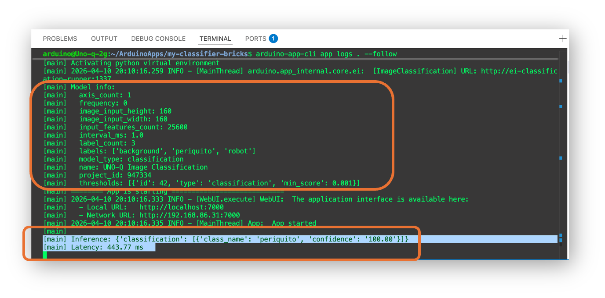

We can see that our custom classification model receives images of 160x160 and that our labels are: 

`labels: ['background', 'periquito', 'robot']`

The latency of this model is around 444 ms, or a little over 2 FPS. 

> If we need a faster model, we can train a new model using a small image (as 96x96) or a reduced model, with an Alpha as 0.35 for example.

---

## 9. Deploying to the UNO Q — Path B: Live Camera

This path gives you full control: live webcam capture, continuous classification, and Bridge communication to the MCU.

### Step 1 — Create a new App on Arduino App Lab

On The Arduino App Lab `My Apps`, click on the upper righ button `Create new app`

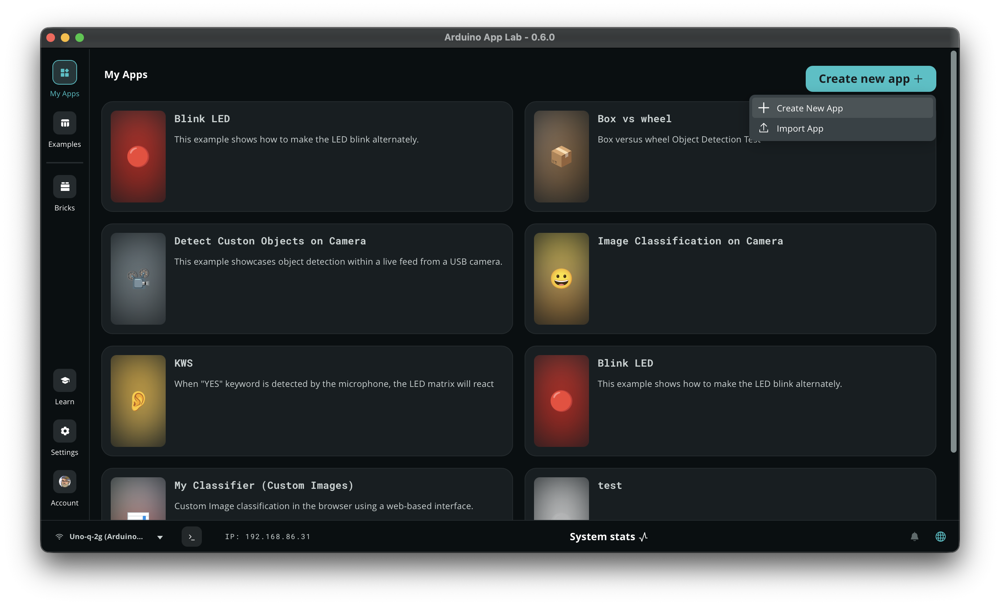

And name it, for example: `Image Classification on Camera`.

### Step 2 — Import a Brick  and Select the Model

Go to `Bricks`  and click on `Add Brick`. 

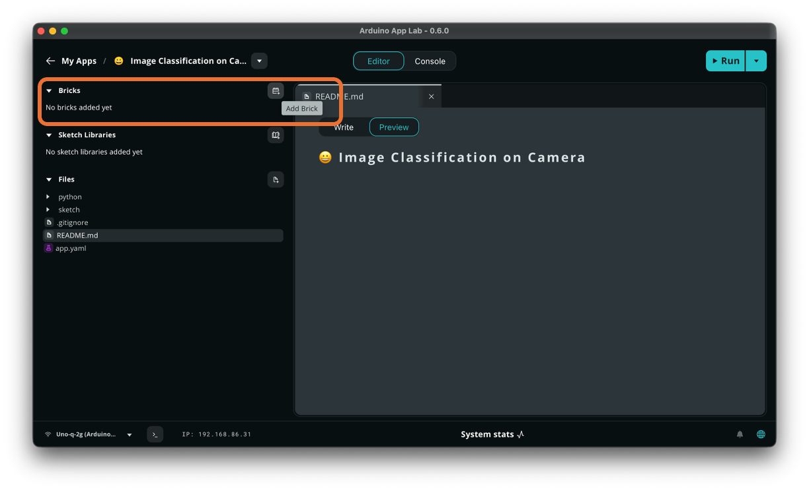

A list of available Bricks will appear, Scroll down untill `Video Image Classification` and `Add brick`.

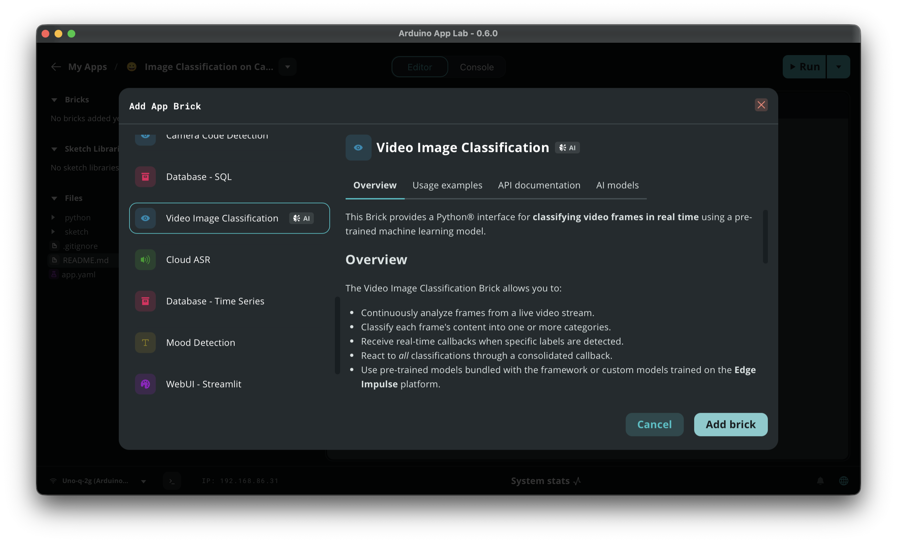

As you did on the previous section, once the brick is installed, go to the `AI Models` tab and select `Uno-Q Image. Classification`, deployed on the last section.  

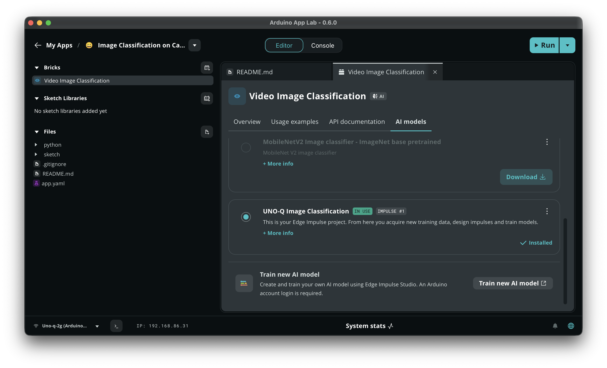

Note that the `app. yaml` is automatically created when the model is selected, pointing to the customized model:

```python
name: Image Classification on Camera
description: ""
ports: []
bricks:
- arduino:video_image_classification:
    model: ei-model-947334-1
icon: 😀
```

### Step 3 — Create a new main.c file

The file main.c is a generic file on which should be defined for our model. 

The most important part of the code is the `VideoImageClassification` class

```python
class VideoImageClassification(camera: BaseCamera | None, 
                               confidence: float, 
                               debounce_sec: float)
```

This is a module for image classification on a **live video stream** using a specified machine learning model. It provides a way to react to detected classes over a video stream, invoking registered actions in real-time.

#### Parameters

- **camera** (*BaseCamera*): The camera instance used to capture video. If None, a default camera will be initialized.
- **confidence** (*float*): The minimum confidence level for a classification to be considered valid. Default is 0.3.
- **debounce_sec** (*float*): The minimum time in seconds between consecutive detections of the same object to avoid multiple triggers. Default is 0 seconds.

Here is the complete code:

```python
from arduino.app_utils import App
from arduino.app_bricks.video_imageclassification import VideoImageClassification

# Create a classification stream with default confidence threshold (0.5)
classification_stream = VideoImageClassification(confidence=0.5)

# Callback when "periquito" is detected
def periquito_detected():
    print("Detected periquito!")

# Callback when "robot" is detected
def robot_detected():
    print("Detected robot!")

# Subscribe to your specific labels
classification_stream.on_detect("periquito", periquito_detected)
classification_stream.on_detect("robot", robot_detected)

# Optional: callback for all classifications (useful for debugging)
def all_detected(results):
    # results is a list of dicts like {"label": "periquito", "confidence": 0.85}
    print("Classification results:", results)

classification_stream.on_detect_all(all_detected)

# Run the app
App.run()
```

Run the app:

```bash
cd ~/ArduinoApps/image-classification-on-camera
arduino-app-cli app start .
```

Open a second terminal, go to the project folder and run:

```bash
cd ~/ArduinoApps/image-classification-on-camera
arduino-app-cli app logs . --follow
```


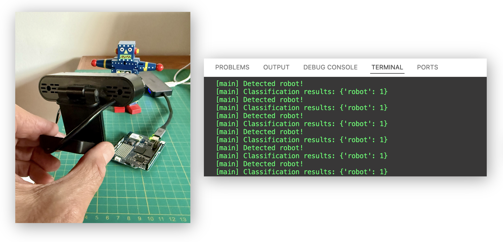

---

## 10. Post-Processing: MCU Actuation via Bridge

In the previous section, we got live image classification running via the `VideoImageClassification` Brick, with detection callbacks printing results to the log. Now, we add the **MCU side** — using Bridge RPC to drive the LED matrix, based on what the camera sees.

### Architecture

```bash
USB Webcam -> VideoImageClassification Brick -> on_detect("robot", callback)
                                               -> on_detect("periquito", callback)
                                                        |
                                            Bridge.call("show_result", label)
                                                        |
                                               MCU (Arduino sketch)
                                               -> LED Matrix; "simple face" = robot
                                               -> LED Matrix: "bird" = periquito
                                               -> LED Matrix: "empty" = background/unknown
```

### Step 1 — Add a Sketch to the Project

Our project from Section 9 (`image-classification-on-camera`) currently has no `sketch/` folder — the MCU is not involved. We need to add one.

In VS Code (or via terminal), create the sketch directory (if it does not alheady exist) :

```bash
cd ~/ArduinoApps/image-classification-on-camera
mkdir -p sketch
```

### Step 2 — Write the Arduino Sketch

Here, we use `matrix.renderBitmap(frame, 8, 13)` to render an 8×13 matrix, and we include the `Arduino_LED_Matrix.h` library in `sketch.ino`. The patterns are simple pixel art — you can refine them later using the [Arduino LED Matrix Editor](https://ledmatrix-editor.arduino.cc/) (adjusting for 13 columns instead of 12).

Create (or modify) `sketch/sketch.ino`:

```cpp
#include "Arduino_RouterBridge.h"
#include "Arduino_LED_Matrix.h"

ArduinoLEDMatrix matrix;

// 8x13 patterns for each class
// Robot icon (simple face)
uint8_t robot_frame[8][13] = {
    {0,0,1,1,1,1,1,1,1,1,1,0,0},
    {0,1,0,0,0,0,0,0,0,0,0,1,0},
    {0,1,0,1,1,0,0,0,1,1,0,1,0},
    {0,1,0,1,1,0,0,0,1,1,0,1,0},
    {0,1,0,0,0,0,0,0,0,0,0,1,0},
    {0,1,0,0,1,1,1,1,1,0,0,1,0},
    {0,1,0,0,0,0,0,0,0,0,0,1,0},
    {0,0,1,1,1,1,1,1,1,1,1,0,0}
};

// Bird icon (simple periquito)
uint8_t bird_frame[8][13] = {
    {0,0,0,0,0,1,1,0,0,0,0,0,0},
    {0,0,0,0,1,1,1,1,0,0,0,0,0},
    {0,0,0,1,1,0,1,1,1,0,0,0,0},
    {0,1,1,1,1,1,1,1,0,0,0,0,0},
    {0,0,0,1,1,1,1,1,1,1,1,0,0},
    {0,0,0,0,1,1,1,1,1,0,0,0,0},
    {0,0,0,0,0,1,0,1,0,0,0,0,0},
    {0,0,0,0,0,1,0,1,0,0,0,0,0}
};

// Empty frame (background / nothing detected)
uint8_t empty_frame[8][13] = {
    {0,0,0,0,0,0,0,0,0,0,0,0,0},
    {0,0,0,0,0,0,0,0,0,0,0,0,0},
    {0,0,0,0,0,0,0,0,0,0,0,0,0},
    {0,0,0,0,0,0,0,0,0,0,0,0,0},
    {0,0,0,0,0,0,0,0,0,0,0,0,0},
    {0,0,0,0,0,0,0,0,0,0,0,0,0},
    {0,0,0,0,0,0,0,0,0,0,0,0,0},
    {0,0,0,0,0,0,0,0,0,0,0,0,0}
};

void setup() {
    matrix.begin();
    matrix.renderBitmap(empty_frame, 8, 13);

    Bridge.begin();
    Bridge.provide("show_result", show_result);
}

void loop() {
}

void show_result(String label) {
    if (label == "robot") {
        matrix.renderBitmap(robot_frame, 8, 13);
    } else if (label == "periquito") {
        matrix.renderBitmap(bird_frame, 8, 13);
    } else {
        matrix.renderBitmap(empty_frame, 8, 13);
    }
}
```

Create (or modify) `sketch/sketch.yaml`:

```yaml
profiles:
  default:
    platforms:
      - platform: arduino:zephyr
    libraries:
      - Arduino_RouterBridge (0.3.0)
      - dependency: Arduino_RPClite (0.2.1)
      - dependency: ArxContainer (0.7.0)
      - dependency: ArxTypeTraits (0.3.2)
      - dependency: DebugLog (0.8.4)
      - dependency: MsgPack (0.4.2)
default_profile: default
```

### Step 3 — Update the Python Script to Call Bridge

Modify `python/main.py` to send classification results to the MCU via Bridge. In the previous example, we created abd use separate `on_detect` callbacks. Here we will use **only** `on_detect_all` and pick the highest-confidence result from there. This removes the individual `on_detect("periquito", ...)` / `on_detect("robot", ...)` callbacks entirely and relies on a single `on_detect_all` that always picks the top class. The `current_label` check ensures we only send a Bridge call when the result actually changes.

Also lowered the confidence to `0.3` so that "background" detections (which sometimes have lower confidence) still come through. You can tune this after testing.

```python
from arduino.app_utils import App, Bridge
from arduino.app_bricks.video_imageclassification import VideoImageClassification

classification_stream = VideoImageClassification(confidence=0.3)

current_label = ""

# Priority order: robot and periquito take precedence over background
PRIORITY = {"robot": 2, "periquito": 1, "background": 0}

def all_detected(results):
    global current_label
    print(f"Raw results: {results}")

    if results:
        # Pick the highest-priority label from the results
        label = max(results, key=lambda r: PRIORITY.get(r, -1))
    else:
        label = "background"

    if label != current_label:
        current_label = label
        Bridge.call("show_result", label)
        print(f"==> {label}")

classification_stream.on_detect_all(all_detected)
App.run()
```

> **Note**: We use a `current_label` variable to avoid sending redundant Bridge calls every frame. The LED Matrix only changes when the detected class actually changes.

### Step 4 — Verify the Updated Project Structure

Your project should now look like this:

```bash
image-classification-on-camera/
├── app.yaml
├── python/
│   └── main.py
└── sketch/
    ├── sketch.ino
    └── sketch.yaml
```

The `app.yaml` should already point to your custom model from Section 9:

```yaml
name: Image Classification on Camera
description: ""
ports: []
bricks:
- arduino:video_image_classification:
    model: ei-model-947334-1
icon: 😀
```

### Step 5 — Run the Complete System

Stop any running app first:

```bash
arduino-app-cli app stop .
```

Start the updated project:

```bash
arduino-app-cli app start .
```

> **Note**: The first run after adding the sketch will take longer, as the system compiles the Arduino code for the MCU.

### Step 6 — Test the System

Monitor the logs:

```bash
arduino-app-cli app logs . --follow
```

Now place objects in front of the camera and observe:

- **Robot** in front of the webcam → **A face** lights up + log shows "raw results: {'robot': 1}"
- **Periquito** in front of the webcam → **A bird** lights up + log shows "Raw results: {'periquito': 1}"
- **No object** (or unknown object) → **empty** lights up + "Raw results: {'background': 1}"


### Step 7 — Stop the App

```bash
arduino-app-cli app stop .
```

### Extending the MCU Actuation

The Arduino sketch can be extended with additional feedback:

**External LEDs:**

```cpp
#include "Arduino_RouterBridge.h"

// Use digital pins for external LEDs (or replace with correct RGB LED macros)
#define MY_LED_BLUE   2
#define MY_LED_GREEN  3
#define MY_LED_RED    4

void setup() {
    pinMode(MY_LED_RED, OUTPUT);
    pinMode(MY_LED_GREEN, OUTPUT);
    pinMode(MY_LED_BLUE, OUTPUT);
    pinMode(LED_BUILTIN, OUTPUT);

    digitalWrite(MY_LED_RED, LOW);
    digitalWrite(MY_LED_GREEN, LOW);
    digitalWrite(MY_LED_BLUE, LOW);
    digitalWrite(LED_BUILTIN, HIGH);

    Bridge.begin();
    Bridge.provide("show_result", show_result);
}

void loop() {}

void show_result(String label) {
    digitalWrite(MY_LED_RED, LOW);
    digitalWrite(MY_LED_GREEN, LOW);
    digitalWrite(MY_LED_BLUE, LOW);

    if (label == "robot") {
        digitalWrite(MY_LED_BLUE, HIGH);
    } else if (label == "periquito") {
        digitalWrite(MY_LED_GREEN, HIGH);
    } else {
        digitalWrite(MY_LED_RED, HIGH);
    }
}
```

**Buzzer Feedback:**

```cpp
#define BUZZER_PIN 3

void show_result(String label) {
    // LEDs as before...

    if (label == "robot")     tone(BUZZER_PIN, 1000, 200);
    if (label == "periquito") tone(BUZZER_PIN, 2000, 200);
}
```

**Servo Motor:**

```cpp
#include <Servo.h>
Servo myServo;

void show_result(String label) {
    if (label == "robot")          myServo.write(0);
    else if (label == "periquito") myServo.write(180);
    else                           myServo.write(90);
}
```

---

## 11. Performance Analysis

### Inference Latency

From the logs captured in the previous sections, we can observe the inference performance:

- **Path A** (Static Image Classification Brick, 160×160, MobileNetV2 1.0): ~444 ms per image (~2 FPS)
- **Path B** (Video Image Classification Brick, live camera): depends on the model, typically faster due to continuous pipeline optimization

### Model Size vs. Speed Tradeoff

| Model            | Input Size | Inference (approx.) | Accuracy  |
| ---------------- | ---------- | ------------------- | --------- |
| MobileNetV2 0.1  | 96×96      | ~30–50 ms           | Good      |
| MobileNetV2 0.35 | 96×96      | ~60–100 ms          | Better    |
| MobileNetV2 0.35 | 160×160    | ~100–200 ms         | Very Good |
| MobileNetV2 1.0  | 160×160    | ~400–500 ms         | Best      |

> If you need faster inference (e.g., for responsive LED feedback), retrain with a smaller model (MobileNetV2 0.35 at 96×96). You should test different configurations to find the best balance for your project.

### Path A vs. Path B Comparison

| Aspect            | Path A (Image Classification Brick) | Path B (Video Image Classification Brick) |
| ----------------- | ----------------------------------- | ----------------------------------------- |
| **Input**         | Static images (browser upload)      | Live webcam (continuous)                  |
| **Latency**       | Per-upload (user-triggered)         | Continuous (model-dependent FPS)          |
| **MCU actuation** | Not included (browser only)         | Yes, via Bridge RPC                       |
| **Web UI**        | Built-in (upload + results)         | No built-in UI (add separately)           |
| **Best for**      | Quick testing, demos                | Real-time applications                    |

### Comparison with Nicla Vision

| Metric                 | Nicla Vision (MCU)             | UNO Q (MPU)                             |
| ---------------------- | ------------------------------ | --------------------------------------- |
| Model                  | MobileNetV2 0.05 (96×96, INT8) | MobileNetV2 0.35–1.0 (96×96 to 160×160) |
| Inference time         | ~100–200 ms                    | ~50–500 ms (model-dependent)            |
| Accuracy (3 classes)   | ~85–90%                        | ~90–97%                                 |
| Power during inference | ~100 mW                        | ~3–6 W (*)                              |
| Framework              | TF Lite Micro (C++)            | App Lab Bricks (Python)                 |
| Camera                 | Built-in                       | External USB webcam                     |
| MCU actuation          | Direct GPIO                    | Bridge RPC                              |

**(*)  Practical total estimate**
Under live image classification (using the USB camera and USB hub), a realistic total power consumption profile is:
•	Board (Uno‑Q): ~2–3.5 W when CPU/NPU is busy.
•	USB camera: ~0.5–1.25 W.
•	Powered hub: ~0.5–1 W.
→ Total: ~3–6 W from the wall (5 V, ~0.6–1.2 A) for a typical one‑camera, one‑hub setup.

> The UNO Q can run larger, more accurate models but uses significantly more power. The Nicla Vision is ideal for battery-powered, always-on applications; the UNO Q excels when accuracy matters and you need the AI result to drive real-time hardware actions.

---

## 12. Exercises

1. **Add a fourth class**: Collect images of a new object, retrain the model in Edge Impulse, redeploy to the UNO Q, and update the Python callbacks and Arduino sketch. How does adding more classes affect accuracy?

2. **Experiment with model size**: Train the same dataset with MobileNetV2 0.1 (96×96) and MobileNetV2 1.0 (160×160). Deploy both to the UNO Q and compare inference time, accuracy, and LED responsiveness. Create a table with your results.

3. **Log to CSV**: Modify `main.py` to log each detection event (timestamp, label) to a CSV file on the UNO Q. After running for 5 minutes, download the CSV and plot detection frequency per class.

4. **LED Matrix icons**: Design custom 8×13 LED matrix patterns for each class (robot, periquito, background) and display them on the UNO Q's built-in LED matrix via the Arduino sketch.

5. **Cross-platform comparison**: If you have a Nicla Vision, deploy a 96×96 MobileNetV2 0.1 model to both platforms. Compare inference time, accuracy, power consumption, and development workflow.

6. **Debounce tuning**: Experiment with the `debounce_sec` parameter in `VideoImageClassification(confidence=0.5, debounce_sec=1.0)`. How does increasing the debounce time affect the responsiveness vs. stability of the LED feedback?

---

## 13. Conclusion

In this tutorial, we progressed through three levels of image classification on the Arduino UNO Q:

1. **Part 1** — The pre-installed static image classifier (Image Classification Brick + WebUI), where we uploaded images through a browser and saw results in the web interface.
2. **Path A** — Our custom model deployed via the same Brick, still with static uploads, but now classifying our own robot/periquito/background classes.
3. **Path B** — Live camera classification using the Video Image Classification Brick, with real-time detection callbacks driving MCU actuation (RGB LEDs) via Bridge RPC.

### Key Takeaways

- **The Edge Impulse → App Lab → UNO Q pipeline works**: Collect data, train in EI Studio, deploy to App Lab, and run — all guided through the UI.
- **Two Bricks, two modes**: The `ImageClassification` Brick handles static images (great for testing); the `VideoImageClassification` Brick handles live camera streams (essential for real applications).
- **The dual-brain architecture adds value**: Python handles camera + ML inference on the MPU, while the Arduino sketch on the MCU provides real-time LED/servo/buzzer control. Bridge RPC makes this seamless.
- **Model selection matters**: The UNO Q can run larger, more accurate models than any MCU, but there is always a tradeoff between accuracy and inference speed. Test different configurations to find the best balance for your project.

### What's Next

In the [next tutorial](../object_detection/object_detection.qmd), we will extend our computer vision skills to **Object Detection** — using FOMO and YOLO to detect not just *what* is in the image, but also *where* it is. This opens the door to applications in tracking, counting, and spatial awareness.

---

## 14. Resources

| Resource                        | URL                                                          |
| ------------------------------- | ------------------------------------------------------------ |
| Edge Impulse Studio             | https://studio.edgeimpulse.com                               |
| EI Arduino UNO Q Docs           | https://docs.edgeimpulse.com/hardware/boards/arduino-uno-q   |
| EI App Lab Deployment           | https://docs.edgeimpulse.com/hardware/deployments/run-arduino-app-lab |
| App Lab Bricks Documentation    | https://docs.arduino.cc/software/app-lab/tutorials/bricks    |
| TinyML Made Easy (Nicla Vision) | https://mjrovai.github.io/TinyML_Made_Easy_NiclaV_eBook/     |
| Arduino App Lab CLI             | https://docs.arduino.cc/software/app-lab/tutorials/cli       |
| UNO Q Setup Tutorial            | [Previous chapter](../setup/setup.qmd)                       |

---

*Tutorial created for IESTI05 — Edge AI ML System Engineering, UNIFEI. Licensed under CC-BY-SA 4.0.*
