# GenAI at the Edge, Part 2: Giving the Classifier Eyes

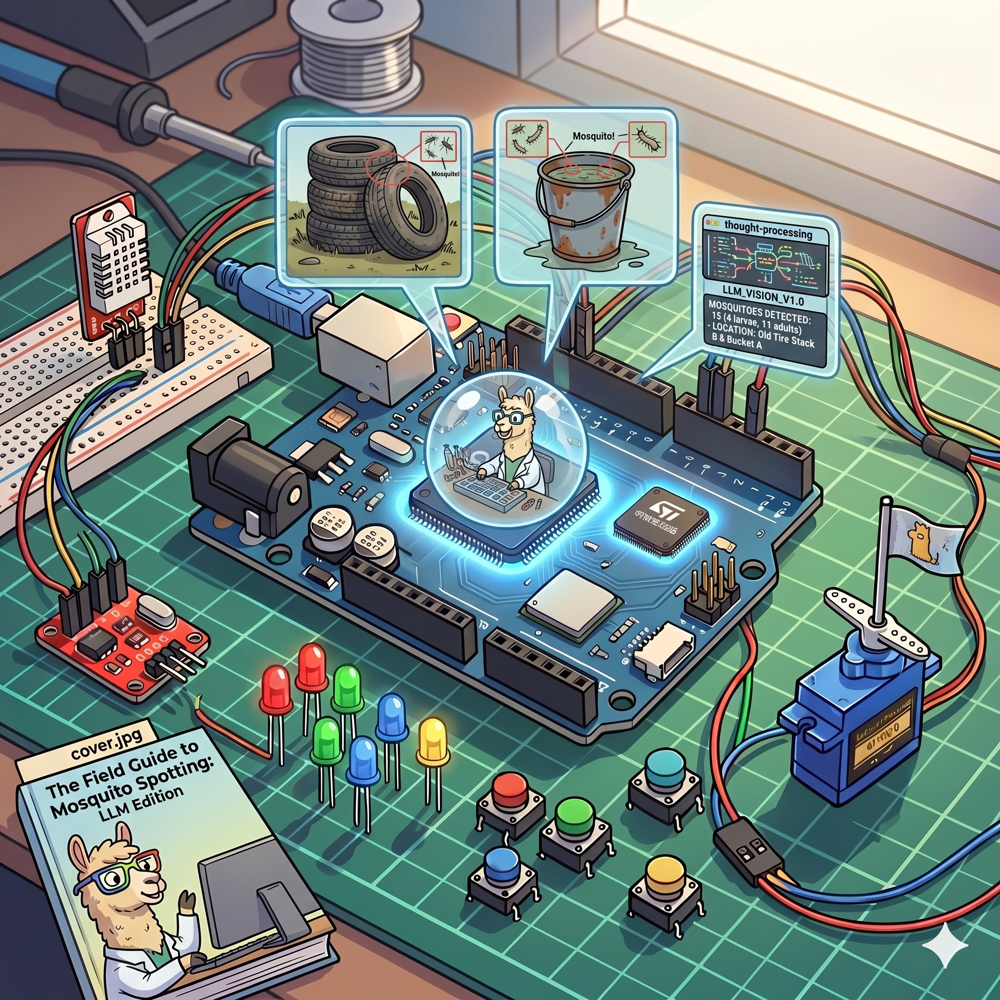

> A continuation of [Part 1 — Generative AI at the Edge: Running Small Language Models with llama.cpp and Bridge RPC](https://github.com/Mjrovai/ARDUINO-UNO-Q/blob/main/Gen_AI_Edge/README.md). If you haven't built that one yet, start there. This chapter assumes you already have a `llama-server` running on the UNO Q and a working dual-brain (MCU + Linux) setup.

---

## Table of Contents

1. [Where We Left Off](#1-where-we-left-off)
2. [Giving a Small Model Eyes: The Projector](#2-giving-a-small-model-eyes-the-projector)
3. [Loading the Model and Its Projector](#3-loading-the-model-and-its-projector)
4. [Running the Vision Server](#4-running-the-vision-server)
5. [First Contact, and the API](#5-first-contact-and-the-api)
6. [When It "Never Stops," and Other CPU Realities](#6-when-it-never-stops-and-other-cpu-realities)
7. [Which Model: 0.8B or 2B?](#7-which-model-08b-or-2b)
8. [VisText-Mosquito](#8-vistext-mosquito)
9. [Reasoning Mode, and the Trap I Fell Into](#9-reasoning-mode-and-the-trap-i-fell-into)
10. [Going Further](#10-going-further)
11. [Conclusion](#11-conclusion)
12. [Resources](#12-resources)

---

## 1. Where We Left Off

In Part 1, the model read text. You fed it a few environmental numbers, and it reasoned about dengue risk, all on the board, no cloud call. It ran text-only from a single GGUF file (`Qwen_Qwen3.5-0.8B-Q8_0.gguf`) served by `llama-server` as a `systemd` service on port 8081.

Text is a strange interface for a mosquito problem, though. The thing you actually want to catch is *visual*: water sitting in an old tire, a plant saucer that never drains, a bucket left open after the rain. A health agent walking a neighborhood doesn't type numbers into a form. They look.

So this chapter gives the same board eyes. By the end, you'll have the UNO Q looking at a photo (or a real image from a webcam) and answering a question like **"is this a potential mosquito breeding site, and why?"** — and you'll understand exactly what it costs to run that on a CPU the size of a coin.

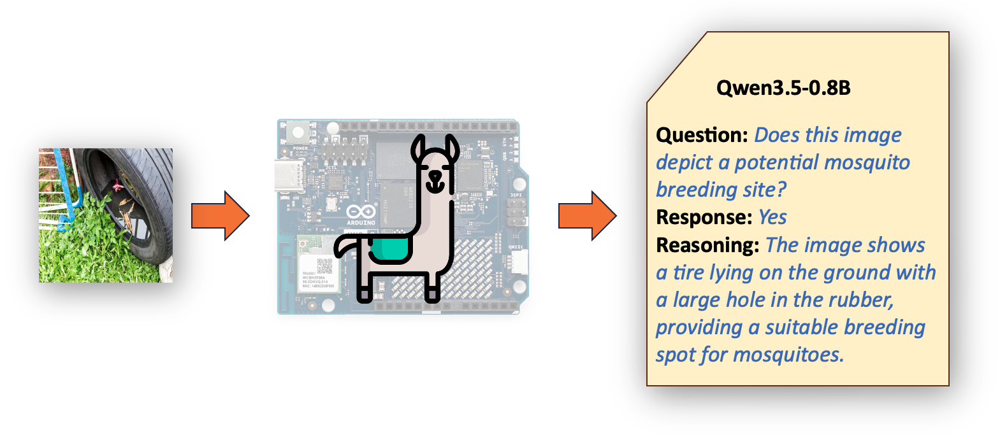

We should be honest about the costs as we go, because that's the part most tutorials skip. Vision on this hardware works. It's also slow, and the slowness teaches you something real about how these models work.

## 2. Giving a Small Model Eyes: The Projector

A text-only Qwen runs from a single GGUF. To make it describe an image, you add one more file, the `mmproj`, and the same model can suddenly talk about a photo. That second file is where the vision machinery lives. Understanding what's inside it explains both how the model "sees" and why a couple of the serving flags matter.

### One model that was trained to see

Qwen3.5 isn't a text model with vision bolted on. Qwen describes it as a **unified vision-language foundation**: the model was trained on text and image tokens together from the start, an approach they call early **fusion.** That matters, because the older mental model, a frozen language model with a separately trained adapter glued onto a frozen image encoder, is the LLaVA or Moondream recipe, and it isn't how this model was built. The vision and language sides grew up together. 

> It's also why Qwen3.5 beats the earlier Qwen3-VL models on visual benchmarks rather than inheriting from them. Different family.

At inference, though, there's still a clear pipeline, and llama.cpp makes it visible by splitting the weights across two files. The `-m` file holds the language model. The `mmproj` file contains the vision encoder and the small connector that connects it to the language side. That split is a packaging convenience, not a sign the base is text-only: you can run the model without the `mmproj` to skip the vision pathway and save memory, which is what the Part 1 classifier effectively did.

```
image ──▶ vision encoder ──▶ projector / connector ──▶ language model ──▶ text
          └──────── mmproj GGUF ────────┘               └─── -m GGUF ───┘
                  (inference path; weights split across two files)
```

### What happens to the image at inference


**1. Vision Encoder:** The image gets resized and chopped into a grid of small patches. Those patches go into the Vision Transformer, the vision encoder, which returns one feature vector per patch: what's in that region and how it relates to its neighbors. Those vectors live in the encoder's own space. They have nothing to do with the language model's vocabulary or its embedding dimensions.

**2. Multimodal Connector (Early Fusion):** That mismatch is what the connector resolves. The language model reads token embeddings in its own d-dimensional space. Text gets there through a lookup table; image patches don't have one. The connector reshapes the visual vectors to the model's embedding dimension and lands them in the region of that space the model already understands, so a patch of `fur` (image) ends up behaving the way the text embedding for "fur" would. In an early-fusion model, alignment is learned jointly with the rest of the network, not trained as a bolt-on afterward.

**3. Spliced Embeddings (Input Stream):** Once mapped, the visual vectors are spliced into the token stream where an image placeholder sits, and the model processes one mixed sequence of text and image embeddings. From the model's point of view, there's no special "image mode"; the picture has become something that reads like tokens.

**4. Language Model:** Qwen3.5's internals aren't a vanilla transformer, for the curious, it uses an efficient hybrid of linear-attention blocks and a sparse mixture-of-experts. Sparse MoE appears in Qwen's family-level highlights, but the 0.8B's own spec sheet lists a plain feed-forward network (intermediate dimension 3584) with no experts and no router, with full attention only on periodic layers. That detail doesn't change the picture here, but it's why the architecture is described as a hybrid rather than a standard decoder.

That's why "describe this image" produces a caption: the model continues the sequence conditioned on the visual embeddings it can read.

> The vision pathway produces no text. It emits embeddings, nothing else. Every word in the answer comes from the language model. The projector's only job is to make the image *legible*.
>

### The context window

Each image becomes a real block of embeddings, occupying a specific position in the context window. Not one token, many. A single image runs into the hundreds or low thousands of tokens on its own. Qwen3.5 uses dynamic resolution, so a bigger or busier image produces more visual tokens. That's the number the `--image-min-tokens` and `--image-max-tokens` flags cap (these only apply to dynamic-resolution models, which is why they bite here), and we'll come back to it when we talk about speed.

The immediate consequence: the `-c 1024` context that was fine for the text classifier will overflow before you've even added a prompt. Give it `4096`.

## 3. Loading the Model and Its Projector

First, stop the service from Part 1. It's holding port 8081 and some RAM, and you want both back for testing.

```bash
sudo systemctl stop llama-server.service

# confirm the port is free and the memory came back
sudo ss -ltnp | grep 8081      # should print nothing
free -h
```

The service is still `enabled`, so it returns on the next reboot. For testing, that's fine. Run `sudo systemctl start llama-server.service` when you're done, or leave it stopped while you experiment.

For vision, you must load two files: the `model` and its `mmproj`. A warning that will save you an afternoon: the two have to come from the *same* model, because their embedding dimensions must match. Pair a projector with the wrong base, and the load fails outright with an `n_embd` mismatch. The Part 1 setup was the same 0.8B model served *without* mmproj, so the text classifier and the vision describer use the same weights, with the vision pathway switched off or on. There's no separate "text-only" and "VL" download to keep straight, just the model plus its matching projector.

In the [QWEN3.5-0.8B model webpage on HF](https://huggingface.co/unsloth/Qwen3.5-0.8B-GGUF/tree/main), you can see all available files and versions (see them at the bottom of the page):

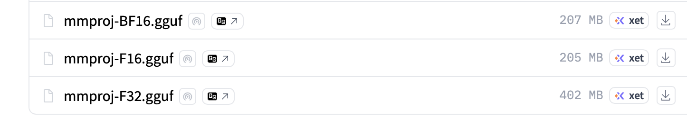

### A note on the projector's format

You'll usually find the `mmproj` offered in BF16, F16, and F32. On the UNO Q, prefer F16. The board's Cortex-A53 cores have no native BF16 path, so BF16 weights get converted on the fly, which wastes memory bandwidth you can't spare.

> When switching the 0.8B's projector from BF16 to F16, the description time for a 640×640 image dropped from 4 to about 1 minute. Same model, same image, just a friendlier weight format.

## 4. Running the Vision Server

Here's the command for the 0.8B model. Run it in the foreground the first time so you can read the startup log:

```bash
./build/bin/llama-server \
  -m       /home/arduino/models/Qwen_Qwen3.5-0.8B-Q8_0.gguf \
  --mmproj /home/arduino/models/mmproj-F16_0.8B.gguf \
  --host 0.0.0.0 --port 8081 \
  -c 4096 -t 4 \
  -n 256 \
  --jinja \
  --image-max-tokens 256 \
  --reasoning off \
  --reasoning-budget 0
```

Three flags deserve a comment.

`--host 0.0.0.0` is what lets you reach the WebUI from your desktop or mobile, instead of only from the board itself. Without it, the server binds to localhost, and your laptop can't see it.

`--jinja` turns on the model's own chat template. Skip it, and you can hit a nasty failure mode where generation never stops, because the generic fallback template doesn't register Qwen's end-of-turn token as a stop string. The model just keeps going until it fills the context.

> The first time I ran without `--jinja`, I sat watching it generate forever and assumed the board had locked up. It hadn't. It just didn't know when to shut up.

`-n 256` caps output length as a safety net. We'll revisit this when reasoning enters the picture, because it interacts with the thinking trace in a way that surprised me.

On startup, look for a `clip` / `mtmd` block confirming the projector loaded, a line reporting image support enabled, and `HTTP server listening` on `0.0.0.0:8081`. 

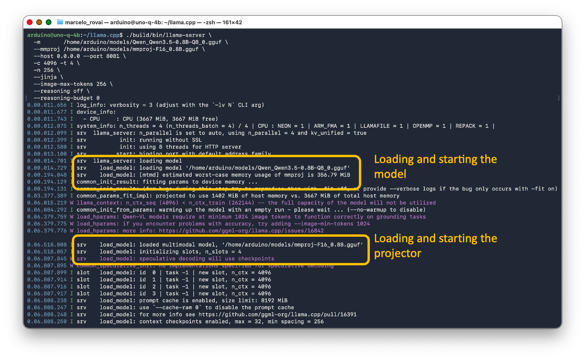

If a request later comes back with "image processing requires a vision model," the `mmproj` didn't load: check that you passed `--mmproj` and that the file path is right.

Then open `http://<UNO_Q_IP>:8081/` on your desktop or mobile and drop in an image.

> **Use images smaller than 640x640.**

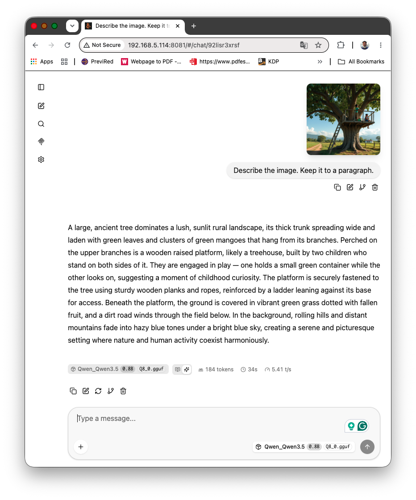

> The total latency from start to finish was around a minute and half, which is pretty nice for such a small model. Regarding energy, the peak was 2.3W and the temperature gap around 20 °C (reached 56 °C).

### What the small model gets right, and wrong

I tested the 0.8B on a generated scene: two kids on a platform in a big papaya tree, a ladder, a dirt road, mountains, and a farmhouse in the background. The description was genuinely good of the whole scene. It named the platform, the kids, the ladder, the path, the farmhouse, and the mood. Then it called the hanging papayas "mangos."

That's worth keeping in sight, because it's the signature of a small VLM. The gist is solid; the specifics are unreliable. The model made up the fruits wrong. For a breeding-site screen, this matters: the model can reliably tell you "there's a container with standing water," but don't trust it to identify the container as a specific 200-liter drum. Design the question around what it's actually good at.

## 5. First Contact, and the API

The embedded WebUI is the quickest smoke test, but for anything repeatable you want the API. The server speaks the OpenAI-compatible format, so you send the image as a base64 data URI inside an `image_url` content block.

Let's create a directory (`images`) and put a few images there. For example:

`/home/arduino/ArduinoApps/images/test-papaya.png`

> **One trap to avoid:** don't paste the base64 string straight into a `curl -d '...'` argument. A base64 image is large enough to exceed the shell's argument-size limit, and you'll get `curl: Argument list too long` before the request is even sent. Write the body to a file (or pipe it on stdin) so it never goes through the command line.

With the server running, go to the created directory

```bash
cd ArduinoApps/images
```

Define the image:

```bash
IMG=$(base64 -w 0 test-papaya.png)
```

And run the model to describe the image:

```bash
cat > /tmp/req.json <<EOF
{
  "max_tokens": 256,
  "messages": [{
    "role": "user",
    "content": [
      {"type": "image_url", "image_url": {"url": "data:image/png;base64,$IMG"}},
      {"type": "text", "text": "Describe this image."}
    ]
  }]
}
EOF

curl -s http://127.0.0.1:8081/v1/chat/completions \
  -H "Content-Type: application/json" \
  --data @/tmp/req.json
```

> Match the media type to your file (`image/png` for a `.png`, `image/jpeg` for a `.jpg`). A single-model `llama-server` ignores the `model` field, so you can leave it out.

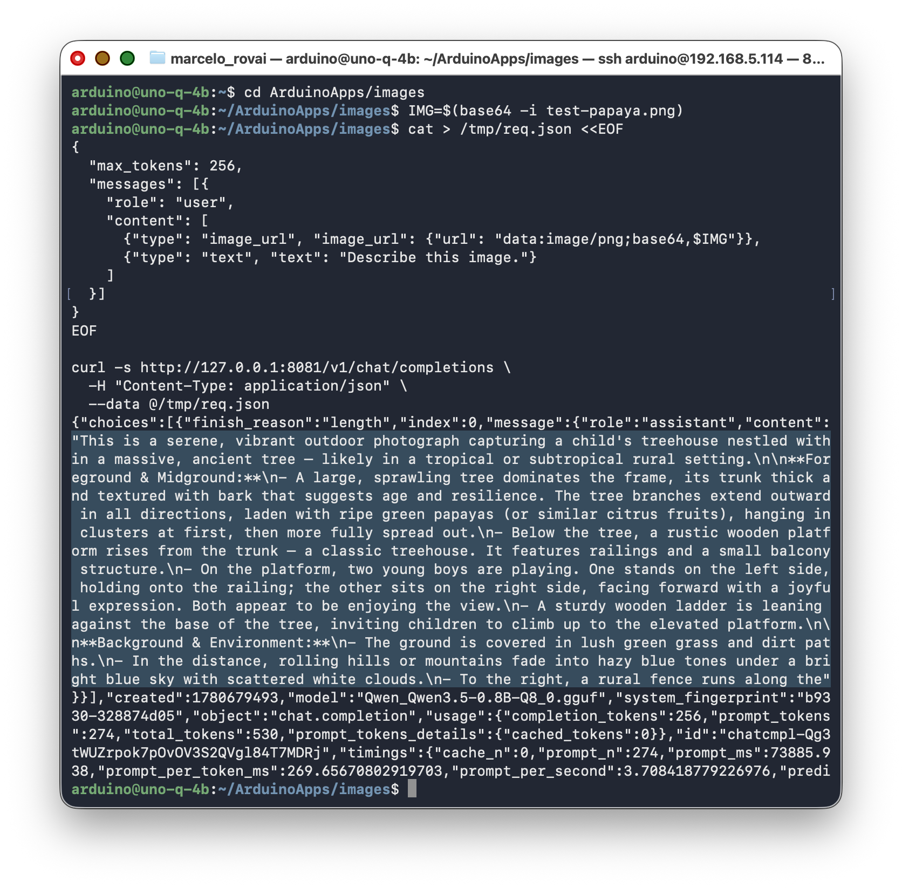

OK, we tested and it works! But for real work, Python is cleaner, and it sidesteps the argument-length trap entirely by putting the image in the request body rather than on the command line.

Let's create a Python script. We can do it directly on the terminal, using the Arduino App Lab or the VS Code. Let's go with the nano here:

```bash
cd ArduinoApps
nano image_caption.py
```

Enter the script and save it with `[CTRL]+[X]` and `[y]`:

```python
import base64
import requests

SERVER = "http://127.0.0.1:8081/v1/chat/completions"


def encode_image(path):
    with open(path, "rb") as f:
        return base64.b64encode(f.read()).decode("utf-8")


def describe_image(path, prompt="Describe this image. Keep it to a paragraph.", max_tokens=256):
    data_uri = f"data:image/jpeg;base64,{encode_image(path)}"
    payload = {
        "messages": [{
            "role": "user",
            "content": [
                {"type": "image_url", "image_url": {"url": data_uri}},
                {"type": "text", "text": prompt},
            ],
        }],
        "temperature": 0.7,
        "max_tokens": max_tokens,
    }
    r = requests.post(SERVER, json=payload, timeout=300)
    r.raise_for_status()
    return r.json()["choices"][0]["message"]["content"]


if __name__ == "__main__":
    print(describe_image("images/test-papaya.png"))
```

> Note the `timeout=300`. On this board, a vision request can take between 1 and 2 minutes, and the default request's timeout will give up long before the model does.

Let's use a different image from a dataset we'll explore later with the "Textual Reasoning on Mosquito Breeding Sites" project:


Run the Python script

```bash
python3 image_caption.py
```

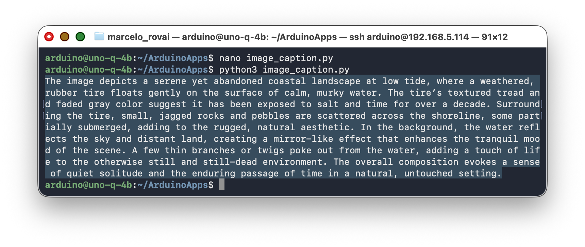

## 6. When It "Never Stops," and Other CPU Realities

Some lessons learned during the tests:

**Symptom one: it runs forever.** Covered above. The fix is `--jinja` plus the `-n` cap. If you have both and it still runs away, the WebUI's own "max tokens" setting is overriding the server's `-n`. Lower it in the sampler panel too.

**Symptom two: it freezes at 2%.** I uploaded a tall two-panel collage at full resolution, and the progress bar parked at 2% with an ETA of 113 seconds. Ten minutes later, still 2%. My first instinct was a memory problem, swap thrashing as the model spilled past 4 GB. I was wrong. I checked `free -h` and swap was at zero. The board wasn't out of memory. It was out of time. A large, busy image makes the dynamic-resolution encoder produce a high patch count, and the ViT has to process every one of them on four CPU cores. The encoding wasn't stuck. It was facing tens of minutes of honest math.

That one cost me an afternoon, and the lesson is sharp: on this board, **vision is compute-bound on image size, not memory-bound at sane sizes.** Resolution is the single biggest lever you have.

**Reading `free -h` correctly.** When I ran the 2B model and checked memory mid-describe, I saw this:

```
               total        used        free      shared  buff/cache   available
Mem:           3.6Gi       1.5Gi        83Mi      36Mi      2.2Gi        2.1Gi
Swap:          1.8Gi        20Mi       1.8Gi
```

The `free` column says 83 MiB, and panic sets in. Don't. `llama-server` memory-maps the GGUF, so the model weights show up under `buff/cache` (that 2.2 GiB), not under `used`. The number that matters is `available`: 2.1 GiB still free, and swap basically untouched at 20 MiB. The 2B fits comfortably. It's just slow.

### The speed levers, in order of payoff

Once you know it's compute-bound, the fixes follow. The most direct one targets the encoder's token budget. Because Qwen3.5 uses dynamic resolution, `llama-server` lets you cap how many tokens an image is allowed to become:

```bash
--image-max-tokens 256
```

Encode time scales with that count, so capping it directly reduces the work — and a model is often smart enough to describe a scene well with far fewer image tokens than the default. Start at 256 and tune.

After that: downscale the input (feed it ~448–512 px, complementary to the token cap), keep the output short (every generated token costs real time on this CPU), and, if you want a one-time win, rebuild llama.cpp with OpenBLAS (`-DGGML_BLAS=ON -DGGML_BLAS_VENDOR=OpenBLAS`) since the encode and prefill are matrix-multiply heavy. Measure that last one before and after, because the gain on ARM varies.

One more, unrelated to speed but worth folding in: for image workloads, drop `--cache-prompt`. There's a known issue where each image adds 1000+ KV tokens to the prompt cache, the cache grows without bound across repeated requests, and the process eventually gets OOM-killed. The in-slot cache still works within a session, so a single-slot setup loses nothing meaningful by turning it off. On a 4 GB board, that's cheap insurance.

## 7. Which Model: 0.8B or 2B?

I ran both on the same 640×640 image, so the comparison is real and not a guess.

|                       | Qwen3.5-0.8B (Q8_0)        | Qwen3.5-2B (UD-Q4_K_XL) |
| --------------------- | -------------------------- | ----------------------- |
| Projector (F16)       | ~220 MB                    | 668 MB                  |
| Decode speed          | 5.42 tok/s                 | 2.44 tok/s              |
| Time for one describe | ~1 min                     | ~4 min                  |
| Peak RAM (mmap incl.) | well under the ceiling     | ~3 GB, fits, swap ~0    |
| Description quality   | good gist, shaky specifics | noticeably better       |

The bigger projector isn't optional, by the way. If you go 2B, you use its 668 MB projector, because the small one won't match. The file is 3× larger because the vision encoder inside it is bigger, which is also why the encoding is slower: every patch passes through a heavier tower.

So it's a real trade, not a free upgrade. The 2B writes clearer answers and stays within the RAM budget, but five minutes per image rules out anything interactive. My take: treat them as two tiers. The 0.8B is the fast screen for when you need an answer in roughly a minute. The 2B is the quality pass for when correctness matters more than latency, and the device can sit and think. `--image-max-tokens` is the dial between them, and tuning it on the 2B is the most useful experiment you can run.

## 8. VisText-Mosquito

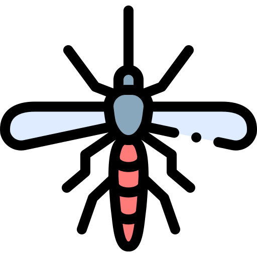

We will explore some images from the [VisText-Mosquito](https://arxiv.org/abs/2506.14629), a multimodal dataset that integrates visual and textual data to support automated detection, segmentation, and reasoning for mosquito breeding site analysis.

The project developed a fine-tuned **Mosquito-LLaMA3-8B** model which achieved the best results, with a final loss of 0.0028, a BLEU score of 54.7, BERTScore of 0.91, and ROUGE-L of 0.85. This dataset is publicly available at [dataset](https://data.mendeley.com/datasets/rtsfh7jh7p/3).

Here we will try to see if our Arduino UNO-Q running the small **Qwen3.5-0.8B**, without any fine-tuning, can also reason about an image, verifying if it can be considered a mosquito breeding site.

For example, let's try one of the images of the dataset, using the prompt described on the VisText-Mosquito paper.

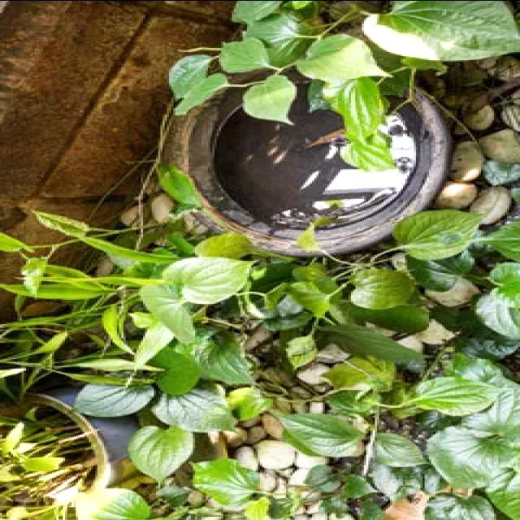

The prompt:

```bash
You are creating a dataset for an image analysis model designed to identify potential mosquito breeding sites. The dataset will consist of image-question-answer pairs. For the provided image, generate a question asking whether it depicts a potential mosquito breeding site. Then, provide a detailed answer explaining why or why not. Don't give extra text. 

Output format: 

Question: [Your generated question] 

Response: [Yes/No] 

Reasoning(Why): [Your detailed reasoning]
```

Running it on the Server app, we got:

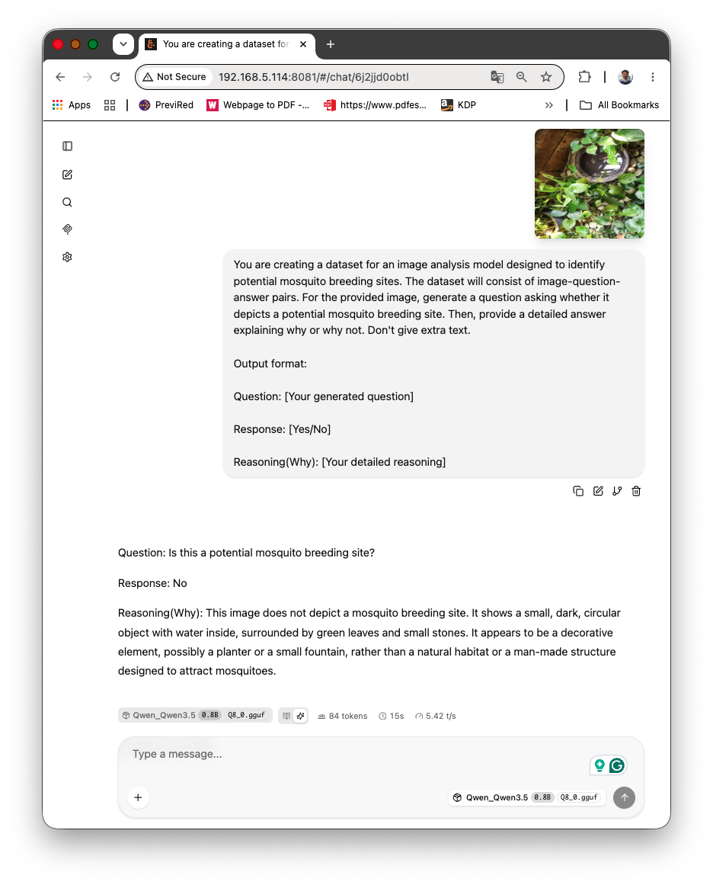

The model understood the question, had an understanding of the image and followed correctly the result structure, BUT fail completely on the analysis. The image YES, is a potential breeding site.

Well, one solution is try to turn-on model reasoning mode. Let's see if thinking deeper it can return a better result.

## 9. Reasoning Mode, and the Trap I Fell Into

For the task below, I wanted to see if the model's reasoning would reach a good verdict. So I dropped `--reasoning off` and let it think. The output came back cut off mid-sentence, right before the conclusion. The token counter read exactly 256.

Worth knowing before you turn thinking on: Qwen3.5-0.8B's own model card flags that this size is more prone to thinking loops than the larger ones, sometimes failing to stop on its own. So the runaway generation we hit early on, the "it never stops" that sent me chasing the `--jinja` flag, was partly this. The small model in thinking mode genuinely struggles to terminate. Keeping it in its default non-thinking mode for the classifier was the right call for several reasons.

The cut-off above has a simpler cause, though. With reasoning on, the model writes a long internal `<think>` trace *before* the real answer. My `-n 256` cap was fully consumed by the thinking, so the model never reached the structured output I actually asked for. The fix is to give it room for both and remember that the WebUI's max-tokens overrides the server flag. Here is the new server command, not turning off the reasoning:

```bash
./build/bin/llama-server \
  -m       /home/arduino/models/Qwen_Qwen3.5-0.8B-Q8_0.gguf \
  --mmproj /home/arduino/models/mmproj-F16_0.8B.gguf \
  --host 0.0.0.0 --port 8081 \
  -c 4096 -t 4 \
  -n 1024 \
  --jinja \
  --image-max-tokens 256
```

The answer took longer:

- 1’20” start+img proc.
- 1’ for reasoning
- 20”  for writing answer at 5.3tk/s

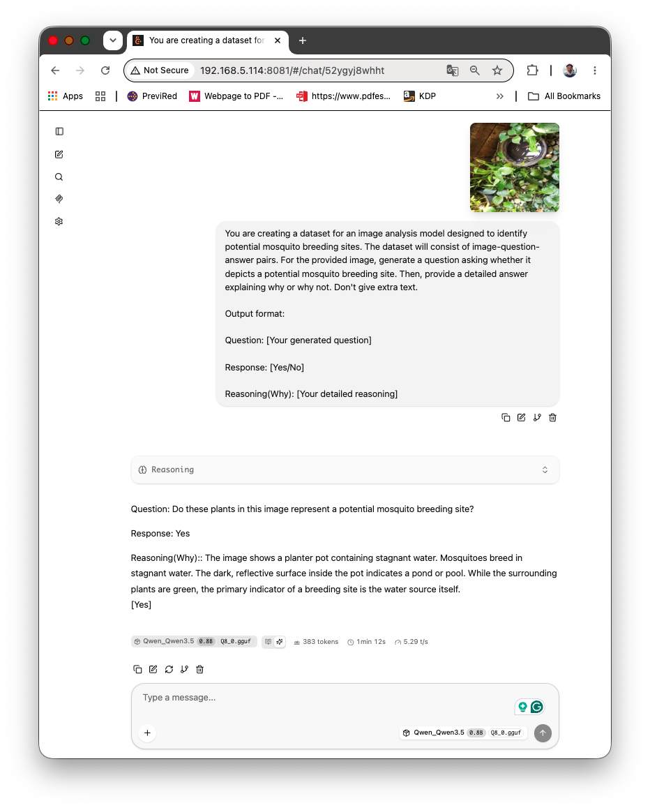

**The answer was correct!**

Let's open the "Reasoning tab" and see the thinking process of the model:

```bash
The user wants me to analyze the provided image and generate a dataset entry for an image analysis model.
The image shows a garden scene with a planter pot sitting on pebbles.
Inside the pot, there is a dark, reflective surface that looks like water.
Above the pot, there is green leafy plant.
The surface in the pot is dark and glossy, reflecting light.
The surrounding area has pebbles and other greenery.
The question is: "Do these plants in this image represent a potential mosquito breeding site?"

Reasoning:
1. **Water Source:** The pot contains water. Mosquitoes breed in stagnant water.
2. **Vegetation:** While the leaves are green, they are somewhat dry and sparse, not in a dense, lush overgrowth typical of a breeding zone (though they can be in a pond).
3. **Texture:** The surface inside the pot is clearly dark, reflective, and glossy. This looks like a pond or a pool of water.
4. **Context:** A planter pot is a very common container for ponds or pools in gardens.
5. **Conclusion:** The presence of a water source in a pot strongly suggests a potential breeding site.

So, the output should be:
Question: Do these plants in this image represent a potential mosquito breeding site?
Response: Yes
Reasoning: [Detailed explanation]
```

And, the power consumption stayed at a maximum of 3.1W (brief peacks) with a temperature delta of 24 °C.  

> Bytheway, during iddle periods, when waing to answer a question for example, with the server runing, the power consumption atayed below 500mW. 

Let's try another image, now an old tire:

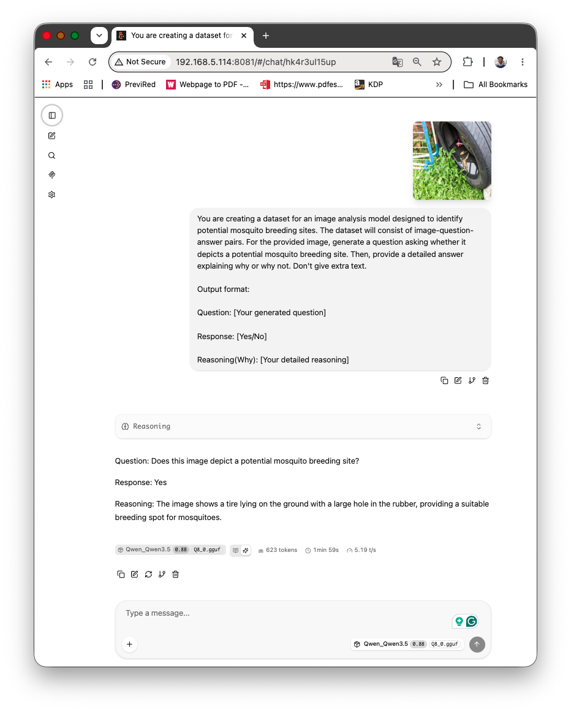

Again a great and correct answer. Even without fine-tuning the model, those tests seem very promising.

On a garden photo of a dark ceramic bowl holding still water with plants growing around the rim, the model produced a clean **Yes** with sound reasoning: "*The image shows a planter pot containing stagnant water. Mosquitoes breed in stagnant water. The dark, reflective surface inside the pot indicates a pond or pool. While the surrounding plants are green, the primary indicator of a breeding site is the water source itself*".

On an abandoned tire in the garden, "*The image shows a tire lying on the ground with a large hole in the rubber, providing a suitable breeding spot for mosquitoes*."

Both are usable labeled rows!

To really compare with the VisText-Mosquito results, we would need to test with a lot more images. Run it over a folder of field photos with an adapted Python helper as discussed before, write each result to disk, and you have the start of a real dataset, generated on a device that costs less than the camera that took the photos.

**But for our little experiment here, the UNO-Q and the multimodal model, Qwen 3.5-0.8B, show a great results!**

Two cautions before you trust the labels. The model is confidently wrong sometimes, especially on the visual specifics, so a human should spot-check ("curate") the set before it trains anything that matters. And keep the `max_tokens` generous here, since the structured answer plus any reasoning is longer than a one-line caption.

## 10. Going Further

The classifier sees now. Here are four directions that each turn a one-afternoon experiment into something closer to a deployment.

### Feed it a live camera

The whole chapter worked from files you dropped into a folder. A field deployment doesn't have that luxury — it has a camera pointed at a yard. 

First, turn off the UNO-Q:

```bash
sudo halt
```
#### Get the Hardware

| Item                 | Purpose                                         |
| -------------------- | ----------------------------------------------- |
| Arduino UNO Q (4 GB) | Edge AI inference + MCU actuation               |
| USB webcam           | Image capture                                   |
| USB hub with PD      | Connect webcam + power to the single USB-C port 

- Connect the hub to the Power Supply 
- Connect the WebCam
- Connect the UNO-Q


The Uno-Q will restart and remember to run the service developed in Part-1 automatically, which does not have the projector. 

```bash
sudo systemctl stop llama-server.service

# confirm the port is free and the memory came back
sudo ss -ltnp | grep 8081      # should print nothing
free -h
```

The change is small. Grab a frame, write it to disk at a sane resolution, and hand the path to the same `describe_image()` you already wrote. Let's start capturing an image (a frame) from my desk.

```bash
sudo apt install -y fswebcam
fswebcam -r 640x480 --skip 20 --no-banner /home/arduino/ArduinoApps/images/frame.jpg
```

The  `--skip 20`  discards the first 20 frames, giving the camera time to auto-adjust exposure.

Keep the capture at 512 px or below (in this case `640x480`). A 1080p frame from a cheap webcam hands the encoder a few thousand patches, and you're back to staring at a 2% progress bar. Downscale at capture time, not after — that's the lesson from Section 6, applied at the source.

Here an image taken from my desk:

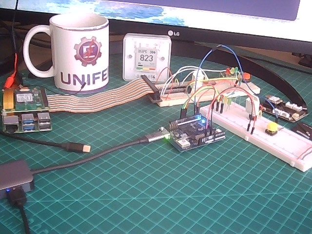

We can run the simple prompt to describe the image without reasoning; it is faster. Start the server and open the WebUI:

```bash
cd llama.cpp
./build/bin/llama-server \
  -m       /home/arduino/models/Qwen_Qwen3.5-0.8B-Q8_0.gguf \
  --mmproj /home/arduino/models/mmproj-F16_0.8B.gguf \
  --host 0.0.0.0 --port 8081 \
  -c 4096 -t 4 \
  -n 256 \
  --jinja \
  --image-max-tokens 256 \
  --reasoning off \
  --reasoning-budget 0
```

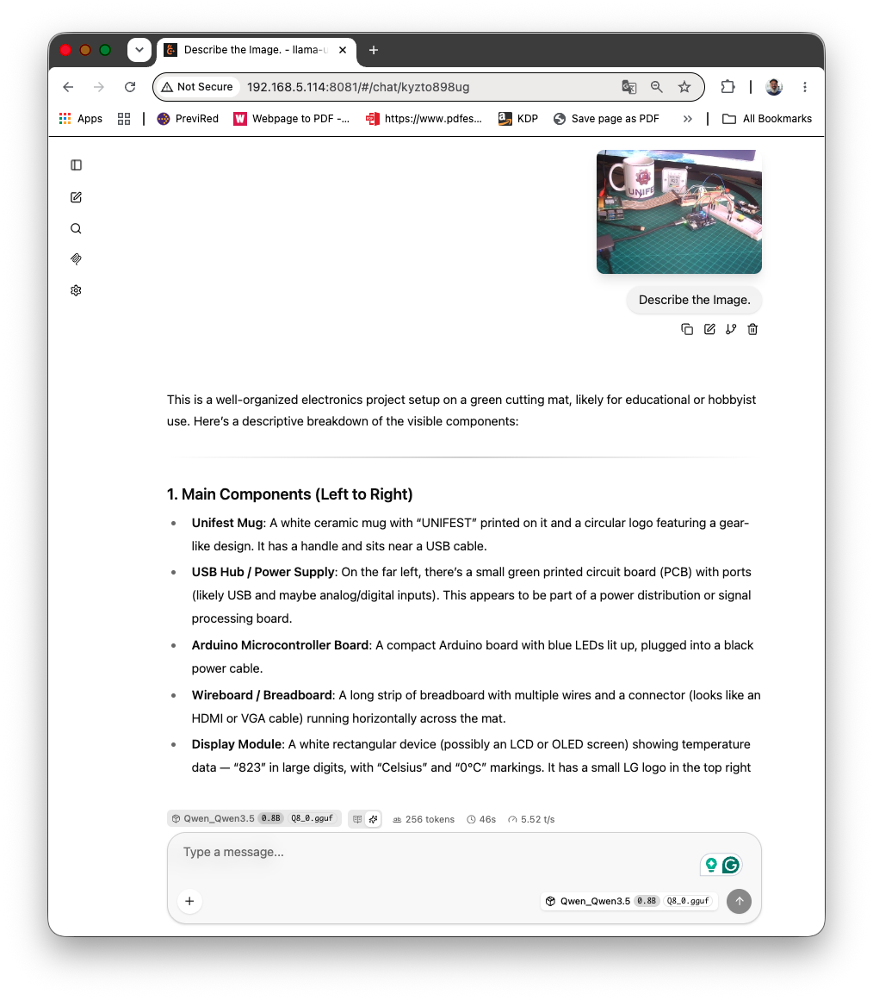

It is a great description! The model captured all the main components of the image. 

Let's now stop the server and restart it with the Reasoning ON and enter the VisText-Mosquito prompt as before:

```bash
./build/bin/llama-server \
  -m       /home/arduino/models/Qwen_Qwen3.5-0.8B-Q8_0.gguf \
  --mmproj /home/arduino/models/mmproj-F16_0.8B.gguf \
  --host 0.0.0.0 --port 8081 \
  -c 4096 -t 4 \
  -n 1024 \
  --jinja \
  --image-max-tokens 256
```

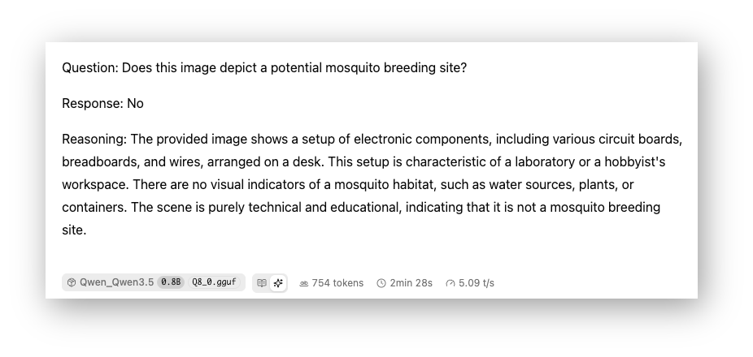

**It is working!** And it's nice to learn that my desk is not suitable for mosquito breeding ;-) 

Let's now adapt the early `image_caption.py` script to use the VisText-Mosquito prompt, targeting `frame.jpg`. 

```python
import base64
import requests

SERVER = "http://127.0.0.1:8081/v1/chat/completions"

PROMPT = '''
You are creating a dataset for an image analysis model designed to identify potential mosquito breeding sites. The dataset will consist of image-question-answer pairs. 

For the provided image:
1. Generate a question asking whether it depicts a potential mosquito breeding site
2. Provide a detailed answer explaining why or why not

Output ONLY in this exact format (no extra text, no explanations):

Question: Does this image depict a potential mosquito breeding site?

Response: [Yes/No]

Reasoning(Why): [Your detailed reasoning here]
'''

def encode_image(path):
    with open(path, "rb") as f:
        return base64.b64encode(f.read()).decode("utf-8")


def describe_image(path, prompt=PROMPT, max_tokens=1024):
    data_uri = f"data:image/jpeg;base64,{encode_image(path)}"
    payload = {
        "messages": [{
            "role": "user",
            "content": [
                {"type": "image_url", "image_url": {"url": data_uri}},
                {"type": "text", "text": prompt},
            ],
        }],
        "temperature": 0.3,
        "max_tokens": max_tokens,
    }
    r = requests.post(SERVER, json=payload, timeout=300)
    r.raise_for_status()
    
    msg = r.json()["choices"][0]["message"]
    
    # Combine both reasoning_content (thinking) + content (final answer)
    reasoning = msg.get("reasoning_content", "")
    content = msg.get("content", "")
    
    # If content is empty, use reasoning; otherwise combine them
    if content.strip():
        answer = content
    else:
        answer = reasoning
    
    return answer


if __name__ == "__main__":
    print(describe_image("images/frame.jpg"))

```

The result:

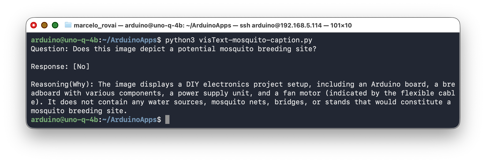

### Build a labeled dataset, one frame at a time

Section 8 showed the board producing a clean Question/Response/Reasoning row from a single image. Point the same code at a folder of field photos instead of one file, append each verdict to a JSONL file, and you have the start of a labeled dataset — generated offline, overnight, on a device that costs less than the camera that shot the photos.

```python
import json, glob

with open("labels.jsonl", "w") as out:
    for path in sorted(glob.glob("images/field/*.jpg")):
        verdict = describe_image(path, prompt=MOSQUITO_PROMPT, max_tokens=1024)
        out.write(json.dumps({"image": path, "verdict": verdict}) + "\n")
        print(f"done: {path}")
```

The catch is the one I keep coming back to: the model is confidently wrong often enough that you can't ship the labels unread. Treat the output as a first draft a human curates, not as ground truth. Even so, pre-labeling beats labeling from scratch — your reviewer is correcting, not authoring, and that's most of the cost gone.

### Zero-shot now, fine-tuned later

What you've built is zero-shot: a general model reasoning about a task it was never trained for. The VisText-Mosquito authors went the other way and fine-tuned Mosquito-LLaMA3-8B on their dataset, landing a BLEU of 54.7 and a final loss near 0.003. That's the quality ceiling for this task, and it sits well above what an un-tuned 0.8B reaches.

The two approaches aren't rivals. Zero-shot is how you bootstrap the dataset cheaply; fine-tuning is how you turn that dataset into a specialist. The UNO Q does the first job. The training happens on a workstation, and a small fine-tuned model can come back to the board for inference.

### Close the dual-brain loop

In Part 1, a button told the classifier whether standing water was present. A human pressed it (or it could have come from a YOLO output). With a camera and the vision pathway, that input can come from the model itself: the MCU triggers a capture on a timer or a motion sensor, the Linux side runs the describe-and-classify step, and the verdict drives the same RGB LED you wired in Part 1. The Bridge RPC plumbing doesn't change — only the source of the "water present" signal does. That's the arc of these two chapters in one line: the MCU senses, the MPU reasons, and now the reasoning includes sight.

## 11. Conclusion

You now have the same UNO Q from Part 1, but looking at photos — or a live camera frame — and judging mosquito habitat, with a clear picture of what that costs: roughly a minute per image on the 0.8B, a couple more with reasoning on, about five on the 2B, all on four CPU cores, no cloud. You know why `--jinja` and the context size matter, why a frozen progress bar is usually the encoder doing honest work rather than a crash, and how to read `free -h` without scaring yourself.

### What Works

- **Vision genuinely runs on this board.** A coin-sized CPU describes a scene and reasons about it offline. A couple of years ago that sentence would have been a joke.
- **The gist is reliable.** "There's a container holding standing water" is the kind of judgment the 0.8B gets right consistently, and that's exactly the judgment a breeding-site screen needs.
- **One model, two modes.** The same weights that ran the text classifier in Part 1 run the vision describer here. The `mmproj` is the only addition, and there's no separate VL download to manage.

### Limitations and Considerations

Being honest about what doesn't work well at this scale:

- **It's slow.** A minute to a few minutes per image rules out anything interactive. This is a batch tool, not a chat.
- **Confidently wrong on specifics.** The model called papayas "mangos." It will name the wrong container, invent a detail, occasionally flip a verdict. Trust it for the gist, never for the specifics, and keep a human curating anything that feeds a downstream model.
- **Compute-bound on image size, not memory-bound.** A too-large image doesn't crash the board, it just makes you wait ten minutes for an answer you could've had in one. Resolution is the lever.
- **Thinking mode is a double-edged tool.** It fixed the verdict that non-thinking mode got wrong, but the 0.8B struggles to terminate its own reasoning, so you pay for it with a generous `max_tokens` and the occasional cut-off.

### Where This Fits

The interesting use here isn't real-time vision — the latency forbids it. It's dataset bootstrapping. A board this cheap, generating first-draft labels offline, turns the expensive part of a supervised pipeline (the labeling) into something a single field device can do overnight. The 0.8B is the fast screen; the 2B is the quality pass for when correctness outweighs latency. `--image-max-tokens` is the dial between them.

### What's Next

- A live camera feeding frames on a timer or motion trigger, instead of files dropped into a folder.
- A fine-tuned specialist (the VisText-Mosquito path) replacing zero-shot reasoning for the production classifier.
- The full dual-brain loop: MCU triggers the capture, MPU runs the verdict, LED responds — the camera replacing the button from Part 1.

### A Note on the Arduino VENTUNO Q

The 16 GB VENTUNO Q, with its Dragonwing NPU, changes the math. The Qwen3.5-2B becomes interactive instead of a five-minute wait, the 4B's native vision fits with room to spare, and the encode step stops being the bottleneck. The patterns here port directly — same `mmproj` split, same flags, same dual-brain wiring. Only the clock changes.

## 12. Resources

### Useful Resources

| Resource | URL |
|---|---|
| Part 1 — Running SLMs with llama.cpp and Bridge RPC | <https://github.com/Mjrovai/ARDUINO-UNO-Q/blob/main/Gen_AI_Edge/README.md> |
| Project repository | https://github.com/Mjrovai/ARDUINO-UNO-Q/tree/main/Multimodal_AI_Edge |
| llama.cpp repository | <https://github.com/ggml-org/llama.cpp> |
| llama.cpp multimodal (mtmd) documentation | <https://github.com/ggml-org/llama.cpp/blob/master/docs/multimodal.md> |
| llama.cpp mtmd / libmtmd README | <https://github.com/ggml-org/llama.cpp/blob/master/tools/mtmd/README.md> |
| llama.cpp HTTP server docs | <https://github.com/ggml-org/llama.cpp/blob/master/tools/server/README.md> |
| Qwen3.5-0.8B GGUF + mmproj (Unsloth) | <https://huggingface.co/unsloth/Qwen3.5-0.8B-GGUF> |
| Qwen3.5-0.8B GGUF (Bartowski) | <https://huggingface.co/bartowski/Qwen_Qwen3.5-0.8B-GGUF> |
| ggml-org multimodal GGUF collection | <https://huggingface.co/collections/ggml-org/multimodal-ggufs-68244e01ff1f39e5bebeeedc> |
| VisText-Mosquito paper (arXiv) | <https://arxiv.org/abs/2506.14629> |
| VisText-Mosquito dataset (Mendeley) | <https://data.mendeley.com/datasets/rtsfh7jh7p/3> |
| VisText-Mosquito code repository | <https://github.com/adnanul-islam-jisun/VisText-Mosquito> |
| Arduino UNO Q Documentation | <https://docs.arduino.cc/hardware/uno-q> |
| Arduino_RouterBridge library | <https://github.com/arduino-libraries/Arduino_RouterBridge> |

### References

1. Qwen Team, "Qwen3.5 Small Model Series," Alibaba Cloud, 2026.
2. llama.cpp, "Multimodal Support (libmtmd / mmproj)," <https://github.com/ggml-org/llama.cpp/blob/master/docs/multimodal.md>
3. Islam, M. A., Sayeedi, M. F. A., Shuvo, M. A., Bappy, S. R., Islam, M. A., and Shatabda, S., "VisText-Mosquito: A Unified Multimodal Benchmark Dataset for Visual Detection, Segmentation, and Textual Reasoning on Mosquito Breeding Sites," arXiv:2506.14629, 2025.
4. Gerganov, G., "llama.cpp: Inference of Meta's LLaMA model (and others) in pure C/C++," <https://github.com/ggml-org/llama.cpp>
5. Unsloth, "Qwen3.5 — How to Run Locally," <https://unsloth.ai/docs/models/qwen3.5>, 2026.
6. Arduino, "Arduino UNO Q Product Page," <https://www.arduino.cc/product-uno-q/>

---

*Tutorial created for IESTI05 — Edge AI Machine Learning System Engineering, UNIFEI. Licensed under GNU General Public License 3.0.*
