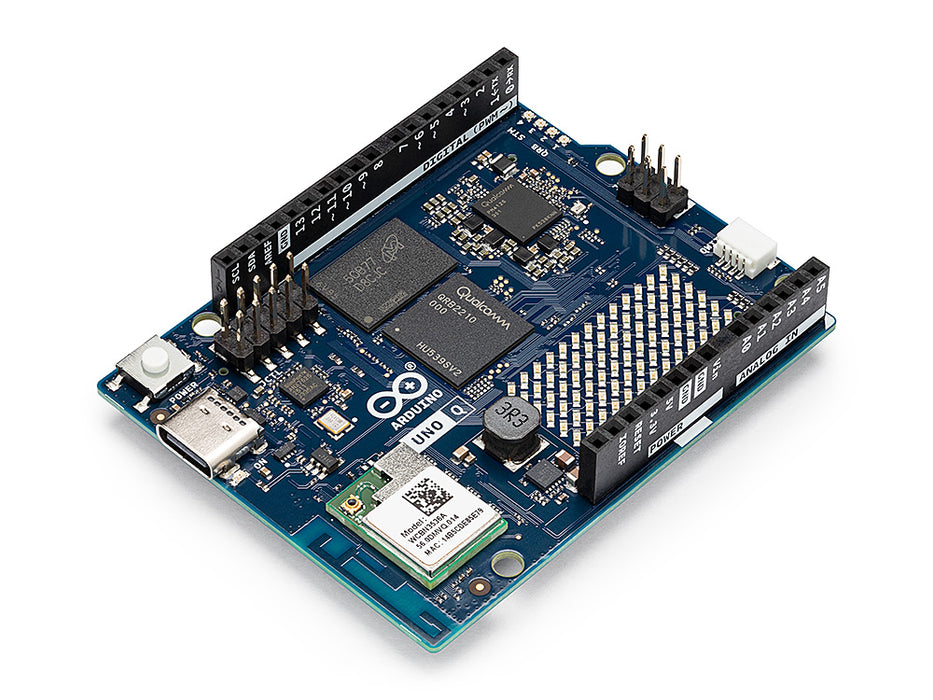

# Arduino UNO Q Hands-On Tutorials:

---
## Why the Arduino UNO Q for an ML Engineering Course?

In the Edge AI Machine Engineering courses, we have traditionally used separate hardware platforms for different tiers of the ML deployment spectrum:

- **TinyML on microcontrollers** (MCUs): Boards like the Arduino Nano, Nicla Vision, and Seeed XIAO ESP32S3 Sense running quantized models under extreme memory constraints (256 KB–512 KB RAM, no OS). Students learn to deploy keyword-spotting, image-classification, and anomaly-detection models using TensorFlow Lite (LiteRT) for Microcontrollers and Edge Impulse, operating at milliwatt-level power.

- **Edge AI on single-board computers** (SBCs): Platforms like the Raspberry Pi Zero 2 W and Raspberry Pi 5 running full Linux with Python-based ML frameworks (TensorFlow Lite (LiteRT), ONNX Runtime, PyTorch). Students work on more complex tasks, such as object detection with YOLO, generative AI with small language models, and multi-model pipelines — but without direct real-time hardware control.

These two tiers — MCU-based TinyML and SBC-based Edge AI — have always been taught as separate worlds, each with its own toolchain, programming language, and deployment workflow. Students would learn C/C++ and Arduino IDE for microcontrollers, then switch to Python and Linux for SBCs, often struggling to connect the two in a single project.

**The Arduino UNO Q bridges this gap.**

Its dual-brain architecture — a Linux-capable Qualcomm QRB2210 MPU paired with a real-time STM32U585 MCU on the same board — lets students experience both tiers simultaneously within a unified development environment. A single project can run an AI model in Python on the Linux side (like on a Raspberry Pi) while controlling sensors, motors, and LEDs from an Arduino sketch on the MCU side (like on a Nicla or XIAO) — with the two communicating seamlessly through Bridge RPC.

### How the UNO Q Compares to What We've Used Before

| Aspect | MCUs (Nano, Nicla, XIAO ESP32S3) | SBCs (RPi Zero 2W, RPi 5) | Arduino UNO Q |
|---|---|---|---|
| **CPU** | Single/Dual-core, 80–240 MHz | Quad/Multi-core, 1–2.4 GHz | Quad-core A53 @ 2 GHz + Cortex-M33 |
| **RAM** | 256 KB – 1MB (8MB w/PSRAM) | 512 MB – 8 GB | 2 GB or 4 GB + MCU SRAM |
| **OS** | Bare-metal / RTOS | Linux (Raspberry Pi OS) | Debian Linux + Zephyr RTOS |
| **ML Frameworks** | TFLM, Edge Impulse (C/C++) | TF Lite, ONNX, PyTorch (Python) | Both: Python ML + Arduino C++ |
| **Real-time I/O** | Native (GPIO, ADC, PWM) | Via libraries (no determinism) | Dedicated MCU (deterministic) |
| **Power** | Milliwatts (battery-friendly) | 1–5 W (RPi Zero) / 5–27 W (RPi 5) | ~3–5 W |
| **Camera support** | Built-in (Nicla, XIAO) | USB or CSI cameras | USB or MIPI-CSI (via carrier) |
| **Price** | ~\$15 (XIAO) –$90 (Nicla) | \$15 (Zero) / \$120 (RPi 5) | ~\$50 (2 GB) / ~\$60 (4 GB) |
| **AI Acceleration** | None (CPU only) | None (RPi 5 CPU) or external | Adreno GPU |
| **Ecosystem** | Arduino IDE, PlatformIO | Full Linux / pip / Docker | Arduino + Linux + App Lab CLI |

### What the UNO Q Brings to the Course

The UNO Q does not replace the MCU boards or the Raspberry Pi in our curriculum — it complements them by offering a unique "middle ground" that is pedagogically valuable:

- **Unified TinyML + Edge AI workflow**: Students deploy ML models in Python while controlling the physical world from Arduino sketches — on the same board, in the same project.
- **Real Linux skills on an Arduino**: The board runs standard Debian, so students practice SSH, package management, Python environments, and Git — all skills that transfer directly to Raspberry Pi, cloud servers, and production edge devices.
- **Low barrier to entry**: Students familiar with Arduino from introductory courses find the UNO form factor, pin layout, and shield compatibility immediately recognizable. The learning curve is adding Linux, not starting from scratch.
- **Edge Impulse integration**: The UNO Q has first-class Edge Impulse support, with pre-loaded models for image classification, object detection, keyword spotting, and anomaly detection — the same tasks we teach across the course.
- **Cost-effective classroom deployment**: At ~$50 for the 2 GB variant, the UNO Q is comparable in price to a Raspberry Pi 4 but includes the MCU subsystem, Wi-Fi, Bluetooth, and LED matrix out of the box — no additional HATs or accessories needed for basic projects.

---
## [1. Setup](./Setup/README.md)
## [2. Image Classification](./Image_Classification/README.md)
---
*Tutorials created for IESTI05 — Edge AI Machine Learning System Engineering, UNIFEI. Licensed under GNU General Public License 3.0.*
