# Arduino UNO Q Hands-On:

### Headless Setup and VSCode/CLI Development for Edge AI


---

## Table of Contents

1. [Introduction](#1-introduction)
2. [What Is the Arduino UNO Q?](#2-what-is-the-arduino-uno-q)
3. [Hardware and Software Requirements](#3-hardware-and-software-requirements)
4. [Installing ADB on Your Host Computer](#4-installing-adb-on-your-host-computer)
5. [Flashing the Latest Linux Image (Recommended)](#5-flashing-the-latest-linux-image-recommended)
6. [First Connection: Headless Setup via ADB](#6-first-connection-headless-setup-via-adb)
7. [Configuring Wi-Fi from the Terminal](#7-configuring-wi-fi-from-the-terminal)
8. [Enabling and Using SSH](#8-enabling-and-using-ssh)
9. [Setting Up VS Code with Remote-SSH](#9-setting-up-vs-code-with-remote-ssh)
10. [Understanding the UNO Q Dual-Brain Architecture](#10-understanding-the-uno-q-dual-brain-architecture)
11. [Project Structure](#11-project-structure)
12. [Your First Project: LED Blink (CLI Workflow)](#12-your-first-project-led-blink-cli-workflow)
13. [Exploring and Modifying Pre-Installed Examples](#13-exploring-and-modifying-pre-installed-examples)
14. [The arduino-app-cli Command Reference](#14-the-arduino-app-cli-command-reference)
15. [Essential Linux Commands for the UNO Q](#15-essential-linux-commands-for-the-uno-q)
16. [Tips, Tricks, and Troubleshooting](#16-tips-tricks-and-troubleshooting)
17. [Going Further](#17-going-further)
18. [Conclusion](#18-conclusion)
19. [Resources](#19-resources)

---

## 1. Introduction

### Why the Arduino UNO Q for an ML Engineering Course?

In the Edge AI Machine Engineering courses, we have traditionally used separate hardware platforms for different tiers of the ML deployment spectrum:

- **TinyML on microcontrollers** (MCUs): Boards like the Arduino Nano, Nicla Vision, and Seeed XIAO ESP32S3 Sense running quantized models under extreme memory constraints (256 KB–512 KB RAM, no OS). Students learn to deploy keyword-spotting, image-classification, and anomaly-detection models using TensorFlow Lite (LiteRT) for Microcontrollers and Edge Impulse, operating at milliwatt-level power.

- **Edge AI on single-board computers** (SBCs): Platforms like the Raspberry Pi Zero 2 W and Raspberry Pi 5 running full Linux with Python-based ML frameworks (TensorFlow Lite (LiteRT), ONNX Runtime, PyTorch). Students work on more complex tasks, such as object detection with YOLO, generative AI with small language models, and multi-model pipelines — but without direct real-time hardware control.

These two tiers — MCU-based TinyML and SBC-based Edge AI — have always been taught as separate worlds, each with its own toolchain, programming language, and deployment workflow. Students would learn C/C++ and Arduino IDE for microcontrollers, then switch to Python and Linux for SBCs, often struggling to connect the two in a single project.

**The Arduino UNO Q bridges this gap.**

Its dual-brain architecture — a Linux-capable Qualcomm QRB2210 MPU paired with a real-time STM32U585 MCU on the same board — lets students experience both tiers simultaneously within a unified development environment. A single project can run an AI model in Python on the Linux side (like on a Raspberry Pi) while controlling sensors, motors, and LEDs from an Arduino sketch on the MCU side (like on a Nicla or XIAO) — with the two communicating seamlessly through Bridge RPC.

### How the UNO Q Compares to What We've Used Before

| Aspect | MCUs (Nano, Nicla, XIAO ESP32S3) | SBCs (RPi Zero 2W, RPi 5) | Arduino UNO Q |
|---|---|---|---|
| **CPU** | Single/Dual-core, 80–240 MHz | Quad/Multi-core, 1–2.4 GHz | Quad-core A53 @ 2 GHz + Cortex-M33 |
| **RAM** | 256 KB – 1MB (8MB w/PSRAM) | 512 MB – 8 GB | 2 GB or 4 GB + MCU SRAM |
| **OS** | Bare-metal / RTOS | Linux (Raspberry Pi OS) | Debian Linux + Zephyr RTOS |
| **ML Frameworks** | TFLM, Edge Impulse (C/C++) | TF Lite, ONNX, PyTorch (Python) | Both: Python ML + Arduino C++ |
| **Real-time I/O** | Native (GPIO, ADC, PWM) | Via libraries (no determinism) | Dedicated MCU (deterministic) |
| **Power** | Milliwatts (battery-friendly) | 1–5 W (RPi Zero) / 5–27 W (RPi 5) | ~3–5 W |
| **Camera support** | Built-in (Nicla, XIAO) | USB or CSI cameras | USB or MIPI-CSI (via carrier) |
| **Price** | ~\$15 (XIAO) –$90 (Nicla) | \$15 (Zero) / \$120 (RPi 5) | ~\$50 (2 GB) / ~\$60 (4 GB) |
| **AI Acceleration** | None (CPU only) | None (RPi 5 CPU) or external | Adreno GPU |
| **Ecosystem** | Arduino IDE, PlatformIO | Full Linux / pip / Docker | Arduino + Linux + App Lab CLI |

### What the UNO Q Brings to the Course

The UNO Q does not replace the MCU boards or the Raspberry Pi in our curriculum — it complements them by offering a unique "middle ground" that is pedagogically valuable:

- **Unified TinyML + Edge AI workflow**: Students deploy ML models in Python while controlling the physical world from Arduino sketches — on the same board, in the same project.
- **Real Linux skills on an Arduino**: The board runs standard Debian, so students practice SSH, package management, Python environments, and Git — all skills that transfer directly to Raspberry Pi, cloud servers, and production edge devices.
- **Low barrier to entry**: Students familiar with Arduino from introductory courses find the UNO form factor, pin layout, and shield compatibility immediately recognizable. The learning curve is adding Linux, not starting from scratch.
- **Edge Impulse integration**: The UNO Q has first-class Edge Impulse support, with pre-loaded models for image classification, object detection, keyword spotting, and anomaly detection — the same tasks we teach across the course.
- **Cost-effective classroom deployment**: At ~$50 for the 2 GB variant, the UNO Q is comparable in price to a Raspberry Pi 4 but includes the MCU subsystem, Wi-Fi, Bluetooth, and LED matrix out of the box — no additional HATs or accessories needed for basic projects.

### What This Tutorial Covers

This tutorial focuses on getting the UNO Q up and running using only **terminal tools** (ADB and SSH) and **Visual Studio Code** via the Remote-SSH extension. We deliberately skip Arduino App Lab's graphical interface and instead focus on a professional, command-line-driven development workflow.

**Why this approach?**

- You gain full control over the board's Debian Linux environment.
- You can use your favorite editor (VS Code) with IntelliSense, extensions, and version control.
- Code lives on your host machine under Git, not locked inside the board.
- You learn transferable Linux/SSH/SCP skills used in real embedded and edge-AI deployments.
- Build and deployment can be scripted and automated.

By the end of this tutorial, you will be able to connect to the UNO Q headlessly, configure its network, transfer and run dual-brain projects (Python + Arduino sketch), and develop comfortably from VS Code over SSH.

---

## 2. What Is the Arduino UNO Q?


The Arduino UNO Q is a **hybrid single-board computer** that combines two processors on one UNO-form-factor board:

| Component | Role | Details |
|---|---|---|
| **MPU** (Microprocessor Unit) | High-level computing, AI, networking | Qualcomm Dragonwing™ QRB2210 — quad-core Arm Cortex-A53 @ 2.0 GHz, Adreno 702 GPU, dual ISP. Runs **Debian Linux**. |
| **MCU** (Microcontroller Unit) | Real-time hardware control | STMicroelectronics STM32U585 — Arm Cortex-M33 @ 160 MHz. Runs **Arduino Core on Zephyr OS**. |

The two processors communicate through **Bridge**, Arduino's RPC (Remote Procedure Call) library, allowing Python code on the MPU to call functions running in Arduino sketches on the MCU, and vice versa.

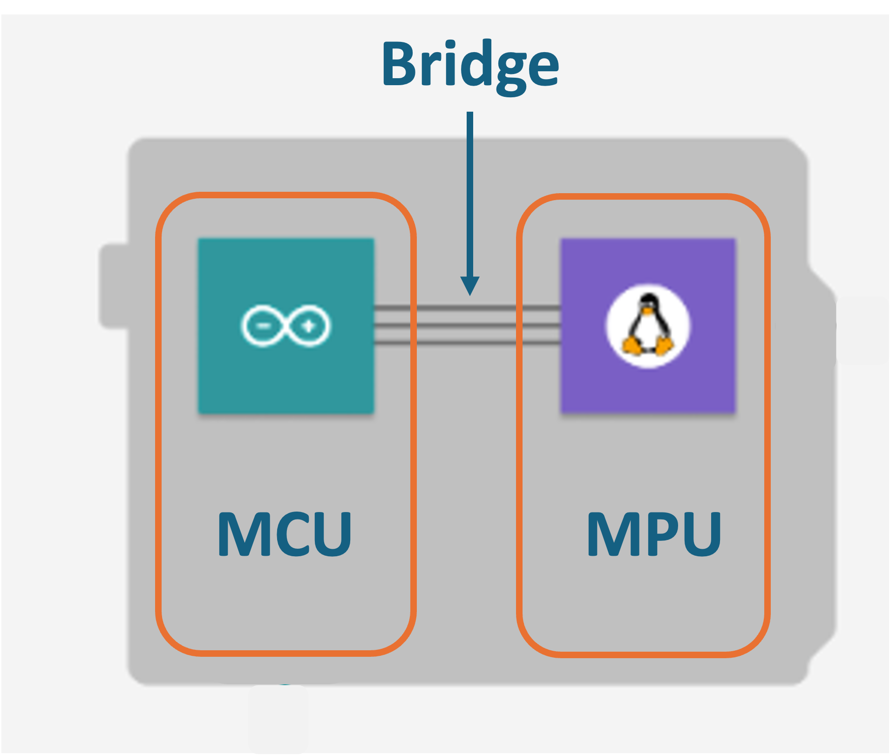

### Available Variants

| Variant | RAM | Storage (eMMC) | Best For |
|---|---|---|---|
| **2 GB** | 2 GB LPDDR4X | 16 GB | Headless/SSH development, lightweight edge AI, TinyML |
| **4 GB** | 4 GB LPDDR4X | 32 GB | SBC mode with display, larger AI models, multitasking |

Both variants share the same processor, connectivity (dual-band Wi-Fi 5 + Bluetooth 5.1), USB-C port, UNO-compatible headers, Qwiic connector, 8×13 LED matrix, and 4 RGB LEDs.

### Key Connectivity

- **USB-C**: Single multi-function port for power delivery, data (ADB), and DisplayPort video output.
- **Wi-Fi**: Dual-band 802.11ac (2.4 GHz and 5 GHz).
- **Bluetooth**: 5.1.

> **Important**: The UNO Q uses a single USB-C port for everything. Make sure you use a **data-capable USB-C cable** (not a charge-only cable). Some USB hubs and Apple USB-C adapters may not be recognized.

For more details: [Arduino® UNO Q 1 User Manual]( https://docs.arduino.cc/resources/datasheets/ABX00162-datasheet.pdf)

---

## 3. Hardware and Software Requirements

### Hardware

- Arduino UNO Q (2 GB or 4 GB variant)
- USB-C data cable (verify it is not charge-only)
- Host computer (Linux, macOS, or Windows)
- Wi-Fi network (the UNO Q and your host must be on the same network for SSH)

### Software (on your host computer)

| Tool | Purpose |
|---|---|
| **ADB** (Android Debug Bridge) | Initial headless connection over USB-C |
| **SSH client** | Remote access over Wi-Fi (built-in on Linux/macOS; available on Windows) |
| **SCP** | Secure file transfer to the board |
| **VS Code** | Code editor with Remote-SSH extension |

---

## 4. Installing ADB on Your Host Computer

ADB (Android Debug Bridge) lets you open a shell on the UNO Q over the USB-C cable — no network or monitor required. This is essential for initial setup.

### Linux (Ubuntu/Debian)

```bash
sudo apt update
sudo apt install android-tools-adb
```

### macOS

Using [Homebrew](https://brew.sh/):

```bash
brew install android-platform-tools
```

### Windows

1. Download **SDK Platform-Tools** from:  
   https://developer.android.com/studio/releases/platform-tools
2. Extract the ZIP to a folder (e.g., `C:\platform-tools`).
3. Add that folder to your system `PATH` environment variable, or open a terminal (PowerShell or Command Prompt) in that folder.

> **Windows tip**: For a more Unix-like experience (with native `ssh` and `scp` commands), consider installing [WSL (Windows Subsystem for Linux)](https://learn.microsoft.com/en-us/windows/wsl/install). Inside WSL you can install ADB the same way as on Ubuntu.

### Verify the Installation

With the UNO Q **disconnected**, run:

```bash
adb version
```

You should see output like `Android Debug Bridge version X.X.X`. If not, revisit the installation steps.

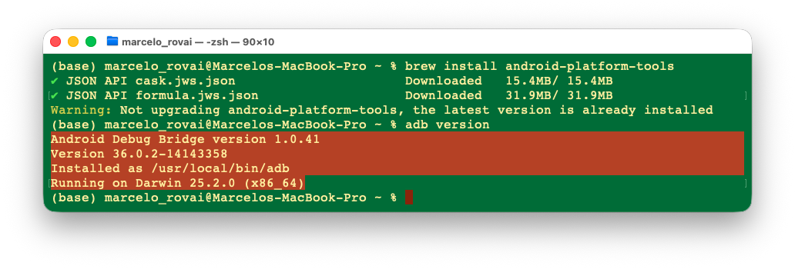

---

## 5. Flashing the Latest Linux Image (Recommended)

> **This step is optional but strongly recommended**, especially for boards fresh out of the box. The first batches of UNO Q shipped with an older Debian image that can cause issues such as: random desktop/application restarts due to missing ZRAM memory compression, ADB defaulting to root (a security concern), and missing HDMI audio support. Flashing the latest image resolves all of these and ensures a consistent experience across your classroom boards.
>
> **If your board is already up to date** (e.g., you purchased it recently and it boots correctly), you can skip this section and go directly to [Section 6](#6-first-connection-headless-setup-via-adb).

The flashing process uses Arduino's `arduino-flasher-cli` tool, which runs entirely from the terminal on your host computer. It downloads the latest Debian image (~1 GB) and writes it to the UNO Q's eMMC storage.

> **Warning**: Flashing erases everything on the board and restores it to factory state. If you have existing projects on the UNO Q, back them up first.

### Step 1 — Download the Flasher CLI

Go to the Arduino Flasher CLI releases page and download the version for your operating system:

https://github.com/arduino/arduino-flasher-cli/releases

| OS | File to download |
|---|---|
| **Linux** | `arduino-flasher-cli_X.X.X_Linux_64bit.tar.gz` |
| **macOS** | `arduino-flasher-cli_X.X.X_macOS_64bit.tar.gz` |
| **Windows** | `arduino-flasher-cli_X.X.X_Windows_64bit.zip` |

Extract the archive to a convenient location.

### Step 2 — Put the Board into Flash Mode (EDL Mode)

With the board **powered off** (USB cable disconnected):

1. Locate the **JCTL** header on the UNO Q board (a small 10-pin header).
2. Using a jumper wire or shunt, **short the two pins furthest from the USB-C connector**.
3. With the jumper in place, connect the USB-C cable to your computer.

The board will boot into EDL (Emergency Download) mode — the LED matrix will show the Arduino Logo continuously. 


### Step 3 — Flash the Latest Image

Open a terminal on your host computer, navigate to the folder where you extracted the flasher CLI, and run:

**Linux / macOS:**

```bash
./arduino-flasher-cli flash latest
```

**Windows (PowerShell):**

```powershell
.\arduino-flasher-cli.exe flash latest
```

The tool will:

1. Ask if you want to download the latest Debian image — type `y` and press Enter.
2. Download the image (~1 GB, this may take several minutes).
3. Extract the image.
4. Flash it to the UNO Q's eMMC.

**Do not disconnect the USB cable or interrupt the process.** Wait until you see a message confirming that the partition is now bootable.

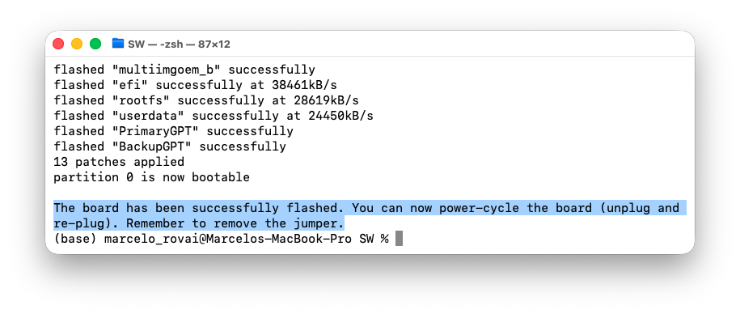

> **Linux users**: If the flasher cannot access the device, you may need to run it with `sudo`, or add a udev rule for the Qualcomm EDL device.

### Step 4 — Remove the Jumper and Reboot

1. Disconnect the USB cable.
2. **Remove the jumper** from the JCTL header.
3. Reconnect the USB cable.

The board will boot from the fresh image. You will see the Arduino logo animation on the LED matrix, ending with a heart, indicating a successful flash (one of the blue LEDs will also be on). The board is now in a factory-fresh state and ready for setup.


### Flashing a Local Image (Alternative)

If you have already downloaded the Debian image file, you can flash it directly without re-downloading:

```bash
./arduino-flasher-cli flash path/to/downloaded/image
```

> This is useful in multiple settings where you can download the image once and distribute it via a shared drive or USB stick.
>

---

## 6. First Connection: Headless Setup via ADB

### Step 1 — Connect the Board

1. Plug the USB-C data cable into the UNO Q and into your computer.
2. Wait approximately 30 seconds for the board to boot. You will see the LED matrix display an animated Arduino logo ending with a heart during startup.

### Step 2 — Verify ADB Sees the Device

```bash
adb devices
```

Expected output:

```
List of devices attached
XXXXXXXX    device
```

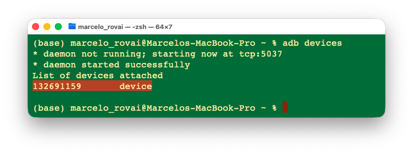

If the list is empty:

- Confirm that you are using a USB-C data cable.
- Try a different USB port (preferably a USB-C or USB 3.0 port directly on your computer, not through a hub).
- On Linux, you may need to configure udev rules for the device.

### Step 3 — Open a Shell on the Board

```bash
adb shell
```

You are now inside the UNO Q's Debian Linux environment. The default credentials are:

| Field | Value |
|---|---|
| Username | `arduino` |
| Password | `arduino` |

### Step 4 — Change the Default Password (Recommended)

For security, the default password `arduino` should be changed. If you do not change it, the system will remind you. It is mandatory. 

```bash
sudo passwd arduino
```

Enter and confirm your new password. **Remember this password** — you will need it for SSH.

### Step 5 — Check Board Information

While in the ADB shell, you can inspect the system:

```bash
# Check OS version
cat /etc/os-release

# Check available storage
df -h

# Check RAM
free -h

# Check CPU info
lscpu
```

Type `exit` to leave the ADB shell and return to your host terminal.

---

## 7. Configuring Wi-Fi from the Terminal

Wi-Fi is essential for SSH access. We will configure it entirely from the ADB shell.

### Step 1 — Enter the ADB Shell

```bash
adb shell
```

### Step 2 — Scan for Available Networks

```bash
nmcli dev wifi list
```

This will display all visible Wi-Fi networks with their SSID, signal strength, security type, etc.

### Step 3 — Connect to Your Wi-Fi Network

```bash
sudo nmcli dev wifi connect "YOUR_WIFI_SSID" password "YOUR_WIFI_PASSWORD"
```

Replace `YOUR_WIFI_SSID` and `YOUR_WIFI_PASSWORD` with your actual network credentials. If your SSID contains spaces, keep the quotes.

### Step 4 — Verify the Connection

```bash
nmcli device status
```

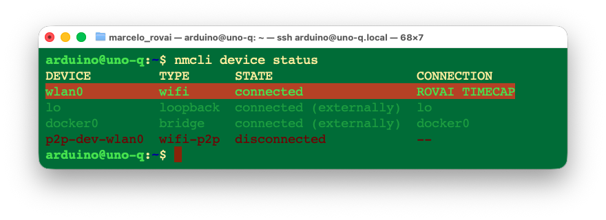

The `wlan0` interface should show `connected`. Now get the board's IP address:

```bash
hostname -I
```

or, for more detail:

```bash
ip addr show wlan0
```

Look for the `inet` line — it will show something like `192.168.1.XXX/24`. **Write down this IP address**; you will need it for SSH.

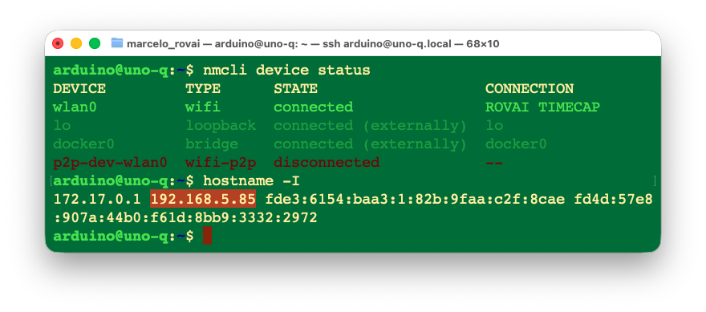

> **Tip**: If your router supports it, assign a **static IP** to your UNO Q using its MAC address (visible in the output of `ip addr show wlan0` under `link/ether`). This prevents the IP from changing between reboots — especially useful in classroom setups with multiple boards.

### Switching Networks Later

If you need to change Wi-Fi networks in the future (over SSH or ADB):

```bash
# Disconnect from current network
nmcli device disconnect wlan0

# Connect to a different network
sudo nmcli dev wifi connect "NEW_SSID" password "NEW_PASSWORD"
```

---

## 8. Enabling and Using SSH

### Step 1 — Enable the SSH Server

During the first setup, Wi-Fi® credentials are entered, and the board will automatically enable SSH. But it also needs to be completed and activated manually. 

For that, run the command below in the board's shell.

```bash
arduino-app-cli system network-mode enable 
```

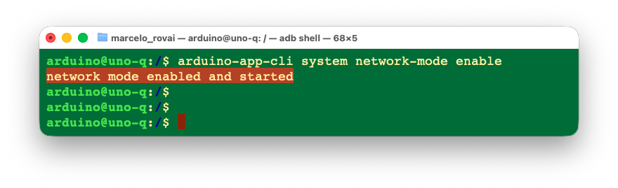

### Step 2 — Exit ADB and Connect via SSH

Exit the ADB shell:

```bash
exit
```

Now, from your host computer's terminal, connect via SSH:

```bash
ssh arduino@<UNO_Q_IP_ADDRESS>
```

Replace `<UNO_Q_IP_ADDRESS>` with the IP you noted earlier (e.g., `192.168.1.42`).

- The first time you connect, you will be asked to accept the host fingerprint. Type `yes`.
- Enter the password you set earlier (or `arduino` if you did not change it).

You should now have a remote Debian shell on the UNO Q over your Wi-Fi network.

### Alternative: Connect Using Hostname

On some networks that support mDNS, you can also use:

```bash
ssh arduino@uno-q.local
```

Or if you named your board during setup:

```bash
ssh arduino@<boardname>.local
```

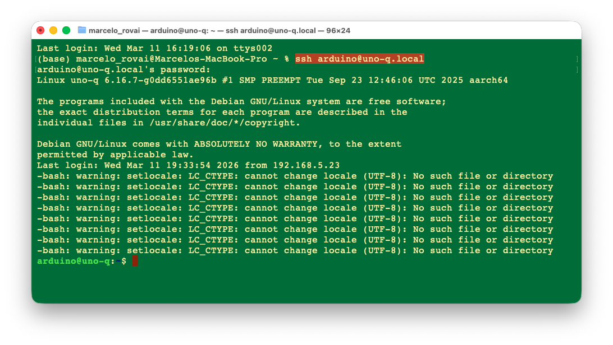

### Step 3 — Set Up SSH Key Authentication (Optional but Recommended)

To avoid typing your password every time:

**On your host computer**, generate an SSH key pair (if you do not already have one):

```bash
ssh-keygen -t ed25519
```

Press Enter to accept the defaults. Then copy the public key to the UNO Q:

```bash
ssh-copy-id arduino@<UNO_Q_IP_ADDRESS>
```

Enter your password one last time. From now on, `ssh arduino@<UNO_Q_IP_ADDRESS>` will connect without a password prompt.

### If the SSH Password Is Not Working

If the default `arduino` password is rejected, use ADB to reset it:

```bash
adb shell
sudo passwd arduino
```

Set a new password, exit, and try SSH again.

### Step 4 —Check the CPU and memory with htop

On the terminal, run:

```bash
htop
```

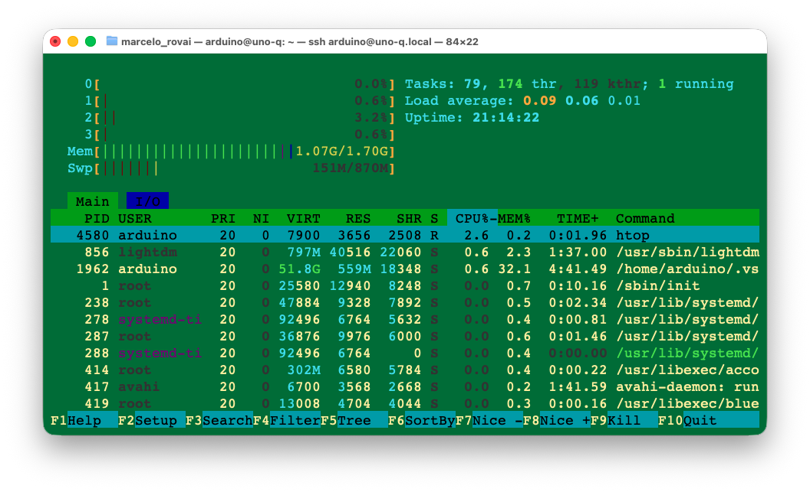

---

## 9. Setting Up VS Code with Remote-SSH

Visual Studio Code with the Remote-SSH extension gives you a full IDE experience — file browsing, terminal, IntelliSense, extensions — running directly on the UNO Q's filesystem.

### Step 1 — Install VS Code

Download and install VS Code for your OS from:  
https://code.visualstudio.com/

### Step 2 — Install the Remote-SSH Extension

1. Open VS Code.
2. Go to the **Extensions** view (`Ctrl+Shift+X` / `Cmd+Shift+X`).
3. Search for **Remote - SSH** (by Microsoft).
4. Click **Install**.

### Step 3 — Connect to the UNO Q

1. Click the **Remote Connection** icon in the bottom-left corner or at the left menu of VS Code (it looks like `><`).
2. Select `+` or **Connect to Host…**
3. Enter: `arduino@<UNO_Q_IP_ADDRESS>`

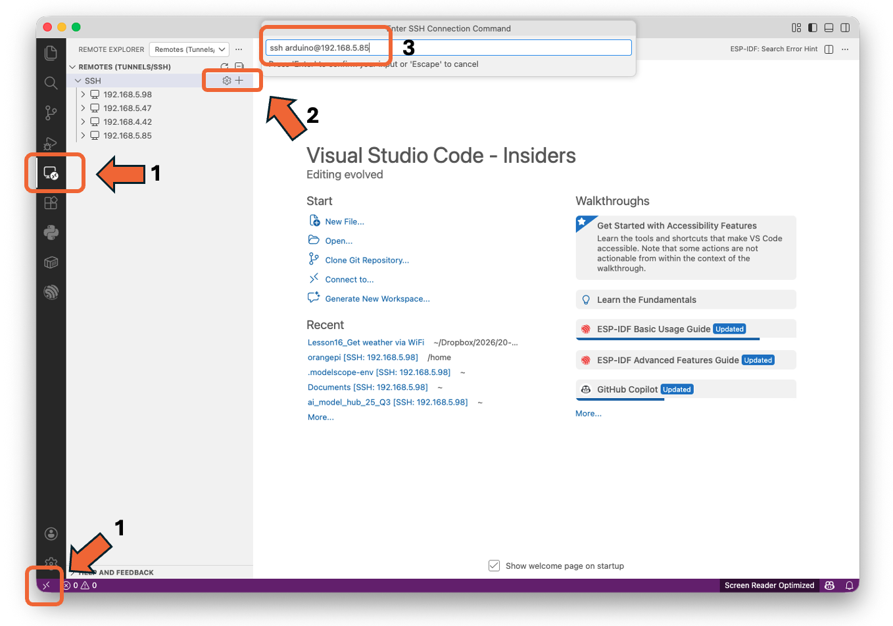

4. When prompted, hit `<Enter>`. The Arduino UNO IP Address will appear under `SSH`. 
5. Click in the `terminal +`  icon. 

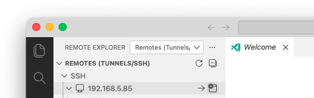

6. Enter your password (or it will authenticate automatically if you set up SSH keys).

VS Code will install a lightweight server component on the UNO Q. This may take a minute on the first connection.

### Step 4 — Open Your Projects Folder

Once connected:

1. Go to **File → Open Folder…**
2. Navigate to `/home/arduino/ArduinoApps/`

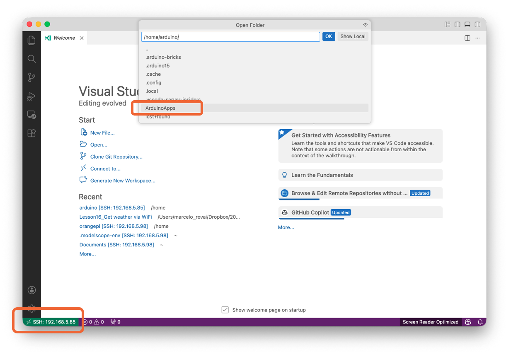

3. Click **OK**.

You now have full file-browsing, editing, and integrated terminal access to the UNO Q.

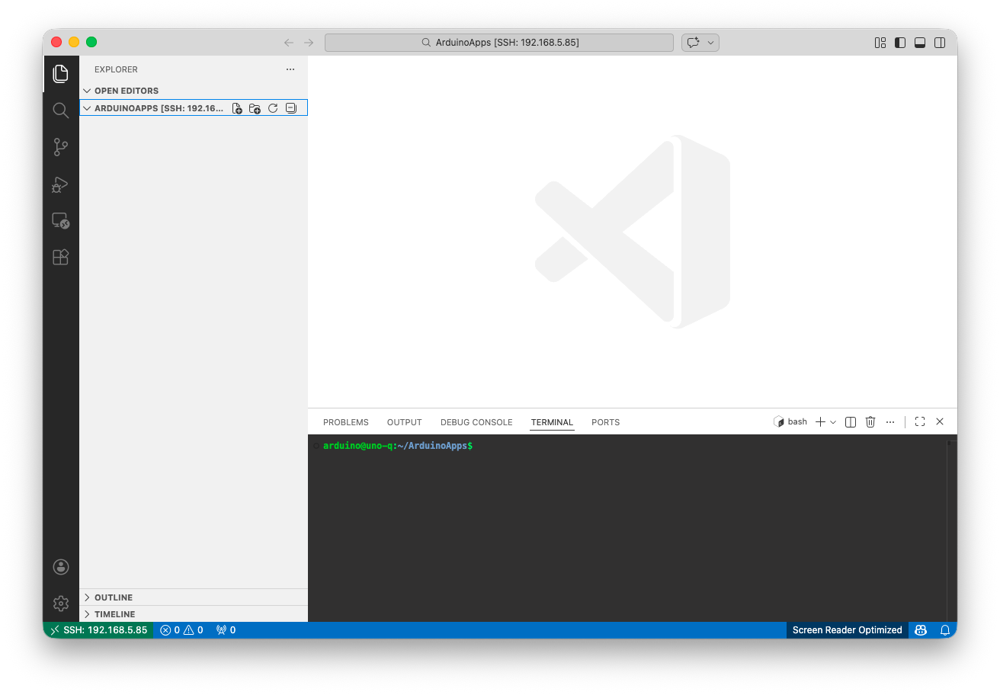

### Step 5 — Open the Integrated Terminal

If not opened, use `` Ctrl+` `` (backtick) to open a terminal inside VS Code. This terminal runs directly on the UNO Q, so you can execute `arduino-app-cli` commands, install packages, and manage your projects — all from within VS Code.

### Important: Disable Heavy Extensions on the Remote

The UNO Q has limited RAM (especially the 2 GB variant). To avoid memory issues:

- **Disable** GitHub Copilot and other AI assistants on the remote connection.
- **Disable** any extension you do not strictly need for Python/C++ editing.
- Keep installed remote extensions to a minimum: **Python**, **C/C++**, and **Pylance** are usually sufficient.

You can disable extensions selectively for the SSH connection without affecting your local setup: right-click the extension and choose *Disable (SSH: arduino@...)*.

---

## 10. Understanding the UNO Q Dual-Brain Architecture

The UNO Q runs two processors simultaneously, each with its own operating system and programming language:

```bash
┌─────────────────────────────────────────────────────┐
│                   Arduino UNO Q                     │
│                                                     │
│  ┌──────────────────────┐  ┌──────────────────────┐ │
│  │     MPU (Linux)      │  │     MCU (Zephyr)     │ │
│  │                      │  │                      │ │
│  │  Qualcomm QRB2210    │  │  STM32U585           │ │
│  │  Cortex-A53 @ 2 GHz  │  │  Cortex-M33 @ 160MHz │ │
│  │  Debian Linux        │  │  Arduino Core        │ │
│  │  Python scripts      │  │  C++ sketches        │ │
│  │                      │  │                      │ │
│  │  • AI / ML inference │  │  • GPIO pin control  │ │
│  │  • Networking / USB  │  │  • PWM / ADC / SPI   │ │
│  │  • Camera / Display  │  │  • Real-time tasks   │ │
│  │  • File I/O          │  │  • LED matrix        │ │
│  └──────────┬───────────┘  └──────────┬───────────  │
│             │        Bridge (RPC)     │             │
│             └────────────┬────────────┘             │
│                          │                          │
│              Bidirectional function calls           │
└─────────────────────────────────────────────────────┘
```

### How Bridge Works

- **Python → MCU**: Your Python code calls `Bridge.call("function_name", args)` to invoke a function registered in the Arduino sketch.
- **MCU → Python**: The Arduino sketch can similarly call back into the Python side.

This lets you, for example, run an AI model in Python and then send the result to the MCU to control a servo or LED in real time.

### The arduino-app-cli Tool

The `arduino-app-cli` is a command-line tool **pre-installed on the UNO Q** that orchestrates both sides. It handles:

- Building the Arduino sketch (compiling C++ for the MCU).
- Setting up the Python environment (installing dependencies from `requirements.txt`).
- Deploying and launching both halves together.
- Logging and monitoring.

---

## 11. Project Structure

Every UNO Q project follows a standard directory layout. The `arduino-app-cli` expects this structure:

```
my_project/
├── app.yaml              # App manifest (name, version, bricks, ports)
├── README.md             # Project documentation (optional)
├── python/
│   ├── main.py           # Python entry point (runs on MPU)
│   └── requirements.txt  # Python dependencies (pip format)
└── sketch/
    ├── sketch.ino        # Arduino sketch (runs on MCU)
    └── sketch.yaml       # Arduino build config (board, libraries)
```

**File-by-file explanation:**

### app.yaml

Defines the overall application metadata and optional "Bricks" (pre-built service modules for web servers, computer vision, etc.):

```yaml
name: My Project
description: "A short description of the project"
icon: 🤖
version: "1.0.0"
ports: []
bricks: []
```

### python/main.py

The Python program that runs on the Linux side (MPU). It must include `App.run()` to properly start in the UNO Q runtime:

```python
from arduino.app_utils import *

def loop():
    # Your code here
    pass

App.run(user_loop=loop)
```

### python/requirements.txt

Standard pip requirements file. List any Python packages your project needs (one per line). Leave empty if no extra packages are required.

### sketch/sketch.ino

Standard Arduino sketch (C++) that runs on the MCU. Include the Bridge library to communicate with the Python side:

```cpp
#include "Arduino_RouterBridge.h"

void setup() {
    Bridge.begin();
    // Register functions callable from Python
}

void loop() {
    // Real-time control code
}
```

### sketch/sketch.yaml

Declares the board type, platform, and library dependencies for the Arduino build system:

```yaml
profiles:
  default:
    fqbn: arduino:zephyr:unoq
    platforms:
      - platform: arduino:zephyr
    libraries:
      - MsgPack (0.4.2)
      - DebugLog (0.8.4)
      - ArxContainer (0.7.0)
      - ArxTypeTraits (0.3.1)
default_profile: default
```

> **Note**: The four libraries listed above (MsgPack, DebugLog, ArxContainer, ArxTypeTraits) are required by the Bridge system. Always include them. Add any extra Arduino libraries your sketch needs (with exact version numbers).

### Creating a new App

You can create a new app by using the CLI command, `arduino-app-cli app new "<NAME_APP>"`, for example:

```bash
arduino-app-cli app new "test"
```

This will create a new App named `test` along with its main files.

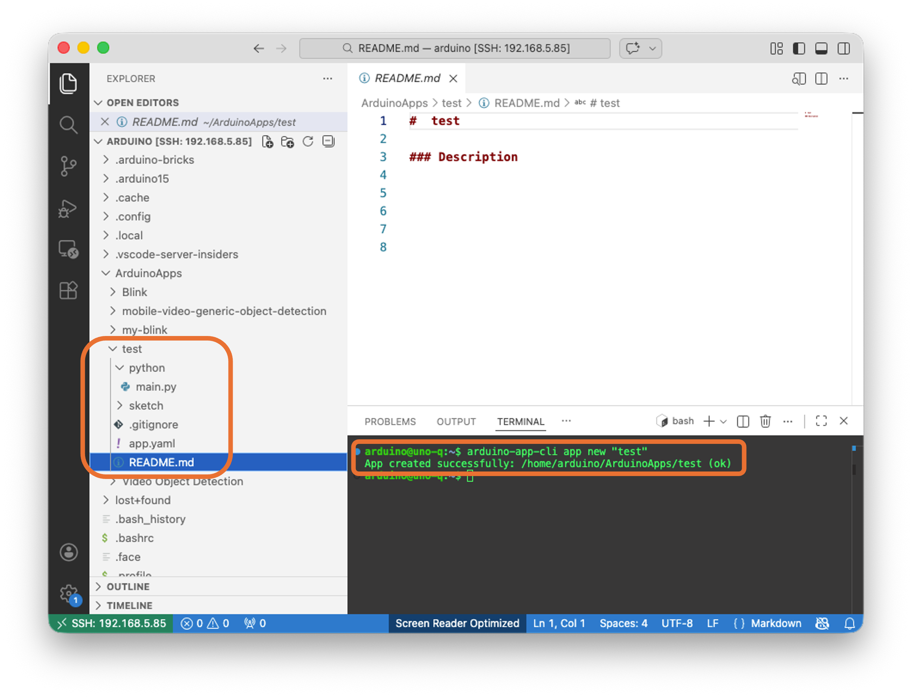

---

## 12. First Project: LED Blink (CLI Workflow)

Let us walk through creating, transferring, and running a complete project that blinks the built-in LED using the Bridge between Python and the MCU.

### Step 1 — Download `app-bricks-examples` on Your Host Computer

Go to [app-bricks-examples website](https://github.com/arduino/app-bricks-examples) and download the ZIP content. When opened, you will find a full list of examples. 

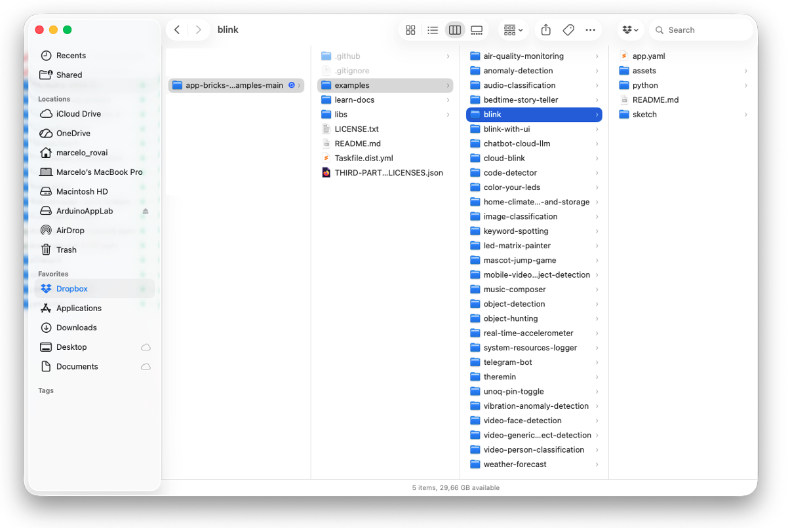

### Step 2 — Blink Example Files

**blink/app.yaml**

```yaml
name: Blink LED
icon: 🔴
description: This example shows how to make the LED blink alternately.
```

**blink/python/main.py**

```python
# SPDX-FileCopyrightText: Copyright (C) ARDUINO SRL (http://www.arduino.cc)
#
# SPDX-License-Identifier: MPL-2.0

from arduino.app_utils import *
import time

led_state = False

def loop():
    global led_state
    time.sleep(1)
    led_state = not led_state
    Bridge.call("set_led_state", led_state)

App.run(user_loop=loop)
```

**blink/python/requirements.txt**

```
# No extra dependencies for this project
```

**blink/sketch/sketch.ino**

```cpp
// SPDX-FileCopyrightText: Copyright (C) ARDUINO SRL (http://www.arduino.cc)
//
// SPDX-License-Identifier: MPL-2.0

#include "Arduino_RouterBridge.h"

void setup() {
    pinMode(LED_BUILTIN, OUTPUT);

    Bridge.begin();
    Bridge.provide("set_led_state", set_led_state);
}

void loop() {
}

void set_led_state(bool state) {
    // LOW state means LED is ON
    digitalWrite(LED_BUILTIN, state ? LOW : HIGH);
}
```

**blink/sketch/sketch.yaml**

```yaml
profiles:
  default:
    platforms:
      - platform: arduino:zephyr
    libraries:
      - Arduino_RouterBridge (0.3.0)
      - dependency: Arduino_RPClite (0.2.1)
      - dependency: ArxContainer (0.7.0)
      - dependency: ArxTypeTraits (0.3.2)
      - dependency: DebugLog (0.8.4)
      - dependency: MsgPack (0.4.2)
default_profile: default
```

### Step 3 — Create the Destination Folder on the UNO Q

In the VCS, under the `ArduinoApps` folder create a folder, for example `Blink`:

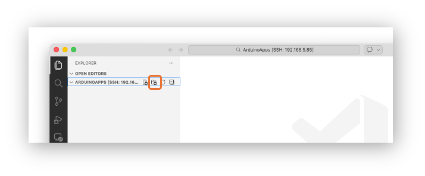

### Step 4 — Transfer the Project Files

#### a. Transferring files using FTP (FileZilla)

Transferring files via FTP, such as [FileZilla FTP Client](https://filezilla-project.org/download.php?type=client), is also possible and much easier to use. Follow the instructions to install the program on your Desktop, then use the Uno-Q's IP address as the `Host`. For example:

```bash
sftp://192.168.5.85
```

Enter your UNO-Q `username and password`. Pressing `Quickconnect` opens two windows, one for your host computer desktop (right) and another for the UNO-Q (left).

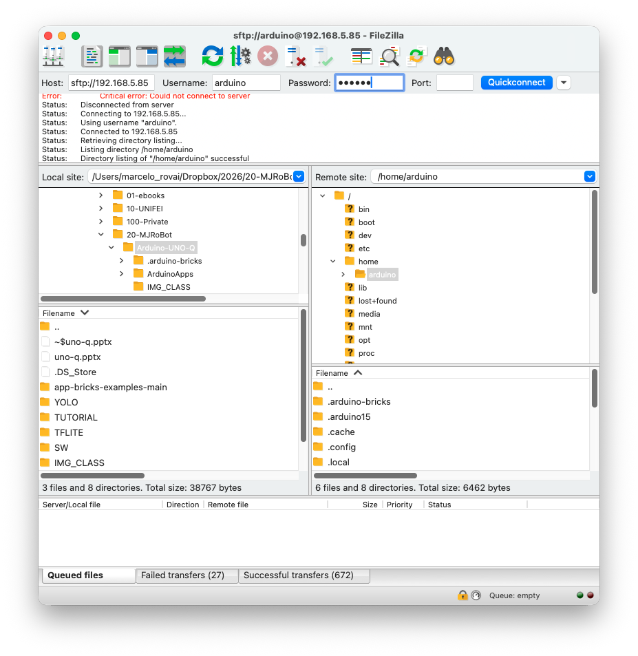

#### b. Using scp

From your host machine, navigate into the `blink/` directory and copy all files to the board:

```bash
cd blink
scp -r * arduino@<UNO_Q_IP_ADDRESS>:~/ArduinoApps/Blink/
```

Enter your password when prompted. You should see the files being transferred.

#### c. Dragging Files

Or simply select the files under the  `blink/` directory in your PC and drag them into the  VCS `Blink/` folder in the Uno-Q:

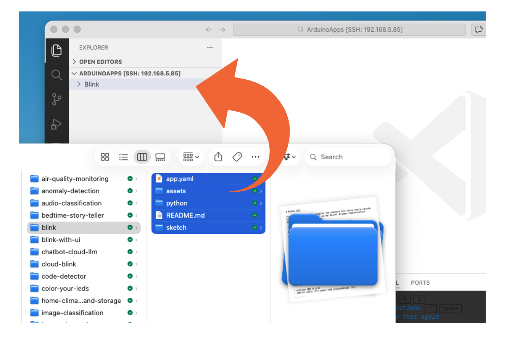

### Step 5 — Run the Project

Start the application from ArduinoApps folder:

```bash
arduino-app-cli app start ~/ArduinoApps/Blink
```

Or if in the `Blink` folder (which is recommended), simply:

```bash
arduino-app-cli app start .
```

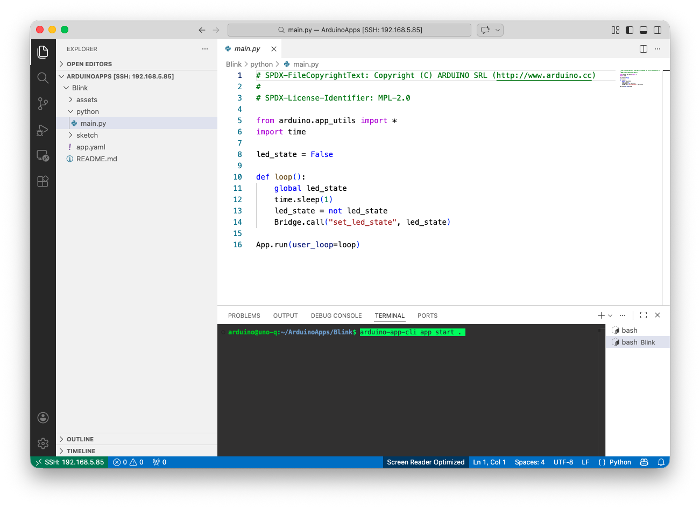

> **Note**: The first run may take several minutes as the system downloads and installs Arduino libraries and sets up the Python container.

You should see the built-in LED on the UNO Q blinking on and off every second.

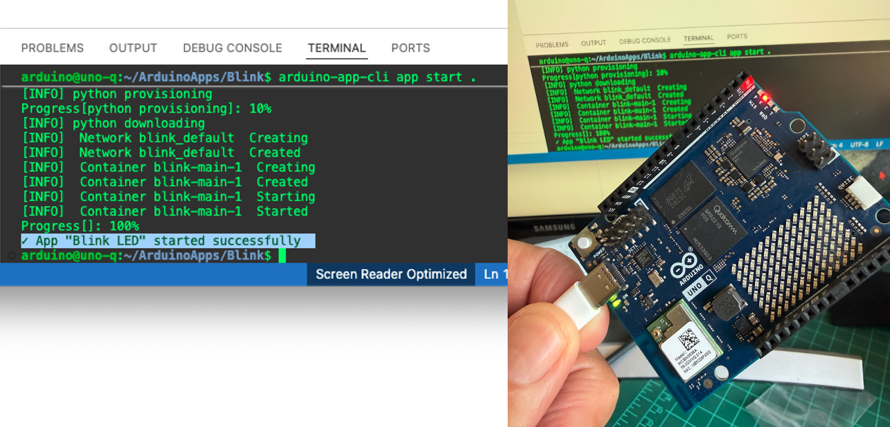

### Step 6 — View Logs

If you modify your code to, for example, generate a `print()` output, it goes to a log file (not the console). To view it, you should use:

```bash
arduino-app-cli app logs . --follow
```

### Step 7 — Stop the Application

The app runs in the background. Stop it with:

```bash
arduino-app-cli app stop ~/ArduinoApps/Blink
```
or in the project folder
```bash
arduino-app-cli app stop .
```
The LED will stop blinking, and in the terminal, the message below will be displayed:

  `✓ App '"Blink LED" stopped successfully.`


---

## 13. Exploring and Modifying Pre-Installed Examples

### Step 1 — Exploring the Pre-loaded AI models

The UNO Q ships with a rich set of pre-installed example applications that demonstrate everything from basic LED control to AI-powered computer vision. You can discover, run, study, and customize all of them entirely from the terminal or VS Code over SSH — no App Lab GUI required.

> To guarantee that you have the latest pre-loaded models you can updated the system with the command:
>
> `arduino-app-cli system update`

From an SSH terminal (or the VS Code integrated terminal), run:

 `arduino-app-cli app list`.

This command will show all installed models, including the user created ones:

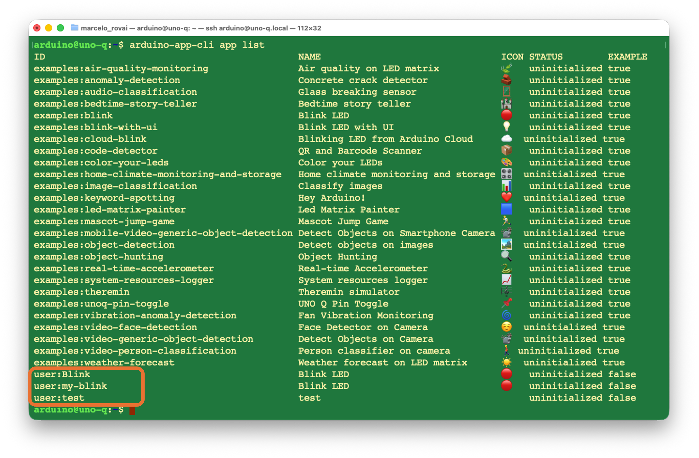

Note that the `examples:` apps listed by `arduino-app-cli` are **not** stored in `~/ArduinoApps/` — only your user-created apps (like `Blink`) live there. The examples are managed internally by the CLI on the filesystem and  stored inside `~/.local/share/arduino-app-cli` on the board.

So we have two classes of apps in the UNO-Q:

- **`examples:\*`** → read-only, managed by the CLI at `/var/lib/arduino-app-cli`
- **`user:\*`** → your apps in `~/ArduinoApps/`, which is the only place you see with `ls`

### Step 2 — Running an example via terminal

It is possible to run any of the examples directly on a terminal via SSH

```bash
arduino-app-cli app start examples:blink
```

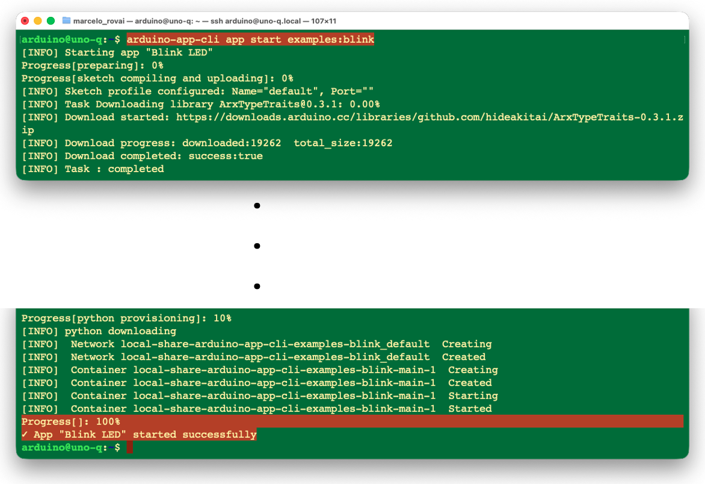

To inspect the logs:

```bash
arduino-app-cli app logs examples:blink
```

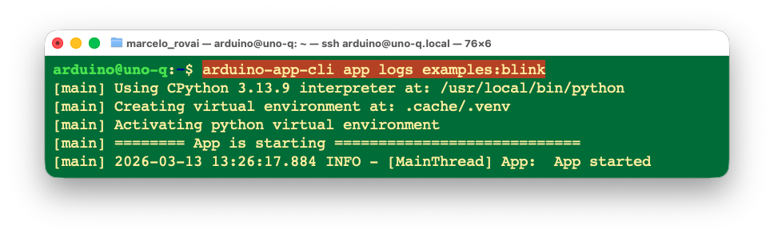

And to stop it:

```bash
arduino-app-cli app stop examples:blink
```

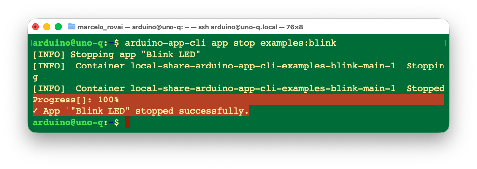

### Step 3 — Studying an Example's Source Code in VS Code

Since the examples live in `/var/lib/arduino-app-cli`, you can browse (and run) them in VS Code by opening that folder:

1. In VS Code (connected via Remote-SSH), go to **File → Open Folder…**
2. Navigate to `/var/lib/arduino-app-cli`
3. Click **OK**.

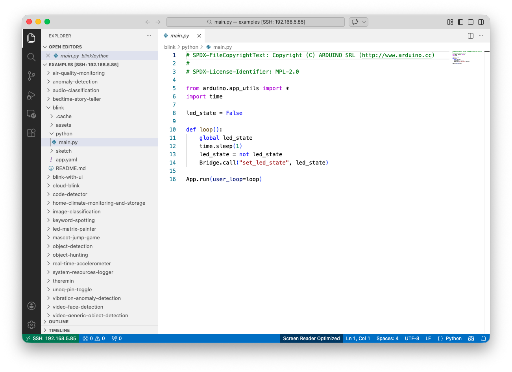

You can now browse all example projects and study their `app.yaml`, `python/main.py`, `sketch/sketch.ino`, and any Brick configurations. This is a great way to learn how the dual-brain architecture works in practice.

> **Important**: These example files are **read-only** (managed by the system). Do not try to edit them in place — your changes may be overwritten during system updates.

### Step 4 — Copying an Example to Your Workspace for Modification

To customize an example, copy it to your `~/ArduinoApps/` directory first:

```bash
cp -r /var/lib/arduino-app-cli/examples/blink ~/ArduinoApps/my-blink
```

Verify it now appears as a user app:

```bash
arduino-app-cli app list
```

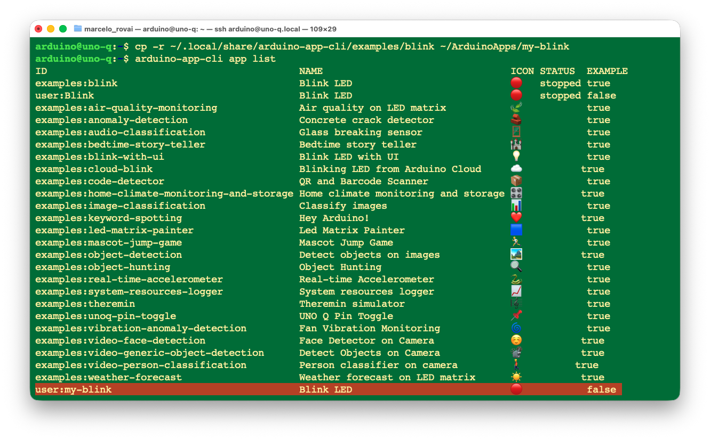

You should see a new entry `user:my-blink` alongside the original `examples:blink`.

Now in VS Code, open `~/ArduinoApps/` and you have full read-write access to your copy. You can modify the Python code, the Arduino sketch, add libraries, and change Bricks. For example, let's change the main.py, to add a Print statement:

```python
from arduino.app_utils import *
import time

led_state = False

def loop():
    global led_state
    time.sleep(1)
    led_state = not led_state
    Bridge.call("set_led_state", led_state)
    print(f"LED {'ON' if led_state else 'OFF'}")

App.run(user_loop=loop)
```

and run the modified version:

```bash
arduino-app-cli app start .
```

On the UNO Q, Python apps run inside a container, so `print()` output goes to a **log file**, not to the console. You won't see it in the terminal where you ran `app start`.

To see the print output, open a **second terminal** (or a second VS Code terminal tab) and run:

```bash
arduino-app-cli app logs . --follow
```

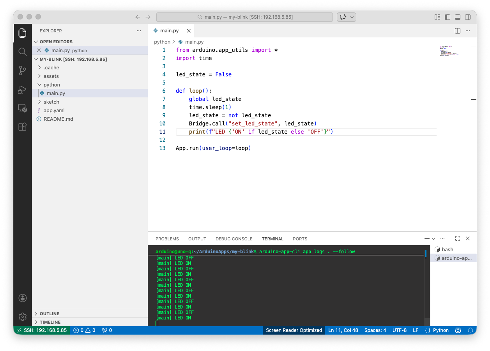

## 14. The arduino-app-cli Command Reference

The `arduino-app-cli` tool is pre-installed on the UNO Q and manages the full lifecycle of dual-brain applications.

| Command | Description |
|---|---|
| `arduino-app-cli app start <path>` | Build (if needed) and start the application at the given path |
| `arduino-app-cli app stop <path>` | Stop a running application |
| `arduino-app-cli app logs <path>` | View the Python-side log output |
| `arduino-app-cli app list` | List installed/running applications |
| `arduino-app-cli app new "<name>"` | Create a new App |
| `arduino-app-cli system cleanup` | Clean unused containers and images |
| `arduino-app-cli system update` | Update the CLI tool and board components |

> For full documentation, see the [Arduino App CLI repo](https://github.com/arduino/arduino-app-cli) and the [official CLI tutorial](https://docs.arduino.cc/software/app-lab/tutorials/cli/).

---

## 15. Essential Linux Commands for the UNO Q

Since the UNO Q runs Debian Linux, here are the commands you will use frequently:

### System Information

```bash
# OS version
cat /etc/os-release

# CPU information
lscpu

# Memory usage
free -h

# Disk usage
df -h

# Running processes
htop                  # (if necessary, install with: sudo apt install htop)
```

### Network Management

```bash
# Show network interfaces and IPs
ip addr show

# Show Wi-Fi connection status
nmcli device status

# Show current Wi-Fi connection details
nmcli connection show

# List available Wi-Fi networks
nmcli dev wifi list

# Connect to a Wi-Fi network
sudo nmcli dev wifi connect "SSID" password "PASSWORD"

# Get board IP address (short form)
hostname -I
```

### Package Management

```bash
# Update package lists
sudo apt update

# Upgrade installed packages
sudo apt upgrade -y

# Install a package
sudo apt install <package-name> -y

# Remove a package
sudo apt remove <package-name>

# Clean up unused packages and cache
sudo apt autoremove -y
sudo apt clean
```

### File Operations

```bash
# List files (detailed)
ls -la

# Navigate directories
cd ~/ArduinoApps

# Create a directory
mkdir -p my_project/python my_project/sketch

# Copy files
cp source.txt destination.txt

# Move/rename files
mv old_name.py new_name.py

# Remove a file
rm filename.txt

# Remove a directory and its contents
rm -rf directory_name

# View file contents
cat filename.txt

# Edit a file (nano is pre-installed)
nano filename.txt
```

### Service Management

```bash
# Check SSH service status
sudo systemctl status sshd

# Restart SSH
sudo systemctl restart sshd

# Reboot the board
sudo reboot

# Shut down the board
sudo shutdown -h now
sudo halt
```

---

## 16. Tips, Tricks, and Troubleshooting

### ADB Not Detecting the Board

- Ensure you are using a **data-capable** USB-C cable (not a charge-only cable).
- Use a USB-C or USB 3.0 port **directly** on your computer. Avoid USB hubs when possible.
- Some **Apple USB-C hubs** are not compatible.
- The board takes about **30 seconds to boot** — wait before running `adb devices`.
- On Linux, you may need udev rules. Check the [Android developer documentation](https://developer.android.com/studio/run/device) for guidance.

### SSH Connection Refused

- Verify the SSH server is running:

  ```bash
  adb shell
  sudo systemctl status sshd
  ```

  If it is not running:

  ```bash
  sudo apt install openssh-server -y
  sudo systemctl enable ssh
  sudo ssh-keygen -A
  sudo systemctl start sshd
  ```

### SSH Password Rejected

Reset the password via ADB:

```bash
adb shell
sudo passwd arduino
```

### Wi-Fi Not Connecting

- Verify the SSID and password are correct (case-sensitive).
- Try connecting to the 2.4 GHz band if 5 GHz fails (some access points have issues).
- Check that your router is not blocking new devices (MAC filtering).

### "App.run() Missing" Error

If you see errors like `Stopped decode loop: EOF` when starting a project, make sure your Python code includes:

```python
App.run(user_loop=loop)
```

This line is **mandatory** for the runtime to start the application properly.

### Memory Issues (Especially on the 2 GB Variant)

- In VS Code Remote-SSH, disable unnecessary extensions on the remote host.
- Avoid running large AI models; use TinyML-optimized models.
- Monitor memory usage: `free -h` or `htop`.
- Close unused applications and services.

### Storage Cleanup

Over time, Docker images, logs, and cached packages can fill the eMMC:

```bash
# Check available space
df -h

# Clean apt cache
sudo apt clean
sudo apt autoremove -y

# If using Docker
docker system prune -a
```

### Using Git for Version Control

Install Git on the UNO Q and use it to sync code instead of SCP:

```bash
sudo apt install git -y
```

You can then clone repositories directly on the board or push/pull from your host. This is especially useful for team projects and keeping your code backed up.

### Alternative File Transfer: rsync

For iterative development, `rsync` is faster than `scp` because it only transfers changed files:

```bash
# On your host machine, from inside the project directory:
rsync -avz --progress ./ arduino@<UNO_Q_IP_ADDRESS>:~/ArduinoApps/uno_q_blink/
```

Install `rsync` on the UNO Q if not present:

```bash
sudo apt install rsync -y
```

---

## 17. Going Further

Now that you have a working CLI/SSH development environment, here are some paths to explore:

### Edge AI on the UNO Q

- **Pre-loaded AI models**: The UNO Q comes with models for object detection, image classification, sound recognition, and keyword spotting. Explore them via `arduino-app-cli app list`.

- **Edge Impulse integration**: Train and deploy custom ML models from Edge Impulse Studio to the UNO Q. See the [Edge Impulse Arduino UNO Q documentation](https://docs.edgeimpulse.com/hardware/boards/arduino-uno-q).
- **TinyML with Python**: Use TensorFlow Lite or ONNX Runtime on the Linux side for inference tasks.

### Hardware Expansion

- **Camera modules**: Connect a USB camera via USB Hub, or a MIPI-CSI camera for computer vision projects.
- **Modulino nodes**: Use the Qwiic connector for plug-and-play sensors and actuators.
- **Arduino shields**: Traditional UNO shields are compatible with the header layout.

---

## 18. Conclusion

### What We Covered

This tutorial walked through a complete terminal-first workflow for the Arduino UNO Q: from headless setup via ADB, through Wi-Fi and SSH configuration, to VS Code Remote-SSH development and running dual-brain projects using the `arduino-app-cli`. Along the way, we explored the board's pre-installed AI examples and learned how to copy, modify, and deploy them — all without ever opening Arduino App Lab's graphical interface.

### Advantages of the UNO Q Approach

**For teaching ML System Engineering:**

- **One board, two worlds**: The dual-brain architecture naturally teaches students the boundary between high-level AI inference (Python/Linux) and real-time physical control (C++/RTOS) — a distinction that is central to real-world edge AI systems but hard to convey with a single-processor board.
- **Professional development workflow**: Working over SSH with VS Code, transferring files via SCP/rsync, and using CLI tools mirrors how edge AI systems are developed and maintained in industry — very different from the "click upload" experience of traditional Arduino.
- **Gradual complexity**: Students can start with simple LED blink examples to understand the Bridge architecture, then progress to AI-powered projects (image classification, keyword spotting, object detection) without switching hardware.
- **Ecosystem continuity**: Skills learned on the UNO Q (Linux administration, Python ML frameworks, Arduino sketches) transfer directly to both simpler MCU boards and more powerful SBCs, making it a natural stepping stone in the course progression.

**Technical advantages:**

- The Adreno 702 GPU enables hardware-accelerated inference, achieving sub-100ms latency on common vision models via TensorFlow Lite.
- Pre-loaded Edge Impulse models provide instant hands-on experience with production-grade ML pipelines.
- The `arduino-app-cli` orchestrates the entire build-deploy-run cycle for both processors from a single command.
- Standard Debian Linux means full access to `pip`, `apt`, Docker, Git, and any Python ML library that fits in memory.

### Limitations and Considerations

It is important to be realistic about the UNO Q's constraints, particularly in comparison to the platforms we've used previously:

- **Compute power**: The Cortex-A53 cores sit at roughly the Raspberry Pi 3 level of performance. Running large models (e.g., LLMs beyond 1B parameters) is impractical. For heavy inference tasks, a Raspberry Pi 5 or an accelerator (like MemryX MX3 or Google Coral) remains the better choice.
- **RAM limitations**: The 2 GB variant can feel tight when running VS Code's remote server, a Python container, and an AI model simultaneously. The 4 GB variant is recommended for more demanding workloads.
- **Single USB-C port**: All connectivity (power, data, video) goes through one port, requiring a hub for SBC mode. Cable compatibility issues are a recurring frustration.
- **Maturing software ecosystem**: Arduino App Lab and the `arduino-app-cli` are still evolving (currently pre-1.0). Students may encounter rough edges, and documentation is still catching up. This is both a limitation and a learning opportunity — working with early-stage tooling is a reality of edge AI development.
- **No dedicated NPU**: Unlike the upcoming Arduino VENTUNO Q (with 40 TOPS via the Dragonwing IQ8 NPU), the current UNO Q relies on CPU and GPU for inference. For compute-intensive models, this is a bottleneck.
- **Camera requires external hardware**: Unlike the Nicla Vision or XIAO ESP32S3 Sense  (which have built-in cameras), the UNO Q needs a USB webcam or a MIPI-CSI camera with a carrier board.

### The Bigger Picture: Where the UNO Q Fits in Our Curriculum

The UNIFEI  IESTI01 (TinyML) and IESTI05 (EdgeAI) courses cover the full spectrum of ML deployment. Here is how the UNO Q fits alongside our existing platforms:

```bash
     TinyML                 Edge AI (UNO Q)        Edge AI (SBC/Accelerator)
┌─────────────────┐    ┌─────────────────────┐    ┌──────────────────────────┐
│  Nicla Vision   │    │   Arduino UNO Q     │    │   Raspberry Pi 5         │
│  XIAO ESP32S3   │    │                     │    │   + MemryX MX3 / Hailo   │
│                 │    │  Python + Arduino   │    │                          │
│  C/C++ only     │    │  Linux + RTOS       │    │  Python + full Linux     │
│  TFLM / EI      │    │  TFLite / EI / ONNX │    │  PyTorch / ONNX / LLMs   │
│  256KB RAM      │    │  2–4 GB RAM         │    │  4–8 GB RAM + accel.     │
│                 │    │                     │    │                          │
│  • KWS          │    │  • Image Classif.   │    │  • Object Detection      │
│  • Wake word    │    │  • Object Detection │    │  • Generative AI (SLMs)  │
│  • Anomaly De   │    │  • KWS              │    │  • Vision-Language Models│
│  • Simple Vision│    │  • Anomaly Detection│    │  • Physical AI           │
│  • Motion Det.  │    │  • Physical AI      │    │  • Multi-model pipelines │
│                 │    │  + Real-time control│    │                          │
│  μW – mW power  │    │  ~3-5W              │    │  5-27W                   │
└─────────────────┘    └─────────────────────┘    └──────────────────────────┘
```

The UNO Q occupies the "middle ground" — more capable than a bare-metal MCU, more constrained than a full SBC, and uniquely capable of bridging both worlds in a single project. This makes it ideal for teaching students how AI models interact with the physical world through actuators, sensors, and real-time control.

### What's Next: Edge AI Tutorials on the UNO Q

With the setup foundation from this tutorial in place, the following hands-on tutorials will explore specific Edge AI applications on the UNO Q:

- **Image Classification**: Deploying a pre-trained image classifier using Edge Impulse and a USB camera, with MCU-side control of visual feedback (LEDs, displays).
- **Object Detection**: Running YOLO-based or MobileNet-SSD object detection models on the Linux side, with real-time bounding box results sent to the MCU for actuation.
- **Keyword Spotting (KWS)**: Using the built-in "Hey Arduino!" model and training custom wake words via Edge Impulse, with voice-triggered hardware actions.
- **Anomaly Detection**: Deploying vibration or sensor anomaly models for predictive maintenance scenarios, leveraging the MCU's real-time ADC capabilities.
- **Generative AI**: Running small language models (SLMs) like TinyLlama via Ollama for on-device text generation and conversational AI at the edge.
- **Physical AI**: Combining ML inference with servo/motor control for robotics applications where perception (camera/audio) drives real-time actuation — the UNO Q's dual-brain architecture makes this natural.

Each tutorial will follow the same terminal-first, VS Code/SSH workflow established here, reinforcing the professional development practices that are central to the IESTI05 course.

### A Note on the Arduino VENTUNO Q

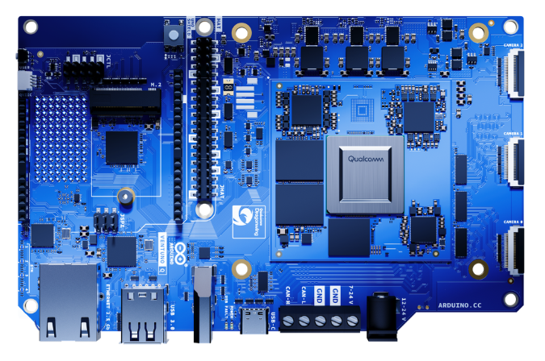

Arduino has recently announced the VENTUNO Q, a more powerful successor featuring the Qualcomm Dragonwing IQ8 with a dedicated NPU capable of up to 40 TOPS, 16 GB of RAM, and Raspberry Pi HAT compatibility. When available, the VENTUNO Q will open the door to significantly more demanding on-device AI workloads — including vision-language models, real-time multi-camera object tracking, and on-device speech synthesis — while maintaining the same dual-brain architecture and development workflow. Skills acquired on the UNO Q will transfer directly to the VENTUNO Q.

---

## 19. Resources

### Useful Resources

| Resource | URL |
|---|---|
| Arduino UNO Q Documentation | https://docs.arduino.cc/hardware/uno-q |
| Arduino App CLI Tutorial | https://docs.arduino.cc/software/app-lab/tutorials/cli |
| Arduino App CLI (GitHub) | https://github.com/arduino/arduino-app-cli |
| Bricks Documentation | https://docs.arduino.cc/software/app-lab/tutorials/bricks |
| Blink CLI Example (Shawn Hymel) | https://github.com/ShawnHymel/arduino_uno_q_blink_cli |
| Edge Impulse — Arduino UNO Q | https://docs.edgeimpulse.com/hardware/boards/arduino-uno-q |
| UNO Q Datasheet (PDF) | https://docs.arduino.cc/resources/datasheets/ABX00162-datasheet.pdf |

### References
1. Arduino, "Arduino UNO Q Product Page," https://www.arduino.cc/product-uno-q/
2. Arduino, "UNO Q Documentation," https://docs.arduino.cc/hardware/uno-q
3. Arduino, "Arduino App CLI — Manage Apps from the Command Line," https://docs.arduino.cc/software/app-lab/tutorials/cli
4. Shawn Hymel, "How to Use the Command Line (CLI) With the Arduino UNO Q," https://shawnhymel.com/3074/how-to-use-the-command-line-cli-with-the-arduino-uno-q/
5. Edge Impulse, "Arduino UNO Q," https://docs.edgeimpulse.com/hardware/boards/arduino-uno-q
6. Kevin McAleer, "How to Set Up WiFi on the Arduino Uno Q," https://www.kevsrobots.com/blog/arduino-uno-q-wifi-setup.html
7. Kevin McAleer, "5 Tips for Managing Your Arduino Uno Q," https://www.kevsrobots.com/blog/uno-q-tips.html
8. Foundries.io, "Arduino UNO Q Elf Detector Series — Part 0: Introduction," https://www.foundries.io/insights/blog/arduino-uno-q-elf-detector/

---


*Tutorial created for IESTI05 — Edge AI Machine Learning System Engineering, UNIFEI. Licensed under GNU General Public License 3.0.*
